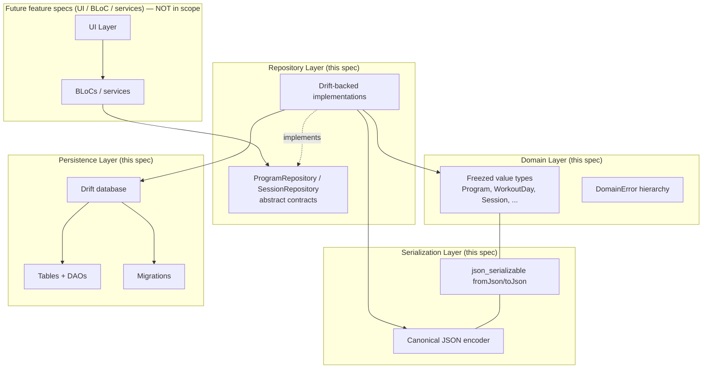
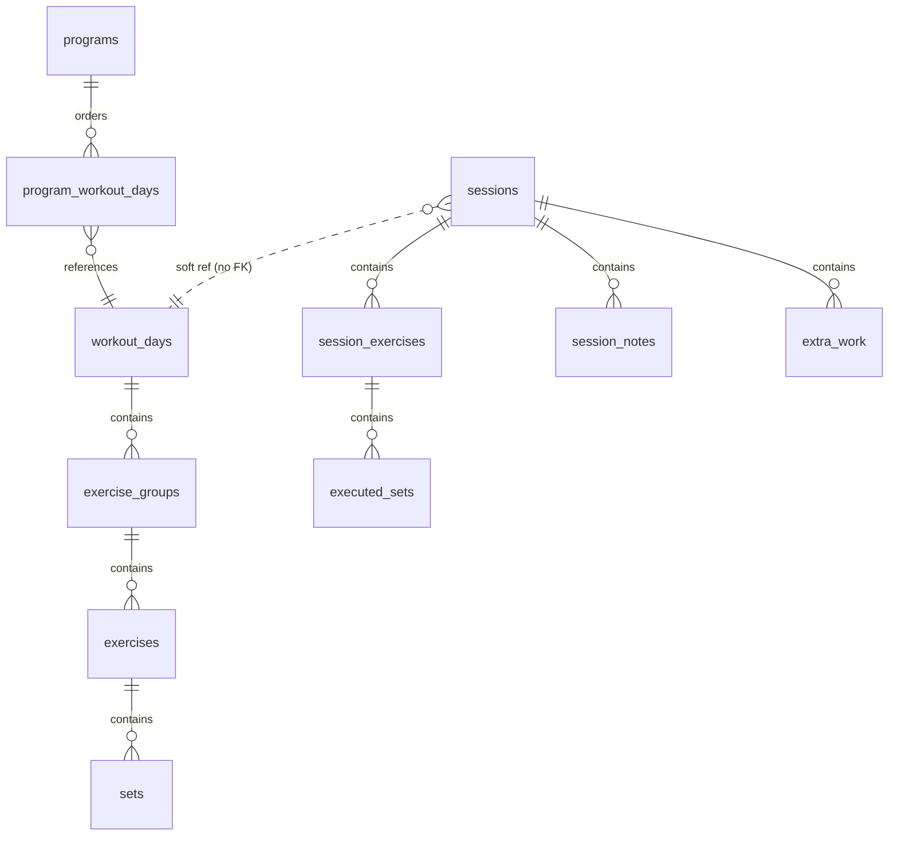

# Design Document — Core Domain and Persistence

## 1. Introduction

This document describes the design of the **core domain model and persistence
layer** for Zamaj. It is the technical blueprint for the requirements defined
in [`requirements.md`](./requirements.md) and the first implementation spec for
the product vision in [`../../../mvp-design-doc.md`](../../../mvp-design-doc.md).

The scope is intentionally narrow. This spec delivers:

- Pure, immutable Dart domain types (programs, workout days, exercise groups,
  exercises, sets, measurement types, sessions, session snapshots, session
  exercises, executed sets, session notes, extra work), generated with
  `freezed` + `json_serializable`.
- A Drift-backed SQLite persistence layer with migrations, foreign keys, and a
  single Drift `schemaVersion`.
- Abstract `ProgramRepository` and `SessionRepository` contracts, plus concrete
  Drift-backed implementations.
- A canonical JSON encoder that guarantees byte-stable output for snapshots
  and export.
- A typed `DomainError` hierarchy covering validation, immutability, ordering,
  deserialization, and schema-version mismatch failures.

It explicitly does NOT deliver UI, BLoCs, the session flow engine, the text
parser, rest timers, export formatters, or cloud sync. Those are separate
follow-up specs that build on top of the contracts introduced here.

---

## 2. Architecture Overview

The layer splits into four cooperating concerns:



**Dependency rules (compiler-enforced):**

- `Domain Layer` depends on nothing but Dart core, `freezed_annotation`,
  `json_annotation`, `uuid`, and `clock`.
- `Serialization Layer` depends on `Domain Layer` and the canonical JSON
  encoder.
- `Repository Layer` abstract contracts depend only on `Domain Layer`.
- `Persistence Layer` and the concrete repository implementations depend on
  `drift`, `Domain Layer`, and `Serialization Layer`.
- **No layer imports `dart:io`, `http`, `dio`, or any package capable of
  network I/O.** This is enforced in CI with a simple import-allowlist lint
  (Requirement 12).

**Aggregate boundaries:**

- **Program aggregate:** `Program` + its ordered list of `workoutDayIds`. The
  `Program` row is loaded independently of its workout days.
- **WorkoutDay aggregate:** `WorkoutDay` + `ExerciseGroup[]` + `Exercise[]` +
  `WorkoutSet[]` + `ExerciseMetadata`. Always loaded together.
- **Session aggregate:** `Session` + `SessionSnapshot` + `SessionExercise[]` +
  `ExecutedSet[]` + `SessionNote[]` + `ExtraWork[]`. Always loaded together.

All repository reads return fully hydrated aggregates; no partial reads are
exposed (Requirement 10.6).

---

## 3. Module Layout

Following the project convention in [`init.md`](../../../init.md), the
foundational code lives in two module folders plus a thin `core/` package:

```
lib/
├── core/
│   ├── clock.dart                  # Injected Clock (wraps package:clock)
│   ├── schema_versions.dart        # SchemaVersions.drift, .domain constants
│   ├── canonical_json.dart         # Stable, sorted-key JSON encoder
│   └── app_error.dart              # Top-level AppError (cross-cutting)
├── modules/
│   ├── domain/                     # Pure domain layer
│   │   ├── models/
│   │   │   ├── ids.dart            # UuidV4 newtype wrapper, id generator
│   │   │   ├── program.dart
│   │   │   ├── workout_day.dart
│   │   │   ├── exercise_group.dart
│   │   │   ├── exercise.dart
│   │   │   ├── workout_set.dart
│   │   │   ├── measurement_type.dart
│   │   │   ├── exercise_group_kind.dart
│   │   │   ├── exercise_metadata.dart
│   │   │   ├── planned_set_values.dart
│   │   │   ├── actual_set_values.dart
│   │   │   ├── session.dart
│   │   │   ├── session_snapshot.dart
│   │   │   ├── session_exercise.dart
│   │   │   ├── executed_set.dart
│   │   │   ├── session_note.dart
│   │   │   ├── extra_work.dart
│   │   │   ├── exercise_state.dart
│   │   │   └── substitute_exercise.dart
│   │   ├── repositories/
│   │   │   ├── program_repository.dart   # abstract
│   │   │   └── session_repository.dart   # abstract
│   │   ├── errors.dart             # sealed DomainError hierarchy
│   │   └── domain.dart             # barrel
│   └── persistence/                # Drift-backed implementation
│       ├── database/
│       │   ├── app_database.dart
│       │   ├── tables.dart
│       │   └── migrations.dart
│       ├── daos/
│       │   ├── programs_dao.dart
│       │   ├── workout_days_dao.dart
│       │   └── sessions_dao.dart
│       ├── mappers/
│       │   ├── program_mapper.dart
│       │   ├── workout_day_mapper.dart
│       │   └── session_mapper.dart
│       ├── repositories/
│       │   ├── drift_program_repository.dart
│       │   └── drift_session_repository.dart
│       └── persistence.dart        # barrel
```

Feature modules (`program_management/`, `workout_picker/`, `session_flow/`,
...) do **not** exist in this spec. They will be added in follow-up specs and
consume the abstract repository interfaces from `modules/domain/repositories/`.

---

## 4. Domain Model

### 4.1 Identifier type

Every persisted entity is identified by a **UUIDv4** encoded as its canonical
36-character string. The domain uses plain `String` in signatures for
ergonomics (freezed round-tripping, JSON compatibility), with a minimal
factory:

```dart
String newUuidV4() => const Uuid().v4();
```

Uniqueness across entity types (Req 8 AC 7) relies on the 122 bits of
randomness of UUIDv4. No runtime cross-type uniqueness check is performed at
the DB layer; the birthday-paradox probability of a collision at the scale of
a single user's device is astronomically small, and this is called out in the
testing strategy rather than enforced with a central id registry.

### 4.2 Measurement type (sealed, extensible)

```dart
@Freezed(unionKey: 'type')
sealed class MeasurementType with _$MeasurementType {
  const factory MeasurementType.repBased() = RepBasedMeasurement;
  const factory MeasurementType.timeBased() = TimeBasedMeasurement;

  factory MeasurementType.fromJson(Map<String, dynamic> json) =
      _$MeasurementTypeFromJson;
}
```

- Discriminator key: `"type"`. Values: `"repBased"`, `"timeBased"`.
- The type has **no data fields** at the measurement-type level. It tags the
  exercise's contract; the actual values live on `PlannedSetValues` and
  `ActualSetValues` (§4.6) and must match this tag.
- Adding a future variant (e.g. `distanceBased`) requires only adding a new
  factory; existing JSON payloads continue to deserialize (Req 2 AC 4).

### 4.3 Exercise group kind (sealed, extensible)

```dart
@Freezed(unionKey: 'type')
sealed class ExerciseGroupKind with _$ExerciseGroupKind {
  const factory ExerciseGroupKind.single() = SingleKind;
  const factory ExerciseGroupKind.superset() = SupersetKind;

  factory ExerciseGroupKind.fromJson(Map<String, dynamic> json) =
      _$ExerciseGroupKindFromJson;
}
```

- Discriminator key: `"type"`. Values: `"single"`, `"superset"`.
- Cardinality constraints are enforced on `ExerciseGroup` construction, not on
  the kind value itself (§4.11).

### 4.4 Program and WorkoutDay

```dart
@freezed
class Program with _$Program {
  const Program._();

  @Assert('id.length == 36', 'id must be canonical UUIDv4 (36 chars)')
  const factory Program({
    required String id,
    required String name,
    required List<String> workoutDayIds, // ordered
    required DateTime createdAt,
    required DateTime updatedAt,
    required int schemaVersion,
  }) = _Program;

  factory Program.fromJson(Map<String, dynamic> json) = _$ProgramFromJson;
}
```

```dart
@freezed
class WorkoutDay with _$WorkoutDay {
  const WorkoutDay._();

  const factory WorkoutDay({
    required String id,
    required String programId,
    required String name,
    required List<ExerciseGroup> exerciseGroups, // ordered
    required DateTime createdAt,
    required DateTime updatedAt,
    required int schemaVersion,
  }) = _WorkoutDay;

  factory WorkoutDay.fromJson(Map<String, dynamic> json) =
      _$WorkoutDayFromJson;
}
```

A `WorkoutDay` is an **aggregate**: it carries the full nested tree of groups,
exercises, sets, and metadata, always loaded together.

### 4.5 ExerciseGroup, Exercise, WorkoutSet, ExerciseMetadata

```dart
@freezed
class ExerciseGroup with _$ExerciseGroup {
  const ExerciseGroup._();

  factory ExerciseGroup({
    required String id,
    required String workoutDayId,
    required int position,              // zero-based
    required ExerciseGroupKind kind,
    required List<Exercise> exercises,  // ordered
    required DateTime createdAt,
    required DateTime updatedAt,
    required int schemaVersion,
  }) {
    // Cardinality invariant (Req 3 AC 2/3, Req 13 AC 1)
    ExerciseGroupInvariants.validate(id: id, kind: kind, exercises: exercises);
    return _ExerciseGroup(
      id: id, workoutDayId: workoutDayId, position: position,
      kind: kind, exercises: exercises,
      createdAt: createdAt, updatedAt: updatedAt, schemaVersion: schemaVersion,
    );
  }

  factory ExerciseGroup.fromJson(Map<String, dynamic> json) =
      _$ExerciseGroupFromJson;
}
```

```dart
@freezed
class Exercise with _$Exercise {
  const Exercise._();

  const factory Exercise({
    required String id,
    required String exerciseGroupId,
    required int position,
    required String name,
    required MeasurementType measurementType,
    required ExerciseMetadata metadata,
    required List<WorkoutSet> sets,    // ordered
    required DateTime createdAt,
    required DateTime updatedAt,
    required int schemaVersion,
  }) = _Exercise;

  factory Exercise.fromJson(Map<String, dynamic> json) = _$ExerciseFromJson;
}
```

```dart
@freezed
class WorkoutSet with _$WorkoutSet {
  const WorkoutSet._();

  factory WorkoutSet({
    required String id,
    required String exerciseId,
    required int position,
    required MeasurementType measurementType, // must agree with plannedValues
    required PlannedSetValues plannedValues,
    required DateTime createdAt,
    required DateTime updatedAt,
    required int schemaVersion,
  }) {
    WorkoutSetInvariants.validate(
      id: id,
      measurementType: measurementType,
      plannedValues: plannedValues,
    );
    return _WorkoutSet(
      id: id, exerciseId: exerciseId, position: position,
      measurementType: measurementType, plannedValues: plannedValues,
      createdAt: createdAt, updatedAt: updatedAt, schemaVersion: schemaVersion,
    );
  }

  factory WorkoutSet.fromJson(Map<String, dynamic> json) =
      _$WorkoutSetFromJson;
}
```

`measurementType` is denormalized onto `WorkoutSet` for construction-time
validation and for self-describing JSON. The owning `Exercise.measurementType`
is the contract; `WorkoutSet.measurementType` must match it — this is enforced
in the `Exercise` aggregate's invariant check (§4.11) and implicitly by the
repository when hydrating.

```dart
@freezed
class ExerciseMetadata with _$ExerciseMetadata {
  const factory ExerciseMetadata({
    String? notes,
    String? videoUrl,
  }) = _ExerciseMetadata;

  factory ExerciseMetadata.fromJson(Map<String, dynamic> json) =
      _$ExerciseMetadataFromJson;

  static const empty = ExerciseMetadata();
}
```

### 4.6 Planned vs actual value families (hard separation)

Requirement 4 AC 7 forbids planned values and actual values ever sharing a
field. We enforce that at the type level with two **parallel** sealed
families:

```dart
@Freezed(unionKey: 'type')
sealed class PlannedSetValues with _$PlannedSetValues {
  const factory PlannedSetValues.repBased({
    required double weightKg,   // ≥ 0, resolution 0.5 (Req 2 AC 2)
    required int reps,          // ≥ 0
  }) = PlannedRepBased;

  const factory PlannedSetValues.timeBased({
    required int durationSeconds, // ≥ 0 (Req 2 AC 3)
  }) = PlannedTimeBased;

  factory PlannedSetValues.fromJson(Map<String, dynamic> json) =
      _$PlannedSetValuesFromJson;
}
```

```dart
@Freezed(unionKey: 'type')
sealed class ActualSetValues with _$ActualSetValues {
  const factory ActualSetValues.repBased({
    required double weightKg,
    required int reps,
  }) = ActualRepBased;

  const factory ActualSetValues.timeBased({
    required int durationSeconds,
  }) = ActualTimeBased;

  factory ActualSetValues.fromJson(Map<String, dynamic> json) =
      _$ActualSetValuesFromJson;
}
```

**Consistency rule** (enforced at construction of `WorkoutSet` and `ExecutedSet`):

| `MeasurementType` | allowed `PlannedSetValues` | allowed `ActualSetValues` |
| --- | --- | --- |
| `repBased` | `PlannedRepBased` | `ActualRepBased` |
| `timeBased` | `PlannedTimeBased` | `ActualTimeBased` |

A mismatch raises `ValidationError` at construction (Req 13 AC 3).

**Weight resolution.** `PlannedRepBased.weightKg` and `ActualRepBased.weightKg`
must be a non-negative multiple of `0.5`. Validation uses an integer-scaled
check: `(weightKg * 2).roundToDouble() == weightKg * 2 && weightKg >= 0`.
Storage is a plain `REAL` column; round-trip tests verify stability.

### 4.7 Session

```dart
@freezed
class Session with _$Session {
  const Session._();

  const factory Session({
    required String id,
    required String workoutDayId,        // soft ref to the source template
    required SessionSnapshot snapshot,
    required List<SessionExercise> sessionExercises,
    required List<SessionNote> notes,
    required List<ExtraWork> extraWork,
    required DateTime startedAt,
    DateTime? endedAt,
    required DateTime createdAt,
    required DateTime updatedAt,
    required int schemaVersion,
  }) = _Session;

  factory Session.fromJson(Map<String, dynamic> json) = _$SessionFromJson;
}
```

`workoutDayId` is a **soft reference** (no FK). If the source `WorkoutDay` is
later deleted the `Session` must remain readable; the snapshot is the source
of truth for replay.

### 4.8 SessionSnapshot (deep copy)

```dart
@freezed
class SessionSnapshot with _$SessionSnapshot {
  const factory SessionSnapshot({
    required WorkoutDay workoutDay,   // deep copy of template at start
    required String canonicalJson,    // byte-stable encoding (§7)
    required String sha256Hash,       // hex lowercase, 64 chars
    required DateTime capturedAt,
    required int schemaVersion,
  }) = _SessionSnapshot;

  factory SessionSnapshot.fromJson(Map<String, dynamic> json) =
      _$SessionSnapshotFromJson;
}
```

The snapshot carries both a fully typed `WorkoutDay` tree (for ergonomics) and
its canonical JSON string (for byte-stability and integrity). The two must
agree: `sha256(canonicalJson) == sha256Hash` and
`canonicalJson == CanonicalJson.encode(workoutDay.toJson())`. This invariant
is validated on construction.

### 4.9 SessionExercise, ExerciseState, SubstituteExercise, ExecutedSet

```dart
@Freezed(unionKey: 'type')
sealed class ExerciseState with _$ExerciseState {
  const factory ExerciseState.unfinished() = UnfinishedState;
  const factory ExerciseState.completed() = CompletedState;
  const factory ExerciseState.skipped() = SkippedState;
  const factory ExerciseState.replaced({
    required SubstituteExercise substitute,
  }) = ReplacedState;

  factory ExerciseState.fromJson(Map<String, dynamic> json) =
      _$ExerciseStateFromJson;
}
```

```dart
@freezed
class SubstituteExercise with _$SubstituteExercise {
  const factory SubstituteExercise({
    required String name,
    required MeasurementType measurementType,
    ExerciseMetadata? metadata,
  }) = _SubstituteExercise;

  factory SubstituteExercise.fromJson(Map<String, dynamic> json) =
      _$SubstituteExerciseFromJson;
}
```

Encoding the substitute payload **inside** the `replaced` variant is
deliberate: it makes the compiler enforce Req 5 AC 1/2/4 (substitute is
non-null iff state is `Replaced`). `SessionExercise` never sees a nullable
substitute field.

```dart
@freezed
class SessionExercise with _$SessionExercise {
  const SessionExercise._();

  const factory SessionExercise({
    required String id,
    required String sessionId,
    required int position,
    required String plannedExerciseIdInSnapshot, // always present (Req 4.2)
    required ExerciseState state,
    required List<ExecutedSet> executedSets,
    required DateTime createdAt,
    required DateTime updatedAt,
    required int schemaVersion,
  }) = _SessionExercise;

  factory SessionExercise.fromJson(Map<String, dynamic> json) =
      _$SessionExerciseFromJson;
}
```

```dart
@freezed
class ExecutedSet with _$ExecutedSet {
  const ExecutedSet._();

  factory ExecutedSet({
    required String id,
    required String sessionExerciseId,
    required int position,
    required MeasurementType measurementType,
    required ActualSetValues actualValues,
    String? plannedSetIdInSnapshot,
    required DateTime completedAt,
    required DateTime createdAt,
    required DateTime updatedAt,
    required int schemaVersion,
  }) {
    ExecutedSetInvariants.validate(
      id: id,
      measurementType: measurementType,
      actualValues: actualValues,
    );
    return _ExecutedSet(/* ... */);
  }

  factory ExecutedSet.fromJson(Map<String, dynamic> json) =
      _$ExecutedSetFromJson;
}
```

### 4.10 SessionNote and ExtraWork

```dart
@freezed
class SessionNote with _$SessionNote {
  const factory SessionNote({
    required String id,
    required String sessionId,
    required String body,
    required DateTime createdAt,
    required DateTime updatedAt,
    required int schemaVersion,
  }) = _SessionNote;

  factory SessionNote.fromJson(Map<String, dynamic> json) =
      _$SessionNoteFromJson;
}

@freezed
class ExtraWork with _$ExtraWork {
  const factory ExtraWork({
    required String id,
    required String sessionId,
    required int position, // ordered within session
    required String body,
    required DateTime createdAt,
    required DateTime updatedAt,
    required int schemaVersion,
  }) = _ExtraWork;

  factory ExtraWork.fromJson(Map<String, dynamic> json) =
      _$ExtraWorkFromJson;
}
```

### 4.11 Validation at construction

Each validated type exposes a private `_Invariants` helper that throws a typed
`ValidationError` on failure. The `freezed` factory delegates to it before
returning the generated value (Req 13 AC 4). Invariants enforced:

| Type | Invariant | Req |
| --- | --- | --- |
| `ExerciseGroup` | `kind == single` ⇒ `exercises.length == 1` | 3 AC 2, 13 AC 1 |
| `ExerciseGroup` | `kind == superset` ⇒ `exercises.length ≥ 2` | 3 AC 3, 13 AC 1 |
| `Exercise` | every `workoutSet.measurementType == exercise.measurementType` | 2, 4 AC 7 |
| `WorkoutSet` | `plannedValues` variant matches `measurementType` variant | 2, 13 AC 3 |
| `WorkoutSet` | `PlannedRepBased.weightKg` ≥ 0, multiple of 0.5 | 2 AC 2, 13 AC 3 |
| `WorkoutSet` | `PlannedRepBased.reps` ≥ 0 | 2 AC 2, 13 AC 3 |
| `WorkoutSet` | `PlannedTimeBased.durationSeconds` ≥ 0 | 2 AC 3, 13 AC 3 |
| `ExecutedSet` | `actualValues` variant matches `measurementType` variant | 4 AC 7, 13 |
| `ExecutedSet` | non-negativity rules mirror `WorkoutSet` | 2, 13 AC 3 |
| `SessionSnapshot` | `sha256(canonicalJson) == sha256Hash` | 6 AC 3 |
| `SessionSnapshot` | `canonicalJson == CanonicalJson.encode(workoutDay.toJson())` | 6 AC 1/3 |
| `SubstituteExercise` | no additional invariants beyond non-null name + type | 5 AC 2 |

Timestamp and id-format checks (`len == 36`, valid UUID) are asserted at
construction via `assert` in debug builds and are fully verified at repository
boundaries (§6).

---

## 5. Persistence Layer

### 5.1 Drift table design



#### Template tables

```dart
// lib/modules/persistence/database/tables.dart

class Programs extends Table {
  TextColumn  get id           => text().withLength(min: 36, max: 36)();
  TextColumn  get name         => text()();
  IntColumn   get createdAtMs  => integer()();
  IntColumn   get updatedAtMs  => integer()();
  IntColumn   get schemaVersion => integer()();
  @override Set<Column> get primaryKey => {id};
}

class ProgramWorkoutDays extends Table {
  TextColumn get programId    => text().references(Programs, #id,
                                   onDelete: KeyAction.cascade)();
  TextColumn get workoutDayId => text().references(WorkoutDays, #id,
                                   onDelete: KeyAction.cascade)();
  IntColumn  get position     => integer()();
  @override Set<Column> get primaryKey => {programId, workoutDayId};
  @override List<Set<Column>> get uniqueKeys => [{programId, position}];
}

class WorkoutDays extends Table {
  TextColumn get id             => text().withLength(min: 36, max: 36)();
  TextColumn get programId      => text().references(Programs, #id,
                                     onDelete: KeyAction.cascade)();
  TextColumn get name           => text()();
  IntColumn  get createdAtMs    => integer()();
  IntColumn  get updatedAtMs    => integer()();
  IntColumn  get schemaVersion  => integer()();
  @override Set<Column> get primaryKey => {id};
}

class ExerciseGroups extends Table {
  TextColumn get id               => text().withLength(min: 36, max: 36)();
  TextColumn get workoutDayId     => text().references(WorkoutDays, #id,
                                       onDelete: KeyAction.cascade)();
  IntColumn  get position         => integer()();
  TextColumn get kindDiscriminator=> text()();        // 'single' | 'superset' | ...
  TextColumn get kindPayloadJson  => text()();        // canonical JSON
  IntColumn  get createdAtMs      => integer()();
  IntColumn  get updatedAtMs      => integer()();
  IntColumn  get schemaVersion    => integer()();
  @override Set<Column> get primaryKey => {id};
  @override List<Set<Column>> get uniqueKeys => [{workoutDayId, position}];
}

class Exercises extends Table {
  TextColumn get id                        => text().withLength(min: 36, max: 36)();
  TextColumn get exerciseGroupId           => text().references(ExerciseGroups, #id,
                                                onDelete: KeyAction.cascade)();
  IntColumn  get position                  => integer()();
  TextColumn get name                      => text()();
  TextColumn get measurementTypeDiscriminator => text()();
  TextColumn get measurementTypePayloadJson   => text()();
  TextColumn get notes                     => text().nullable()();
  TextColumn get videoUrl                  => text().nullable()();
  IntColumn  get createdAtMs               => integer()();
  IntColumn  get updatedAtMs               => integer()();
  IntColumn  get schemaVersion             => integer()();
  @override Set<Column> get primaryKey => {id};
  @override List<Set<Column>> get uniqueKeys => [{exerciseGroupId, position}];
}

class Sets extends Table {
  TextColumn get id                      => text().withLength(min: 36, max: 36)();
  TextColumn get exerciseId              => text().references(Exercises, #id,
                                             onDelete: KeyAction.cascade)();
  IntColumn  get position                => integer()();
  TextColumn get plannedValuesDiscriminator => text()();
  TextColumn get plannedValuesPayloadJson   => text()();
  IntColumn  get createdAtMs             => integer()();
  IntColumn  get updatedAtMs             => integer()();
  IntColumn  get schemaVersion           => integer()();
  @override Set<Column> get primaryKey => {id};
  @override List<Set<Column>> get uniqueKeys => [{exerciseId, position}];
}
```

#### Session tables

```dart
class Sessions extends Table {
  TextColumn get id              => text().withLength(min: 36, max: 36)();
  TextColumn get workoutDayId    => text()(); // soft ref, NO FK
  TextColumn get snapshotJson    => text()(); // canonical JSON of WorkoutDay
  TextColumn get snapshotHash    => text().withLength(min: 64, max: 64)();
  IntColumn  get startedAtMs     => integer()();
  IntColumn  get endedAtMs       => integer().nullable()();
  IntColumn  get createdAtMs     => integer()();
  IntColumn  get updatedAtMs     => integer()();
  IntColumn  get schemaVersion   => integer()();
  @override Set<Column> get primaryKey => {id};
}
// Index: (workoutDayId)

class SessionExercises extends Table {
  TextColumn get id                         => text().withLength(min: 36, max: 36)();
  TextColumn get sessionId                  => text().references(Sessions, #id,
                                                 onDelete: KeyAction.cascade)();
  IntColumn  get position                   => integer()();
  TextColumn get plannedExerciseIdInSnapshot=> text().withLength(min: 36, max: 36)();
  TextColumn get stateDiscriminator         => text()(); // unfinished|completed|skipped|replaced
  TextColumn get substitutePayloadJson      => text().nullable()();
  IntColumn  get createdAtMs                => integer()();
  IntColumn  get updatedAtMs                => integer()();
  IntColumn  get schemaVersion              => integer()();
  @override Set<Column> get primaryKey => {id};
  @override List<Set<Column>> get uniqueKeys => [{sessionId, position}];
}
// Index: (sessionId, stateDiscriminator)

class ExecutedSets extends Table {
  TextColumn get id                          => text().withLength(min: 36, max: 36)();
  TextColumn get sessionExerciseId           => text().references(SessionExercises, #id,
                                                  onDelete: KeyAction.cascade)();
  IntColumn  get position                    => integer()();
  TextColumn get measurementTypeDiscriminator=> text()();
  TextColumn get actualValuesDiscriminator   => text()();
  TextColumn get actualValuesPayloadJson     => text()();
  TextColumn get plannedSetIdInSnapshot      => text().nullable()();
  IntColumn  get completedAtMs               => integer()();
  IntColumn  get createdAtMs                 => integer()();
  IntColumn  get updatedAtMs                 => integer()();
  IntColumn  get schemaVersion               => integer()();
  @override Set<Column> get primaryKey => {id};
  @override List<Set<Column>> get uniqueKeys => [{sessionExerciseId, position}];
}

class SessionNotes extends Table {
  TextColumn get id            => text().withLength(min: 36, max: 36)();
  TextColumn get sessionId     => text().references(Sessions, #id,
                                    onDelete: KeyAction.cascade)();
  TextColumn get body          => text()();
  IntColumn  get createdAtMs   => integer()();
  IntColumn  get updatedAtMs   => integer()();
  IntColumn  get schemaVersion => integer()();
  @override Set<Column> get primaryKey => {id};
}

class ExtraWorkItems extends Table {
  TextColumn get id            => text().withLength(min: 36, max: 36)();
  TextColumn get sessionId     => text().references(Sessions, #id,
                                    onDelete: KeyAction.cascade)();
  IntColumn  get position      => integer()();
  TextColumn get body          => text()();
  IntColumn  get createdAtMs   => integer()();
  IntColumn  get updatedAtMs   => integer()();
  IntColumn  get schemaVersion => integer()();
  @override Set<Column> get primaryKey => {id};
  @override List<Set<Column>> get uniqueKeys => [{sessionId, position}];
}
```

### 5.2 Snapshot storage strategy (Option A: single opaque JSON blob)

**Decision.** Each `Session` stores its snapshot as a single canonical JSON
string in `sessions.snapshotJson` (TEXT) alongside a `snapshotHash` (sha256
hex) column. There are no parallel `snapshot_*` tables.

**Rationale.**

1. **Req 6 AC 3 (byte-stability) is free.** Once the row is written, the bytes
   never change unless the application overwrites them — and the repository
   exposes no such method (Req 6 AC 4). Template-table edits cannot leak in.
2. **Req 6 AC 2 (independence) is trivial.** The snapshot column has no
   foreign keys into the template tables, so cascading deletes or updates on
   programs/workout days cannot modify it.
3. **Sessions are always read in full.** The UI never queries *inside* a
   snapshot — it hydrates the whole `WorkoutDay` tree into memory and lets
   BLoCs traverse it. Making snapshots queryable in SQL would add complexity
   with no consumer.
4. **Schema evolution is robust.** When the domain shape changes in a future
   spec, old snapshots continue to round-trip via their recorded
   `schemaVersion` and the JSON migration paths defined per-entity. Parallel
   `snapshot_*` tables would force every domain migration to also migrate
   historical session data, re-introducing exactly the "program edits rewrite
   history" problem we are avoiding.
5. **Integrity.** The `sha256Hash` column lets property tests assert that
   identical snapshots are byte-identical across reads and writes, and that
   `canonicalJson` round-trips through `fromJson(toJson(...))` stably.

Option B (parallel `snapshot_*` tables) was considered and rejected for the
reasons above.

### 5.3 Canonical JSON encoder

All snapshot JSON and all exported JSON go through a single function:

```dart
// lib/core/canonical_json.dart

class CanonicalJson {
  /// Deterministic JSON encoding:
  ///  - Object keys sorted lexicographically.
  ///  - No insignificant whitespace.
  ///  - Numbers emitted with fixed formatting:
  ///      * integers → `"123"`, no decimal point.
  ///      * finite doubles → shortest round-trip form, always with a '.' or
  ///        exponent. NaN and ±Infinity rejected with ValidationError.
  ///  - Strings encoded with RFC 8259 escaping; no unescaped control chars.
  ///  - List order preserved from the domain (domain ordering is authoritative).
  ///  - Recursively applied to nested objects and arrays.
  static String encode(Object? value);

  static String sha256Hex(String canonical);
}
```

Properties the encoder guarantees (verified by PBT, §11):

- **Determinism:** `encode(v)` is a pure function. Two structurally equal
  inputs always produce the same string.
- **Round-trip compatibility:** `json.decode(encode(toJson(v)))` equals
  `toJson(v)` as a `Map`/`List` tree (key ordering is not part of map
  equality).
- **Idempotence:** `encode(json.decode(encode(v))) == encode(v)`.

### 5.4 Schema version strategy (two versions, intentionally separate)

There are **two independent schema versions**, each an integer starting at 1:

| Constant | Purpose | Bumped when |
| --- | --- | --- |
| `SchemaVersions.drift`  | Drift DB schema version; feeds `MigrationStrategy`. | Tables, columns, indexes, or constraints change. |
| `SchemaVersions.domain` | Stamped onto every row's `schema_version` column and on every JSON payload. | Serialization shape of any domain entity changes. |

They may drift apart. Example:

- Adding a new DB index: `drift` bumps, `domain` does not.
- Adding a new optional field to `ExerciseMetadata`: `domain` bumps; `drift`
  only bumps if a new column is added rather than widening the existing JSON
  payload.

```dart
// lib/core/schema_versions.dart
class SchemaVersions {
  static const int drift  = 1;
  static const int domain = 1;
  const SchemaVersions._();
}
```

Both are exported from `core/schema_versions.dart` and are the **single source
of truth**; no other file defines or hard-codes a schema version.

### 5.5 Migration plan

```dart
class AppDatabase extends _$AppDatabase {
  AppDatabase(QueryExecutor e) : super(e);

  @override int get schemaVersion => SchemaVersions.drift;

  @override MigrationStrategy get migration => MigrationStrategy(
    onCreate: (m) => m.createAll(),
    onUpgrade: (m, from, to) async {
      // No migrations registered in v1.
      // Future versions add steps here, each guarded by `if (from < N) ...`.
    },
    beforeOpen: (details) async {
      // Req 9 AC 5: reject opening a DB whose stored version > code version.
      if (details.versionBefore != null &&
          details.versionBefore! > schemaVersion) {
        throw VersionMismatchError(
          persisted: details.versionBefore!,
          expected: schemaVersion,
        );
      }
      await customStatement('PRAGMA foreign_keys = ON;'); // Req 9 AC 6
    },
  );
}
```

At v1 the migration callback is empty. Every future schema change adds an
`if (from < N)` branch that performs the migration; the Drift upgrade path
remains monotonic and testable.

---

## 6. Repository Layer

### 6.1 Aggregate-load strategy

Both repositories always return **fully hydrated aggregates**. Reading a
`WorkoutDay` returns its full nested `ExerciseGroup[] → Exercise[] → WorkoutSet[]`
tree; reading a `Session` returns the full `Session` with snapshot, all
`SessionExercise[]` with nested `ExecutedSet[]`, all notes, and all extra
work.

Implementation: each aggregate loader runs a small number of Drift queries
(one per nested level), and assembles the domain object in memory. For
example `getWorkoutDay(id)` issues:

1. `SELECT ... FROM workout_days WHERE id = ?`
2. `SELECT ... FROM exercise_groups WHERE workout_day_id = ? ORDER BY position`
3. `SELECT ... FROM exercises WHERE exercise_group_id IN (?) ORDER BY position`
4. `SELECT ... FROM sets WHERE exercise_id IN (?) ORDER BY position`

Steps 3 and 4 use `IN` clauses over the ids gathered in the previous step; no
N+1 fan-out per row. At MVP scale (≤ few hundred exercises per workout day)
this cost is negligible, and the code is much more readable than an
everything-in-one-join query.

Aggregate-load semantics simplify downstream BLoC reasoning: a hydrated
`Session` is guaranteed to satisfy every domain invariant, and snapshot
integrity can be checked once at load time.

### 6.2 `ProgramRepository` contract

```dart
abstract class ProgramRepository {
  // Programs
  Future<Program>        createProgram({required String name});
  Future<Program?>       getProgram(String programId);
  Future<List<Program>>  listPrograms();
  Future<Program>        updateProgram(Program program);
  Future<void>           deleteProgram(String programId);

  // Workout days (live inside a program)
  Future<WorkoutDay>           createWorkoutDay({
    required String programId,
    required String name,
  });
  Future<WorkoutDay?>          getWorkoutDay(String workoutDayId);
  Future<List<WorkoutDay>>     listWorkoutDaysForProgram(String programId);
  Future<WorkoutDay>           updateWorkoutDay(WorkoutDay workoutDay);
  Future<void>                 deleteWorkoutDay(String workoutDayId);
  Future<void>                 reorderWorkoutDays(
    String programId,
    List<String> orderedWorkoutDayIds,
  );

  // Exercise groups
  Future<ExerciseGroup>        createExerciseGroup({
    required String workoutDayId,
    required ExerciseGroupKind kind,
    required List<Exercise> exercises,
  });
  Future<ExerciseGroup>        updateExerciseGroup(ExerciseGroup group);
  Future<void>                 deleteExerciseGroup(String exerciseGroupId);
  Future<void>                 reorderExerciseGroups(
    String workoutDayId,
    List<String> orderedGroupIds,
  );

  // Exercises
  Future<Exercise>             createExercise({
    required String exerciseGroupId,
    required String name,
    required MeasurementType measurementType,
    ExerciseMetadata metadata = ExerciseMetadata.empty,
  });
  Future<Exercise>             updateExercise(Exercise exercise);
  Future<void>                 deleteExercise(String exerciseId);
  Future<void>                 reorderExercises(
    String exerciseGroupId,
    List<String> orderedExerciseIds,
  );

  // Sets
  Future<WorkoutSet>           createSet({
    required String exerciseId,
    required PlannedSetValues plannedValues,
  });
  Future<WorkoutSet>           updateSet(WorkoutSet set);
  Future<void>                 deleteSet(String setId);
  Future<void>                 reorderSets(
    String exerciseId,
    List<String> orderedSetIds,
  );
}
```

All methods throw typed `DomainError`s on invariant violations (§8) and never
return partially constructed aggregates (Req 10 AC 6).

### 6.3 `SessionRepository` contract

```dart
abstract class SessionRepository {
  /// Starts a new session for `workoutDayId`. Captures the snapshot
  /// atomically with the session row (Req 6). Returns the fully hydrated
  /// Session aggregate with all SessionExercises pre-seeded in `unfinished`
  /// state matching the snapshot's planned exercises.
  Future<Session> startSession({required String workoutDayId});

  Future<Session?>        getSession(String sessionId);
  Future<List<Session>>   listSessionsForWorkoutDay(String workoutDayId);

  /// Finalizes the session (sets endedAt). Does not alter exercise states.
  Future<Session> endSession(String sessionId);

  /// Records a completed set against a SessionExercise. If this was the last
  /// planned set, the SessionExercise transitions to `completed` and its
  /// position is locked (Req 7 AC 4).
  Future<Session> completeSet({
    required String sessionExerciseId,
    required ActualSetValues actualValues,
    String? plannedSetIdInSnapshot,
  });

  /// Updates an existing ExecutedSet's values (e.g. user edits reps after
  /// completion). Does not change exercise state or position.
  Future<Session> updateExecutedSet({
    required String executedSetId,
    required ActualSetValues actualValues,
  });

  /// Transitions the SessionExercise to `skipped` and locks its position.
  Future<Session> skipExercise(String sessionExerciseId);

  /// Transitions the SessionExercise to `replaced`. Creates no template rows.
  Future<Session> replaceExercise({
    required String sessionExerciseId,
    required String substituteName,
    required MeasurementType substituteMeasurementType,
    ExerciseMetadata? substituteMetadata,
  });

  /// Reorders unfinished SessionExercises only. Throws OrderingError if any
  /// id in the list is not in `unfinished` state (Req 7 AC 3).
  Future<Session> reorderUnfinished({
    required String sessionId,
    required List<String> orderedUnfinishedIds,
  });

  Future<Session> addSessionNote({
    required String sessionId,
    required String body,
  });

  Future<Session> addExtraWork({
    required String sessionId,
    required String body,
  });
}
```

### 6.4 Position assignment algorithm

Positions are non-negative integers. Collision-freedom is enforced at the DB
level by `UNIQUE(parent_id, position)`. The repository maintains an
**"unfinished sit above locked"** invariant for session exercises:

> For every `Session`, and for every `SessionExercise X` whose state is not
> `unfinished`, `X.position < Y.position` for every `SessionExercise Y` in the
> same session whose state is `unfinished`.

Position assignment rules:

1. **Initial session start.** The N session exercises are created in snapshot
   order with positions `1·G, 2·G, 3·G, …` where `G = 1024` is the default
   gap.
2. **`reorderUnfinished(sessionId, orderedIds)`.** Under a transaction:
   - Read `maxLockedPos := max(position) WHERE state != 'unfinished'` (or `0`
     if none).
   - For each id in `orderedIds` at index `i`, write
     `position := maxLockedPos + (i + 1) * G`.
   - Any unfinished id not in `orderedIds` is rejected with `OrderingError`.
3. **Transition `unfinished` → locked** (on `completeSet` finalization,
   `skipExercise`, `replaceExercise`):
   - Under a transaction:
     - `maxLockedPos := max(position) WHERE state != 'unfinished' AND id != X.id`.
     - Set `X.state := <new state>`.
     - Set `X.position := maxLockedPos + 1` (any integer > `maxLockedPos`
       works; the exact value is aesthetic).
     - Renumber every remaining unfinished SE to positions
       `X.position + j·G` for j = 1, 2, … in their current display order.
4. **Gap exhaustion.** The gap `G = 1024` is large enough that in practice
   exhaustion does not occur within a single session. If a reorder ever
   computes a conflict, the repository falls back to an atomic "renumber all
   unfinished rows with a fresh gap-based sequence" operation inside the
   transaction.

This algorithm satisfies:

- Req 7 AC 1 (locked positions never change) — only unfinished rows are
  renumbered in rule 2 and rule 3 step 4.
- Req 7 AC 3 (locked reorder rejected) — rule 2 rejects non-unfinished ids.
- Req 7 AC 4 (transitioning position ≥ max_locked) — rule 3 sets it strictly
  greater.
- Req 7 AC 5 (strict total order, no duplicates) — `UNIQUE(session_id, position)`
  plus the integer arithmetic above.

### 6.5 Timestamp monotonicity helper

All repository writes go through a single helper:

```dart
DateTime _nextUpdatedAt({
  required DateTime? previousUpdatedAt,
  required DateTime createdAt,
  required Clock clock,
}) {
  final now = clock.now().toUtc();
  final flooredByPrevious = previousUpdatedAt == null
      ? now
      : (now.isAfter(previousUpdatedAt)
            ? now
            : previousUpdatedAt.add(const Duration(milliseconds: 1)));
  return flooredByPrevious.isAfter(createdAt)
      ? flooredByPrevious
      : createdAt;
}
```

Called inside the same transaction that reads the row being updated. The
`Clock` is injected (from `core/clock.dart`) so tests can simulate clock
regressions (laptop sleep, DST, NTP correction) and assert monotonicity.

### 6.6 Timestamp storage

`DateTime` is serialized into SQLite as `INTEGER` milliseconds-since-epoch
(UTC) and into JSON as ISO 8601 (with `Z` suffix). Mappers convert between
these representations. The domain layer always holds UTC `DateTime`s.

### 6.7 Concrete implementation notes

`DriftProgramRepository` and `DriftSessionRepository` are the concrete
implementations. They depend on `AppDatabase`, `Clock`, and
`CanonicalJson`. All repository writes happen inside a Drift transaction so
that FK cascades, position renumbering, snapshot capture, and timestamp
updates are atomic.

---

## 7. Serialization Layer

### 7.1 Round-trip guarantees

Every `Domain_Model` type has a generated `fromJson` / `toJson` pair. The
serialization layer guarantees:

> `T.fromJson(t.toJson()) == t` for every value `t` constructed via a public
> constructor (under `freezed`-generated equality).

Round-trip holds transitively for nested types and sealed-family variants.
Round-trip is verified with property-based tests (§9, Property 9).

### 7.2 Discriminator shape for sealed families

Every sealed family uses the freezed union style with `@Freezed(unionKey:
'type')`. The discriminator key is `"type"`; values are the lowerCamelCase
names of the factory constructors.

| Family | Discriminator values |
| --- | --- |
| `MeasurementType` | `"repBased"`, `"timeBased"` |
| `ExerciseGroupKind` | `"single"`, `"superset"` |
| `ExerciseState` | `"unfinished"`, `"completed"`, `"skipped"`, `"replaced"` |
| `PlannedSetValues` | `"repBased"`, `"timeBased"` |
| `ActualSetValues` | `"repBased"`, `"timeBased"` |

Forward compatibility (Req 2 AC 4, Req 3 AC 5): adding a new variant adds a
new factory and a new discriminator value. Existing payloads still
deserialize. An unrecognized discriminator at read time raises
`DeserializationError` (Req 11 AC 4).

### 7.3 Schema version in JSON

Every serialized entity carries a `"schemaVersion"` field. On write, the
repository stamps it with `SchemaVersions.domain`. On read, the value is
preserved; future migrations may inspect it to decide how to interpret older
payloads. Missing or non-integer `schemaVersion` in an incoming JSON payload
raises `DeserializationError`.

### 7.4 Canonical encoding for snapshots

`SessionSnapshot.canonicalJson` is produced by
`CanonicalJson.encode(workoutDay.toJson())` at capture time. The SHA-256 hash
is computed over the UTF-8 bytes of `canonicalJson`. On read, the repository
re-computes the hash and rejects any mismatch with
`DeserializationError(field: "sessionSnapshot", discriminator: "sha256Hash")`
(Req 6 AC 3).

Canonical encoding is NOT the default `toJson` for entities — regular
`toJson()` produces a `Map` whose key order is arbitrary. Only snapshot and
export pathways call `CanonicalJson.encode`.

---

## 8. Error Handling

All failures in the domain and repository layers surface as subclasses of a
sealed `DomainError` hierarchy, all implementing `Exception`:

```dart
// lib/modules/domain/errors.dart

@immutable
sealed class DomainError implements Exception {
  const DomainError(this.message);
  final String message;
}

final class ValidationError extends DomainError {
  const ValidationError({
    required this.entityId,
    required this.invariant,
    required String message,
  }) : super(message);
  final String entityId;      // UUIDv4 or '<new>' if pre-persistence
  final String invariant;     // machine-readable code, e.g. 'set.weight.negative'
}

final class ImmutabilityError extends DomainError {
  const ImmutabilityError({required this.sessionId, required String message})
      : super(message);
  final String sessionId;
}

final class OrderingError extends DomainError {
  const OrderingError({
    required this.sessionExerciseId,
    required this.currentState,
    required String message,
  }) : super(message);
  final String sessionExerciseId;
  final ExerciseState currentState;
}

final class VersionMismatchError extends DomainError {
  const VersionMismatchError({
    required this.persisted,
    required this.expected,
  }) : super('Persisted schema v$persisted > expected v$expected');
  final int persisted;
  final int expected;
}

final class DeserializationError extends DomainError {
  const DeserializationError({
    required this.field,
    this.discriminator,
    required String message,
  }) : super(message);
  final String field;
  final String? discriminator;
}

final class NotFoundError extends DomainError {
  const NotFoundError({required this.entityType, required this.id})
      : super('$entityType $id not found');
  final String entityType;
  final String id;
}
```

Rationale for typed exceptions (vs `Result<T, DomainError>`):

- Idiomatic Dart repository code already uses `throw` for database failures;
  adding a parallel `Result` type would mix two error channels.
- BLoCs can handle `DomainError` in a single `try/catch` and map to UI state;
  pattern matching on sealed subclasses is ergonomic.
- Property-based tests can assert "this invalid input throws `ValidationError`
  with invariant code X" without wrapping.

`NotFoundError` is separate from `DomainError` semantics because some
operations can legitimately return `null` (see `getProgram`, `getSession`);
`NotFoundError` is raised only when a write targets a row that must exist.

### 8.1 Error surface summary

| Source of failure | Error type | Req |
| --- | --- | --- |
| Invalid construction of any domain type | `ValidationError` | 13.4 |
| Attempt to mutate an existing snapshot via any repository method | not exposed in API; attempt via internal backdoor → `ImmutabilityError` | 6.4, 6.5 |
| Reorder includes a locked session exercise | `OrderingError` | 7.3 |
| Opening a DB whose stored schema version > code version | `VersionMismatchError` | 9.5 |
| Missing required field in JSON | `DeserializationError(field)` | 11.4 |
| Unknown discriminator in JSON | `DeserializationError(discriminator)` | 2.5, 3.5, 11.4 |
| Snapshot hash mismatch on read | `DeserializationError(field: "sessionSnapshot")` | 6.3 |
| Write target id not found (update/delete) | `NotFoundError` | — |

Repositories propagate all errors as exceptions. `get*` methods return `null`
when the row does not exist (Req 10 AC 3/4 read side); all mutating methods
throw `NotFoundError` if their target does not exist.

---

## 9. Correctness Properties

*A property is a characteristic or behavior that should hold true across all
valid executions of a system — essentially, a formal statement about what the
system should do. Properties serve as the bridge between human-readable
specifications and machine-verifiable correctness guarantees.*


### Property 1: WorkoutSet / ExecutedSet value consistency

*For any* `MeasurementType` `m` and any candidate value record `v`, constructing
a `WorkoutSet(measurementType: m, plannedValues: v, ...)` or
`ExecutedSet(measurementType: m, actualValues: v, ...)` succeeds if and only if:
(i) `v`'s union variant corresponds to `m`'s variant (`repBased ↔ RepBased`,
`timeBased ↔ TimeBased`), (ii) every numeric field in `v` is non-negative, and
(iii) for `RepBased` the weight in kg is a multiple of `0.5`. In every failure
case the constructor throws `ValidationError` whose `entityId` is the set id and
whose `invariant` names the violated rule.

**Validates: Requirements 1.5, 2.2, 2.3, 4.3, 4.7, 13.3, 13.4**

### Property 2: ExerciseGroup cardinality

*For any* `ExerciseGroupKind` `k` and any list of `Exercise` values `xs`,
constructing an `ExerciseGroup(kind: k, exercises: xs, ...)` succeeds if and
only if: (i) `k == single` and `xs.length == 1`, or (ii) `k == superset` and
`xs.length >= 2`. In every failure case the constructor throws
`ValidationError` whose `invariant` names the violated cardinality rule.

**Validates: Requirements 3.2, 3.3, 3.4, 13.1, 13.4**

### Property 3: Replacement invariant

*For any* `SessionExercise` with state `s` and substitute payload presence `p`
(where `p` is `Some(substitute)` if `s == ReplacedState(...)` and `None`
otherwise — a property of the sealed encoding itself), the following hold
simultaneously: (i) the pair `(s, p)` is consistent by construction (enforced
by the sealed `ExerciseState` encoding at the type level and re-verified at
the JSON boundary: fromJson rejects payloads where the substitute appears on
a non-`replaced` variant or is missing on a `replaced` variant, raising
`DeserializationError`); (ii) for every `SessionExercise` with
`state == replaced`, reading the owning `Session` returns a value in which
`sessionExercise.plannedExerciseIdInSnapshot` is the id of some `Exercise`
present in `session.snapshot.workoutDay`, and the substitute payload is
carried inside the `state`.

**Validates: Requirements 4.2, 5.1, 5.2, 5.4, 5.5, 13.2**

### Property 4: Replacement does not mutate templates

*For any* initial template state `T` (a random but valid `Program` with
nested `WorkoutDay`s, `ExerciseGroup`s, `Exercise`s, and `WorkoutSet`s) and any
sequence of `replaceExercise` calls `R` issued against an in-flight session
started from `T`, the bytes of every row in the template tables (`programs`,
`program_workout_days`, `workout_days`, `exercise_groups`, `exercises`,
`sets`) after `R` completes are equal to the bytes of those rows before `R`
began, column-for-column.

**Validates: Requirement 5.3**

### Property 5: Snapshot fidelity and byte-stability

*For any* initial `WorkoutDay` `W`, any session `S` started via
`startSession(workoutDayId: W.id)`, and any subsequent sequence of template
mutations `M` (random inserts, updates, and deletes applied to `W` and its
descendants via `ProgramRepository`), the following hold: (i) immediately
after `startSession`, `S.snapshot.canonicalJson` is equal to
`CanonicalJson.encode(W.toJson())`; (ii) on every subsequent read of `S` via
`getSession`, `S.snapshot.canonicalJson` returns exactly the same byte string
as observed immediately after `startSession`, regardless of `M`; (iii)
`sha256Hex(S.snapshot.canonicalJson) == S.snapshot.sha256Hash` on every read.

**Validates: Requirements 6.1, 6.3**

### Property 6: Position total-order invariant

*For any* `Session` `S` and any sequence of repository operations `ops`
applied to `S` (mix of `completeSet`, `skipExercise`, `replaceExercise`,
`reorderUnfinished`, `startSession`), after every prefix of `ops` the
following hold simultaneously: (i) every `SessionExercise` in `S` has a
distinct `position` integer; (ii) for every locked `SessionExercise` `L` and
every unfinished `SessionExercise` `U` in `S`, `L.position < U.position`;
(iii) for every `SessionExercise` `X` that is locked at prefix `k` and was
locked at prefix `k-1`, `X.position` is identical at `k` and `k-1`; (iv) if
any operation in `ops` is a `reorderUnfinished` call whose id list contains
the id of a locked `SessionExercise`, that operation throws `OrderingError`
naming that id and its current state, and `S` is unchanged.

**Validates: Requirements 7.1, 7.2, 7.3, 7.4, 7.5**

### Property 7: Identity invariants

*For any* sequence of repository writes applied to a fresh database, for
every row persisted in any table: (i) the `id` column is a 36-character
string that matches the canonical UUIDv4 format; (ii) the `schema_version`
column equals `SchemaVersions.domain`; (iii) the set of all `id` values
across every table in the database has cardinality equal to the total number
of persisted rows (no duplicates within a table and no duplicates across
tables).

**Validates: Requirements 8.1, 8.5, 8.6, 8.7**

### Property 8: Timestamp monotonicity under arbitrary clocks

*For any* sequence of repository operations applied to a fresh database
using an injected `Clock` that may emit arbitrary non-monotonic values, for
every row `R` in the database at any observation point: (i) `R.created_at`
equals the `updated_at` value observed at the end of the transaction that
first inserted `R`; (ii) `R.created_at` is unchanged since that insert; (iii)
on every subsequent write to `R`, the new `updated_at` is greater than or
equal to both the previous `updated_at` and `R.created_at`.

**Validates: Requirements 8.3, 8.4**

### Property 9: JSON round-trip

*For any* value `v` of any generated `Domain_Model` type `T` that is
constructed via a public constructor, `T.fromJson(v.toJson())` is equal to
`v` under `freezed`-generated equality, and `v.toJson()["schemaVersion"]`
equals `v.schemaVersion`.

**Validates: Requirements 11.2, 11.5**

### Property 10: Typed deserialization error naming

*For any* value `v` of any generated `Domain_Model` type `T` and any
corruption of `v.toJson()` that is either (a) removal of any single required
field, or (b) replacement of any discriminator value with a string not in the
set of known variant tags for its family, `T.fromJson(corrupted)` throws
`DeserializationError` whose `field` exposes the removed field path (case a)
or whose `discriminator` exposes the offending string (case b).

**Validates: Requirements 2.5, 11.4**

---

## 10. Testing Strategy

### 10.1 Tooling

- **Unit / example tests:** `package:test` (via `flutter test`).
- **Property-based tests:** Implemented using `flutter_test`'s built-in `test` runner with custom `Random`-based generator functions in `test/support/generators.dart`. No third-party PBT library is used — `glados`, `kiri_check`, and all similar packages conflict with `drift_dev`'s transitive `analyzer >=10.0.0` constraint under Flutter 3.38.x / Dart 3.10.4. Each property test runs at least **100 iterations** via a `for` loop inside a standard `test()` block.
- **Integration tests:** Drift's in-memory DB (`NativeDatabase.memory()`),
  allowing the full repository contract to be exercised without platform
  setup.

Each property-based test runs at least **100 iterations** and is tagged with a comment of the form:

```
// Feature: core-domain-and-persistence, Property N: <property text>
```

### 10.2 Mapping properties to tests

| Design Property | Test location (module) | Style |
| --- | --- | --- |
| P1 WorkoutSet/ExecutedSet value consistency | `test/domain/workout_set_construction_test.dart` | PBT |
| P2 ExerciseGroup cardinality | `test/domain/exercise_group_construction_test.dart` | PBT |
| P3 Replacement invariant (construction + JSON) | `test/domain/replacement_invariant_test.dart` | PBT |
| P4 Replacement does not mutate templates | `test/repository/replacement_no_template_mutation_test.dart` | PBT + in-memory DB |
| P5 Snapshot fidelity and byte-stability | `test/repository/snapshot_immutability_test.dart` | PBT + in-memory DB |
| P6 Position total-order invariant | `test/repository/position_order_test.dart` | PBT + in-memory DB |
| P7 Identity invariants | `test/repository/identity_invariants_test.dart` | PBT + in-memory DB |
| P8 Timestamp monotonicity under arbitrary clocks | `test/repository/timestamp_monotonicity_test.dart` | PBT + fake Clock |
| P9 JSON round-trip | `test/serialization/round_trip_test.dart` | PBT |
| P10 Typed deserialization error naming | `test/serialization/deserialization_errors_test.dart` | PBT |

### 10.3 Example-based and smoke tests

In addition to the properties above, we ship:

- **Structural/smoke tests** for each domain type (compile-time shape check
  plus one construction-and-read test).
- **Golden JSON fixtures** for each existing variant of every sealed family
  (`MeasurementType`, `ExerciseGroupKind`, `ExerciseState`,
  `PlannedSetValues`, `ActualSetValues`) to lock the wire format (covers
  Reqs 2.4, 3.5, 11.3).
- **Integration test** for `VersionMismatchError`: write a DB file with a
  forged higher `schemaVersion`, attempt to open, assert the typed error with
  both versions named (Req 9.5).
- **Integration test** for foreign-key enforcement: for each FK relationship,
  one insert-without-parent and one cascade-delete scenario (Req 9.6).
- **Compile-time/static-analysis test** confirming that
  `ProgramRepository` and `SessionRepository` public signatures reference no
  Drift types (Req 10.1/10.2).
- **Import-allowlist lint** (via `analysis_options.yaml` + a custom
  `package:custom_lint` rule, or a CI grep) that rejects `dart:io`
  network APIs, `package:http`, `package:dio`, etc., in the three in-scope
  modules (Req 12.1/12.2/12.3).

### 10.4 Generators

Key generator functions in `test/support/generators.dart` (plain Dart, `dart:math` `Random`):

- `anyUuidV4(Random r)`: produces canonical-form UUIDs.
- `anyUtcDateTime(Random r)`: wraps a random int ms-since-epoch.
- `anyMeasurementType(Random r)`: randomly picks `repBased` or `timeBased`.
- `anyPlannedSetValues(Random r)`: composite; `repBased` with valid weight/reps, `timeBased` with valid duration.
- `anyExerciseGroupKind(Random r)`: randomly picks `single` or `superset`.
- `anyExercise(Random r, MeasurementType measurementType)`: parameterized so that sets honor the passed-in `MeasurementType` (for positive tests); an adversarial variant `anyInconsistentExercise(Random r)` deliberately desyncs for negative tests.
- `anyWorkoutDay(Random r)`: composes the above, with configurable `exerciseGroupCount`, `exercisesPerGroup`, and `setsPerExercise` bounds.
- `anyProgramRepoOpSequence(Random r)`: sequence of template mutation ops; used in P4 and P5 to fuzz template churn.
- `anySessionRepoOpSequence(Random r)`: sequence of session ops biased toward locking states (so P6 sees many unfinished↔locked transitions).
- `anyCorruption(Random r, Map<String, dynamic> json)`: drops a random required field OR rewrites a random discriminator to a non-whitelisted string; used in P10.
- `RegressingClock`: test-double that returns arbitrary non-monotonic UTC times; used in P8.

### 10.5 PBT iteration count and seeds

Every property test runs at least **100 iterations** in a `for` loop.
Tests that exercise the in-memory DB use a single long-lived DB per test
with `setUp`/`tearDown`. A fixed seed (`Random(42)`) is used per test for
reproducibility; CI also runs a "daily random seed" job to broaden coverage.

---

## 11. Mapping from requirements to design

| Req | Addressed in |
| --- | --- |
| 1 (Program/WorkoutDay/... types) | §4.4, §4.5, §4.10 |
| 2 (Extensible MeasurementType) | §4.2, §4.6, §5.1, §7.2 |
| 3 (Extensible ExerciseGroupKind) | §4.3, §4.11, §5.1, §7.2 |
| 4 (Session / Execution model) | §4.7, §4.8, §4.9, §4.10 |
| 5 (Replacement preserves planned ref) | §4.9 (encoding), §6.3 (API), P3, P4 |
| 6 (Snapshot immutability) | §4.8, §5.1, §5.2, §7.4, P5 |
| 7 (Completed ordering locked) | §6.4, P6 |
| 8 (Sync-ready primitives) | §4.1, §4.4, §5.1, §5.4, §6.5, §6.6, P7, P8 |
| 9 (Drift persistence + migrations) | §5.1, §5.5, §8 (errors) |
| 10 (Repository contracts) | §6.2, §6.3 |
| 11 (Serialization + round-trip) | §7, P9, P10 |
| 12 (Offline-first isolation) | §2 (dependency rules), §11.3 (import lint) |
| 13 (Construction validation) | §4.11, P1, P2, P3 |

---

## 12. Resolved decisions

The following items were flagged during design review and have been confirmed
by the user. They are locked in for `tasks.md`:

1. **Dart PBT approach:** Custom `Random`-based generator functions in `test/support/generators.dart`, run in `for` loops of ≥100 iterations inside standard `test()` blocks. `package:glados`, `kiri_check`, and all other third-party PBT libraries are incompatible with this project's Flutter 3.38.x / Dart 3.10.4 SDK because `drift_dev >=2.32.1` requires `analyzer >=10.0.0`, which conflicts with the transitive `test_api 0.7.7` pin from `flutter_test`.
2. **Clock abstraction:** `package:clock`.
3. **Import-allowlist enforcement:** CI `grep` script initially; upgrade to a
   `custom_lint` rule later if noise warrants.
4. **Domain `Set` renamed to `WorkoutSet`** everywhere in this design.
   `PlannedSetValues` / `ActualSetValues` / `ExecutedSet` names stay as-is;
   only the planned-template leaf type changes. This avoids shadowing
   `dart:core` `Set<T>` in every importing file.
5. **`SessionExercise` initialization on `startSession`:** flatten the
   snapshot's `WorkoutDay` into one `SessionExercise` per planned `Exercise`,
   preserving group order first and within-group order second. Supersets
   therefore expand into multiple `SessionExercise` rows in the session.
6. **Snapshot hash algorithm:** SHA-256 via `package:crypto`.
7. **Delete semantics:**
   - `programs`, `program_workout_days`, `workout_days`, `exercise_groups`,
     `exercises`, `workout_sets` all use `ON DELETE CASCADE` for their
     parent FKs. Deleting a `Program` cascades through the full template
     tree.
   - `sessions.workoutDayId` is a **soft ref** (no FK). Deleting a
     `WorkoutDay` or `Program` does **not** delete any historical `Session`.
     Sessions remain fully readable via their stored snapshot.
8. **`ExtraWork` structuring:** deferred to a future spec. Keep the free-form
   `body` string in this spec and drop a `// TODO(extra-work-typing)`
   comment at the type definition.
9. **`schemaVersion` included in JSON output:** yes — every domain entity's
   `toJson()` carries its `schemaVersion`, making exports self-describing
   and round-trip pure.
