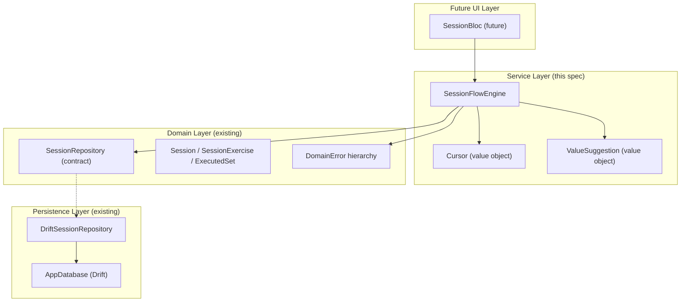
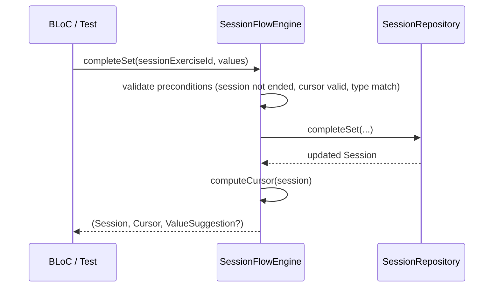

# Design Document: Session Flow Engine

## Overview

The Session Flow Engine is a stateless, pure-Dart service that sits between the `SessionRepository` and the future BLoC/UI layer. It provides:

1. **Session lifecycle** — create, resume, end
2. **Cursor computation** — always know which exercise/set is next
3. **Mutation orchestration** — complete sets, skip, replace, reorder, superset, extra work, notes
4. **Value suggestion** — pre-fill actual values from prior performance
5. **Invariant enforcement** — reject illegal state transitions before they reach persistence

The engine is deliberately stateless: it holds no cached session. Every mutation delegates to the `SessionRepository`, receives the updated `Session` aggregate back, recomputes the `Cursor`, and returns both to the caller. This guarantees the caller always sees the latest persisted state and that app backgrounding cannot cause stale-state bugs.

### Design Decisions

| Decision | Choice | Rationale |
|----------|--------|-----------|
| Stateless vs stateful | Stateless | Eliminates cache-invalidation bugs; every call round-trips through the repo. The BLoC layer above will hold the reactive state. |
| Cursor as value object | Freezed sealed class with `active` and `completed` variants | Exhaustive pattern matching in Dart; no null-cursor ambiguity. |
| Superset at session level | Tag-based grouping via `supersetTag` field on `SessionExercise` | Avoids schema migration; the flat list stays flat; grouping is a logical overlay. Requires a new nullable field on `SessionExercise`. |
| Clock injection | Constructor parameter, no default | Forces tests to be explicit; matches existing `AppClock` pattern. |
| Error signaling | Throw typed `DomainError` subclasses | Matches existing error hierarchy (`ValidationError`, `ImmutabilityError`, `OrderingError`, `NotFoundError`). |

## Architecture



The engine depends only on:
- `SessionRepository` (abstract contract)
- Domain models (`Session`, `SessionExercise`, `ExecutedSet`, etc.)
- Domain errors
- `Clock` from `package:clock`

No Flutter imports, no Drift imports, no `dart:io`.

### Flow for a typical mutation



## Components and Interfaces

### SessionFlowEngine

```dart
class SessionFlowEngine {
  SessionFlowEngine({
    required SessionRepository repository,
    required Clock clock,
  });

  /// Start a new session from a workout day.
  Future<SessionState> startSession({required String workoutDayId});

  /// Resume an existing session.
  Future<SessionState> resumeSession({required String sessionId});

  /// End the current session.
  Future<SessionState> endSession({required String sessionId});

  /// Complete the current set with actual values.
  Future<SessionState> completeSet({
    required String sessionExerciseId,
    required ActualSetValues actualValues,
    String? plannedSetIdInSnapshot,
  });

  /// Edit a previously completed set's values.
  Future<SessionState> updateExecutedSet({
    required String executedSetId,
    required ActualSetValues actualValues,
  });

  /// Skip an unfinished exercise.
  Future<SessionState> skipExercise({required String sessionExerciseId});

  /// Replace an unfinished exercise with a substitute.
  Future<SessionState> replaceExercise({
    required String sessionExerciseId,
    required String substituteName,
    required MeasurementType substituteMeasurementType,
    ExerciseMetadata? substituteMetadata,
  });

  /// Reorder unfinished exercises.
  Future<SessionState> reorderUnfinished({
    required String sessionId,
    required List<String> orderedUnfinishedIds,
  });

  /// Group unfinished exercises into a superset.
  Future<SessionState> createSuperset({
    required String sessionId,
    required List<String> sessionExerciseIds,
  });

  /// Ungroup a superset back into individual exercises.
  Future<SessionState> removeSuperset({
    required String sessionId,
    required List<String> sessionExerciseIds,
  });

  /// Add extra work to the session.
  Future<SessionState> addExtraWork({
    required String sessionId,
    required String body,
  });

  /// Add a note to the session.
  Future<SessionState> addSessionNote({
    required String sessionId,
    required String body,
  });

  /// Query whether the session is fully complete.
  bool isSessionComplete(Session session);

  /// Compute cursor from a session (pure, synchronous).
  Cursor computeCursor(Session session);

  /// Compute suggested values for the current cursor position (pure, synchronous).
  ActualSetValues? suggestValues({
    required Session session,
    required Cursor cursor,
  });
}
```

### SessionState (return type)

```dart
@freezed
abstract class SessionState with _$SessionState {
  const factory SessionState({
    required Session session,
    required Cursor cursor,
    ActualSetValues? suggestedValues,
  }) = _SessionState;
}
```

This bundles the three things every caller needs after any operation: the persisted session, the computed cursor, and optional value suggestions for the next set.

### Cursor

```dart
@Freezed(unionKey: 'type')
sealed class Cursor with _$Cursor {
  /// Points to the next set to complete.
  const factory Cursor.active({
    required String sessionExerciseId,
    required int setIndex,
  }) = ActiveCursor;

  /// All exercises are in a terminal state.
  const factory Cursor.completed() = CompletedCursor;
}
```

The `setIndex` is the 0-based index of the next set to perform (equals `executedSets.length` for that exercise).

### Superset Grouping at Session Level

The template layer uses `ExerciseGroup` with `ExerciseGroupKind.superset()`. At the session level, exercises are stored as a flat `List<SessionExercise>`. Superset grouping is represented as a **logical tag**:

**Approach**: Add an optional `supersetTag` field to `SessionExercise`. Exercises sharing the same non-null `supersetTag` value form a superset group. The tag is a UUID generated when the superset is created.

This requires a schema addition to `SessionExercise`:
```dart
@freezed
abstract class SessionExercise with _$SessionExercise {
  const factory SessionExercise({
    // ... existing fields ...
    String? supersetTag, // null = standalone, non-null = grouped with same tag
  }) = _SessionExercise;
}
```

And a corresponding nullable column in the `SessionExercises` Drift table.

**Superset creation**: Assign the same UUID tag to all provided exercises, reposition them consecutively.

**Superset removal**: Set `supersetTag` to null on all exercises in the group.

**Validation**: Only unfinished exercises can be grouped/ungrouped. A superset requires ≥2 exercises.

### Repository Extensions for Superset

The existing `SessionRepository` contract needs two new methods:

```dart
abstract class SessionRepository {
  // ... existing methods ...

  /// Groups exercises into a superset by assigning a shared tag and
  /// repositioning them consecutively.
  Future<Session> createSuperset({
    required String sessionId,
    required List<String> sessionExerciseIds,
  });

  /// Removes superset grouping from exercises, restoring them as independent.
  Future<Session> removeSuperset({
    required String sessionId,
    required List<String> sessionExerciseIds,
  });
}
```

## Data Models

### New Value Objects

```dart
/// Bundles session + cursor + suggestion after every engine operation.
@freezed
abstract class SessionState with _$SessionState {
  const factory SessionState({
    required Session session,
    required Cursor cursor,
    ActualSetValues? suggestedValues,
  }) = _SessionState;
}

/// The current position in the session.
@Freezed(unionKey: 'type')
sealed class Cursor with _$Cursor {
  const factory Cursor.active({
    required String sessionExerciseId,
    required int setIndex,
  }) = ActiveCursor;

  const factory Cursor.completed() = CompletedCursor;
}
```

### Modified Existing Models

**SessionExercise** — add nullable `supersetTag`:
```dart
@freezed
abstract class SessionExercise with _$SessionExercise {
  const factory SessionExercise({
    required String id,
    required String sessionId,
    required int position,
    required String plannedExerciseIdInSnapshot,
    required ExerciseState state,
    required List<ExecutedSet> executedSets,
    String? supersetTag,  // NEW: null = standalone, shared UUID = superset group
    required DateTime createdAt,
    required DateTime updatedAt,
    required int schemaVersion,
  }) = _SessionExercise;
}
```

**SessionExercises table** — add nullable text column:
```dart
class SessionExercises extends Table {
  // ... existing columns ...
  TextColumn get supersetTag => text().nullable()();
}
```

### Cursor Computation Algorithm

```
computeCursor(session):
  for each sessionExercise in session.sessionExercises (sorted by position):
    if exercise.state == unfinished:
      plannedSetCount = lookupPlannedSetCount(exercise, session.snapshot)
      if exercise.executedSets.length < plannedSetCount:
        return Cursor.active(exercise.id, exercise.executedSets.length)
    if exercise.state == replaced:
      plannedSetCount = lookupPlannedSetCount(exercise, session.snapshot)
      if exercise.executedSets.length < plannedSetCount:
        return Cursor.active(exercise.id, exercise.executedSets.length)
  return Cursor.completed()
```

### Value Suggestion Algorithm

```
suggestValues(session, cursor):
  if cursor is CompletedCursor: return null
  exercise = findExercise(session, cursor.sessionExerciseId)
  effectiveMeasurementType = exercise.state is replaced
    ? exercise.state.substitute.measurementType
    : lookupOriginalMeasurementType(exercise, session.snapshot)

  if cursor.setIndex > 0:
    // Use last completed set of this exercise
    lastSet = exercise.executedSets.last
    return lastSet.actualValues

  // First set: use planned values from snapshot, converted to ActualSetValues
  if exercise.state is replaced AND substitute.measurementType != original:
    return defaultZeroValues(effectiveMeasurementType)

  plannedSet = lookupPlannedSet(exercise, session.snapshot, position: 0)
  return convertPlannedToActual(plannedSet.plannedValues)
```

### Helper: PlannedSetValues → ActualSetValues conversion

```dart
ActualSetValues convertPlannedToActual(PlannedSetValues planned) {
  return switch (planned) {
    PlannedRepBased(:final weightKg, :final reps) =>
      ActualSetValues.repBased(weightKg: weightKg, reps: reps),
    PlannedTimeBased(:final durationSeconds) =>
      ActualSetValues.timeBased(durationSeconds: durationSeconds),
  };
}
```


## Correctness Properties

*A property is a characteristic or behavior that should hold true across all valid executions of a system — essentially, a formal statement about what the system should do. Properties serve as the bridge between human-readable specifications and machine-verifiable correctness guarantees.*

### Property 1: Fresh session structure

*For any* WorkoutDay with N exercises (across all groups), starting a session SHALL produce a Session with exactly N SessionExercises, all in the `unfinished` state, and the computed Cursor SHALL point to the first exercise (position 0) at set index 0.

**Validates: Requirements 1.2, 1.3**

### Property 2: Cursor computation correctness

*For any* Session with a mix of exercise states (unfinished, completed, skipped, replaced) and varying executed set counts, the computed Cursor SHALL point to the first SessionExercise in position order whose state is `unfinished` or `replaced` AND whose `executedSets.length` is less than the planned set count in the snapshot. If no such exercise exists, the Cursor SHALL be `Cursor.completed()`.

**Validates: Requirements 2.2, 4.1, 4.2, 4.3, 4.4**

### Property 3: Cursor consistency after mutations

*For any* mutation operation (completeSet, skipExercise, replaceExercise, reorderUnfinished, createSuperset, removeSuperset) that succeeds, the returned Cursor SHALL be equal to `computeCursor(returnedSession)` — i.e., the cursor is always recomputed from the actual session state, never stale.

**Validates: Requirements 4.5, 8.5**

### Property 4: End session on active session

*For any* Session where `endedAt` is null (regardless of how many exercises are unfinished, completed, skipped, or replaced), calling `endSession` SHALL succeed and the returned Session SHALL have `endedAt` equal to the injected Clock's current time.

**Validates: Requirements 3.1, 3.2, 3.3**

### Property 5: Double-end immutability

*For any* Session where `endedAt` is non-null, calling `endSession` again SHALL throw an `ImmutabilityError` carrying the session's id.

**Validates: Requirements 3.4, 16.4**

### Property 6: Set completion records correct values and timestamp

*For any* valid set completion (matching measurement type, session not ended, cursor not terminal), the returned Session SHALL contain a new `ExecutedSet` on the target exercise with `actualValues` equal to the provided values and `completedAt` equal to the injected Clock's current time.

**Validates: Requirements 5.1, 18.2, 18.3, 18.4**

### Property 7: Last set transitions exercise to completed

*For any* unfinished SessionExercise where `executedSets.length == plannedSetCount - 1`, completing one more set SHALL transition the exercise state to `completed`.

**Validates: Requirements 5.3**

### Property 8: Measurement type validation

*For any* set completion or set edit where the `ActualSetValues` variant does not match the effective MeasurementType of the exercise (original type for unfinished, substitute's type for replaced), the Engine SHALL throw a `ValidationError`.

**Validates: Requirements 5.4, 6.3, 8.3**

### Property 9: Ended session immutability

*For any* Session where `endedAt` is non-null, calling `completeSet` SHALL throw an `ImmutabilityError`. Additionally, if the Cursor is `Cursor.completed()`, calling `completeSet` SHALL throw a `ValidationError`.

**Validates: Requirements 2.4, 5.5, 5.6, 16.5**

### Property 10: Editing works regardless of exercise state

*For any* existing `ExecutedSet` (regardless of whether its parent SessionExercise is in completed, skipped, or replaced state), calling `updateExecutedSet` with a type-matching `ActualSetValues` SHALL succeed and the returned Session SHALL contain the updated values.

**Validates: Requirements 6.2**

### Property 11: Skip transitions to skipped

*For any* SessionExercise in the `unfinished` state, calling `skipExercise` SHALL transition its state to `skipped` and the Cursor SHALL advance past it.

**Validates: Requirements 7.1, 7.2, 7.4**

### Property 12: Non-unfinished exercises reject structural mutations

*For any* SessionExercise whose state is `completed`, `skipped`, or `replaced`, attempting to skip, replace, include in a reorder list, or include in a superset creation SHALL throw an `OrderingError` with the offending `sessionExerciseId` and its current state.

**Validates: Requirements 7.3, 8.4, 9.2, 10.2, 11.2, 16.1, 16.2, 16.3**

### Property 13: Replace sets correct state and preserves snapshot reference

*For any* unfinished SessionExercise, calling `replaceExercise` with a substitute name and MeasurementType SHALL transition the state to `replaced` with the provided `SubstituteExercise`, AND the `plannedExerciseIdInSnapshot` field SHALL remain unchanged.

**Validates: Requirements 8.1, 8.2**

### Property 14: Reorder preserves completed positions and applies new order

*For any* reorder operation with a valid permutation of all unfinished exercise IDs, the returned Session SHALL have: (a) all completed/skipped/replaced exercises at their original relative positions, and (b) unfinished exercises in the new specified order, all positioned after the locked exercises.

**Validates: Requirements 9.1, 9.4**

### Property 15: Reorder requires exact permutation of all unfinished IDs

*For any* reorder call where the provided list is not exactly the set of all currently unfinished SessionExercise IDs (missing some, or containing extras), the Engine SHALL throw a `ValidationError`.

**Validates: Requirements 9.3**

### Property 16: Superset creation assigns shared tag and consecutive positions

*For any* set of ≥2 unfinished SessionExercise IDs, calling `createSuperset` SHALL assign the same non-null `supersetTag` to all of them and position them consecutively in the session.

**Validates: Requirements 10.1, 10.5**

### Property 17: Superset removal clears tags preserving relative order

*For any* set of SessionExercise IDs that share the same `supersetTag` and are all in `unfinished` state, calling `removeSuperset` SHALL set their `supersetTag` to null while preserving their relative position order.

**Validates: Requirements 11.1, 11.5**

### Property 18: Superset removal requires same group

*For any* set of SessionExercise IDs where not all share the same `supersetTag`, calling `removeSuperset` SHALL throw a `ValidationError`.

**Validates: Requirements 11.3**

### Property 19: Valid text body persists

*For any* string containing at least one non-whitespace character (and ≤5000 characters for notes), calling `addExtraWork` or `addSessionNote` SHALL succeed and the returned Session SHALL contain the new entry with the provided body.

**Validates: Requirements 12.1, 13.1**

### Property 20: Whitespace-only body rejected

*For any* string that is empty or composed entirely of whitespace characters, calling `addExtraWork` or `addSessionNote` SHALL throw a `ValidationError` without persisting any data.

**Validates: Requirements 12.2, 13.2**

### Property 21: Session completion query

*For any* Session, `isSessionComplete` SHALL return `true` if and only if every SessionExercise has state `completed`, `skipped`, or `replaced` where the replaced exercise's `executedSets.length` equals the planned set count in the snapshot. Otherwise it SHALL return `false`.

**Validates: Requirements 14.1, 14.2, 14.3**

### Property 22: Value suggestion correctness

*For any* active Cursor position:
- If `setIndex > 0`, `suggestValues` SHALL return the `actualValues` from the exercise's most recently completed ExecutedSet (highest position).
- If `setIndex == 0` and the exercise is unfinished, `suggestValues` SHALL return `ActualSetValues` converted from the `PlannedSetValues` at position 0 in the snapshot.
- If `setIndex == 0` and the exercise is replaced with a different MeasurementType than the original, `suggestValues` SHALL return zero/default values matching the substitute's MeasurementType.
- The returned `ActualSetValues` variant SHALL always match the exercise's effective MeasurementType.

**Validates: Requirements 15.1, 15.2, 15.3, 15.4**

## Error Handling

The engine uses the existing `DomainError` sealed hierarchy. Each error type maps to specific precondition violations:

| Error Type | Trigger Conditions |
|---|---|
| `NotFoundError` | Session, SessionExercise, ExecutedSet, or WorkoutDay ID not found in repository |
| `ValidationError` | Measurement type mismatch; whitespace-only body; reorder list not a permutation; fewer than 2 exercises for superset; note body exceeds 5000 chars |
| `ImmutabilityError` | Set completion on ended session; double end-session |
| `OrderingError` | Skip/replace/reorder/superset on non-unfinished exercise |

### Error Propagation Strategy

1. **Precondition checks first**: The engine validates preconditions (session not ended, exercise in correct state, type matching) *before* delegating to the repository. This avoids unnecessary DB round-trips for invalid operations.
2. **Repository errors propagate**: If the repository throws (e.g., DB constraint violation), the engine does not catch or wrap it — it propagates directly to the caller.
3. **No partial state**: Since the engine is stateless, a failed operation leaves no stale cached state. The caller can retry or take corrective action.

### Validation Order

For operations with multiple preconditions, the engine checks in this order:
1. Entity existence (NotFoundError)
2. Session ended check (ImmutabilityError)
3. Exercise state check (OrderingError)
4. Value/type validation (ValidationError)

This ensures the most actionable error is surfaced first.

## Testing Strategy

### Property-Based Testing (Primary)

This feature is ideal for PBT: it's pure logic with clear input/output behavior, universal properties that hold across a wide input space, and a rich domain of generated inputs (sessions, exercises, sets, measurement types).

**Library**: `flutter_test` with manual iteration loops (matching the existing project pattern in `test/core/canonical_json_property_test.dart`).

**Configuration**:
- Minimum 100 iterations per property test
- Seeded `Random` for reproducibility
- Each test tagged with a comment referencing the design property

**Tag format**: `// Feature: session-flow-engine, Property {N}: {title}`

**Generators needed** (extend existing `test/support/generators.dart`):
- `anySessionForEngine(Random rng)` — generates a Session with consistent snapshot ↔ exercise mapping (exercises reference real planned exercises in the snapshot)
- `anySessionWithState(Random rng, {required List<ExerciseState> states})` — generates a session with exercises in specified states
- `anyCursorableSession(Random rng)` — generates a session where cursor computation is meaningful (at least one unfinished exercise with sets remaining)
- `anyEndedSession(Random rng)` — generates a session with non-null endedAt
- `anyWhitespaceString(Random rng)` — generates strings of only whitespace characters

**Test file organization**:
```
test/
└── domain/
    └── services/
        ├── session_flow_engine_cursor_property_test.dart
        ├── session_flow_engine_completion_property_test.dart
        ├── session_flow_engine_mutation_property_test.dart
        ├── session_flow_engine_immutability_property_test.dart
        ├── session_flow_engine_superset_property_test.dart
        ├── session_flow_engine_suggestion_property_test.dart
        └── session_flow_engine_test.dart  (unit tests for edge cases)
```

### Unit Tests (Complementary)

Unit tests cover:
- Edge cases: empty workout day, single exercise, zero planned sets
- Error conditions: NotFoundError for missing entities
- Specific examples: a concrete 3-exercise session walked through step by step
- Integration with mock repository: verify delegation order

### Mock Strategy

The engine depends on `SessionRepository` (abstract). Tests will use a mock/fake implementation that:
- Stores sessions in memory
- Applies mutations correctly
- Returns updated sessions

This keeps tests fast (no Drift, no DB) while exercising the engine's logic fully.

### What is NOT tested with PBT

- Repository persistence behavior (tested separately in `test/repository/`)
- Drift SQL correctness (tested in `test/integration/`)
- UI/BLoC behavior (out of scope for this spec)
