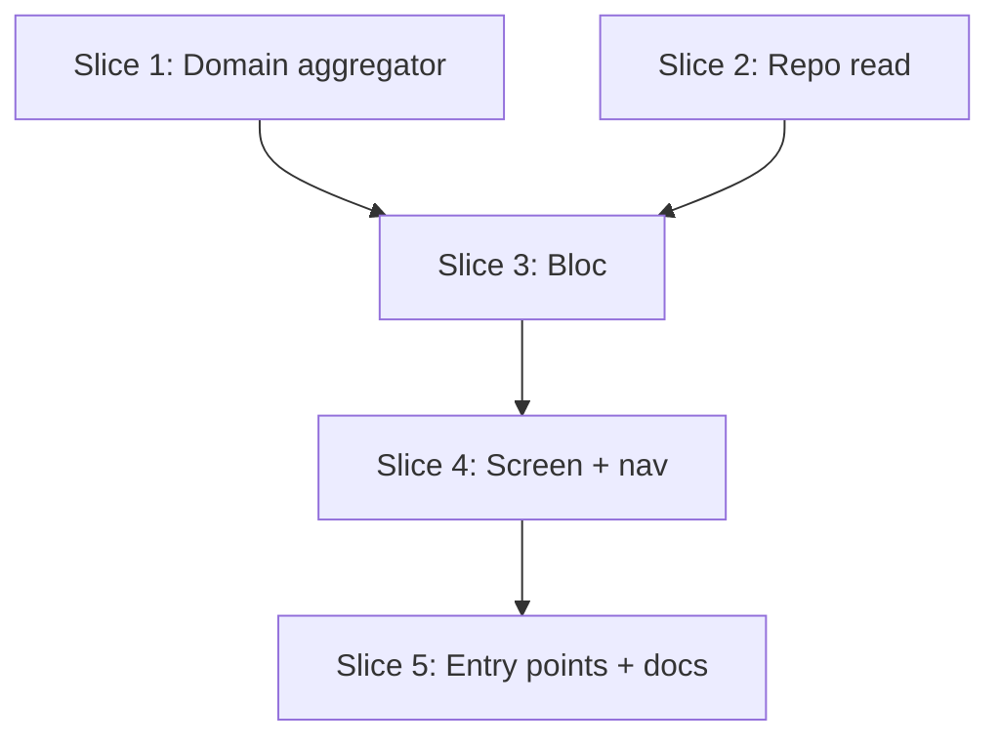

# Plan: Exercise Progress (Top-Set Trend)

**Created**: 2026-06-15
**Branch**: master
**Spec**: `../docs/specs/exercise-progress.md`
**Status**: implemented

## Goal

Add a per-exercise **Progress view** that plots the **top set** (heaviest `repBased` set) logged for an exercise over time, aggregated across **every program** the exercise has appeared in. Reachable from the Library exercise editor and from a finished session's exercise card. All data is computed live from local session rows (no schema bump, no network, deleted sessions drop out automatically). v1 covers `repBased` (weighted) exercises only; `timeBased`/`bodyweight` and unlinked exercises show explicit empty states. Cross-plan is the default; a per-point tooltip shows which workout day each point came from. **The per-program filter is deferred to v2.**

## Acceptance Criteria

- [ ] **AC1** Top-set trend, cross-plan: weighted exercise with ≥2 completed sessions across any programs shows a chronologically-ordered line of top-set weight, including points from different programs.
- [ ] **AC2** Top-set definition: each point is the session's heaviest `weightKg` set for that exercise; ties broken by higher reps; each point exposes `topSetWeightKg`, `reps`, and `sessionDate` as distinct values.
- [ ] **AC3** Weighted-only: a non-`repBased` exercise shows a "supports weighted exercises only" empty state, no chart.
- [ ] **AC4** Unlinked exercise (session-review entry): an exercise with no `libraryExerciseId` shows a "not linked — can't track across sessions" empty state, with a pointer toward the Library link flow.
- [ ] **AC5** Sparse data: 0 sessions → "no sessions logged yet"; exactly 1 session → single labeled top-set stat (weight × reps + date in numeric style) with a "keep training" hint, no trend line.
- [ ] **AC6** Live consistency: when the screen is re-opened after a session was deleted, the deleted session's point no longer appears in the series. (Implementation note, not part of the pass/fail check: the series is recomputed from live data on each load — no precomputed aggregate.)
- [ ] **AC7** Entry points: reachable from the Library exercise editor and a finished session's exercise card; both route to the same view. The action is NOT present on in-progress session cards.
- [ ] **AC8** Token/layout compliance: no hard-coded pixels/color literals; numeric readouts use `AppTypography` numeric styles; passes `tool/check_offline_imports.sh`.
- [ ] **AC9** Tests: domain aggregator + bloc state machine unit-tested; repository read method covered by an integration test.
- [ ] **AC10** Docs: `product-context.md` lists the new Exercise Progress screen.
- [ ] **AC11** Loading & error states: the screen shows a loading indicator while data loads, and a retry-able error state if the read throws.

> **Deferred to v2:** per-program filter (narrow the cross-plan series to one program). Dropped from v1 as the main complexity driver (second repository dependency + deleted-program label handling). The ProgressPoint model still carries `programId`, so adding the filter later is additive.

## Slices

### Slice 1: Domain aggregation — `ExerciseProgressAggregator` + models

**Depends-on:** none
**Files:** `lib/modules/domain/models/progress_point.dart`, `lib/modules/domain/models/exercise_progress_series.dart`, `lib/modules/domain/services/exercise_progress_aggregator.dart`, `lib/modules/domain/domain.dart`, `test/domain/services/exercise_progress_aggregator_test.dart`

**Behavior:**

```gherkin
Feature: Aggregate top-set progress for a library exercise

  Background:
    Given a library exercise "Bench Press" measured by weight and reps

  Scenario: Top set per session, cross-program, oldest first
    Given a completed session on 2026-02-15 in program "PPL" whose heaviest logged set was 100 kg for 5 reps
    And a completed session on 2026-01-10 in program "5x5" whose heaviest logged set was 90 kg for 5 reps
    When the progress series is computed
    Then it has two points ordered oldest first
    And the first point is 90 kg and the second is 100 kg
    And each point carries the workout-day name it was logged under

  Scenario: A point carries weight, reps, and the session date
    Given a completed session on 2026-03-01 whose top set was 80 kg for 8 reps
    When the progress series is computed
    Then the single point has date 2026-03-01, weightKg 80, and reps 8

  Scenario: Tie on weight broken by higher reps
    Given a completed session with sets 100 kg x 3 and 100 kg x 6
    When the progress series is computed
    Then the session's point is 100 kg for 6 reps

  Scenario: Only completed sessions count
    Given a session that was started but not finished, with a 120 kg set
    And a completed session with a 100 kg set
    When the progress series is computed
    Then only the 100 kg point appears

  Scenario: Sessions without the exercise are ignored
    Given a completed session that does not contain the exercise
    When the progress series is computed
    Then that session contributes no point

  Scenario: Empty series when there is no history
    Given no completed sessions contain the exercise
    When the progress series is computed
    Then the series is empty

  Scenario: Single-point series with one session
    Given exactly one completed session contains the exercise
    When the progress series is computed
    Then the series has exactly one point
```

**Steps:**

#### Step 1.1: `ProgressPoint` + `ExerciseProgressSeries` models
**Complexity**: standard
**RED**: Test construction/validation of `ProgressPoint` (date, `topSetWeightKg` ≥ 0 and 0.5-resolution, reps ≥ 0, `programId`, `sourceWorkoutDayName`) and `ExerciseProgressSeries` (points, `isEmpty`/`isSingle` helpers).
**GREEN**: Add freezed models with a private `._()` body for validation and a **non-const redirecting factory** (required by CLAUDE.md because the `._()` body runs runtime checks — do NOT copy `Session`'s `const factory`). `programId` is retained for the deferred v2 filter; `sourceWorkoutDayName` feeds the v1 per-point tooltip.
**REFACTOR**: None expected.
**Files**: `lib/modules/domain/models/progress_point.dart`, `lib/modules/domain/models/exercise_progress_series.dart`, `test/domain/services/exercise_progress_aggregator_test.dart` (model cases) — run `dart run build_runner build --force-jit`.
**Commit**: `feat(domain): add ProgressPoint and ExerciseProgressSeries models`

#### Step 1.2: `ExerciseProgressAggregator.compute`
**Complexity**: complex
**RED**: Tests for every Slice-1 scenario written from the public contract (given input sessions, assert the returned series' points/values/order) — not from internal wiring. Cover cross-program ordering, weight+reps+date shape, workout-day name carried per point, top-set tiebreak, completed-only (reuse `SessionHistory` completed predicate), exercise-absence, `repBased`-only filtering, empty, single.
**GREEN**: Implement pure-Dart aggregator: for each completed session, decode `snapshot.workoutDay`, map `SessionExercise.plannedExerciseIdInSnapshot` → snapshot `Exercise`, keep those whose `libraryExerciseId` matches and whose `measurementType` is `repBased`; from `ExecutedSet`s with `ActualRepBased`, pick max `weightKg` (tiebreak higher reps); emit `ProgressPoint(date: session.startedAt, programId: snapshot.workoutDay.programId, sourceWorkoutDayName: snapshot.workoutDay.name, ...)`; sort oldest-first.
**REFACTOR**: Extract per-session top-set selection into a private helper if `compute` exceeds ~1 screen.
**Files**: `lib/modules/domain/services/exercise_progress_aggregator.dart`, `lib/modules/domain/domain.dart` (export models + service), `test/domain/services/exercise_progress_aggregator_test.dart`.
**Commit**: `feat(domain): compute cross-plan top-set progress series`

### Slice 2: Repository read — list completed sessions

**Depends-on:** none
**Files:** `lib/modules/domain/repositories/session_repository.dart`, `lib/modules/persistence/repositories/drift_session_repository.dart`, `test/integration/list_completed_sessions_test.dart`

**Behavior:**

```gherkin
Feature: List completed sessions for progress aggregation

  Scenario: Returns only ended sessions, fully hydrated
    Given an ended session and a started-but-not-finished session in the database
    When completed sessions are listed
    Then only the ended session is returned
    And it includes its snapshot and executed sets

  Scenario: A deleted session is no longer returned
    Given two ended sessions
    When one is deleted
    And completed sessions are listed
    Then only the remaining session is returned
```

**Steps:**

#### Step 2.1: `SessionRepository.listCompletedSessions()`
**Complexity**: standard
**RED**: Integration test with `makeInMemoryDatabase()` — ended vs not-finished filtering, full hydration (snapshot + executed sets), and post-delete exclusion (covers AC6 at the data layer).
**GREEN**: Add `Future<List<Session>> listCompletedSessions()` to the contract; implement in Drift by selecting sessions where `endedAt` is non-null and hydrating via the existing batched session-assembly path (reuse, do not duplicate row→domain mapping; avoid N+1).
**REFACTOR**: Reuse the existing single-/multi-session hydration helper.
**Files**: `lib/modules/domain/repositories/session_repository.dart`, `lib/modules/persistence/repositories/drift_session_repository.dart`, `test/integration/list_completed_sessions_test.dart`.
**Commit**: `feat(persistence): list completed sessions for progress`

### Slice 3: Progress bloc — state machine

**Depends-on:** 1, 2
**Files:** `lib/modules/exercise_progress/models/exercise_progress_args.dart`, `lib/modules/exercise_progress/bloc/exercise_progress/exercise_progress_event.dart`, `lib/modules/exercise_progress/bloc/exercise_progress/exercise_progress_state.dart`, `lib/modules/exercise_progress/bloc/exercise_progress/exercise_progress_bloc.dart`, `lib/modules/exercise_progress/bloc/exercise_progress/bloc.dart`, `test/modules/exercise_progress/exercise_progress_bloc_test.dart`

**Behavior:**

```gherkin
Feature: Exercise progress presentation state

  Scenario: Trend state for a weighted exercise with history
    Given a linked, weighted exercise with two completed sessions
    When progress is loaded
    Then the state is "trend" carrying the two-point series

  Scenario: Single-session state
    Given a linked, weighted exercise with exactly one completed session
    When progress is loaded
    Then the state is "single" carrying that one top-set value

  Scenario: No-history state
    Given a linked, weighted exercise with no completed sessions
    When progress is loaded
    Then the state is "empty: no sessions"

  Scenario: Unsupported measurement type — time based
    Given a linked exercise measured by time
    When progress is loaded
    Then the state is "unsupported type" and no series is computed

  Scenario: Unsupported measurement type — bodyweight
    Given a linked exercise measured by bodyweight reps
    When progress is loaded
    Then the state is "unsupported type" and no series is computed

  Scenario: Unlinked exercise
    Given an exercise opened with no library id
    When progress is loaded
    Then the state is "unlinked" and no series is computed

  Scenario: Read failure surfaces an error state
    Given the completed-sessions read throws
    When progress is loaded
    Then the state is "error"
    And re-dispatching load recovers to the appropriate data state

  Scenario: Deleted session disappears on next load
    Given a linked weighted exercise with two completed sessions
    And the bloc has loaded a two-point trend
    When one session is deleted and progress is reloaded
    Then the state is "single" with the remaining point
```

**Steps:**

#### Step 3.1: Args + state/event definitions
**Complexity**: standard
**RED**: Test that `ExerciseProgressArgs` carries `libraryExerciseId` (nullable), `measurementType`, and `displayName`; assert the state union shape (loading / trend / single / emptyNoSessions / unsupportedType / unlinked / error) via equality.
**GREEN**: Define `ExerciseProgressArgs` as a **plain `final class`** (matching `FocusModeArgs` — no freezed, no Equatable, no codegen). Define the event/state types as **sealed + Equatable** (matching the export module's bloc convention).
**REFACTOR**: None expected.
**Files**: `lib/modules/exercise_progress/models/exercise_progress_args.dart`, `.../bloc/exercise_progress/exercise_progress_event.dart`, `.../exercise_progress_state.dart`, `.../bloc.dart`, `test/modules/exercise_progress/exercise_progress_bloc_test.dart`.
**Commit**: `feat(exercise_progress): progress args, events, and states`

#### Step 3.2: Bloc load + error handling
**Complexity**: complex
**RED**: Tests for every Slice-3 scenario — gate on null `libraryExerciseId` (→ unlinked, AC4), non-`repBased` (→ unsupportedType, AC3), then load via `listCompletedSessions` + `ExerciseProgressAggregator`, mapping 0/1/≥2 points to emptyNoSessions/single/trend (AC5, AC1); read-throws → error + recover on reload (AC11); delete-then-reload drops the point (AC6).
**GREEN**: Implement the bloc against `SessionRepository` + the aggregator (no `ProgramRepository` dependency in v1). Wrap the read in try/catch → error state.
**REFACTOR**: None expected.
**Files**: `lib/modules/exercise_progress/bloc/exercise_progress/exercise_progress_bloc.dart`, `test/modules/exercise_progress/exercise_progress_bloc_test.dart`.
**Commit**: `feat(exercise_progress): load and error-handle progress state`

### Slice 4: Progress screen + chart widget + navigation + module barrel

**Depends-on:** 3
**Files:** `mobile/pubspec.yaml`, `lib/modules/exercise_progress/exercise_progress.dart`, `lib/modules/exercise_progress/screens/exercise_progress_screen.dart`, `lib/modules/exercise_progress/widgets/top_set_trend_chart.dart`, `lib/modules/exercise_progress/widgets/progress_status_view.dart`, `lib/modules/exercise_progress/navigation/exercise_progress_routes.dart`, `lib/modules/exercise_progress/navigation/exercise_progress_router.dart`, `lib/navigation/app_router.dart`

**Behavior:**

```gherkin
Feature: Render the exercise progress screen

  Scenario: Each bloc state renders its matching surface
    Given the progress bloc state
    When the screen builds
    Then "loading" shows a progress indicator
    And "trend" shows a line chart of top-set weight over time
    And "single" shows the top-set weight × reps + date stat with a keep-training hint
    And "emptyNoSessions" / "unsupportedType" / "unlinked" show their guidance messages
    And "error" shows a retry-able message that re-dispatches load

  Scenario: Tapping a trend point reveals its source
    Given a trend chart with points from more than one workout day
    When a point is tapped
    Then a tooltip shows that point's workout-day name, weight, and reps

  Scenario: Route resolves to the screen
    Given a navigation request to the exercise-progress route with valid args
    When the router handles it
    Then the progress screen is built with its bloc for that exercise
```

> No widget tests per project test scope (CLAUDE.md). Verification = `flutter analyze`, `tool/check_offline_imports.sh`, and user visual validation.

#### Step 4.1: Add `fl_chart` dependency
**Complexity**: trivial
**RED**: None (dependency change). Gate = `flutter pub get` resolves.
**GREEN**: Add `fl_chart` to `pubspec.yaml` dependencies; run `flutter pub get`.
**REFACTOR**: None.
**Files**: `mobile/pubspec.yaml`.
**Commit**: `build: add fl_chart dependency`

#### Step 4.2: Chart + status-view widgets (token-compliant, accessible)
**Complexity**: standard
**RED**: None (presentation). Gate = analyzer + offline-imports guard (AC8).
**GREEN**:
- `TopSetTrendChart` wraps fl_chart pulling all colors/spacing from `appColors`/`AppSpacing` and numeric axis labels from `AppTypography.standard.numeric`; on-tap tooltip shows each point's `sourceWorkoutDayName` + weight × reps; wrap the chart in a `Semantics` node exposing a one-line summary (e.g. "Bench Press: N sessions, latest top set X kg on <date>").
- `ProgressStatusView` renders the non-chart states: **single** (weight × reps in `numericLarge` + date + "keep training" hint), **emptyNoSessions**, **unsupportedType**, **unlinked** (with a pointer toward the Library link flow), **error** (retry action), **loading** (indicator).
**REFACTOR**: Factor shared axis/label styling into a private chart-theme helper.
**Files**: `lib/modules/exercise_progress/widgets/top_set_trend_chart.dart`, `lib/modules/exercise_progress/widgets/progress_status_view.dart`.
**Commit**: `feat(exercise_progress): top-set trend chart and status views`

#### Step 4.3: Screen + module barrel + routing
**Complexity**: standard
**RED**: None (UI wiring). Gate = analyzer + offline-imports guard.
**GREEN**: `ExerciseProgressScreen` provides the bloc and switches on state → chart/status widgets. Add `exercise_progress.dart` barrel, `exercise_progress_routes.dart`, `exercise_progress_router.dart`; chain the router into `app_router.dart`'s `??` delegate chain (AC7 plumbing).
**REFACTOR**: None expected.
**Files**: `lib/modules/exercise_progress/screens/exercise_progress_screen.dart`, `lib/modules/exercise_progress/exercise_progress.dart`, `lib/modules/exercise_progress/navigation/exercise_progress_routes.dart`, `lib/modules/exercise_progress/navigation/exercise_progress_router.dart`, `lib/navigation/app_router.dart`.
**Commit**: `feat(exercise_progress): progress screen and route`

### Slice 5: Entry points + docs

**Depends-on:** 4
**Files:** `lib/modules/workout_overview/models/exercise_view_model.dart`, `lib/modules/workout_overview/services/*assembler*.dart`, `lib/modules/exercise_library/screens/exercise_library_editor_screen.dart`, `lib/modules/export/widgets/session_detail_exercise_card.dart`, `product-context.md`

**Behavior:**

```gherkin
Feature: Reach the progress view from real surfaces

  Scenario: From the Library exercise editor
    Given a library exercise open in the editor
    When the user taps the progress action
    Then the progress screen opens for that library exercise (always linked)

  Scenario: From a finished session's exercise card
    Given a completed session shown in session detail
    When the user taps an exercise's progress action
    Then the progress screen opens for that exercise
    And if the exercise has no library link the "unlinked" guidance is shown

  Scenario: Progress action absent from an in-progress session
    Given a session that is in progress
    When its exercise card is rendered
    Then no progress action is present on the card
```

> No widget tests per project test scope. Verification = analyzer + user visual validation. The view-model extension in Step 5.1 carries a domain field already present on the snapshot, so it needs no new test beyond the assembler's existing coverage.

#### Step 5.1: Expose `libraryExerciseId` to the session-detail exercise (prep)
**Complexity**: standard
**RED**: Extend the assembler test (if present) to assert `ExerciseViewModel.libraryExerciseId` is carried through from the snapshot `Exercise`.
**GREEN**: Add `libraryExerciseId` (nullable) to `ExerciseViewModel` and populate it in the assembler from the snapshot exercise. (`ExerciseViewModel` currently exposes measurement type but not the library id — this is the gap the design review verified.)
**REFACTOR**: None.
**Files**: `lib/modules/workout_overview/models/exercise_view_model.dart`, the workout-overview assembler that builds it, and its test if one exists.
**Commit**: `feat(workout_overview): expose libraryExerciseId on ExerciseViewModel`

#### Step 5.2: Library editor entry action
**Complexity**: standard
**RED**: None (UI wiring). Gate = analyzer.
**GREEN**: Add a "Progress" action to `exercise_library_editor_screen.dart` navigating to the progress route with the library entry's id, `measurementType`, and name.
**REFACTOR**: None.
**Files**: `lib/modules/exercise_library/screens/exercise_library_editor_screen.dart`.
**Commit**: `feat(exercise_library): open progress from the editor`

#### Step 5.3: Session-detail entry action
**Complexity**: standard
**RED**: None (UI wiring). Gate = analyzer.
**GREEN**: Add a progress affordance to the session-detail exercise (`session_detail_exercise_card.dart`) navigating with the exercise's `libraryExerciseId` (nullable → unlinked state), `measurementType`, and name. Do NOT add this affordance to in-progress session surfaces (AC7).
**REFACTOR**: None.
**Files**: `lib/modules/export/widgets/session_detail_exercise_card.dart`.
**Commit**: `feat(export): open progress from session detail`

#### Step 5.4: Update product-context.md
**Complexity**: trivial
**RED**: None.
**GREEN**: Add the Exercise Progress screen to `product-context.md` (AC10).
**REFACTOR**: None.
**Files**: `product-context.md`.
**Commit**: `docs: add Exercise Progress screen to product context`

## Parallelization



| Wave | Slices (parallel) |
|------|-------------------|
| 1 | 1, 2 |
| 2 | 3 |
| 3 | 4 |
| 4 | 5 |

> Waves derived manually from `Depends-on` (the `plan-waves.sh` script is not present in this plugin build). Wave 1 is the only parallel wave; slices 1 and 2 declare fully disjoint files and have no behavioral coupling (the aggregator takes already-hydrated `Session`s and never calls the repo). Verified by the Parallelization Critic.

## Complexity Classification

Per step (see each). Summary: Steps 1.2 and 3.2 are `complex` (core domain logic / state machine); model, repo, widget, view-model, and wiring steps are `standard`; dependency add and docs are `trivial`.

## Pre-PR Quality Gate

- [ ] All tests pass (`tool/ci.sh`)
- [ ] `dart analyze` clean
- [ ] `tool/check_offline_imports.sh` passes (new UI module imports no Drift)
- [ ] `dart format` clean
- [ ] `/code-review` passes
- [ ] `product-context.md` updated

## Risks & Open Questions

- **Loading all completed sessions per view** — `listCompletedSessions` + Dart-side scan is O(all history) per open. Acceptable for solo data (spec-accepted). The future optimization (a denormalized `libraryExerciseId` index + a filtered read) is **additive** — a new method alongside `listCompletedSessions`, not a breaking contract change.
- **Value gated on exercise linking** — exercises without a `libraryExerciseId` show empty/unlinked states; this feature's payoff scales with how many exercises the user has linked. Mitigation: the unlinked empty state points toward the existing Library link flow (Step 4.2 / AC4). The deferred "last-time look-back" feature would further drive linking.
- **`repBased` is the only "weighted" type** — `timeBased` can carry optional weight but is excluded in v1 by design; revisit only if users ask.
- **fl_chart theming + a11y** — must be fully token-driven (AC8) and Semantics-wrapped (Step 4.2); the wrapper widget is the enforcement point.
- **Per-point attribution uses the workout-day name, not the program name** — the snapshot carries `workoutDay.name` for free; resolving the program name would reintroduce `ProgramRepository`. The day name is sufficient for v1 attribution; the v2 per-program filter will add proper program resolution.

## Build Progress

### Slices (grouped by wave)

#### Wave 1
- [x] Slice 1: Domain aggregation — ExerciseProgressAggregator + models
  - [x] Step 1.1: ProgressPoint + ExerciseProgressSeries models
  - [x] Step 1.2: ExerciseProgressAggregator.compute
- [x] Slice 2: Repository read — list completed sessions
  - [x] Step 2.1: SessionRepository.listCompletedSessions()

#### Wave 2
- [x] Slice 3: Progress bloc — state machine
  - [x] Step 3.1: Args + state/event definitions
  - [x] Step 3.2: Bloc load + error handling

#### Wave 3
- [x] Slice 4: Progress screen + chart widget + navigation + module barrel
  - [x] Step 4.1: Add fl_chart dependency
  - [x] Step 4.2: Chart + status-view widgets
  - [x] Step 4.3: Screen + module barrel + routing

#### Wave 4
- [x] Slice 5: Entry points + docs
  - [x] Step 5.1: Expose libraryExerciseId on ExerciseViewModel (prep)
  - [x] Step 5.2: Library editor entry action
  - [x] Step 5.3: Session-detail entry action
  - [x] Step 5.4: Update product-context.md

### Acceptance Criteria

- [x] AC1 Top-set trend, cross-plan
- [x] AC2 Top-set definition + tiebreak (weight, reps, date)
- [x] AC3 Weighted-only empty state
- [x] AC4 Unlinked empty state (+ link pointer)
- [x] AC5 Sparse data (0 / 1 session)
- [x] AC6 Live consistency on delete
- [x] AC7 Entry points (editor + session detail; not in-progress)
- [x] AC8 Token/layout compliance
- [x] AC9 Aggregator + bloc + repo tests
- [x] AC10 product-context.md updated
- [x] AC11 Loading & error states

## Plan Review Summary

Five plan-review personas ran (sonnet). Final: **all five approve** after one revision round. The per-program filter was subsequently **deferred to v2** by product decision (Strategic Critic's recommendation), simplifying Slice 3.

| Reviewer | Initial | Final |
|----------|---------|-------|
| Acceptance Test Critic | needs-revision | approve |
| Design & Architecture Critic | approve | approve |
| UX Critic | needs-revision | approve |
| Strategic Critic | approve | approve |
| Parallelization Critic | approve | approve |

**Blockers resolved in revision:**
- Split the merged "empty/single-point" Gherkin into two scenarios (Slice 1).
- Reworded the live-consistency criterion and added a bloc-level "deleted session disappears on next load" scenario (Slice 3) so it's verified above the repo layer.
- Added a dedicated scenario asserting a point carries weight + reps + date.
- Added `loading` rendering and a first-class `error` state (state union, Step 3.2 try/catch, Step 4.2 retry render, AC11, bloc scenario).

**Warnings folded in:**
- `ExerciseProgressArgs` pinned to a plain `final class`; freezed models pinned to a non-const factory (Design — prevents copy-from-`Session` compile error).
- New Slice 5 prep step exposes `libraryExerciseId` on `ExerciseViewModel` (Design — verified the field was missing; avoids mid-slice rework).
- Per-point attribution via on-tap tooltip; single-session stat layout; chart Semantics summary; unlinked state points to the Library link flow (UX).
- Deterministic Givens (explicit dates/counts); split timeBased vs bodyweight scenarios; added in-progress-card negative scenario (Acceptance).

**Scope decision:**
- Per-program filter (and its `ProgramRepository` dependency + deleted-program label handling) **deferred to v2**. `ProgressPoint.programId` is retained so the filter is an additive change later.
