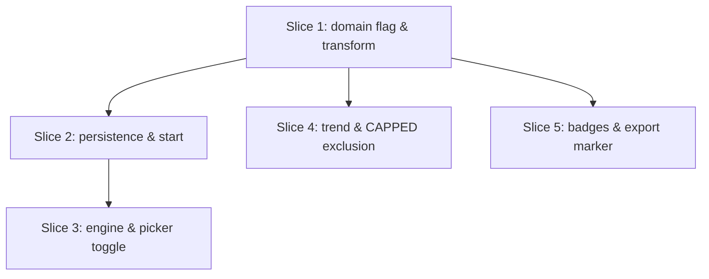

# Plan: Deload Week (v1)

**Created**: 2026-06-18
**Branch**: master
**Status**: approved
**Spec**: [docs/specs/deload-week.md](../docs/specs/deload-week.md)

## Goal

Let the lifter declare a workout session a **deload** at start. Doing so halves each working-exercise's planned set count in that session's frozen snapshot (so it reads as *completed*, not partial), tags the session via `Session.isDeload`, excludes it from the top-set progress trend and the CAPPED computations, and marks it as a deload everywhere it appears. The program template is never mutated; weight reductions remain manual (logged as in-session actuals). Ships "simplest first": a plain per-session toggle (no inferred week-default), no retroactive tagging, no week-ahead setup editor, no cadence reminder — all deferred.

## Acceptance Criteria

- [ ] AC1: Starting via the deload affordance yields `isDeload == true`; normal start yields `false`.
- [ ] AC2: A deload snapshot halves each `main`-group exercise to `ceil(n/2)` sets, preserving the first sets (1→1, 2→1, 3→2, 4→2, 5→3).
- [ ] AC3: `warmup`-role groups keep their full set count in a deload snapshot.
- [ ] AC4: Logging the halved quota in a deload session derives the exercise as completed, not partial.
- [ ] AC5: The program `WorkoutDay` set counts are identical before and after starting a deload session.
- [ ] AC6: A deload session's snapshot passes its canonical-JSON/hash invariant.
- [ ] AC7: A deload session contributes no point to `ExerciseProgressAggregator`.
- [ ] AC8: A deload session never sets the CAPPED badge and never appears in the recent set-history table, even when it sits mid-history (skipping it must not drop or duplicate adjacent entries).
- [ ] AC9: A deload session still appears in `SessionHistory.completedNewestFirst` and renders a DELOAD badge on the recent-sessions tile, the overview header, and the session-detail review.
- [ ] AC10: Plain-text export of a deload session includes a deload marker.
- [ ] AC11: Existing persisted sessions load post-migration with `isDeload == false`.

## Slices

### Slice 1: Domain — deload flag & set-halving transform

**Depends-on:** none
**Files:** `lib/modules/domain/models/session.dart`, `lib/modules/domain/services/deload_transform.dart`, `test/domain/services/deload_transform_test.dart`, `test/serialization/session_test.dart`

**Behavior:**

```gherkin
Feature: Deload set-halving transform

  Scenario Outline: Working-set count halves rounding up with a floor of one
    Given a main-group exercise planned for <planned> sets
    When the deload transform is applied to its workout day
    Then that exercise is planned for <deload> sets in the result
    And the first <deload> planned sets are preserved in order

    Examples:
      | planned | deload |
      | 1       | 1      |
      | 2       | 1      |
      | 3       | 2      |
      | 4       | 2      |
      | 5       | 3      |

  Scenario: Warmup groups are left untouched
    Given a workout day with a warmup group of 3 sets and a main group of 4 sets
    When the deload transform is applied
    Then the warmup group still has 3 sets
    And the main group has 2 sets

  Scenario: The source workout day is not mutated
    Given a workout day with main-group exercises
    When the deload transform is applied
    Then the original workout day's set counts are unchanged
```

**Steps:**

#### Step 1.1: Add `Session.isDeload`

**Complexity**: standard
**RED**: In `test/serialization/session_test.dart`, add a unit test asserting a `Session` round-trips `isDeload: true` and that an existing JSON payload without the key deserializes to `false`. (Plain serialization unit test — not a behavior scenario.)
**GREEN**: Add `@Default(false) bool isDeload` to `Session`; run `dart run build_runner build --force-jit`.
**REFACTOR**: None needed.
**Files**: `lib/modules/domain/models/session.dart`, `test/serialization/session_test.dart`
**Commit**: `feat(domain): add Session.isDeload flag (default false)`

#### Step 1.2: Pure set-halving transform

**Complexity**: standard
**RED**: In `test/domain/services/deload_transform_test.dart`, cover the Scenario Outline counts, warmups-untouched, and source-not-mutated.
**GREEN**: Add `DeloadTransform.halveWorkingSets(WorkoutDay) → WorkoutDay` that, for each `ExerciseGroup` with `role == main`, keeps each exercise's first `(sets.length + 1) ~/ 2` sets; `warmup` groups returned unchanged; returns a new tree (no input mutation).
**REFACTOR**: Extract a `_halveExercise` helper if the group loop reads densely.
**Files**: `lib/modules/domain/services/deload_transform.dart`, `test/domain/services/deload_transform_test.dart`
**Commit**: `feat(domain): add deload set-halving transform`

### Slice 2: Persistence — column, migration, start path

**Depends-on:** 1
**Files:** `lib/modules/persistence/database/tables.dart`, `lib/modules/persistence/database/migrations.dart`, `lib/core/schema_versions.dart`, `lib/modules/persistence/mappers/session_mapper.dart`, `lib/modules/domain/repositories/session_repository.dart`, `lib/modules/persistence/repositories/drift_session_repository.dart`, `test/integration/deload_session_start_test.dart`, `test/integration/migration_isdeload_test.dart`

**Behavior:**

```gherkin
Feature: Starting a deload session

  Scenario: A deload start halves working sets and tags the session
    Given a workout day with a 4-set main exercise
    When a session is started as a deload
    Then the session's snapshot plans that exercise for 2 sets
    And the session is flagged as a deload

  Scenario: A normal start changes nothing
    Given a workout day with a 4-set main exercise
    When a session is started normally
    Then the session's snapshot plans that exercise for 4 sets
    And the session is not flagged as a deload

  Scenario: The program template is never mutated
    Given a workout day with a 4-set main exercise
    When a session is started as a deload
    Then the stored workout day still plans that exercise for 4 sets

  Scenario: A deload exercise reads completed at its halved quota
    Given a deload session whose exercise is planned for 2 sets
    When both sets are logged
    Then the exercise's outcome is completed, not partial

  Scenario: A deload snapshot is internally consistent
    When a session is started as a deload
    Then loading it raises no snapshot validation error

  Scenario: Legacy sessions migrate with no deload flag
    Given a session row written before the deload column existed
    When the database migrates to the current schema
    Then that session loads with isDeload false
```

**Steps:**

#### Step 2.1: `isDeload` column, schema bump, migration, mapper

**Complexity**: complex
**RED**: In `test/integration/migration_isdeload_test.dart`, seed a session at the prior schema, migrate, and assert it loads with `isDeload == false`.
**GREEN**: Add `BoolColumn get isDeload => boolean().withDefault(const Constant(false))()` to `Sessions`; bump `SchemaVersions.drift` 12→13 and `domain` 8→9; add the `m12→m13` step adding the column; map `isDeload` in **both** `SessionMapper.toDomain` (read `row.isDeload`) and the row-building path (`Value(session.isDeload)` in the insert/`sessionToRow` companion) so read and write sides stay in sync; regenerate (`build_runner ... --force-jit`).
**REFACTOR**: None needed.
**Files**: `lib/modules/persistence/database/tables.dart`, `lib/modules/persistence/database/migrations.dart`, `lib/core/schema_versions.dart`, `lib/modules/persistence/mappers/session_mapper.dart`, `test/integration/migration_isdeload_test.dart`
**Commit**: `feat(persistence): add isDeload column + migration`

#### Step 2.2: `startSession` applies the transform and persists the flag

**Complexity**: complex
**RED**: In `test/integration/deload_session_start_test.dart`, cover deload-halves+tags, normal-unchanged, template-not-mutated, reads-completed-at-halved-quota, and snapshot-consistency.
**GREEN**: Add `bool isDeload = false` to `SessionRepository.startSession`; in the impl, when `isDeload`, run `DeloadTransform.halveWorkingSets` on the fetched day before computing `snapshotJson`/`snapshotHash`, and persist `isDeload` on the session row. (Exercise seeding is per-exercise and unaffected by set count.)
**REFACTOR**: None needed.
**Files**: `lib/modules/domain/repositories/session_repository.dart`, `lib/modules/persistence/repositories/drift_session_repository.dart`, `test/integration/deload_session_start_test.dart`
**Commit**: `feat(persistence): start deload sessions with halved snapshot`

### Slice 3: Engine pass-through & picker "Deload week" toggle

**Depends-on:** 2
**Files:** `lib/modules/domain/services/session_flow_engine.dart`, `lib/modules/workout_day_picker/bloc/workout_day_picker_event.dart`, `lib/modules/workout_day_picker/bloc/workout_day_picker_bloc.dart`, `lib/modules/workout_day_picker/screens/workout_day_picker_screen.dart`, `test/domain/services/session_flow_engine_test.dart`, `test/modules/workout_day_picker/workout_day_picker_bloc_test.dart`

**Behavior:**

```gherkin
Feature: Declaring a deload at start

  Scenario: Starting with the deload affordance requests a deload session
    Given the day picker is showing a program's days
    When the user starts a day with the deload affordance selected
    Then a deload session is started for that day

  Scenario: Starting normally requests a normal session
    Given the day picker is showing a program's days
    And the deload affordance is not selected
    When the user starts a day
    Then a non-deload session is started for that day

  Scenario: The deload affordance defaults to off
    Given the day picker has just loaded a program's days
    Then the deload affordance is not selected

  Scenario: Starting is still blocked while another session is active
    Given a session is already in progress
    When the user attempts a deload start
    Then no new session is started
```

**Steps:**

#### Step 3.1: Engine `startSession` deload pass-through

**Complexity**: standard
**RED**: In `test/domain/services/session_flow_engine_test.dart`, with a fake repository, assert `startSession(isDeload: true)` forwards `isDeload: true` and the default forwards `false`.
**GREEN**: Add `bool isDeload = false` to `SessionFlowEngine.startSession`, forwarded to the repository.
**REFACTOR**: None needed.
**Files**: `lib/modules/domain/services/session_flow_engine.dart`, `test/domain/services/session_flow_engine_test.dart`
**Commit**: `feat(domain): thread isDeload through engine startSession`

#### Step 3.2: Picker toggle + event wiring (plain, default off)

**Complexity**: standard
**RED**: In `test/modules/workout_day_picker/workout_day_picker_bloc_test.dart`, assert: a start with deload selected calls the engine with `isDeload: true`; a default start passes `false`; the loaded state's deload selection defaults to off; an active session still blocks the start.
**GREEN**: Add `isDeload` to `WorkoutDayPickerStartPressed`; carry a plain `deloadSelected` (default `false`) on `WorkoutDayPickerLoaded` plus a toggle event; forward it in `_onStartPressed`. Render a labelled "Deload week" toggle on the picker (standard 48 dp — not a sweaty-hands surface). **No** week-derived/inferred default — the toggle resets to off on each load.
**REFACTOR**: None needed.
**Files**: `lib/modules/workout_day_picker/bloc/workout_day_picker_event.dart`, `lib/modules/workout_day_picker/bloc/workout_day_picker_bloc.dart`, `lib/modules/workout_day_picker/screens/workout_day_picker_screen.dart`, `test/modules/workout_day_picker/workout_day_picker_bloc_test.dart`
**Commit**: `feat(picker): deload-week toggle on start`

### Slice 4: Exclude deload sessions from trend & CAPPED

**Depends-on:** 1
**Files:** `lib/modules/domain/services/exercise_progress_aggregator.dart`, `lib/modules/domain/services/exercise_cap_history_aggregator.dart`, `test/domain/services/exercise_progress_aggregator_test.dart`, `test/domain/services/exercise_cap_history_aggregator_test.dart`

**Behavior:**

```gherkin
Feature: Deload sessions do not pollute history derivations

  Scenario: A deload session yields no progress point
    Given an ended deload session that logged a movement
    And an ended normal session that logged the same movement
    When the top-set series is computed
    Then only the normal session contributes a point

  Scenario: A deload session never caps the badge
    Given the most recent matching session for a movement is a deload that hit every ceiling
    When the CAPPED badge is computed
    Then the movement is not flagged

  Scenario: A mid-history deload session is skipped without disturbing neighbours
    Given three ended sessions for a movement, newest-first: normal, deload, normal
    When the recent set-history is computed
    Then only the two normal sessions are listed, in newest-first order
    And the deload session is absent

  Scenario: Deload exclusion does not touch the recent-sessions list
    Given an ended deload session
    When completed-newest-first is computed
    Then the deload session is included
```

**Steps:**

#### Step 4.1: Exclude from the progress trend

**Complexity**: standard
**RED**: Add a test asserting a deload session contributes no point and a normal one still does.
**GREEN**: Extend the ended-session filter in `ExerciseProgressAggregator.compute` with `&& !s.isDeload`.
**REFACTOR**: None needed.
**Files**: `lib/modules/domain/services/exercise_progress_aggregator.dart`, `test/domain/services/exercise_progress_aggregator_test.dart`
**Commit**: `feat(domain): exclude deload sessions from progress trend`

#### Step 4.2: Exclude from CAPPED (badge + history), including mid-history

**Complexity**: standard
**RED**: Add tests: a capped deload session does not set the badge; the mid-history scenario (normal, deload, normal → only the two normals listed, newest-first, deload absent); and a guard test that `SessionHistory.completedNewestFirst` still includes deload sessions (exclusion stays local).
**GREEN**: Skip `isDeload` sessions inside both `computeHistory` and `computeBadge` by `continue`-ing past them in the existing newest-first walk (do not change `SessionHistory`), so neighbours keep their order and the `limit` window fills from non-deload entries only.
**REFACTOR**: Extract a shared local `!session.isDeload` guard if duplicated.
**Files**: `lib/modules/domain/services/exercise_cap_history_aggregator.dart`, `test/domain/services/exercise_cap_history_aggregator_test.dart`
**Commit**: `feat(domain): exclude deload sessions from CAPPED`

### Slice 5: Visibility — badges & export marker

**Depends-on:** 1
**Files:** `lib/modules/export/models/session_history_item.dart`, `lib/modules/export/services/session_history_assembler.dart`, `lib/modules/domain/services/session_export_formatter.dart`, `lib/modules/export/bloc/session_detail_state.dart`, `lib/modules/export/screens/session_detail_screen.dart`, `lib/modules/export/screens/recent_sessions_screen.dart`, `lib/modules/workout_overview/bloc/workout_overview_state.dart`, `lib/modules/workout_overview/widgets/exercise_card.dart`, `test/modules/export/services/session_history_assembler_test.dart`, `test/domain/services/session_export_formatter_test.dart`

**Behavior:**

```gherkin
Feature: Deload sessions are clearly marked

  Scenario: The recent-sessions projection carries the deload flag
    Given an ended deload session
    When it is assembled into a recent-sessions item
    Then the item is marked as a deload
    And a normal session's item is not

  Scenario: Plain-text export marks a deload session
    Given an ended deload session
    When it is exported as plain text
    Then the output contains a deload marker
    And a normal session's export does not

  Scenario: The session-detail projection exposes the deload flag
    Given a deload session is opened in review
    When its detail state is built
    Then the state reports the session as a deload
```

**Steps:**

#### Step 5.1: Recent-sessions item carries `isDeload`

**Complexity**: standard
**RED**: In `test/modules/export/services/session_history_assembler_test.dart`, assert the assembled item is marked deload for a deload session and not for a normal one.
**GREEN**: Add `isDeload` to `SessionHistoryItem`; map it in `SessionHistoryAssembler`.
**REFACTOR**: None needed.
**Files**: `lib/modules/export/models/session_history_item.dart`, `lib/modules/export/services/session_history_assembler.dart`, `test/modules/export/services/session_history_assembler_test.dart`
**Commit**: `feat(export): surface isDeload on recent-sessions item`

#### Step 5.2: Plain-text export marker

**Complexity**: standard
**RED**: In `test/domain/services/session_export_formatter_test.dart`, assert a deload session's export contains the marker and a normal one's does not.
**GREEN**: Add a deload marker to the session header line in `SessionExportFormatter`.
**REFACTOR**: None needed.
**Files**: `lib/modules/domain/services/session_export_formatter.dart`, `test/domain/services/session_export_formatter_test.dart`
**Commit**: `feat(export): mark deload sessions in plain-text export`

#### Step 5.3: Badges on review, recent list, and overview

**Complexity**: standard
**RED**: In the session-detail bloc test, assert the detail state reports `isDeload` for a deload session.
**GREEN**: Expose `isDeload` on `session_detail_state` and `workout_overview_state`; render a DELOAD badge on the session-detail review header, the recent-sessions tile, and the overview header. Base the badge on the existing `StatusBadge.pill` component (`lib/building_blocks/status_badge.dart`) for visual consistency with CAPPED (badge widgets themselves are not unit-tested per the test-scope rule).
**REFACTOR**: One small shared DELOAD-badge wrapper over `StatusBadge.pill`, reused across the three surfaces.
**Files**: `lib/modules/export/bloc/session_detail_state.dart`, `lib/modules/export/screens/session_detail_screen.dart`, `lib/modules/export/screens/recent_sessions_screen.dart`, `lib/modules/workout_overview/bloc/workout_overview_state.dart`, `lib/modules/workout_overview/widgets/exercise_card.dart`, `test/modules/export/session_detail_bloc_test.dart`
**Commit**: `feat(ui): render DELOAD badge on review, recent list, overview`

## Parallelization



| Wave | Slices (parallel) |
|------|-------------------|
| 1 | 1 |
| 2 | 2, 4, 5 |
| 3 | 3 |

## Complexity Classification

- complex: 2.1, 2.2 (schema migration; snapshot-affecting start path).
- standard: all remaining steps.
- trivial: none.

## Pre-PR Quality Gate

- [ ] All tests pass (`tool/ci.sh`)
- [ ] Offline-import guard passes (`tool/check_offline_imports.sh`)
- [ ] Codegen committed (`*.freezed.dart`, `*.g.dart`, `app_database.g.dart`)
- [ ] Analyzer + format clean
- [ ] `/code-review` passes
- [ ] `product-context.md` updated (deload is a new user-facing capability on the picker + session review)

## Risks & Open Questions

- **One-tap quick-log re-logs full weight on a deload.** v1 reduces set *count*, not weight; weight cuts are manual. The one-tap log circle suggests the full planned weight, so cutting weight on a heavy lift means opening the ± editor each set. Acceptable since this user's deload is primarily set reduction with only occasional weight cuts. Documented v1 limitation; a future nicety could suppress the full-weight quick-log fallback for `main`-group sets when `isDeload`.
- **Snapshot represents the deload plan, not the original.** A deload snapshot stores halved sets; the original full plan is not retained on the session (we chose "deload plan only" display). A future "show both" / week-ahead editor would need the original retained — out of scope now; the template remains the source for the original.
- **Schema double-bump.** Both `drift` (12→13) and `domain` (8→9) move; the migration must default existing rows to `false`. Covered by Slice 2's migration test.
- **Deferred by decision (2026-06-18):** the inferred week-derived default and retroactive (post-start) tagging were both cut from v1 for simplicity — retroactive tagging in particular cannot make a forgotten session read "completed" without violating snapshot immutability. Both can be added later without reworking this slice set.

## Build Progress

### Slices (grouped by wave)

#### Wave 1
- [x] Slice 1: Domain — deload flag & set-halving transform
  - [x] Step 1.1: Add Session.isDeload
  - [x] Step 1.2: Pure set-halving transform

#### Wave 2
- [x] Slice 2: Persistence — column, migration, start path
  - [x] Step 2.1: isDeload column, schema bump, migration, mapper
  - [x] Step 2.2: startSession applies the transform and persists the flag
- [x] Slice 4: Exclude deload sessions from trend & CAPPED
  - [x] Step 4.1: Exclude from the progress trend
  - [x] Step 4.2: Exclude from CAPPED (badge + history), including mid-history
- [ ] Slice 5: Visibility — badges & export marker
  - [ ] Step 5.1: Recent-sessions item carries isDeload
  - [ ] Step 5.2: Plain-text export marker
  - [ ] Step 5.3: Badges on review, recent list, and overview

#### Wave 3
- [ ] Slice 3: Engine pass-through & picker "Deload week" toggle
  - [ ] Step 3.1: Engine startSession deload pass-through
  - [ ] Step 3.2: Picker toggle + event wiring (plain, default off)

### Acceptance Criteria

- [x] AC1: Deload affordance yields isDeload true; normal yields false.
- [x] AC2: Deload snapshot halves main-group exercises to ceil(n/2), first sets preserved.
- [x] AC3: Warmup groups keep full set count in a deload snapshot.
- [x] AC4: Halved quota reads completed, not partial.
- [x] AC5: Program WorkoutDay set counts unchanged after a deload start.
- [x] AC6: Deload snapshot passes its hash invariant.
- [x] AC7: Deload session contributes no progress point.
- [x] AC8: Deload session never caps the badge and is absent from cap history, including mid-history.
- [ ] AC9: Deload session stays in recent-sessions and shows a badge on tile, overview, review.
- [ ] AC10: Plain-text export includes a deload marker.
- [x] AC11: Existing sessions load post-migration with isDeload false.

## Plan Review Summary

Five plan-review personas ran (sonnet). Final status after one revision round: **all pass**.

| Reviewer | Initial | Final |
|---|---|---|
| Acceptance Test Critic | needs-revision | **approve** |
| Design & Architecture Critic | needs-revision | resolved by revision |
| UX Critic | needs-revision | resolved / noted |
| Strategic Critic | needs-revision | resolved by revision |
| Parallelization Critic | **approve** | approve |

**Blockers (all resolved):**
- *Week-derived picker default (old AC11)* — flagged untested (Acceptance), no data source in the picker bloc (Design), and unnecessary inferred state (Strategic). **Resolved: dropped** at user direction; Slice 3 is now a plain toggle defaulting off.
- *Retroactive tagging (old Slice 6)* — Strategic showed it can't deliver "reads completed" without violating snapshot immutability. **Resolved: dropped** from v1 at user direction.
- *CAPPED mid-history exclusion scenario missing* (Acceptance). **Resolved:** Slice 4 adds the normal/deload/normal mid-history scenario; Step 4.2 specifies `continue`-past-deload in the newest-first walk.

**Warnings folded into the plan:**
- Mapper read+write both named in Step 2.1 (Design).
- Slice 5 assembler test path corrected to `…/services/…` (Parallelization).
- DELOAD badge based on existing `StatusBadge.pill` (UX).
- One-tap quick-log re-logs full weight on a deload — captured as a documented v1 limitation in Risks (UX).

**Confirmed strengths:** `Session.isDeload` on `Session` (not the hash-validated snapshot); transform runs before `SessionSnapshot.capture` so completion/CAPPED/open-target derivations flow through unchanged; aggregator exclusions kept local (not in shared `SessionHistory`); migration follows the existing additive-column convention; stays clear of the no-coaching line (fixed mechanical set-count rule, weight left manual). Wave plan (`[1] → [2,4,5] → [3]`) has genuine parallelism with no file collisions.
