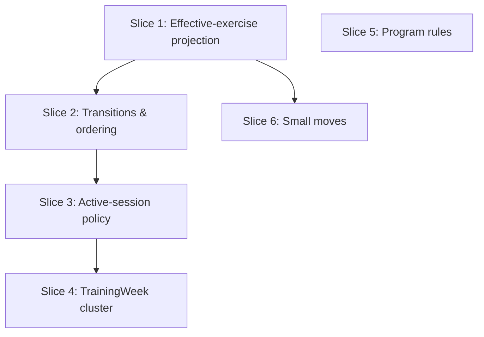

# Plan: Domain Refactor — push business logic down to `domain/`

**Created**: 2026-06-12
**Branch**: master
**Status**: in-progress

## Goal

Move business rules that currently live above or below the `domain/` layer into pure-Dart domain code, per the binding decision log in [domain-refactor.md](../domain-refactor.md) ("Agreed implementation scope"). Three recurring leaks are addressed: the "smart repository" that implements domain transitions in SQL-adjacent code, domain policies stranded in (and imported across) feature modules, and the "effective exercise" projection re-implemented five times with three behavioral divergences. The work lands entirely inside the existing test scope (`test/domain`, `test/modules`, `test/integration`) with no new test infrastructure, leaving the codebase green (`tool/ci.sh`) and committable at every step boundary.

**Implementation status (verified 2026-06-12):** none of this batch is implemented. All target domain files are absent; every source file remains in its original module. The `## Build Progress` checkboxes are the implementation markers — a checked box means that step has landed.

## Scope guardrails (from the decision log — do NOT implement)

- Single-active-session enforcement in the engine (finding 2 — UI-only by design, coach+trainee future).
- Superset-contiguity validation in `reorderUnfinished` (finding 5 — deferred pending superset UX redesign).
- Focus rotation/progression policy move (finding 9 — opportunistic).
- `ExerciseLinkingService` / transactional bulk link (finding 11 remainder — opportunistic).
- `IncrementRules` relocation (finding 13), set-row pairing extraction (finding 16).
- Anything touching the dormant Replace/`ReplacedState` surface beyond mechanical adoption of the new projection.

## Acceptance Criteria

- [ ] AC1: Resolving a `SessionExercise` against its snapshot is implemented once in `domain/` (`EffectiveExercises.of`); the five private copies (engine, Drift repo, overview assembler, focus assembler, focus bloc `_matches`) are deleted and delegate to it.
- [ ] AC2: A missing snapshot planned exercise **always throws** `NotFoundError` — the Drift repo's former silent "planned set count = 0" behavior is gone, pinned by an integration test.
- [ ] AC2b: That thrown `NotFoundError` is **handled without crashing** on every consuming surface. View-model build paths that newly become throw sites (the overview/focus assemblers invoked synchronously on stream push) are wrapped so the bloc emits its existing failure state (`WorkoutOverviewLoadFailure` / `FocusModeLoadFailure`) instead of letting the exception escape the event handler. Pinned by `test/modules` bloc unit tests.
- [ ] AC3: Exercise auto-complete/revert is a pure domain function (`afterSetLogged` auto-completes **only** from `unfinished`; `afterSetDeleted` reverts `completed`→`unfinished` below quota); the Drift repo delegates inside its existing transactions; integration tests stay green.
- [ ] AC4: Superset create/append ordering and session seeding (snapshot flattening, `supersetTag` derivation) are pure domain functions the repo consumes; the two-phase UNIQUE-dodging writes stay in the repo.
- [ ] AC5: One `ActiveSessionPolicy` (updatedAt desc → startedAt desc → id desc) governs both the summarizer's `_beats` and the repo's `getActiveSession`/`watchActiveSession` ordering.
- [ ] AC6: `TrainingWeek` (Monday-start), `SessionEditability`, and the session-history derivations live in `domain/`; the only cross-feature UI import (`export/` → `workout_day_picker/`) is removed.
- [ ] AC7: Program-authoring numeric/text bounds live in domain `ProgramRules`, enforced at the write path (not in aggregate constructors — legacy rows still load); program-name limit is **100 chars everywhere** (the 120-on-create is removed); `parseRepTarget` is `RepTarget.parse` in domain.
- [ ] AC8: `LinkSuggester` lives in `domain/services/`; the substitute summary duplication is gone (`PlannedSummaryFormatter` overload); `ExerciseGroupKind.forMemberCount(int)` states the group-kind rule once.
- [ ] AC9: `tool/ci.sh` (imports → codegen → format → analyze → test) passes at every step boundary; no `bloc_test`, no widget tests; generated files regenerated via `dart run build_runner build --force-jit`, never hand-edited.

## Slices

A slice is a vertically deliverable increment. Each slice carries the Gherkin
scenario(s) that define its behavior, followed by the TDD steps. Steps are
numbered `<slice>.<step>`. The Gherkin is intentionally implementation-independent
(no SQL, no table names, no widget selectors) — it describes domain behavior.

> **Barrel note for parallelization:** `domain.dart` and the per-feature barrels are
> append-only export indexes. Each slice adds disjoint export lines; these are treated
> as non-colliding and are intentionally omitted from the per-slice **Files** lists so
> `plan-waves.sh` reflects substantive file contention only. A wave that merges two
> barrel additions resolves trivially.

---

### Slice 1: Effective-exercise projection (finding 6)

**Depends-on:** none
**Files:** `mobile/lib/modules/domain/services/effective_exercises.dart`, `mobile/lib/modules/domain/models/actual_set_values.dart`, `mobile/lib/modules/domain/services/session_flow_engine.dart`, `mobile/lib/modules/persistence/repositories/drift_session_repository.dart`, `mobile/lib/modules/workout_overview/services/exercise_view_model_assembler.dart`, `mobile/lib/modules/workout_overview/bloc/workout_overview_bloc.dart`, `mobile/lib/modules/focus_mode/services/focus_mode_assembler.dart`, `mobile/lib/modules/focus_mode/bloc/focus_mode_bloc.dart`, `mobile/test/domain/services/effective_exercises_test.dart`, `mobile/test/integration/effective_exercise_missing_snapshot_test.dart`, `mobile/test/modules/workout_overview/bloc/workout_overview_bloc_test.dart`, `mobile/test/modules/focus_mode/bloc/focus_mode_bloc_test.dart`

**Behavior:**

```gherkin
Feature: Effective-exercise projection

  Scenario: Resolve a planned exercise from the snapshot
    Given a session whose snapshot contains the planned exercise for a session-exercise
    When the effective view of that session-exercise is requested
    Then it exposes the planned exercise, its measurement type, planned set count, display name, and planned group role

  Scenario: Resolve a substituted exercise
    Given a session-exercise carrying a substitute
    When its effective view is requested
    Then the effective measurement type, display name, and planned set count come from the substitute, not the original snapshot entry

  Scenario: Missing snapshot entry is a hard error
    Given a session-exercise whose planned exercise is absent from the snapshot
    When its effective view is requested
    Then a not-found error is raised
    And no fallback set count of zero and no fallback group role is produced

  Scenario: A corrupt snapshot surfaces a graceful error, not a crash
    Given an open workout session whose snapshot is missing a planned exercise
    When the session is loaded or pushed through the live update stream
    Then the screen presents a load-failure state
    And the not-found error does not escape as an unhandled crash

  Scenario: Match logged values against the effective measurement type
    Given an effective measurement type for a session-exercise
    When actual set values of a matching kind are checked against it
    Then they are reported as matching
    And actual set values of a different kind are reported as not matching
```

**Steps:**

#### Step 1.1: `ActualSetValues.matches(MeasurementType)`

**Complexity**: standard
**RED**: `test/domain` — each `ActualSetValues` variant matches its corresponding `MeasurementType` and rejects the others (repBased↔repBased, timeBased↔timeBased, bodyweight↔bodyweight).
**GREEN**: Add `bool matches(MeasurementType)` to `actual_set_values.dart`.
**REFACTOR**: None needed.
**Files**: `mobile/lib/modules/domain/models/actual_set_values.dart`, `mobile/test/domain/models/actual_set_values_test.dart`
**Commit**: `feat(domain): add ActualSetValues.matches(MeasurementType)`

#### Step 1.2: `EffectiveExercises.of(Session)` projection

**Complexity**: complex
**RED**: `test/domain` — builds the snapshot index once; exposes per-session-exercise `effectiveMeasurementType`, `plannedSetCount`, `displayName`, `plannedGroupRole`, `plannedExercise`; substitute (`ReplacedState`) handling; missing planned exercise throws `NotFoundError` (always — pin the three former divergences: no set-count-0, no `main` fallback).
**GREEN**: New `domain/services/effective_exercises.dart`; export from `domain.dart`.
**REFACTOR**: Extract the snapshot-index build if the projection getters duplicate lookups.
**Files**: `mobile/lib/modules/domain/services/effective_exercises.dart`, `mobile/test/domain/services/effective_exercises_test.dart`
**Commit**: `feat(domain): add EffectiveExercises projection`

#### Step 1.3: Migrate the engine; delete its private copies

**Complexity**: complex
**RED**: Existing `test/domain` engine tests must stay green; add a test asserting the engine path raises `NotFoundError` on a missing snapshot exercise.
**GREEN**: Replace `_lookupPlannedExercise`, `_lookupPlannedSetCount`, `_lookupPlannedValuesAtPosition`, `_effectiveMeasurementType`, `_validateMeasurementTypeMatch` with `EffectiveExercises`/`ActualSetValues.matches`.
**REFACTOR**: Remove now-dead helpers.
**Files**: `mobile/lib/modules/domain/services/session_flow_engine.dart`, `mobile/test/domain/services/session_flow_engine_test.dart`
**Commit**: `refactor(domain): engine uses EffectiveExercises projection`

#### Step 1.4: Migrate the Drift repo; pin the behavior change

**Complexity**: complex
**RED**: `test/integration` (`makeInMemoryDatabase()`) — a session whose snapshot is missing a planned exercise now throws on the read/complete path instead of silently treating planned set count as 0 (no spurious auto-complete on corrupt data).
**GREEN**: Replace `_measurementTypeForExercise`, `_plannedSetCountForExercise`, `_validateActualValues` with the projection + `ActualSetValues.matches`.
**REFACTOR**: Remove dead helpers.
**Files**: `mobile/lib/modules/persistence/repositories/drift_session_repository.dart`, `mobile/test/integration/effective_exercise_missing_snapshot_test.dart`
**Commit**: `refactor(persistence): session repo uses EffectiveExercises; missing snapshot throws`

#### Step 1.5: Migrate the assemblers and focus bloc; delete copies

**Complexity**: standard
**RED**: `test/modules` — overview/focus assembler unit tests stay green; focus bloc `_matches` cases covered by `ActualSetValues.matches`.
**GREEN**: `ExerciseViewModelAssembler`, `FocusModeAssembler` (`_lookupPlanned`, `_resolveGroupRole`, `_displayName`), and `FocusModeBloc._matches` consume the projection; drop the `main` fallback and recomputed `isLoggable` (derive from `openTargets`).
**REFACTOR**: Delete duplicated switch statements.
**Files**: `mobile/lib/modules/workout_overview/services/exercise_view_model_assembler.dart`, `mobile/lib/modules/focus_mode/services/focus_mode_assembler.dart`, `mobile/lib/modules/focus_mode/bloc/focus_mode_bloc.dart`, plus their `test/modules` tests
**Commit**: `refactor(ui): assemblers and focus bloc use EffectiveExercises projection`

#### Step 1.6: Guard the view-model build paths against `NotFoundError` (AC2b)

**Complexity**: complex
**RED**: `test/modules` (plain bloc unit tests — no `bloc_test`) — feeding a session with a corrupt snapshot through the **load and live-update** paths emits `WorkoutOverviewLoadFailure` / `FocusModeLoadFailure` (or the loaded-state transient-error variant) and the `NotFoundError` does **not** escape the event handler.
**GREEN**: Wrap the synchronous assemble calls in the stream-push handlers (`WorkoutOverviewBloc._onSessionPushed`/`_onSessionUpdate`, the focus-bloc equivalent) in `on DomainError catch` → emit the existing failure state. `NotFoundError` already `extends DomainError`, and the stream `onError` already routes repo/engine throws to a failure state — this step closes the assembler throw site that those paths don't cover.
**REFACTOR**: Reuse the existing `InternalSessionFailed` / failure-emission path rather than adding a parallel one.
**Files**: `mobile/lib/modules/workout_overview/bloc/workout_overview_bloc.dart`, `mobile/lib/modules/focus_mode/bloc/focus_mode_bloc.dart`, `mobile/test/modules/workout_overview/bloc/workout_overview_bloc_test.dart`, `mobile/test/modules/focus_mode/bloc/focus_mode_bloc_test.dart`
**Commit**: `fix(ui): surface corrupt-snapshot NotFoundError as a load-failure state, not a crash`

---

### Slice 2: Transitions, ordering & seeding out of the repo (findings 1, 4, 12)

**Depends-on:** 1
**Files:** `mobile/lib/modules/domain/services/exercise_state_transitions.dart`, `mobile/lib/modules/domain/services/superset_ordering.dart`, `mobile/lib/modules/domain/services/session_seed.dart`, `mobile/lib/modules/persistence/repositories/drift_session_repository.dart`, `mobile/test/domain/services/exercise_state_transitions_test.dart`, `mobile/test/domain/services/superset_ordering_test.dart`, `mobile/test/domain/services/session_seed_test.dart`

**Behavior:**

```gherkin
Feature: Exercise state transitions

  Scenario: Logging the quota-meeting set completes an unfinished exercise
    Given an unfinished exercise whose executed set count reaches its planned quota
    When the transition after logging is computed
    Then the exercise becomes completed

  Scenario: A replaced exercise is never auto-completed
    Given a replaced exercise whose executed set count reaches its planned quota
    When the transition after logging is computed
    Then the exercise stays replaced

  Scenario: Deleting below quota reverts completion
    Given a completed exercise whose executed set count drops below its planned quota
    When the transition after deleting is computed
    Then the exercise becomes unfinished

  Scenario: Deleting while still at quota keeps completion
    Given a completed exercise whose executed set count stays at or above quota
    When the transition after deleting is computed
    Then the exercise stays completed

Feature: Superset ordering

  Scenario: Create pulls chosen members into a contiguous block
    Given an ordered list of exercise ids and a chosen subset to group
    When the create order is computed
    Then the chosen members form one contiguous block anchored at the earliest chosen position
    And the relative order of non-members is preserved

  Scenario: Append inserts after the last member
    Given the unfinished order, the current member ids, and a dragged id
    When the append order is computed
    Then the dragged id sits immediately after the last existing member

Feature: Session seeding

  Scenario: A planned day flattens into ordered session exercises
    Given a workout day with single and superset groups
    When the session seed is computed
    Then exercises appear in group-then-member order
    And each superset member carries the group id as its superset tag
    And single-group exercises carry no superset tag
```

**Steps:**

#### Step 2.1: `ExerciseStateTransitions`

**Complexity**: standard
**RED**: `test/domain` — `afterSetLogged(state, executedCount, plannedCount)` and `afterSetDeleted(...)` cover the four scenarios above (including the "only from unfinished" guard and `replaced` immobility).
**GREEN**: New `domain/services/exercise_state_transitions.dart`; export from `domain.dart`.
**REFACTOR**: None needed.
**Files**: `mobile/lib/modules/domain/services/exercise_state_transitions.dart`, `mobile/test/domain/services/exercise_state_transitions_test.dart`
**Commit**: `feat(domain): add ExerciseStateTransitions`

#### Step 2.2: Repo `completeSet`/`deleteExecutedSet` delegate

**Complexity**: complex
**RED**: `test/integration` — existing auto-complete/revert behavior stays green through delegation (in-transaction re-reads preserved).
**GREEN**: `completeSet`/`deleteExecutedSet` compute the next state via `ExerciseStateTransitions` inside their existing transactions; repo only persists the result.
**REFACTOR**: Remove inline transition logic.
**Files**: `mobile/lib/modules/persistence/repositories/drift_session_repository.dart`, `mobile/test/integration/session_state_transitions_test.dart`
**Commit**: `refactor(persistence): session repo delegates state transitions to domain`

#### Step 2.3: `SupersetOrdering`

**Complexity**: standard
**RED**: `test/domain` — `blockedOrderForCreate(allIds, chosenIds)` (contiguous block at earliest anchor; non-member order preserved) and `orderForAppend(unfinishedIds, memberIds, draggedId)` (insert after last member).
**GREEN**: New `domain/services/superset_ordering.dart` beside `superset_grouping.dart`; export from `domain.dart`.
**REFACTOR**: None needed.
**Files**: `mobile/lib/modules/domain/services/superset_ordering.dart`, `mobile/test/domain/services/superset_ordering_test.dart`
**Commit**: `feat(domain): add SupersetOrdering`

#### Step 2.4: Repo `createSuperset`/`addToSuperset` consume ordering

**Complexity**: standard
**RED**: `test/integration` — superset create/append produce the same final order; two-phase UNIQUE-dodging writes unchanged.
**GREEN**: Repo maps `SupersetOrdering` output onto position slots; deletes inline order math.
**REFACTOR**: None needed.
**Files**: `mobile/lib/modules/persistence/repositories/drift_session_repository.dart`, `mobile/test/integration/superset_ordering_test.dart`
**Commit**: `refactor(persistence): superset create/append use domain ordering`

#### Step 2.5: `SessionSeed.fromWorkoutDay`

**Complexity**: standard
**RED**: `test/domain` — ordered `(plannedExerciseIdInSnapshot, supersetTag)` list; tag = group id when kind is superset, null otherwise.
**GREEN**: New `domain/services/session_seed.dart`; export from `domain.dart`.
**REFACTOR**: None needed.
**Files**: `mobile/lib/modules/domain/services/session_seed.dart`, `mobile/test/domain/services/session_seed_test.dart`
**Commit**: `feat(domain): add SessionSeed.fromWorkoutDay`

#### Step 2.6: Repo `startSession` consumes the seed

**Complexity**: standard
**RED**: `test/integration` — `startSession` produces the same rows; the position-gap constant stays a repo detail.
**GREEN**: `startSession` turns `SessionSeed` output into rows.
**REFACTOR**: Remove inline flatten/tag logic.
**Files**: `mobile/lib/modules/persistence/repositories/drift_session_repository.dart`, `mobile/test/integration/start_session_seed_test.dart`
**Commit**: `refactor(persistence): startSession uses SessionSeed`

---

### Slice 3: Active-session policy (finding 8)

**Depends-on:** 2
**Files:** `mobile/lib/modules/domain/services/active_session_policy.dart`, `mobile/lib/modules/workout_day_picker/services/session_history_summarizer.dart`, `mobile/lib/modules/persistence/repositories/drift_session_repository.dart`, `mobile/test/domain/services/active_session_policy_test.dart`, `mobile/test/integration/active_session_selection_test.dart`

**Behavior:**

```gherkin
Feature: Active-session selection

  Scenario: Most recently worked-on session wins
    Given two in-progress sessions with different last-updated times
    When the active session is selected
    Then the one with the later last-updated time is chosen

  Scenario: Deterministic tie-break
    Given two in-progress sessions with equal last-updated and start times
    When the active session is selected
    Then the one with the greater id is chosen

  Scenario: Completed sessions are never active
    Given a set of sessions where some have ended
    When the active session is selected
    Then only an in-progress session can be returned
    And an empty or all-completed set yields no active session
```

**Steps:**

#### Step 3.1: `ActiveSessionPolicy.select`

**Complexity**: standard
**RED**: `test/domain` — `select(List<Session>) → Session?`: in-progress only; order by `updatedAt` desc, then `startedAt` desc, then `id` desc; empty/all-completed → null.
**GREEN**: New `domain/services/active_session_policy.dart`; export from `domain.dart`.
**REFACTOR**: None needed.
**Files**: `mobile/lib/modules/domain/services/active_session_policy.dart`, `mobile/test/domain/services/active_session_policy_test.dart`
**Commit**: `feat(domain): add ActiveSessionPolicy`

#### Step 3.2: Summarizer + repo adopt the policy

**Complexity**: standard
**RED**: `test/modules` — `SessionHistorySummarizer._beats` delegates and is unchanged behaviorally; `test/integration` — repo `getActiveSession`/`watchActiveSession` now order by `updatedAt` (with deterministic secondary ordering) and agree with the summarizer when two in-progress sessions exist.
**GREEN**: `_beats` delegates to `ActiveSessionPolicy`; repo query ORDER BY changes from `startedAt` to `updatedAt`, then `startedAt`, then `id`.
**REFACTOR**: None needed.
**Files**: `mobile/lib/modules/workout_day_picker/services/session_history_summarizer.dart`, `mobile/lib/modules/persistence/repositories/drift_session_repository.dart`, `mobile/test/integration/active_session_selection_test.dart`
**Commit**: `refactor: unify active-session selection via ActiveSessionPolicy`

---

### Slice 4: TrainingWeek cluster (findings 3, 10)

**Depends-on:** 3
**Files:** `mobile/lib/modules/domain/models/training_week.dart`, `mobile/lib/modules/domain/services/session_editability.dart`, `mobile/lib/modules/domain/services/session_history.dart`, `mobile/lib/modules/export/services/session_history_assembler.dart`, `mobile/lib/modules/export/bloc/recent_sessions_bloc.dart`, `mobile/lib/modules/export/bloc/session_detail_bloc.dart`, `mobile/lib/modules/workout_day_picker/services/session_history_summarizer.dart`, `mobile/test/domain/models/training_week_test.dart`, `mobile/test/domain/services/session_editability_test.dart`, `mobile/test/domain/services/session_history_test.dart`

**Behavior:**

```gherkin
Feature: Training week

  Scenario: The week is Monday to the following Monday in local time
    Given any instant in local time
    When the training week containing it is computed
    Then the week starts at the most recent Monday at local midnight
    And ends at the following Monday at local midnight
    And the start is included while the end is excluded

Feature: Session editability

  Scenario: An ended session inside the current week is correctable
    Given an ended session whose end falls inside the current training week
    When editability is checked
    Then its actual values may be corrected

  Scenario: An ended session outside the current week is frozen
    Given an ended session whose end falls outside the current training week
    When editability is checked
    Then its actual values may not be corrected

  Scenario: An in-progress session is not "correctable"
    Given a session that has not ended
    When editability is checked
    Then its actual values may not be corrected via the review path

Feature: Session history derivations

  Scenario: Counts and last-completed are derived from completed sessions only
    Given a mix of completed and in-progress sessions across weeks
    When the history summary is computed
    Then completed-this-week and total-completed counts ignore in-progress sessions
    And the last-completed date is the latest end among completed sessions

  Scenario: History ordering is newest-first with a deterministic tie-break
    Given completed sessions with equal end times
    When history is ordered
    Then they are ordered newest-first, breaking ties by id
```

**Steps:**

#### Step 4.1: Move `CurrentWeekWindow` → domain `TrainingWeek`

**Complexity**: complex
**RED**: `test/domain` — `TrainingWeek.compute(now)` reproduces the Mon–Sun window (Monday start hardcoded), `contains` semantics (start inclusive, end exclusive).
**GREEN**: New `domain/models/training_week.dart` (freezed, renamed); run `dart run build_runner build --force-jit`; export from `domain.dart`. Repoint call sites; delete `workout_day_picker/services/current_week_window.dart`.
**REFACTOR**: None needed.
**Files**: `mobile/lib/modules/domain/models/training_week.dart`, consumers, `mobile/test/domain/models/training_week_test.dart`
**Commit**: `refactor(domain): move CurrentWeekWindow to domain as TrainingWeek`

#### Step 4.2: Move `SessionEditability` to domain

**Complexity**: standard
**RED**: `test/domain` — `canEditValues(session, week)` for the three scenarios above.
**GREEN**: New `domain/services/session_editability.dart` consuming `TrainingWeek`; delete `export/services/session_editability.dart`; repoint consumers.
**REFACTOR**: None needed.
**Files**: `mobile/lib/modules/domain/services/session_editability.dart`, consumers, `mobile/test/domain/services/session_editability_test.dart`
**Commit**: `refactor(domain): move SessionEditability to domain`

#### Step 4.3: `SessionHistory` domain service

**Complexity**: standard
**RED**: `test/domain` — completed-only filter, newest-first + id tie-break ordering, completed-exercise counting, week bucketing (the computational core of the summarizer + assembler).
**GREEN**: New `domain/services/session_history.dart`; export from `domain.dart`.
**REFACTOR**: None needed.
**Files**: `mobile/lib/modules/domain/services/session_history.dart`, `mobile/test/domain/services/session_history_test.dart`
**Commit**: `feat(domain): add SessionHistory derivations`

#### Step 4.4: Repoint consumers; remove cross-feature import

**Complexity**: standard
**RED**: `test/modules` — `SessionHistorySummarizer` and `SessionHistoryAssembler` keep only view-model wrapping and stay green; verify (`tool/check_offline_imports.sh`) no `export/` → `workout_day_picker/` import remains.
**GREEN**: Both feature modules consume `SessionHistory`/`TrainingWeek` from `domain.dart`.
**REFACTOR**: Delete dead computation in the summarizer/assembler.
**Files**: `mobile/lib/modules/workout_day_picker/services/session_history_summarizer.dart`, `mobile/lib/modules/export/services/session_history_assembler.dart`, `mobile/lib/modules/export/bloc/recent_sessions_bloc.dart`, `mobile/lib/modules/export/bloc/session_detail_bloc.dart`
**Commit**: `refactor: feature modules consume domain SessionHistory; drop cross-feature import`

---

### Slice 5: Program rules (finding 7)

**Depends-on:** none
**Files:** `mobile/lib/modules/domain/services/program_rules.dart`, `mobile/lib/modules/domain/models/rep_target.dart`, `mobile/lib/modules/program_management/services/program_validation.dart`, `mobile/lib/modules/program_management/services/aggregate_saver.dart`, `mobile/lib/modules/persistence/repositories/drift_program_repository.dart`, `mobile/test/domain/models/rep_target_parse_test.dart`, `mobile/test/domain/services/program_rules_test.dart`, `mobile/test/integration/program_rules_write_path_test.dart`

**Behavior:**

```gherkin
Feature: Rep-target parsing

  Scenario: A single integer is a fixed target
    Given the input "8"
    When it is parsed as a rep target
    Then it is a fixed target of 8

  Scenario: A hyphen or en-dash range is a range target
    Given the input "6-8" or "6–8"
    When it is parsed as a rep target
    Then it is a range target from 6 to 8

  Scenario: Equal bounds collapse to a fixed target
    Given the input "8-8"
    When it is parsed as a rep target
    Then it is a fixed target of 8

  Scenario: Out-of-range or malformed input is rejected
    Given an input above the reps bound or with reversed bounds
    When it is parsed as a rep target
    Then a validation error is raised

Feature: Program-authoring bounds at the write path

  Scenario: An out-of-bounds aggregate is rejected on save
    Given a program aggregate with a set weight above the maximum
    When it is saved through the program repository
    Then the save is rejected with a validation error

  Scenario: Legacy out-of-bounds rows still load
    Given a persisted program row that predates these bounds
    When it is read back
    Then it loads without error

  Scenario: Program name limit is 100 on both create and edit
    Given a 120-character program name
    When it is validated on create or on edit
    Then it is rejected as too long
```

**Steps:**

#### Step 5.1: `RepTarget.parse` in domain

**Complexity**: standard
**RED**: `test/domain` — move `parseRepTarget`'s scenarios (single int, hyphen/en-dash range, `min==max` collapse, reversed/out-of-range/non-whole rejection) onto `RepTarget.parse`.
**GREEN**: Add `static ... parse(String)` to `rep_target.dart` returning a domain result/throwing `ValidationError`.
**REFACTOR**: None needed.
**Files**: `mobile/lib/modules/domain/models/rep_target.dart`, `mobile/test/domain/models/rep_target_parse_test.dart`
**Commit**: `feat(domain): add RepTarget.parse`

#### Step 5.2: `ProgramRules` constants + validators

**Complexity**: complex
**RED**: `test/domain` — bounds: weight ≤ 1000 in half-kg steps, reps ≤ 999, duration/rest ≤ 3600, set count 1–20, exercise name ≤ 80, day name ≤ 100, program name ≤ 100, video-url + notes rules; each producing the right `ValidationError`.
**GREEN**: New `domain/services/program_rules.dart`; export from `domain.dart`. No constructor validation on aggregates.
**REFACTOR**: None needed.
**Files**: `mobile/lib/modules/domain/services/program_rules.dart`, `mobile/test/domain/services/program_rules_test.dart`
**Commit**: `feat(domain): add ProgramRules bounds`

#### Step 5.3: Enforce at the write path

**Complexity**: complex
**RED**: `test/integration` — saving an out-of-bounds aggregate through the program repository is rejected; a pre-existing out-of-bounds row still loads on read.
**GREEN**: Validate via `ProgramRules` in `saveProgramAggregate` (and/or `AggregateSaver.save`) before persisting; reads stay unguarded.
**REFACTOR**: None needed.
**Files**: `mobile/lib/modules/persistence/repositories/drift_program_repository.dart`, `mobile/lib/modules/program_management/services/aggregate_saver.dart`, `mobile/test/integration/program_rules_write_path_test.dart`
**Commit**: `feat(persistence): enforce ProgramRules at the write path`

#### Step 5.4: UI delegates; unify name limit; use `RepTarget.parse`

**Complexity**: standard
**RED**: `test/modules` — `ProgramValidation` delegates bounds to `ProgramRules`, keeps input parsing + error-code mapping; program-name limit is 100 on create (regression test for the former 120); rep parsing calls `RepTarget.parse`.
**GREEN**: Update `program_validation.dart`.
**REFACTOR**: Remove duplicated bound literals.
**Files**: `mobile/lib/modules/program_management/services/program_validation.dart`, `mobile/test/modules/program_management/services/program_validation_test.dart`
**Commit**: `refactor(ui): ProgramValidation delegates to ProgramRules; unify program-name limit at 100`

---

### Slice 6: Small moves (findings 11-partial, 14, 15)

**Depends-on:** 1
**Files:** `mobile/lib/modules/domain/models/exercise_group_kind.dart`, `mobile/lib/modules/domain/models/exercise_group.dart`, `mobile/lib/modules/program_management/models/program_editor_draft.dart`, `mobile/lib/core/planned_summary_formatter.dart`, `mobile/lib/modules/focus_mode/services/focus_mode_assembler.dart`, `mobile/lib/modules/domain/services/link_suggester.dart`, `mobile/test/domain/models/exercise_group_kind_test.dart`, `mobile/test/core/planned_summary_formatter_test.dart`

**Behavior:** (Depends-on 1 because the summary-formatter step edits `focus_mode_assembler.dart`, which Slice 1 also touches.)

```gherkin
Feature: Group kind from member count

  Scenario: One member is a single group
    Given a group with exactly one member
    When its kind is derived from member count
    Then it is a single group

  Scenario: Multiple members are a superset
    Given a group with two or more members
    When its kind is derived from member count
    Then it is a superset

Feature: Substitute summary formatting

  Scenario: Substitute values format identically to a planned exercise
    Given planned set values and a set count for a substitute
    When the summary is formatted
    Then it matches the format produced for an equivalent planned exercise
```

**Steps:**

#### Step 6.1: `ExerciseGroupKind.forMemberCount(int)`

**Complexity**: standard
**RED**: `test/domain` — `forMemberCount(1)` → single, `forMemberCount(2+)` → superset; assert `ExerciseGroupDraft.kind()` and `ExerciseGroup`'s validation agree through it.
**GREEN**: Add the factory/static to `exercise_group_kind.dart`; route `ExerciseGroupDraft.kind()` and `ExerciseGroup` validation through it.
**REFACTOR**: Remove the inline `length == 1 ? single : superset` duals.
**Files**: `mobile/lib/modules/domain/models/exercise_group_kind.dart`, `mobile/lib/modules/domain/models/exercise_group.dart`, `mobile/lib/modules/program_management/models/program_editor_draft.dart`, `mobile/test/domain/models/exercise_group_kind_test.dart`
**Commit**: `refactor(domain): state group-kind rule once via forMemberCount`

#### Step 6.2: `PlannedSummaryFormatter` overload; delete the copy

**Complexity**: standard
**RED**: `test/core` — `summarizeValues(PlannedSetValues, setCount)` matches the existing `Exercise`-based output across measurement types.
**GREEN**: Add the overload; `FocusModeAssembler` calls it; delete `_summarizeSubstitute`.
**REFACTOR**: None needed.
**Files**: `mobile/lib/core/planned_summary_formatter.dart`, `mobile/lib/modules/focus_mode/services/focus_mode_assembler.dart`, `mobile/test/core/planned_summary_formatter_test.dart`
**Commit**: `refactor: PlannedSummaryFormatter overload replaces _summarizeSubstitute`

#### Step 6.3: Move `LinkSuggester` to domain

**Complexity**: standard
**RED**: Existing `LinkSuggester` tests move to `test/domain/services` and stay green.
**GREEN**: Move `exercise_library/services/link_suggester.dart` → `domain/services/link_suggester.dart` unchanged (already pure); export from `domain.dart`; repoint imports/barrels.
**REFACTOR**: None needed.
**Files**: `mobile/lib/modules/domain/services/link_suggester.dart`, `mobile/lib/modules/exercise_library/bloc/link_suggestion/link_suggestion_bloc.dart`, `mobile/test/domain/services/link_suggester_test.dart`
**Commit**: `refactor(domain): move LinkSuggester to domain/services`

---

## Post-implementation cleanup (after all slices land)

- Fold any decision-bearing nuggets worth preserving into `product-context.md` (e.g. "superset" deliberately names two models — planned group vs live tag run; "completed" covers both quota-met auto-completion and explicit mark-done).
- **Delete `.plans/`** — the `.plans/domain/` glossary is a pre-refactor snapshot that several slices make factually wrong (TrainingWeek, LinkSuggestion, SessionFlowEngine, Session) and has no maintenance mechanism. Regenerate on demand via `/ubiquitous-language` if ever needed.

## Parallelization

Each slice declares `Depends-on`. Waves are derived by `scripts/plan-waves.sh` — not hand-maintained. The dominant constraint is shared hot files: `drift_session_repository.dart` (Slices 1, 2, 3), `session_history_summarizer.dart` (Slices 3, 4), and `focus_mode_assembler.dart` (Slices 1, 6). That contention forces the long 1→2→3→4 chain; Slice 5 (Program rules) is genuinely independent and Slice 6 only waits on Slice 1's `focus_mode_assembler.dart` edit.



| Wave | Slices (parallel) |
|------|-------------------|
| 1 | 1, 5 |
| 2 | 2, 6 |
| 3 | 3 |
| 4 | 4 |

(Authoritative waves are emitted by `plan-waves.sh`; the table mirrors its output.)

## Complexity Classification

| Rating | Where it applies here |
|--------|-----------------------|
| `standard` | New pure-Dart domain function + its tests, UI delegation within existing patterns (1.1, 1.5, 2.1, 2.3, 2.4, 2.5, 2.6, 3.1, 3.2, 4.2, 4.3, 4.4, 5.1, 5.4, 6.1, 6.2, 6.3) |
| `complex` | New cross-cutting abstraction, repo delegation inside transactions, write-path enforcement, behavior change, freezed move with codegen (1.2, 1.3, 1.4, 2.2, 4.1, 5.2, 5.3) |

## Pre-PR Quality Gate

- [ ] `tool/ci.sh` passes (imports → codegen → format → analyze → test) at every step boundary
- [ ] `tool/check_offline_imports.sh` passes — no networking in core/domain/persistence; no drift/AppDatabase in UI; no cross-feature UI imports
- [ ] Codegen run with `dart run build_runner build --force-jit`; generated files committed, never hand-edited
- [ ] `/code-review` passes
- [ ] `product-context.md` updated only if a user-facing screen/feature/pillar shifts (this batch is internal refactor — expected: no change beyond the cleanup nuggets above)

## Risks & Open Questions

- **R1 — `drift_session_repository.dart` is edited by three slices.** Mitigation: the 1→2→3 chain serializes those edits; `tool/ci.sh` green between each. Do not attempt to parallelize Slices 1–3.
- **R2 — AC2 behavior change (missing snapshot now throws).** A corrupt/partial snapshot that previously degraded silently will now raise `NotFoundError`. Mitigation: pinned by an integration test; confirm no production path relies on the old set-count-0 degradation. *Owner: user to confirm this is the intended hardening (the decision log says it is).* **Crash safety (AC2b/Step 1.6):** `NotFoundError extends DomainError`, so mutation handlers (`on DomainError catch`) and the stream `onError` route (repo/engine throws) already degrade to a failure state; the one uncovered throw site is the synchronous assembler call in the stream-push handlers, which Step 1.6 wraps. Net: every surface shows a load-failure state, never an unhandled crash.
- **R3 — Slice 5 write-path enforcement must not break legacy loads.** Mitigation: validate on save only, never in constructors/reads; explicit "legacy row still loads" integration test.
- **R4 — `RepTarget.parse` return shape.** `ProgramValidation` uses an `Invalid(reason)` envelope with specific error codes; `domain` favors throwing `ValidationError`. Open: keep `RepTarget.parse` throwing and let the UI map the exception to its codes, or return a domain result the UI adapts. *Recommended: throw `ValidationError` carrying the same code so UI mapping stays a thin translation.*
- **R5 — Barrel-file merges across parallel waves.** Mitigation: barrels are append-only; documented as non-colliding. If a wave merge conflicts on `domain.dart`, resolve by keeping both export lines.

## Build Progress

This section is the machine-parseable recovery handle. `/build` updates these checkboxes as steps complete; a slice is checked once all its steps are. **Nothing in this batch is implemented yet (verified 2026-06-12).**

### Slices (grouped by wave)

#### Wave 1
- [x] Slice 1: Effective-exercise projection
  - [x] Step 1.1: ActualSetValues.matches(MeasurementType)
  - [x] Step 1.2: EffectiveExercises.of(Session) projection
  - [x] Step 1.3: Migrate the engine; delete its private copies
  - [x] Step 1.4: Migrate the Drift repo; pin the behavior change
  - [x] Step 1.5: Migrate the assemblers and focus bloc; delete copies
  - [x] Step 1.6: Guard the view-model build paths against NotFoundError (AC2b)
- [x] Slice 5: Program rules
  - [x] Step 5.1: RepTarget.parse in domain
  - [x] Step 5.2: ProgramRules constants + validators
  - [x] Step 5.3: Enforce at the write path
  - [x] Step 5.4: UI delegates; unify name limit; use RepTarget.parse

#### Wave 2
- [x] Slice 2: Transitions, ordering & seeding out of the repo
  - [x] Step 2.1: ExerciseStateTransitions
  - [x] Step 2.2: Repo completeSet/deleteExecutedSet delegate
  - [x] Step 2.3: SupersetOrdering
  - [x] Step 2.4: Repo createSuperset/addToSuperset consume ordering
  - [x] Step 2.5: SessionSeed.fromWorkoutDay
  - [x] Step 2.6: Repo startSession consumes the seed
- [x] Slice 6: Small moves
  - [x] Step 6.1: ExerciseGroupKind.forMemberCount(int)
  - [x] Step 6.2: PlannedSummaryFormatter overload; delete the copy
  - [x] Step 6.3: Move LinkSuggester to domain (cluster model moved too — see note)

#### Wave 3
- [x] Slice 3: Active-session policy
  - [x] Step 3.1: ActiveSessionPolicy.select
  - [x] Step 3.2: Summarizer + repo adopt the policy

#### Wave 4
- [x] Slice 4: TrainingWeek cluster
  - [x] Step 4.1: Move CurrentWeekWindow → domain TrainingWeek
  - [x] Step 4.2: Move SessionEditability to domain
  - [x] Step 4.3: SessionHistory domain service
  - [x] Step 4.4: Repoint consumers; remove cross-feature import

### Acceptance Criteria

- [x] AC1: Effective-exercise projection unified in domain; five copies deleted
- [x] AC2: Missing snapshot planned exercise always throws NotFoundError (pinned)
- [x] AC2b: That NotFoundError is handled as a load-failure state on every consuming surface — no crash (pinned by bloc unit tests)
- [x] AC3: Auto-complete/revert is a pure domain function; repo delegates in-transaction
- [x] AC4: Superset ordering + session seeding are pure domain functions
- [x] AC5: One ActiveSessionPolicy governs summarizer and repo
- [x] AC6: TrainingWeek + SessionEditability + SessionHistory in domain; cross-feature import removed
- [x] AC7: ProgramRules at the write path; program-name limit 100 everywhere; RepTarget.parse in domain
- [x] AC8: LinkSuggester in domain; substitute-summary duplication gone; forMemberCount states the rule once
- [x] AC9: tool/ci.sh green at every step boundary; no bloc_test/widget tests; codegen via --force-jit

### Build notes

- **Step 6.3 scope (user-approved 2026-06-12):** `LinkSuggester.suggest()` returns
  `LinkSuggestionCluster`, which lived in `exercise_library/models/`. Moving only the
  service into `domain/` would have made `domain` import a feature module (a backwards
  dependency / library import cycle). With user approval, `link_suggestion_cluster.dart`
  (`LinkSuggestionCluster` + `ExerciseReference`) was also moved to `domain/models/` and
  is re-exported from the `exercise_library` barrel so UI consumers keep their import
  path. Domain stays self-contained and pure.

## Plan Review Summary

Reviewed inline across the five plan-review dimensions (acceptance, design, UX, strategic, parallelization) rather than via spawned sub-agents — the formal multi-agent persona pass can be run on request. Verdict: **approve with observations**.

- **Acceptance / Gherkin** — Scenarios are implementation-independent (no SQL, tables, or widgets in step text) and deterministic; each slice covers happy + negative/edge paths. Every acceptance criterion AC1–AC9 traces to at least one slice. *Observation:* Slice 2 deliberately omits a reorder-permutation error scenario — superset-contiguity enforcement is an explicit out-of-scope guardrail (finding 5), not a gap.
- **Design & architecture** — The work moves rules *down* into pure Dart with no new abstractions beyond the agreed services; layer rules stay enforced by `check_offline_imports.sh`. Honest dependency chain reflects real file contention. *Warning (R4):* `RepTarget.parse`'s return shape (throw `ValidationError` vs. `Invalid(reason)` envelope) is unresolved — flagged in Risks with a recommendation.
- **UX** — Internal refactor; the only user-observable change is AC2 (a corrupt/partial snapshot now raises instead of degrading silently). AC2b/Step 1.6 ensure that raise surfaces as the existing load-failure screen state on every consuming surface rather than crashing the app. Flagged as R2 for the user to confirm the hardening is intended (the decision log says it is).
- **Strategic** — Scope is a 1:1 mapping of the binding decision log; explicit "do NOT implement" guardrails prevent scope creep. Slice boundaries are vertically shippable with `tool/ci.sh` green between each.
- **Parallelization** — `plan-waves.sh` exits 0 with `"collisions": []`. Waves: `[1,5] → [2,6] → [3] → [4]`. The three slices touching `drift_session_repository.dart` (1, 2, 3) are correctly serialized; `focus_mode_assembler.dart` contention (1, 6) is resolved by Slice 6 depending on Slice 1.
