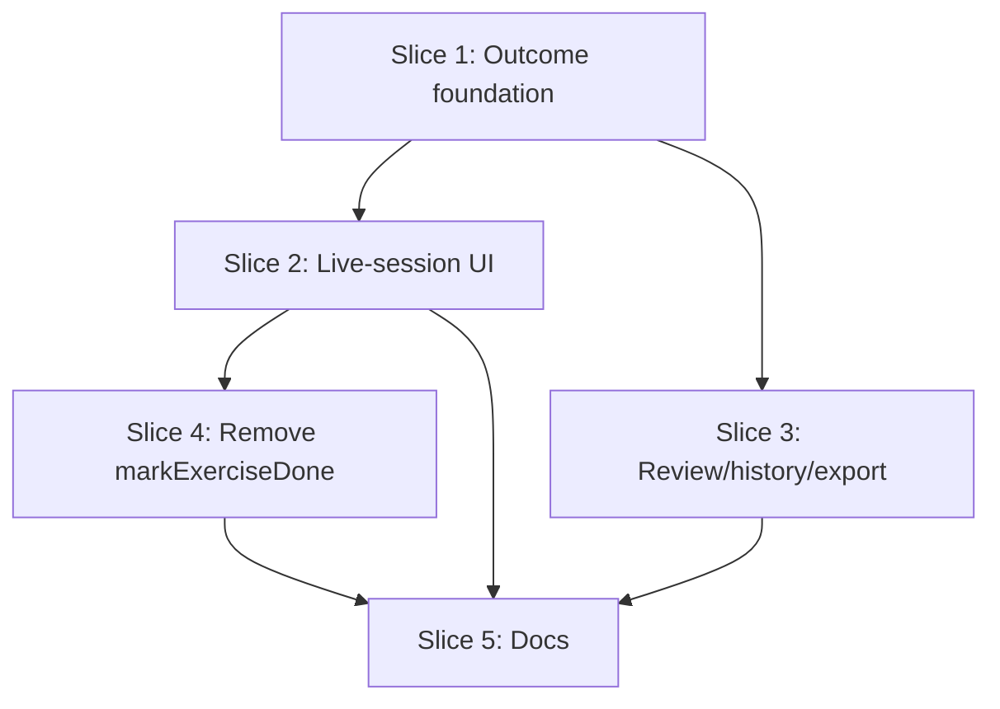

# Plan: Drop "Mark done" — derive exercise outcome from logged sets

**Created**: 2026-06-12
**Branch**: master
**Status**: approved

## Goal

Remove the user-declared "Mark done vs Skip" classification from live sessions. Today both actions produce the same set data (e.g. 2/4 sets) but different declared badges, forcing a meaningless mid-workout decision and letting a ✓ badge editorialize over partial work — contradicting the planned-vs-actual pillar. Replace the pair with **one** terminal action whose label adapts to context ("Skip exercise" with no sets logged, "End exercise" with some), and make every read surface (live card, session review, history tile, plain-text export) **derive** the outcome from the record: full quota → Completed, some-but-not-all → Partial (shown as "2/4 sets"), none → Skipped. `CompletedState` becomes reachable only via the existing auto-complete quota machine; `markExerciseDone` is removed from domain and persistence. No schema change — legacy rows self-heal because display derives from set counts, not the stored discriminator.

## Acceptance Criteria

- [ ] AC1: The exercise overflow menus in workout overview and focus mode offer exactly one terminal action: "Skip exercise" when no sets are logged, "End exercise" when ≥1 set is logged. "Mark done" no longer appears anywhere. Terminal exercises (ended, skipped, auto-completed, replaced) offer no terminal action; their menus keep the non-terminal items (e.g. Open video), matching today's skipped-card behavior.
- [ ] AC2: The end-exercise confirmation states the consequence with counts (logged n of m); confirming keeps the logged sets, stops further log suggestions for that exercise, and lets the session reach completion.
- [ ] AC3: `completed` is reachable only by logging all planned sets (auto-complete); `markExerciseDone` is gone from `SessionFlowEngine`, the `SessionRepository` contract, the Drift implementation, and test support.
- [ ] AC4: Session review badges derive from the record: all planned sets → ✓ Done; some-but-not-all → "n/m sets" pill in a new `exercisePartial` semantic color (both palettes); zero sets → "Skipped" pill; replaced unchanged. Legacy marked-done-early and skipped-with-sets rows display as partial with no migration.
- [ ] AC5: The live overview card for an ended-early exercise shows the honest "n/m sets" partial pill, not "Skipped" and not a completion check.
- [ ] AC6: The recent-sessions tile "N/M exercises" counts only exercises whose logged sets meet the planned quota (derived), not declared states.
- [ ] AC7: Plain-text export header suffixes derive: "(skipped)" for zero sets, "(n/m sets)" for partial, no suffix for full completion.
- [ ] AC8: No `schema_versions` bump and no migration; `tool/ci.sh` passes.
- [ ] AC9: `product-context.md` (pinned "Completed" terminology, screen descriptions) and the CLAUDE.md semantic-color list are updated in the same change.

## Slices

A slice is a vertically deliverable increment. Each slice carries the Gherkin
scenario(s) that define its behavior, followed by the TDD steps that satisfy them.
Steps are numbered `<slice>.<step>`.

### Slice 1: Outcome derivation foundation

**Depends-on:** none
**Files:** `mobile/lib/modules/domain/services/exercise_outcome.dart`, `mobile/lib/modules/domain/domain.dart`, `mobile/test/domain/services/exercise_outcome_test.dart`, `mobile/lib/core/app_colors.dart`

**Behavior:**

```gherkin
Feature: Exercise outcome derived from logged sets

  Scenario: All planned sets logged reads as completed
    Given an exercise record planned for 4 sets
    And 4 sets were logged against it
    When its outcome is derived
    Then the outcome is "completed"

  Scenario: Some but not all sets logged reads as partial
    Given an exercise record planned for 4 sets
    And 2 sets were logged against it
    When its outcome is derived
    Then the outcome is "partial"

  Scenario: No sets logged reads as skipped
    Given an exercise record planned for 4 sets
    And no sets were logged against it
    When its outcome is derived
    Then the outcome is "skipped"

  Scenario: Replaced exercise keeps its replaced outcome
    Given an exercise record that was replaced with a substitute
    And 1 set was logged against it
    When its outcome is derived
    Then the outcome is "replaced"

  Scenario: Legacy early-marked-done record self-heals to partial
    Given an exercise record stored as "completed" with 2 of 4 sets logged
    When its outcome is derived
    Then the outcome is "partial"

  Scenario: Legacy skipped-with-sets record self-heals to partial
    Given an exercise record stored as "skipped" with 2 of 4 sets logged
    When its outcome is derived
    Then the outcome is "partial"

  Scenario: Extra sets beyond plan still read as completed
    Given an exercise record planned for 4 sets
    And 5 sets were logged against it
    When its outcome is derived
    Then the outcome is "completed"
```

**Steps:**

#### Step 1.1: `ExerciseOutcome` domain derivation

**Complexity**: standard
**RED**: Table-driven + property tests in `exercise_outcome_test.dart` covering every scenario above (use `test/support/generators.dart` for the property over executed/planned counts: replaced ⇒ replaced; else executed ≥ planned ⇒ completed; else executed == 0 ⇒ skipped; else partial).
**GREEN**: Add `exercise_outcome.dart` — an enum `ExerciseOutcome { completed, partial, skipped, replaced }` plus a pure derivation `ExerciseOutcomes.of({required ExerciseState state, required int executedSetCount, required int plannedSetCount})`. Document that it is for read surfaces over terminal/ended records; precedence: replaced → counts. Export from the `domain.dart` barrel.
**REFACTOR**: None needed.
**Files**: `mobile/lib/modules/domain/services/exercise_outcome.dart`, `mobile/lib/modules/domain/domain.dart`, `mobile/test/domain/services/exercise_outcome_test.dart`
**Commit**: `feat(domain): derive exercise outcome from logged sets`

#### Step 1.2: `exercisePartial` semantic color

**Complexity**: trivial
**RED**: None meaningful (token addition; no widget tests by project rule) — verified by analyzer and by consumers in Slices 2–3.
**GREEN**: Add `exercisePartial` to `AppColors` in **both** palettes (amber family, distinct from `exerciseSkipped` and `restTimer`), per the CLAUDE.md semantic-color convention.
**REFACTOR**: None needed.
**Files**: `mobile/lib/core/app_colors.dart`
**Commit**: `feat(theme): add exercisePartial semantic color`

### Slice 2: Single adaptive end/skip action in live session

**Depends-on:** 1
**Files:** `mobile/lib/modules/workout_overview/widgets/exercise_card.dart`, `mobile/lib/modules/workout_overview/widgets/superset_card.dart`, `mobile/lib/modules/workout_overview/widgets/workout_group_builder.dart`, `mobile/lib/modules/workout_overview/widgets/workout_overview_loaded_body.dart`, `mobile/lib/modules/workout_overview/screens/workout_overview_screen.dart`, `mobile/lib/modules/workout_overview/bloc/workout_overview_event.dart`, `mobile/lib/modules/workout_overview/bloc/workout_overview_bloc.dart`, `mobile/lib/modules/focus_mode/widgets/focus_panel_actions_menu.dart`, `mobile/lib/modules/focus_mode/bloc/focus_mode_event.dart`, `mobile/lib/modules/focus_mode/bloc/focus_mode_bloc.dart`, `mobile/test/modules/workout_overview/bloc/workout_overview_bloc_test.dart`, `mobile/test/modules/focus_mode/bloc/focus_mode_bloc_test.dart`

**Behavior:**

```gherkin
Feature: One terminal action per live exercise

  Scenario: Exercise with no logged sets offers skip
    Given a live session exercise with no sets logged
    When the user opens the exercise's actions
    Then exactly one terminal action is offered, labeled "Skip exercise"
    And no "Mark done" action is offered

  Scenario: Exercise with logged sets offers end
    Given a live session exercise with 2 of 4 sets logged
    When the user opens the exercise's actions
    Then exactly one terminal action is offered, labeled "End exercise"
    And no "Mark done" action is offered

  Scenario: Ending keeps the logged work
    Given a live session exercise with 2 of 4 sets logged
    When the user confirms "End exercise"
    Then both logged sets remain on the record
    And the remaining planned sets are no longer offered for logging
    And the session can reach completion without its remaining sets

  Scenario: The end confirmation states the consequence
    Given a live session exercise with 2 of 4 sets logged
    When the user chooses "End exercise"
    Then the confirmation states that 2 of 4 sets are logged and remaining sets will not be logged

  Scenario: Skipping with no sets is destructive-styled and terminal
    Given a live session exercise with no sets logged
    When the user confirms "Skip exercise"
    Then the exercise is recorded with no sets
    And the session can reach completion without it

  Scenario: Live card shows honest progress after ending early
    Given a live session exercise ended with 2 of 4 sets logged
    When the user views the workout overview
    Then the exercise card shows a "2/4 sets" partial indicator
    And it shows neither a "Skipped" label nor a completion check

  Scenario: Focus mode advances after ending
    Given the focused exercise has 2 of 4 sets logged
    When the user confirms "End exercise" from the focus panel
    Then focus advances to the next unfinished exercise

  Scenario: Terminal exercises offer no further terminal action
    Given a live session exercise that is already ended, skipped, or completed
    When the user opens the exercise's actions
    Then no terminal action is offered
```

**Steps:**

#### Step 2.1: Workout overview — adaptive action, derived live pill

**Complexity**: standard
**RED**: In `workout_overview_bloc_test.dart` (plain unit tests, no `bloc_test` package): assert the `MarkedDone` event no longer exists (compile-driven) and characterize that the skip event on an exercise with logged sets keeps its executed sets and reaches a terminal state via `engine.skipExercise`.
**GREEN**: Remove `WorkoutOverviewExerciseMarkedDone` event + bloc handler. In `exercise_card.dart`: drop `canMarkDone`/`_MenuAction.markDone`; single menu item labeled by `sessionExercise.executedSets.isEmpty ? 'Skip exercise' : 'End exercise'`. In `workout_overview_screen.dart`: fold `_handleMarkDone` into one `_handleEndOrSkip` with adaptive dialog (0 sets: title "Skip exercise?", destructive, confirm "Skip"; ≥1 set: title "End exercise?", body "You've logged 2 of 4 sets. You won't be able to log the remaining sets — logged values stay editable.", confirm "End exercise", non-destructive; note: editing logged values on an ended exercise already works — `updateExecutedSet` has no state restriction). Both confirm paths fire the existing `WorkoutOverviewExerciseSkipped` event. Live card pill/accent for terminal states derives via `ExerciseOutcomes.of` — partial shows `"2/4 sets"` pill in `exercisePartial`. Remove `onMarkDone*` plumbing from `superset_card.dart`, `workout_group_builder.dart`, `workout_overview_loaded_body.dart`.
**REFACTOR**: Keep the event name `…ExerciseSkipped` (internal; renaming is churn — note in code doc that it covers both end and skip).
**Files**: `mobile/lib/modules/workout_overview/**` (listed above), `mobile/test/modules/workout_overview/bloc/workout_overview_bloc_test.dart`
**Commit**: `feat(workout_overview): single adaptive end/skip action with derived partial pill`

#### Step 2.2: Focus mode — adaptive action

**Complexity**: standard
**RED**: In `focus_mode_bloc_test.dart`: remove/replace `FocusModeExerciseMarkedDone` coverage; characterize that skipping the focused exercise with logged sets keeps sets, is terminal, and advances focus.
**GREEN**: Remove `FocusModeExerciseMarkedDone` event + `_onExerciseMarkedDone` handler. In `focus_panel_actions_menu.dart`: drop the markDone item and `canMarkDone`; one terminal item labeled via `panel.completedSetsCount` (0 → "Skip exercise" destructive; ≥1 → "End exercise" with count-aware confirm body using `completedSetsCount`/`totalPlannedSets`). Confirm fires the existing `FocusModeExerciseSkipped`.
**REFACTOR**: None needed.
**Files**: `mobile/lib/modules/focus_mode/widgets/focus_panel_actions_menu.dart`, `mobile/lib/modules/focus_mode/bloc/focus_mode_event.dart`, `mobile/lib/modules/focus_mode/bloc/focus_mode_bloc.dart`, `mobile/test/modules/focus_mode/bloc/focus_mode_bloc_test.dart`
**Commit**: `feat(focus_mode): single adaptive end/skip action`

### Slice 3: Derived display in review, history, and export

**Depends-on:** 1
**Files:** `mobile/lib/modules/domain/services/session_history.dart`, `mobile/lib/modules/domain/services/session_export_formatter.dart`, `mobile/lib/modules/export/widgets/session_detail_exercise_card.dart`, `mobile/lib/modules/export/services/session_history_assembler.dart`, `mobile/test/domain/services/session_history_test.dart`, `mobile/test/domain/services/session_export_formatter_test.dart`, `mobile/test/modules/export/services/session_history_assembler_test.dart`

**Behavior:**

```gherkin
Feature: Honest derived outcomes on read surfaces

  Scenario: Review badge for a fully completed exercise
    Given a finished session whose exercise has all 4 planned sets logged
    When the user opens the session review
    Then the exercise shows a "Done" check badge

  Scenario: Review badge for a partially completed exercise
    Given a finished session whose exercise has 2 of 4 planned sets logged
    When the user opens the session review
    Then the exercise shows a "2/4 sets" partial badge
    And it shows neither a "Done" check nor a "Skipped" label

  Scenario: Review badge for an untouched exercise
    Given a finished session whose exercise has no sets logged
    When the user opens the session review
    Then the exercise shows a "Skipped" badge

  Scenario: Legacy early-marked-done records display honestly
    Given a finished session recorded before this change where an exercise was marked done at 2 of 4 sets
    When the user opens the session review
    Then the exercise shows a "2/4 sets" partial badge

  Scenario: Replaced exercise keeps its replaced badge
    Given a finished session whose exercise was replaced with a substitute
    When the user opens the session review
    Then the exercise shows a "Replaced" badge regardless of its logged-set count

  Scenario: History tile counts only full completions
    Given a finished session with 6 exercises where 4 met their planned sets, 1 was ended at 2 of 4, and 1 was skipped
    When the user views the recent-sessions list
    Then the session tile reads "4/6 exercises"

  Scenario: Export marks partial and skipped exercises
    Given a finished session with one exercise ended at 2 of 4 sets and one exercise skipped with no sets
    When the session is exported as plain text
    Then the partial exercise's header carries "(2/4 sets)" and lists its logged sets
    And the skipped exercise's header carries "(skipped)" with no logged-set lines
    And fully completed exercises carry no suffix
```

**Steps:**

#### Step 3.1: Derived completed-exercise count for history

**Complexity**: standard
**RED**: Extend `session_history_test.dart`: a session containing a quota-met exercise, a stored-completed-at-2/4 exercise (legacy mark-done shape), a skipped-with-sets exercise, and a zero-set skip counts exactly 1.
**GREEN**: `SessionHistory.completedExerciseCount` derives per exercise via `ExerciseOutcomes.of` using `EffectiveExercises` for planned counts (replaced exercises stay excluded, matching today). `session_history_assembler.dart` signature unchanged.
**REFACTOR**: None needed.
**Files**: `mobile/lib/modules/domain/services/session_history.dart`, `mobile/test/domain/services/session_history_test.dart`
**Commit**: `feat(domain): count completed exercises from derived outcome`

#### Step 3.2: Derived suffixes in plain-text export

**Complexity**: standard
**RED**: Extend `session_export_formatter_test.dart`: partial exercise header gets `(2/4 sets)` and a Done body; zero-set skip keeps `(skipped)` with no body; full completion has no suffix; replaced keeps `(replaced)`.
**GREEN**: In `session_export_formatter.dart`, compute the header suffix and the no-body branch from `ExerciseOutcomes.of` instead of matching `SkippedState` directly.
**REFACTOR**: None needed.
**Files**: `mobile/lib/modules/domain/services/session_export_formatter.dart`, `mobile/test/domain/services/session_export_formatter_test.dart`
**Commit**: `feat(domain): derived outcome suffixes in plain-text export`

#### Step 3.3: Derived badges in session review

**Complexity**: standard
**RED**: Unconditional — add assembler-level cases in `session_history_assembler_test.dart` asserting the outcome shape fed to the badge for each record shape (full quota, legacy completed-at-2/4, skipped-with-sets, zero-set skip, replaced). No widget tests by project rule; the badge widget itself is verified by analyzer + these input-shape tests.
**GREEN**: Compute `ExerciseOutcome` in the parent exercise widget of `session_detail_exercise_card.dart` (which already has planned rows + executed sets) and pass the enum down to `_StateBadge` (signature changes from `ExerciseState` to `ExerciseOutcome` + counts for the label): completed → existing ✓ "Done"; partial → `StatusBadge.pill('n/m sets', exercisePartial)`; skipped → existing pill; replaced unchanged.
**REFACTOR**: None needed.
**Files**: `mobile/lib/modules/export/widgets/session_detail_exercise_card.dart`, `mobile/lib/modules/export/services/session_history_assembler.dart`, `mobile/test/modules/export/services/session_history_assembler_test.dart`
**Commit**: `feat(export): derived outcome badges in session review`

### Slice 4: Remove markExerciseDone from domain and persistence

**Depends-on:** 2
**Files:** `mobile/lib/modules/domain/services/session_flow_engine.dart`, `mobile/lib/modules/domain/repositories/session_repository.dart`, `mobile/lib/modules/persistence/repositories/drift_session_repository.dart`, `mobile/test/support/fake_session_repository.dart`, `mobile/test/domain/services/session_flow_engine_test.dart`, `mobile/test/domain/services/session_flow_engine_mutation_property_test.dart`, `mobile/test/domain/services/session_flow_engine_ordering_property_test.dart`, `mobile/test/repository/identity_invariants_test.dart`, `mobile/test/repository/position_order_test.dart`

**Behavior:**

```gherkin
Feature: Completion only by doing the work

  Scenario: Auto-complete on reaching quota still works
    Given a live session exercise with 3 of 4 sets logged
    When the 4th set is logged
    Then the exercise is completed

  Scenario: Deleting a set still reverts completion
    Given a live session exercise completed with 4 of 4 sets
    When one logged set is deleted
    Then the exercise is no longer completed

  Scenario: An ended-early exercise is never recorded as completed
    Given a live session exercise with 2 of 4 sets logged
    When the user ends the exercise and the session finishes
    Then the stored record is not "completed"
    And its derived outcome is "partial"
```

**Steps:**

#### Step 4.1: Delete the early-completion mutation

**Complexity**: standard
**RED**: Replace mark-done coverage across the listed test files with the scenarios above (auto-complete regression guard already exists — keep it; add the ended-early-is-not-completed characterization through `skipExercise`).
**GREEN**: Delete `markExerciseDone` from `SessionFlowEngine`, the `SessionRepository` contract, `DriftSessionRepository`, and `fake_session_repository.dart`. No schema or migration change — `stateDiscriminator` values are untouched.
**REFACTOR**: Update the engine/contract doc comments that cross-reference mark-done (e.g. `completeSet`'s "extra set on completed" note now only applies to auto-completed exercises).
**Files**: as listed for the slice
**Commit**: `refactor(domain)!: remove markExerciseDone — completion only via set quota`

### Slice 5: Documentation

**Depends-on:** 2, 3, 4
**Files:** `product-context.md`, `CLAUDE.md`

**Behavior:**

```gherkin
Feature: Docs describe the derived-outcome model

  Scenario: Pinned terminology matches behavior
    Given product-context.md
    When reading the pinned "Completed" terminology and the in-session screen descriptions
    Then "Completed" is described as reachable only by logging all planned sets
    And the single adaptive End/Skip action and the partial outcome are described
    And no "mark it done early" path is described
```

**Steps:**

#### Step 5.1: Update product-context.md and CLAUDE.md

**Complexity**: trivial
**RED**: None (documentation-only; covered by final review gate).
**GREEN**: Rewrite the **Completed** entry under "Two words worth pinning down" (auto-complete only; partial derived from counts; single End/Skip action); update the workout-overview and session-detail feature lines ("skip / mark-done per exercise" → the adaptive action; review shows skipped/partial/replaced). Extend the CLAUDE.md semantic-color list with `exercisePartial`.
**REFACTOR**: None needed.
**Files**: `product-context.md`, `CLAUDE.md`
**Commit**: `docs: single end/skip action + derived exercise outcome terminology`

## Parallelization

Each slice declares `Depends-on` (slice ids it must follow, or `none`). The build
**waves** are derived from those declarations by `scripts/plan-waves.sh` — do not
hand-maintain them. Independent slices in the same wave can be built concurrently
(`/build` dispatches them to isolated worktrees).



| Wave | Slices (parallel) |
|------|-------------------|
| 1 | 1 |
| 2 | 2, 3 |
| 3 | 4 |
| 4 | 5 |

## Complexity Classification

Each step must include a complexity rating that controls review depth during `/build`:

| Rating | Criteria | Review depth |
|--------|----------|--------------|
| `trivial` | Single-file rename, config change, typo fix, documentation-only | Skip inline review; covered by final `/code-review` |
| `standard` | New function, test, module, or behavioral change within existing patterns | Spec-compliance + relevant quality agents |
| `complex` | Architectural change, security-sensitive, cross-cutting concern, new abstraction | Full agent suite including opus-tier agents |

When in doubt, classify up (standard rather than trivial, complex rather than standard).

## Pre-PR Quality Gate

- [ ] `tool/ci.sh` passes (offline-import guard → codegen → format → analyze → tests)
- [ ] No `*.freezed.dart`/`*.g.dart` hand-edits; codegen via `dart run build_runner build --force-jit`
- [ ] `/code-review` passes
- [ ] Documentation updated (Slice 5)

## Risks & Open Questions

- **Ended-early exercises lose the "extra set" affordance.** `completeSet` allows appending to a `completed` exercise but throws on `skipped`. Previously, mark-done-at-2/4 left the door open for an extra set; ending early now lands on `skipped`, which refuses logging. Accepted for this change (recovery = delete is N/A, but the exercise was deliberately ended); an "un-end / undo" transition is a noted follow-up, not in scope.
- **Live "Skipped" discriminator wears two meanings** (zero-set skip and ended-early). All read surfaces derive, so display stays honest; risk is future code switching on `SkippedState` directly. Mitigation: `ExerciseOutcome` doc comment names it the canonical read-side interpretation; Slice 4 updates engine doc comments.
- **JSON goldens**: aggregate goldens should be unaffected (no model/schema change), but if any golden encodes export-formatter output, regenerate via `dart run tool/generate_aggregate_goldens.dart`.
- **Event names** (`…ExerciseSkipped`) now cover both end and skip — kept to avoid churn; doc comments updated. Revisit only if it confuses.
- **Confirm dialogs stay** (no undo-snackbar for end/skip in this change); switching to immediate-action + UNDO needs a domain un-end transition — follow-up.

## Build Progress

This section is the machine-parseable recovery handle. `/build` updates checkboxes here via Edit tool so progress survives a `/clear` or session restart. `/continue` reads this section to determine the resume point.

### Slices (grouped by wave)

#### Wave 1
- [x] Slice 1: Outcome derivation foundation
  - [x] Step 1.1: `ExerciseOutcome` domain derivation
  - [x] Step 1.2: `exercisePartial` semantic color

#### Wave 2
- [x] Slice 2: Single adaptive end/skip action in live session
  - [x] Step 2.1: Workout overview — adaptive action, derived live pill
  - [x] Step 2.2: Focus mode — adaptive action
- [ ] Slice 3: Derived display in review, history, and export
  - [x] Step 3.1: Derived completed-exercise count for history
  - [x] Step 3.2: Derived suffixes in plain-text export
  - [ ] Step 3.3: Derived badges in session review

#### Wave 3
- [ ] Slice 4: Remove markExerciseDone from domain and persistence
  - [ ] Step 4.1: Delete the early-completion mutation

#### Wave 4
- [ ] Slice 5: Documentation
  - [ ] Step 5.1: Update product-context.md and CLAUDE.md

### Acceptance Criteria

- [ ] AC1: In-session menus offer exactly one adaptive terminal action; "Mark done" gone
- [ ] AC2: End confirmation states counts; ending keeps sets, stops suggestions, allows session completion
- [ ] AC3: `completed` only via auto-complete; `markExerciseDone` removed end to end
- [ ] AC4: Review badges derived (Done / "n/m sets" partial / Skipped); legacy rows self-heal
- [ ] AC5: Live card shows "n/m sets" partial pill for ended-early exercises
- [ ] AC6: History tile counts derived full completions only
- [ ] AC7: Export suffixes derived ("(skipped)" / "(n/m sets)" / none)
- [ ] AC8: No schema bump or migration; `tool/ci.sh` green
- [ ] AC9: product-context.md and CLAUDE.md updated

## Plan Review Summary

All five reviewers returned **approve** (no blockers). Warnings were folded into the plan before approval; remaining findings:

**Acceptance Test Critic** — *addressed in plan*: Step 3.3 RED made unconditional (assembler-level outcome-shape tests); replaced-badge scenario added to Slice 3; "any number of sets" made concrete; "set suggestions" wording made user-observable; AC1 clarified for terminal/auto-completed menus. *Remaining observations*: no scenario covers a user attempting to log on an ended-early exercise (existing `completeSet` skipped-state guard + Slice 4 tests cover it); Slice 5's Gherkin is a manual review checkpoint, not an automated assertion.

**Design & Architecture Critic** — verified against the codebase: `ExerciseOutcome` placement in `domain/services/` matches existing patterns, no layer violations, barrel export consistent, no-migration claim sound (read-time re-classification of legacy `completed` discriminators). *Observations*: `_StateBadge` in both the live card and the review card currently switch on raw `ExerciseState` and need counts plumbed (now specified in Step 3.3: compute outcome in parent, pass enum down); Step 4.1 should confirm no test silently relies on appending sets to a mark-done exercise.

**UX Critic** — *addressed in plan*: end-dialog copy strengthened to state finality ("You won't be able to log the remaining sets"); edit-path claim verified (`updateExecutedSet` has no state restriction); terminal-card menu behavior specified in AC1. *Remaining observations*: confirm-dialog button placement should follow the existing `AppConfirmDialog` convention (it does — shared component); manually verify `exercisePartial` contrast (WCAG AA) against card backgrounds in both palettes when picking the amber value.

**Strategic Critic** — solution proportional, slice graph coherent, no-migration approach eliminates the main rollback risk, scope boundaries explicit. *Observations*: golden regeneration is conditional — check during build; AC9's "same change" means same PR, not same commit (wave 4 placement satisfies it).

**Parallelization Critic** — `plan-waves.sh` reports zero collisions; wave-2 slices touch disjoint files; Slice 4's `Depends-on: 2` confirmed load-bearing (UI blocs reference `engine.markExerciseDone` until Slice 2 removes the call sites). *Observation*: Slices 3's new imports of `exercise_outcome.dart` should use direct sub-path imports matching the files' existing style (the barrel is settled in wave 1 either way).
