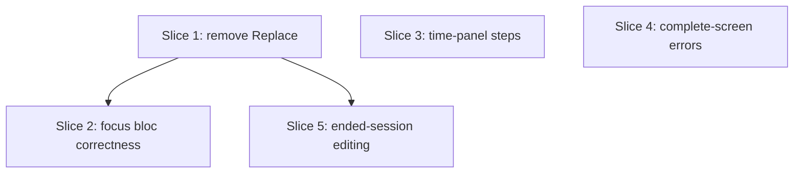

# Plan: Focus Mode & Workout Overview behavioral fixes

**Created**: 2026-06-11
**Branch**: master
**Status**: implemented

## Goal

Fix the in-session behavioral bugs in focus_mode + workout_overview that are
**independent of the Replace-exercise feature**, and **remove the Replace
affordance from the UI/bloc** pending a redesign of how it should behave.

Context: a design interrogation (2026-06-11) established that most of
`to_fix.md`'s findings are artifacts of `ReplacedState` handling, and the
Replace feature's intended semantics are unsettled. Rather than fix bugs in
semantics that may be redesigned, we drop Replace from the UI now (keeping the
domain/engine/persistence intact and dormant so re-enabling is mostly
re-wiring) and ship the six replace-independent fixes that are unambiguously
correct. The replace-coupled findings (1, 5, 7, 9, 10, 12) and Decisions 1 & 5
are deferred — see the Status note in `to_fix.md`.

**Test bar (per [[project-test-scope-modules]]):** extend the existing
`test/modules/**` suites — services, assemblers, and `focus_mode_bloc_test`
(plain `flutter_test` + `FakeSessionRepository`; no `bloc_test` package, no
Flutter widget tests). Verify-by-inspection is reserved for Flutter widgets
(menus, panels, app-bar, banners, `SetRow` render). CLAUDE.md's "domain +
persistence only" wording is knowingly left stale.

## Acceptance Criteria

- [ ] No "Replace exercise" action is offered in the focus panel menu or the overview kebab; the replace dialog and `*ExerciseReplaced` bloc events/handlers are removed.
- [ ] The domain/engine/persistence `replaceExercise` + `ReplacedState` + `SubstituteExercise` + assembler rendering branches are **retained, dormant** — any pre-existing replaced rows still render, and no schema/migration changes are made.
- [ ] A draft edit on one superset panel made while another panel's mutation is in flight is **not** reverted when the mutation lands (finding 2).
- [ ] Any engine mutation stops the running countdown **and** its ticker — no orphaned `Timer`; the invariant "ticker runs iff emitted `stopwatch.isRunning`" holds across mutation and refresh-fallback paths (finding 3).
- [ ] A failed undo leaves the **undo affordance present** so it can be retried, and surfaces the error (finding 6).
- [ ] The time-based focus panel bumps weight via `IncrementRules.weightSteps` and duration via `IncrementRules.durationSteps`; no hardcoded ±2.5 / ±5 (finding 4).
- [ ] A transient error on the focus workout-complete screen is **surfaced** to the user (finding 13).
- [ ] After a session is ended, completed sets remain **editable** (`canEditExecuted`) while logging / reorder / skip / notes stay **disabled** (`canLog`); end-session copy unchanged (finding 14, Decision 4).

## Slices

A slice is a vertically deliverable increment. Each carries the Gherkin
scenario(s) that define its behavior, followed by TDD steps. Steps are numbered
`<slice>.<step>`.

### Slice 1: Remove the Replace affordance (UI + bloc)

**Depends-on:** none
**Files:** `lib/modules/focus_mode/widgets/focus_panel_actions_menu.dart`, `lib/modules/focus_mode/widgets/focus_panel_header.dart`, `lib/modules/focus_mode/bloc/focus_mode_bloc.dart`, `lib/modules/focus_mode/bloc/focus_mode_event.dart`, `lib/modules/workout_overview/widgets/exercise_card.dart`, `lib/modules/workout_overview/widgets/workout_overview_loaded_body.dart`, `lib/modules/workout_overview/widgets/workout_group_builder.dart`, `lib/modules/workout_overview/widgets/superset_card.dart`, `lib/modules/workout_overview/widgets/group_with_picker_dialog.dart`, `lib/modules/workout_overview/widgets/replace_exercise_dialog.dart` (delete), `lib/modules/workout_overview/screens/workout_overview_screen.dart`, `lib/modules/workout_overview/bloc/workout_overview_bloc.dart`, `lib/modules/workout_overview/bloc/workout_overview_event.dart`, `test/modules/focus_mode/bloc/focus_mode_bloc_test.dart`

**Behavior:**

```gherkin
Feature: Replace exercise removed from the UI

  Scenario: Focus panel menu offers no Replace
    Given a focused unfinished exercise
    Then the panel menu does not offer "Replace exercise"
    And it still offers Skip and Mark done

  Scenario: Overview kebab offers no Replace
    Given an unfinished exercise card in the overview
    Then the kebab menu does not offer "Replace exercise"
    And it still offers Skip, Mark done, Group into, and Move

  Scenario: Pre-existing replaced rows still render
    Given a session that already contains a replaced exercise
    Then that exercise still displays its substitute and logged sets
    And no action attempts to create or re-create a replacement
```

**Steps:**

#### Step 1.1: Strip the Replace create-path from both screens and both blocs

**Complexity**: standard
**RED**: In `focus_mode_bloc_test.dart`, remove the `FocusModeExerciseReplaced` test cases (the event is going away). No new assertion needed — the gate is a green build + analyze.
**GREEN**:
- Focus: remove the Replace item + `_handleReplace` from `focus_panel_actions_menu.dart`; remove any replace entry point in `focus_panel_header.dart`; remove `on<FocusModeExerciseReplaced>` + `_onExerciseReplaced` from `focus_mode_bloc.dart`; delete `FocusModeExerciseReplaced` from `focus_mode_event.dart`.
- Overview: remove the Replace menu item + `onReplace` plumbing from `exercise_card.dart`, `workout_overview_loaded_body.dart`, `workout_group_builder.dart`, `superset_card.dart`, `group_with_picker_dialog.dart`, and `workout_overview_screen.dart`; remove `on<WorkoutOverviewExerciseReplaced>` + `_onExerciseReplaced` from `workout_overview_bloc.dart`; delete `WorkoutOverviewExerciseReplaced` from `workout_overview_event.dart`.
- Delete `replace_exercise_dialog.dart` and its helpers (`presentReplaceFlow`, `resolveReplaceExerciseDefaults`) — this also clears the cross-module deep-import (finding 22's worst case).
- **Keep dormant:** `SessionFlowEngine.replaceExercise`, `SessionRepository.replaceExercise`, `DriftSessionRepository.replaceExercise`, `ReplacedState`, `SubstituteExercise`, and all assembler/view-model `ReplacedState` rendering branches (`isReplaced`, substitute summaries). Do **not** touch domain/persistence — no schema or migration changes.
**REFACTOR**: Remove now-unused imports so `tool/check_offline_imports.sh` and analyze stay green.
**Verify**: `dart run build_runner build --force-jit` (if any `*.g/.freezed` referenced a removed event) + `tool/ci.sh`; launch app, confirm no Replace in either menu and a session with a pre-existing replaced exercise still renders.
**Files**: all in the slice header.
**Commit**: `feat(session): remove Replace exercise from the UI pending redesign`

### Slice 2: Focus bloc mutation correctness (draft race, stopwatch leak, undo restore)

**Depends-on:** 1
**Files:** `lib/modules/focus_mode/bloc/focus_mode_bloc.dart`, `test/modules/focus_mode/bloc/focus_mode_bloc_test.dart`

> Depends-on 1 only because both edit `focus_mode_bloc.dart` (Slice 1 removes the replace handler; this slice fixes the remaining mutation handlers).

**Behavior:**

```gherkin
Feature: In-session mutation correctness

  Scenario: A concurrent draft edit survives a mutation landing
    Given a superset with panels A and B, both loggable
    And a weight edit is applied to panel B while LOG SET on panel A is in flight
    When panel A's set completes
    Then panel B's draft still reflects the concurrent edit

  Scenario: Logging on one panel stops a countdown running on another
    Given a countdown running on panel B
    When a set is logged on panel A
    Then the stopwatch is idle
    And no further stopwatch ticks are processed

  Scenario: A failed undo keeps the undo affordance
    Given a just-logged set with an available undo
    When the undo mutation fails with a transient error
    Then the undo affordance is still present
    And the transient error is surfaced
```

**Steps:**

#### Step 2.1: Re-read state after each engine await and merge drafts

**Complexity**: complex
**RED**: Bloc test — seed a loggable superset, dispatch `FocusModeSetCompleted` for A, and (via a `FakeSessionRepository` that lets the test interleave) apply a `FocusModeWeightEdited` to B before completeSet resolves; assert B's draft after settle equals the edited value.
**GREEN**: In `_onSetCompleted`, `_onUndoRequested`, `_onExerciseSkipped`, `_onExerciseMarkedDone` (four handlers now that replace is gone), after the `await` re-read `final latest = state;` and pass `priorDrafts: latest is FocusModeReady ? latest.drafts : current.drafts` into `_assembleAfterMutation` (mirrors `workout_overview_bloc.dart:343`). Keep the `mutationInFlight` drop guard (Decision 6 — no `sequential()` transformer).
**REFACTOR**: Extract a `_draftsAfterAwait()` helper if the call sites duplicate.
**Files**: `focus_mode_bloc.dart`, `test/modules/focus_mode/bloc/focus_mode_bloc_test.dart`
**Commit**: `fix(focus): merge concurrent drafts after a mutation lands`

#### Step 2.2: Tie the stopwatch ticker to the running invariant

**Complexity**: complex
**RED**: Bloc test — start a countdown on B (`FocusModeStopwatchStarted` + a `FocusModeStopwatchTicked`), then log a set on A; assert the resulting state's `stopwatch` is idle and `activeStopwatchExerciseId == null`, and that a subsequently injected `FocusModeStopwatchTicked` is a no-op (ticker treated as stopped).
**GREEN**: Enforce *ticker runs iff emitted `stopwatch.isRunning`*: cancel `_stopStopwatchTicker()` + `_stopStopwatchFlashTimer()` wherever a non-running stopwatch is emitted — unconditionally in the mutation handlers (drop the `activeStopwatchExerciseId == event.id` condition at `focus_mode_bloc.dart:481`) and in the `_assembleFromSessionState` refresh-fallback path. Per Q4: any logged set means the user moved on; no preserve-across-refresh nuance.
**REFACTOR**: Centralize the cancel in one helper invoked by every idle-emitting path.
**Files**: `focus_mode_bloc.dart`, `test/modules/focus_mode/bloc/focus_mode_bloc_test.dart`
**Commit**: `fix(focus): stop the stopwatch ticker on any mutation`

#### Step 2.3: Restore the undo affordance on a failed undo

**Complexity**: standard
**RED**: Bloc test — log a set (undo available), drive `FocusModeUndoRequested` against a repo stubbed to throw `DomainError` on `deleteExecutedSet`; assert the emitted state still has `undoable != null` and `lastTransientError != null`.
**GREEN**: In `_onUndoRequested`'s `DomainError` catch (`focus_mode_bloc.dart:554`), restore `undoable` alongside `mutationInFlight: false` and the error.
**REFACTOR**: None.
**Files**: `focus_mode_bloc.dart`, `test/modules/focus_mode/bloc/focus_mode_bloc_test.dart`
**Commit**: `fix(focus): keep undo available after a failed undo`

### Slice 3: Time-based focus panel honors the shared step policy

**Depends-on:** none
**Files:** `lib/modules/focus_mode/widgets/focus_time_based_panel.dart`

**Behavior:**

```gherkin
Feature: Consistent weight/duration steps in the time-based panel

  Scenario: Weight bump matches the shared increment policy
    Given a time-based panel showing a 5 kg load
    Then the weight bump buttons step by 1 kg
    Given a time-based panel showing a 30 kg load
    Then the weight bump buttons step by 2.5 kg

  Scenario: Duration bump matches the shared increment policy
    Then the duration bump buttons step by 5 seconds
```

**Steps:**

#### Step 3.1: Wire weight/duration bumps to `IncrementRules`

**Complexity**: standard
**RED**: None (Flutter widget — verify-by-inspection; `IncrementRules` is already unit-tested).
**GREEN**: In `focus_time_based_panel.dart`, replace literal `onWeightBump(-2.5)`/`(2.5)` and `'-2.5'`/`'+2.5'` labels (lines 303, 314, 352, 362) with `IncrementRules.weightSteps(currentWeight)`, and the `±5` duration literals (lines 212, 223, 261) with `IncrementRules.durationSteps` — matching `FocusRepBasedPanel` and the set-row stepper.
**REFACTOR**: None.
**Verify**: Build the app; confirm ±1 at ≤10 kg, ±2.5 above (matching the overview editor), and ±5 duration steps.
**Files**: `focus_time_based_panel.dart`
**Commit**: `fix(focus): time-based panel uses shared increment rules`

### Slice 4: Surface transient errors on the workout-complete screen

**Depends-on:** none
**Files:** `lib/modules/focus_mode/screens/focus_mode_screen.dart`, `lib/modules/focus_mode/widgets/focus_workout_complete_view.dart`

**Behavior:**

```gherkin
Feature: Errors on the workout-complete screen are visible

  Scenario: A transient error after completion is shown
    Given the focus screen is in the workout-complete state
    When a transient domain error is attached to that state
    Then an error banner is shown with a dismiss affordance
```

**Steps:**

#### Step 4.1: Render `lastTransientError` on the complete view

**Complexity**: standard
**RED**: None (Flutter widget — verify-by-inspection).
**GREEN**: In `focus_mode_screen.dart:110`, pass `FocusModeWorkoutComplete.lastTransientError` into `FocusWorkoutCompleteView` and render the same error-banner affordance the `FocusModeReady` body uses, wired to `FocusModeErrorDismissed`. (`_onSessionFailed`/`_onErrorDismissed` already maintain the field — `focus_mode_bloc.dart:190-214`.)
**REFACTOR**: Reuse the existing banner widget rather than a one-off.
**Verify**: Build the app; force a transient failure on the complete screen and confirm the banner appears and dismisses.
**Files**: `focus_mode_screen.dart`, `focus_workout_complete_view.dart`
**Commit**: `fix(focus): show transient errors on the workout-complete screen`

### Slice 5: Ended-session editing — split canMutate into canLog / canEditExecuted

**Depends-on:** 1
**Files:** `lib/modules/workout_overview/bloc/workout_overview_state.dart` (state class), `lib/modules/workout_overview/widgets/workout_overview_loaded_body.dart`, `lib/modules/workout_overview/widgets/set_row.dart`, `lib/modules/workout_overview/widgets/exercise_card.dart`

> Depends-on 1 because both edit `exercise_card.dart` and `workout_overview_loaded_body.dart`.

**Behavior:**

```gherkin
Feature: Editing completed sets after a session ends

  Scenario: Completed sets stay editable once ended
    Given an ended session with a completed set
    When the user edits that set's values
    Then the edit is accepted

  Scenario: Logging and structural changes are disabled once ended
    Given an ended session
    Then logging a new set, reorder, skip, and notes are all disabled
```

**Steps:**

#### Step 5.1: Split the mutation gate and thread it through

**Complexity**: standard
**RED**: If `WorkoutOverviewLoaded` gains `canLog` / `canEditExecuted` getters, add a state test asserting `canLog == !isEnded` and `canEditExecuted == true` for an ended session (the widget wiring itself is verify-by-inspection).
**GREEN**: Replace `canMutate = !state.isEnded` (`workout_overview_loaded_body.dart:162`) with `canLog` (`!isEnded`) and `canEditExecuted` (always true). Route `canEditExecuted` to `SetRow`'s edit-existing path (`set_row.dart:205,209`); keep `canLog` gating the loggable row, quick-log, reorder, skip, group-into, and notes. The engine already permits `updateExecutedSet` on ended sessions and blocks `completeSet`/`deleteExecutedSet` (`session_flow_engine.dart:304,347,384`), so this exposes exactly the one allowed post-end op — no error-banner traps. Copy stays as written (Decision 4).
**REFACTOR**: None.
**Verify**: Build the app; end a session, edit a completed set (accepted), confirm logging/reorder/skip/notes are disabled.
**Files**: `workout_overview_state.dart`, `workout_overview_loaded_body.dart`, `set_row.dart`, `exercise_card.dart`
**Commit**: `feat(overview): allow editing completed sets after a session ends`

## Parallelization

`Depends-on` declarations only — waves derived below (the `plan-waves.sh` helper
is not shipped in this plugin version; verified by hand, collision-free).



| Wave | Slices (parallel) |
|------|-------------------|
| 1 | 1, 3, 4 |
| 2 | 2, 5 |

Same-wave file check: Wave 1 — Slice 1 (focus/overview menus + blocs), Slice 3 (`focus_time_based_panel.dart`), Slice 4 (`focus_mode_screen.dart`, `focus_workout_complete_view.dart`) are disjoint. Wave 2 — Slice 2 (`focus_mode_bloc.dart`) and Slice 5 (`workout_overview_*`, `set_row.dart`, `exercise_card.dart`) are disjoint; the files they share with Slice 1 sit in an earlier wave.

## Complexity Classification

| Rating | Steps |
|--------|-------|
| `complex` | 2.1, 2.2 |
| `standard` | 1.1, 2.3, 3.1, 4.1, 5.1 |
| `trivial` | none |

## Pre-PR Quality Gate

- [ ] `tool/ci.sh` passes (offline-import guard → codegen → format → analyze → test)
- [ ] `tool/check_offline_imports.sh` passes (Slice 1 removes imports — no orphans, no new violations)
- [ ] `dart run build_runner build --force-jit` clean (if a removed event was referenced by generated code)
- [ ] `/code-review` passes
- [ ] `product-context.md` reviewed — update for Slice 1 (Replace removed from the user-facing surface) and Slice 5 (ended-overview now allows value edits)

## Risks & Open Questions

- **Replace removal breadth (Slice 1):** the create-path touches ~13 files across two modules. Risk is leaving a dangling reference or unused import that breaks analyze. Mitigation: it's mechanical deletion, gated by `tool/ci.sh`; keep all domain/persistence intact so the blast radius is UI/bloc only.
- **Pre-existing replaced rows:** if your device has sessions with `ReplacedState` exercises, they remain (domain dormant, assemblers still render them) — you just can't create new ones. No migration. Confirm that's the intended "freeze, don't purge" behavior.
- **Re-enabling later:** bringing Replace back means re-adding the menu items, dialog, and bloc events (the engine/repo are untouched), **plus** resolving the deferred design questions — Decision 1 / Q1 (skip & mark-done on replaced, both screens) / Q3 (type-changing replace strands sets) / Q6 (skip on a quota-met replaced). Those, and findings 1, 5, 7, 9, 10, 12, are parked in `to_fix.md`'s Status note.
- **Widget-only fixes** (3.1, 4.1, 5.1) rely on manual verification — no Flutter widget tests in this repo by convention.
- **`product-context.md`:** Slice 1 removes a user-facing capability and Slice 5 changes ended-session behavior — update the doc in those slices.

## Build Progress

### Slices (grouped by wave)

#### Wave 1
- [x] Slice 1: Remove the Replace affordance (UI + bloc)
  - [x] Step 1.1: Strip the Replace create-path from both screens and both blocs
- [x] Slice 3: Time-based focus panel honors the shared step policy
  - [x] Step 3.1: Wire weight/duration bumps to `IncrementRules`
- [x] Slice 4: Surface transient errors on the workout-complete screen
  - [x] Step 4.1: Render `lastTransientError` on the complete view

#### Wave 2
- [x] Slice 2: Focus bloc mutation correctness
  - [x] Step 2.1: Re-read state after each engine await and merge drafts
  - [x] Step 2.2: Tie the stopwatch ticker to the running invariant
  - [x] Step 2.3: Restore the undo affordance on a failed undo
- [x] Slice 5: Ended-session editing — split canMutate into canLog / canEditExecuted
  - [x] Step 5.1: Split the mutation gate and thread it through

### Acceptance Criteria

- [x] Replace removed from both menus + dialog + bloc events; domain kept dormant
- [x] Pre-existing replaced rows still render; no schema/migration change
- [x] Concurrent draft edit survives a mutation landing
- [x] Any mutation stops the countdown + ticker (running invariant)
- [x] Failed undo keeps the undo affordance
- [x] Time-based panel uses IncrementRules for weight/duration steps
- [x] Transient errors surfaced on the workout-complete screen
- [x] Ended session allows editing completed sets; logging/structure disabled
