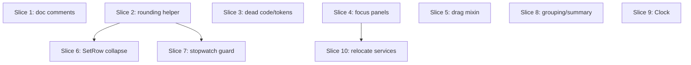

# Plan: Focus Mode & Workout Overview cleanup batch

**Created**: 2026-06-11
**Branch**: cleanup/focus-overview-batch
**Status**: in-progress

## Goal

Clear the **replace-independent** `to_fix.md` findings that the prior behavioral-fix
plan (`plans/focus-overview-behavioral-fixes.md`, now implemented) left on the table:
the two stale doc comments (15, 16), the superset-grouping definition split (11),
and the 🔵 smells/cleanup batch (17–26). Every item here is safe regardless of whether
the dormant engine-side Replace machinery later stays or is torn out — the
replace-coupled findings (1, 5, 7, 9, 10, 12) and the engine-teardown decision are
deliberately **not** in scope and get their own plan.

Finding 24 is already moot (the prior plan deleted `replace_exercise_dialog.dart`), and
finding 22's worst case (focus_mode deep-importing that dialog) is resolved with it.
Finding 8 is withdrawn upstream; this plan does not touch it.

**Test bar (per [[project_test_scope_modules]]):** extend the existing `test/core/**`,
`test/domain/**`, and `test/modules/**` suites — unit tests for the rounding helper,
the grouping helper, the set-value mapper, the focus assembler, and a `focus_mode_bloc`
test for the stopwatch-start guard (plain `flutter_test` + fakes; no `bloc_test`
package, no Flutter widget tests). Pure widget/doc refactors are **verify-by-inspection**
gated on a green `tool/ci.sh`. CLAUDE.md's "domain + persistence only" wording is
knowingly left stale.

## Acceptance Criteria

- [ ] (15) Neither `drop_resolver.dart` nor `draggable_exercise.dart` claims a "drag-to-ungroup" flow; the comments describe the real affordance (header ungroup button only).
- [ ] (16) `UndoableSet`'s doc describes the persistent until-next-mutation bottom-bar row, not a transient SnackBar window.
- [ ] (17) `FocusModeColors`, `MoveTargets.hasAny`, and the never-passed `isDropTarget` params/branches on `ExerciseCard`/`SupersetCard` are removed; `tool/ci.sh` analyze stays clean.
- [ ] (18) Tapping the padding/gaps of an **open** `SetRow` editor no longer collapses it; only the collapsed summary toggles open/closed.
- [ ] (19a) mm:ss formatting has one shared implementation used by both the time-based panel and the rest-timer bar.
- [ ] (19b) The big numeric field + bump row have one shared implementation used by both the rep-based and bodyweight panels.
- [ ] (19c) The focus assembler's planned summary is produced by the shared `PlannedSummaryFormatter` (no byte-for-byte copy).
- [ ] (19d) Half-kg rounding flows through one helper (`IncrementRules.roundHalfKg`) at every call site (`bumpWeight`, set-value mapper, `set_row`, focus bloc, export editor sheet).
- [ ] (20) The drag-registration (`_registered` + post-frame `_setRegistered`) plumbing is one shared mixin used by all four drag widgets.
- [ ] (21) `focus_video_button` uses `AppIconSize.*` and `superset_card`'s border uses `AppStroke` tokens — no raw `28` / `2` / `1`.
- [ ] (22) `DomainErrorPresenter` and `ExternalLinkLauncher` (+ impl) live in `building_blocks/` and are imported via the barrel; no module deep-imports another module's `services/` for them; `library_picker_sheet` is imported via the `exercise_library` barrel.
- [ ] (23) `SessionElapsedLabel` reads the injected `Clock` rather than `DateTime.now()`.
- [ ] (25) Starting the focus stopwatch is a no-op while a mutation is in flight or on a non-loggable panel.
- [ ] (26) Numeric panel commits fire once per edit — no `onSubmitted` + focus-loss double-commit.
- [ ] (11) Superset grouping uses a single shared **contiguity-based** helper across the overview bloc and both assemblers.

## Slices

A slice is a vertically deliverable increment. Each carries the Gherkin scenario(s)
that define its behavior, followed by the TDD steps that satisfy them. Steps are
numbered `<slice>.<step>`. Widget/doc-only slices have no RED test (no Flutter widget
tests by repo convention) — their gate is a green `tool/ci.sh` plus the stated
verify-by-inspection check.

### Slice 1: Doc-comment corrections (15, 16)

**Depends-on:** none
**Files:** `lib/modules/workout_overview/services/drop_resolver.dart`, `lib/modules/focus_mode/models/undoable_set.dart`

> `draggable_exercise.dart`'s half of finding 15 is folded into Slice 5, which already rewrites that file (the drag mixin) — one owner per file.

**Behavior:**

```gherkin
Feature: In-code docs match the real affordances

  Scenario: drop_resolver no longer promises drag-to-ungroup
    Given the drop_resolver "noop" branch doc comment
    Then it describes the header ungroup button as the only ungroup path
    And it does not claim "drag-to-ungroup remains the supported flow"

  Scenario: UndoableSet doc matches the persistent row
    Given the UndoableSet class doc
    Then it describes a persistent bottom-bar row cleared on the next mutation
    And it does not describe a transient SnackBar window
```

**Steps:**

#### Step 1.1: Rewrite the two stale doc comments

**Complexity**: trivial
**RED**: None (comment-only).
**GREEN**: In `drop_resolver.dart:82-83`, replace the "Drag-to-ungroup remains the supported flow…" sentence with the truth: the header ungroup button is the only ungroup affordance; drops with `supersetTag != null` are rejected. In `undoable_set.dart:5-7`, replace "for one transient window so the UI can render a SnackBar … Cleared after the snackbar dismisses" with the persistent-row reality (surfaces in `FocusModeReady.undoable`; persists until the next mutation/group switch or Undo).
**REFACTOR**: None.
**Verify**: `tool/ci.sh` green (analyze unaffected).
**Files**: `drop_resolver.dart`, `undoable_set.dart`
**Commit**: `docs(session): correct stale drag-to-ungroup and UndoableSet comments`

### Slice 2: Centralize half-kg rounding (19d, helper + non-conflicting call sites)

**Depends-on:** none
**Files:** `lib/core/increment_rules.dart`, `lib/modules/workout_overview/services/set_value_input_mapper.dart`, `lib/modules/export/widgets/set_value_editor_sheet.dart`, `test/core/increment_rules_test.dart`, `test/modules/workout_overview/services/set_value_input_mapper_test.dart`

> The two remaining `(x*2).round()/2` call sites live in `set_row.dart` (Slice 6) and `focus_mode_bloc.dart` (Slice 7); those slices adopt the helper introduced here, so they Depend-on this slice.

**Behavior:**

```gherkin
Feature: One half-kg rounding rule

  Scenario: rounding snaps to the nearest 0.5 kg
    Given a raw weight of 2.26 kg
    When it is rounded to the domain's half-kg resolution
    Then the result is 2.5 kg

  Scenario: midpoint rounds consistently
    Given a raw weight of 2.25 kg
    When it is rounded
    Then the result matches IncrementRules.bumpWeight's existing behavior
```

**Steps:**

#### Step 2.1: Add `IncrementRules.roundHalfKg` and route call sites through it

**Complexity**: standard
**RED**: In `increment_rules_test.dart`, add cases for `IncrementRules.roundHalfKg` (e.g. `2.26 → 2.5`, `2.24 → 2.0`, `2.25 → 2.5`, negative passthrough policy matching today). In `set_value_input_mapper_test.dart`, assert the mapper's rounded output is unchanged after the swap (characterization).
**GREEN**: Add `static double roundHalfKg(double kg) => (kg * 2).round() / 2;` to `IncrementRules`. Make `bumpWeight` reuse it (`return roundHalfKg(next);`). Replace `set_value_input_mapper.dart:86 _roundHalfKg` body (or delete it and call `IncrementRules.roundHalfKg` at `:62,73`). Replace the inline `(next * 2).round() / 2` at `set_value_editor_sheet.dart:220` with `IncrementRules.roundHalfKg`.
**REFACTOR**: Remove the now-redundant private `_roundHalfKg` if fully replaced.
**Files**: `increment_rules.dart`, `set_value_input_mapper.dart`, `set_value_editor_sheet.dart`, `increment_rules_test.dart`, `set_value_input_mapper_test.dart`
**Commit**: `refactor(core): single half-kg rounding helper on IncrementRules`

### Slice 3: Remove dead code & superset border token (17, 21-border)

**Depends-on:** none
**Files:** `lib/modules/workout_overview/widgets/exercise_card.dart`, `lib/modules/workout_overview/widgets/superset_card.dart`, `lib/modules/workout_overview/services/reorder_move_resolver.dart`, `test/modules/workout_overview/services/reorder_move_resolver_test.dart`

**Behavior:**

```gherkin
Feature: No dead members, no raw stroke literals

  Scenario: cards no longer expose an unused drop-target flag
    Given no caller passes isDropTarget to ExerciseCard or SupersetCard
    Then the parameter and its render branch are gone
    And the superset card border draws from AppStroke tokens

  Scenario: the unused MoveTargets.hasAny getter is gone
    Given hasAny is referenced nowhere
    Then it is removed and the move-resolver tests still pass
```

**Steps:**

#### Step 3.1: Delete `isDropTarget`, `MoveTargets.hasAny`, `FocusModeColors`-adjacent strays in overview

**Complexity**: standard
**RED**: If `reorder_move_resolver_test.dart` references `hasAny`, remove that assertion; the remaining suite is the gate. (Card changes are verify-by-inspection.)
**GREEN**: Remove the `isDropTarget` field + constructor param + render branch from `exercise_card.dart` (`:64,106,118,121`) and `superset_card.dart` (`:30,58,101-102`); the superset border collapses to `colors.outline` at `AppStroke.hairline` (resolving finding 21's `width: isDropTarget ? 2 : 1`). Remove `MoveTargets.hasAny` (`reorder_move_resolver.dart:22`). No caller passes `isDropTarget`, so `workout_group_builder.dart` needs no edit (confirm).
**REFACTOR**: Drop any now-unused imports.
**Verify**: `tool/ci.sh` green; overview renders unchanged (cards never highlighted as drop targets today anyway).
**Files**: `exercise_card.dart`, `superset_card.dart`, `reorder_move_resolver.dart`, `reorder_move_resolver_test.dart`
**Commit**: `refactor(overview): drop dead isDropTarget/hasAny and tokenize superset border`

### Slice 4: Focus panel widget consolidation (17-color, 19a, 19b, 26, 21-iconSize)

**Depends-on:** none
**Files:** `lib/modules/focus_mode/widgets/focus_rep_based_panel.dart`, `lib/modules/focus_mode/widgets/focus_bodyweight_panel.dart`, `lib/modules/focus_mode/widgets/focus_time_based_panel.dart`, `lib/modules/focus_mode/widgets/focus_rest_timer_bar.dart`, `lib/modules/focus_mode/widgets/focus_video_button.dart`, `lib/modules/focus_mode/widgets/focus_numeric_field.dart` (new), `lib/modules/focus_mode/widgets/mmss_formatter.dart` (new, or reuse `core/rest_formatter.dart`)

**Behavior:**

```gherkin
Feature: Focus panels share their building blocks

  Scenario: one mm:ss formatter
    Given the time-based panel and the rest-timer bar both show mm:ss
    Then both call the same formatter
    And no panel defines its own _formatMmss

  Scenario: one big-numeric field + bump row
    Given the rep-based and bodyweight panels both render a big numeric field with ± bumps
    Then both use the shared widget
    And FocusModeColors (dead) is removed

  Scenario: a single commit per numeric edit
    Given a numeric field is edited and the keyboard "done" is pressed
    Then the value commits exactly once (no duplicate from the focus-loss listener)

  Scenario: tokens, not literals
    Then focus_video_button uses AppIconSize and no panel hardcodes an icon size
```

**Steps:**

#### Step 4.1: Extract shared mm:ss formatter and big-numeric field

**Complexity**: standard
**RED**: None (Flutter widgets — verify-by-inspection).
**GREEN**: Extract `_formatMmss` (`focus_time_based_panel.dart:401`, `focus_rest_timer_bar.dart:81`) into one shared function and call it from both. Extract `_BigNumericField`/`_BumpRow` (duplicated across `focus_rep_based_panel.dart` and `focus_bodyweight_panel.dart`) into `focus_numeric_field.dart`; use it in both. Delete dead `FocusModeColors` (`focus_rep_based_panel.dart:282-286`).
**REFACTOR**: Prefer reusing `core/rest_formatter.dart` if its output already matches mm:ss; otherwise keep the new small formatter.
**Verify**: `tool/ci.sh` green; rep/bodyweight/time panels render identically.
**Files**: the four panels + two new files.
**Commit**: `refactor(focus): share mm:ss formatter and big-numeric field across panels`

#### Step 4.2: De-duplicate the numeric commit and tokenize the icon size

**Complexity**: standard
**RED**: None (verify-by-inspection).
**GREEN**: In the three panels, make the keyboard `onSubmitted` and the focus-loss listener route through one commit path so a "done" press commits once (today only state-equality dedup hides the double emit). Replace `focus_video_button.dart:34` `iconSize: 28` with the matching `AppIconSize.*`.
**REFACTOR**: None.
**Verify**: `tool/ci.sh` green; editing a field and pressing done logs one value; video button unchanged visually.
**Files**: `focus_rep_based_panel.dart`, `focus_bodyweight_panel.dart`, `focus_time_based_panel.dart`, `focus_video_button.dart`
**Commit**: `fix(focus): single numeric commit per edit; tokenize video icon size`

### Slice 5: Drag-registration mixin + stale comment (20, 15-draggable)

**Depends-on:** none
**Files:** `lib/modules/workout_overview/widgets/reorder_gap.dart`, `lib/modules/workout_overview/widgets/superset_reorder_gap.dart`, `lib/modules/workout_overview/widgets/superset_drop_target.dart`, `lib/modules/workout_overview/widgets/draggable_exercise.dart`, `lib/modules/workout_overview/widgets/drag_hover_registration.dart` (new)

**Behavior:**

```gherkin
Feature: One drag-hover registration helper

  Scenario: all drag targets share the registration plumbing
    Given four drag widgets each tracked hover with a copy-pasted _registered + post-frame _setRegistered
    Then all four use one shared mixin
    And drag-hover highlighting behaves exactly as before

  Scenario: draggable_exercise comment is accurate
    Then its onWillAccept doc no longer claims "drag-to-ungroup remains the supported flow"
```

**Steps:**

#### Step 5.1: Extract the `_registered`/`_setRegistered` mixin and fix the comment

**Complexity**: standard
**RED**: None (Flutter widgets — verify-by-inspection).
**GREEN**: Create `drag_hover_registration.dart` with a mixin encapsulating the `_registered` flag + post-frame `_setRegistered` pattern; apply it in all four widgets, deleting the per-file copies. While editing `draggable_exercise.dart`, correct the `:77-81` comment (finding 15's other half) to describe the header ungroup button instead of "drag-to-ungroup".
**REFACTOR**: None.
**Verify**: `tool/ci.sh` green; reorder gaps, superset drop target, and onto-card drag all still highlight on hover.
**Files**: the four drag widgets + the new mixin.
**Commit**: `refactor(overview): extract drag-hover registration mixin`

### Slice 6: SetRow tap-to-collapse trap + adopt roundHalfKg (18, 19d-setrow)

**Depends-on:** 2
**Files:** `lib/modules/workout_overview/widgets/set_row.dart`

> Depends-on 2 because it adopts `IncrementRules.roundHalfKg` introduced there, and because the rounding swap shares `set_row.dart`'s ownership cleanly with the collapse fix.

**Behavior:**

```gherkin
Feature: The open SetRow editor doesn't collapse on a stray tap

  Scenario: tapping editor padding keeps it open
    Given a SetRow whose inline editor is open
    When the user taps padding/gap inside the editor (not a control)
    Then the editor stays open

  Scenario: tapping the collapsed summary still toggles
    Given a collapsed SetRow
    When the user taps the summary
    Then the editor opens
```

**Steps:**

#### Step 6.1: Restrict the collapse `InkWell` to the summary; swap the rounding literal

**Complexity**: standard
**RED**: None (Flutter widget — verify-by-inspection).
**GREEN**: In `set_row.dart`, move the row-level collapse `InkWell` (`:281-288`) so it wraps only the collapsed summary, not the open editor — taps on editor padding no longer toggle. Replace the inline `(next * 2).round() / 2` at `set_row.dart:718` with `IncrementRules.roundHalfKg`.
**REFACTOR**: None.
**Verify**: `tool/ci.sh` green; open editor, tap its padding → stays open; tap collapsed summary → opens.
**Files**: `set_row.dart`
**Commit**: `fix(overview): only the SetRow summary toggles collapse`

### Slice 7: Focus stopwatch-start guard + adopt roundHalfKg (25, 19d-bloc)

**Depends-on:** 2
**Files:** `lib/modules/focus_mode/bloc/focus_mode_bloc.dart`, `test/modules/focus_mode/bloc/focus_mode_bloc_test.dart`

> Depends-on 2 for `IncrementRules.roundHalfKg`. Shares `focus_mode_bloc.dart` ownership between the guard and the rounding swap, so both land here.

**Behavior:**

```gherkin
Feature: Stopwatch start is gated like every other interaction

  Scenario: no countdown while a mutation is in flight
    Given a mutation is in flight on the focus screen
    When a stopwatch start is requested
    Then no stopwatch starts

  Scenario: no countdown on a non-loggable panel
    Given a panel whose set quota is already met
    When a stopwatch start is requested for it
    Then no stopwatch starts
```

**Steps:**

#### Step 7.1: Gate `_onStopwatchStarted` and route weight rounding through the helper

**Complexity**: standard
**RED**: Bloc test — (a) with `mutationInFlight == true`, dispatch `FocusModeStopwatchStarted` and assert no running stopwatch is emitted; (b) for a non-loggable panel, assert the same.
**GREEN**: In `_onStopwatchStarted` (`focus_mode_bloc.dart:369-388`), return early when `mutationInFlight` or the target panel is not loggable — mirroring the other interaction guards. Replace the inline `(raw * 2).round() / 2` at `focus_mode_bloc.dart:303` with `IncrementRules.roundHalfKg`.
**REFACTOR**: None.
**Files**: `focus_mode_bloc.dart`, `focus_mode_bloc_test.dart`
**Commit**: `fix(focus): gate stopwatch start on mutation/loggable; reuse rounding helper`

### Slice 8: Superset grouping unification + planned-summary dedup (11, 19c)

**Depends-on:** none
**Files:** `lib/modules/domain/superset_grouping.dart` (new), `lib/modules/domain/domain.dart` (barrel export), `lib/modules/workout_overview/bloc/workout_overview_bloc.dart`, `lib/modules/workout_overview/services/exercise_view_model_assembler.dart`, `lib/modules/focus_mode/services/focus_mode_assembler.dart`, `lib/core/planned_summary_formatter.dart` (moved from `workout_overview/services/`; `core` has no barrel — importers use the direct `package:zamaj/core/...` path), `test/domain/superset_grouping_test.dart` (new), `test/modules/workout_overview/services/exercise_view_model_assembler_test.dart`, `test/modules/focus_mode/services/focus_mode_assembler_test.dart`

**Behavior:**

```gherkin
Feature: One superset-grouping definition

  Scenario: contiguous same-tag runs form a group
    Given a session where exercises A,B share a superset tag and are contiguous
    Then they group together
    And a standalone exercise forms a single-member group

  Scenario: non-contiguous same-tag exercises do not merge
    Given two exercises share a tag but are separated by a different exercise
    Then they form two separate groups
    And the overview bloc, overview assembler, and focus assembler all agree

  Scenario: planned summary uses the shared formatter
    Given a planned exercise summarized in the focus panel
    Then the summary equals PlannedSummaryFormatter.summarize for that exercise
```

**Steps:**

#### Step 8.1: Extract a shared contiguity-based grouping helper

**Complexity**: complex
**RED**: `superset_grouping_test.dart` — assert `groupBySupersetRun(sessionExercises)` returns contiguous same-tag runs as groups, standalone/null-tag as singletons, and non-contiguous same-tag as separate groups. Add/extend assembler tests asserting their grouping now delegates to the helper (behavior unchanged for the contiguous case the engine guarantees today).
**GREEN**: Add `groupBySupersetRun(List<SessionExercise>) -> List<List<SessionExercise>>` to `domain/superset_grouping.dart`, export via the domain barrel. Replace `focus_mode_assembler.dart:_computeGroups` and `exercise_view_model_assembler.dart:_groupByAdjacentSupersetTag`'s grouping core with calls to it, and change `workout_overview_bloc.dart:_activeGroupLoggableIds` (`:421-436`) to derive the active group from the same helper (contiguity-based) rather than whole-session tag matching.
**REFACTOR**: Keep the assemblers' view-model wrapping local; only the grouping decision is shared.
**Files**: `superset_grouping.dart`, `domain.dart`, the two assemblers, `workout_overview_bloc.dart`, the three test files.
**Commit**: `refactor(domain): single contiguity-based superset grouping helper`

#### Step 8.2: Reuse `PlannedSummaryFormatter` in the focus assembler

**Complexity**: standard
**RED**: In `focus_mode_assembler_test.dart`, assert the focus panel's planned summary equals `PlannedSummaryFormatter.summarize(plannedExercise)`.
**GREEN**: Move `PlannedSummaryFormatter` from `workout_overview/services/` to `core/` (it is a pure formatter over the domain `Exercise`), repoint the overview call site's import to the new `package:zamaj/core/planned_summary_formatter.dart` path (no `core` barrel exists), and replace `focus_mode_assembler.dart:_summarizePlanned` (`:426`) with a call to it — removing the byte-for-byte copy and the cross-module reach.
**REFACTOR**: Delete `_summarizePlanned` once unused.
**Files**: `core/planned_summary_formatter.dart` (moved), barrels, `exercise_view_model_assembler.dart`, `focus_mode_assembler.dart`, `focus_mode_assembler_test.dart`
**Commit**: `refactor(core): share PlannedSummaryFormatter with the focus assembler`

### Slice 9: SessionElapsedLabel uses the injected Clock (23)

**Depends-on:** none
**Files:** `lib/modules/workout_overview/widgets/session_elapsed_label.dart`

**Behavior:**

```gherkin
Feature: Elapsed label uses the app Clock

  Scenario: live elapsed reads from the injected Clock
    Given a live session with no endedAt
    When the elapsed label computes "now"
    Then it reads the Clock provided at app.dart, not DateTime.now()
```

**Steps:**

#### Step 9.1: Read `context.read<Clock>()` instead of `DateTime.now()`

**Complexity**: standard
**RED**: None (Flutter widget — verify-by-inspection; `Clock` is already provided app-wide at `app.dart:39`).
**GREEN**: In `session_elapsed_label.dart:60`, replace `DateTime.now().toUtc()` with the injected clock (`context.read<Clock>().nowUtc()` / `.now().toUtc()` to match the existing UTC basis). No provider wiring needed — `RepositoryProvider<Clock>` is global.
**REFACTOR**: None.
**Verify**: `tool/ci.sh` green; elapsed label still ticks live and freezes on end.
**Files**: `session_elapsed_label.dart`
**Commit**: `fix(overview): SessionElapsedLabel reads the injected Clock`

### Slice 10: Relocate shared cross-module services (22)

**Depends-on:** 4
**Files:** move `domain_error_presenter.dart`, `external_link_launcher.dart`, `url_launcher_external_link_launcher.dart` from `lib/modules/program_management/services/` → `lib/building_blocks/`; `lib/building_blocks/building_blocks.dart` (barrel); `lib/app.dart`; all importers — `program_management/navigation/program_management_router.dart`, `program_management/screens/{program_editor_screen,program_list_screen,plan_preview_screen}.dart`, `program_management/widgets/exercise_editor_form.dart`, `program_management/bloc/exercise_editor/exercise_editor_bloc.dart`, `workout_day_picker/screens/workout_day_picker_screen.dart`, `workout_day_picker/widgets/{day_tile,workout_day_picker_error_view}.dart`, `workout_overview/screens/workout_overview_screen.dart`, `workout_overview/widgets/{workout_overview_error_view,transient_error_banner}.dart`, `focus_mode/widgets/focus_video_button.dart`, `focus_mode/widgets/focus_mode_state_views.dart`, `export/screens/recent_sessions_screen.dart`, `exercise_library/screens/{exercise_library_editor_screen,exercise_library_list_screen,link_suggestion_screen}.dart`; barrel switch in `program_management/widgets/{add_exercise_dialog,exercise_library_link_section}.dart`

> Depends-on 4 because both edit `focus_video_button.dart` (Slice 4 tokenizes its icon; this slice rewrites its import). Everything else this slice touches is untouched by Slices 1–9.

**Behavior:**

```gherkin
Feature: Shared services live in building_blocks and import via barrels

  Scenario: no module deep-imports another module's services
    Given DomainErrorPresenter and ExternalLinkLauncher now live in building_blocks
    Then every importer references them via the building_blocks barrel
    And no file imports program_management/services for them

  Scenario: library picker imported via its module barrel
    Given add_exercise_dialog and exercise_library_link_section use LibraryPickerSheet
    Then they import it from the exercise_library barrel, not a deep widget path

  Scenario: error presentation and link launching behave unchanged
    Given the moved DomainErrorPresenter and the UrlLauncher impl
    Then presented messages and launch results are identical to before
```

**Steps:**

#### Step 10.1: Move the two services into `building_blocks/` and repoint all importers

**Complexity**: complex
**RED**: None (mechanical move — the gate is `tool/check_offline_imports.sh` + `tool/ci.sh`; existing `domain_error_presenter`/launcher tests, if any, move with the files and must stay green).
**GREEN**: Move `domain_error_presenter.dart`, `external_link_launcher.dart`, and `url_launcher_external_link_launcher.dart` into `lib/building_blocks/`; export them from `building_blocks.dart`. Update the `ExternalLinkLauncher` provider registration in `app.dart:40-41`. Repoint every importer to `package:zamaj/building_blocks/building_blocks.dart`. Switch `add_exercise_dialog.dart` and `exercise_library_link_section.dart` to import `LibraryPickerSheet` from the `exercise_library` barrel (already exported at `exercise_library.dart:12`).
**REFACTOR**: Remove now-empty `program_management/services/` strays if any.
**Verify**: `tool/check_offline_imports.sh` (no new cross-module deep imports; `building_blocks` may import `url_launcher` — it is outside the core/domain/persistence restriction) + `tool/ci.sh` green.
**Files**: as listed in the slice header.
**Commit**: `refactor(arch): move shared error presenter & link launcher to building_blocks`

## Parallelization

`Depends-on` declarations below. The `plan-waves.sh` helper is **not shipped** in this
plugin version (confirmed: the referenced path does not exist), so waves are derived by
hand and verified collision-free.



| Wave | Slices (parallel) |
|------|-------------------|
| 1 | 1, 2, 3, 4, 5, 8, 9 |
| 2 | 6, 7, 10 |

Same-wave file check:
- **Wave 1** — Slice 1 (`drop_resolver`, `undoable_set`), Slice 2 (`increment_rules`, `set_value_input_mapper`, `set_value_editor_sheet`), Slice 3 (`exercise_card`, `superset_card`, `reorder_move_resolver`), Slice 4 (focus panels + `focus_video_button` + 2 new), Slice 5 (4 drag widgets + new mixin), Slice 8 (`superset_grouping` new, `domain.dart`, `workout_overview_bloc`, both assemblers, `planned_summary_formatter` move, `core` barrel), Slice 9 (`session_elapsed_label`) — all disjoint.
- **Wave 2** — Slice 6 (`set_row`), Slice 7 (`focus_mode_bloc`), Slice 10 (relocation + importers) — disjoint. Slice 10's only overlap with a wave-1 slice is `focus_video_button.dart` (Slice 4), serialized by `Depends-on: 4`.

## Complexity Classification

| Rating | Steps |
|--------|-------|
| `complex` | 8.1, 10.1 |
| `standard` | 2.1, 3.1, 4.1, 4.2, 5.1, 6.1, 7.1, 8.2, 9.1 |
| `trivial` | 1.1 |

## Pre-PR Quality Gate

- [ ] `tool/ci.sh` passes (offline-import guard → codegen → format → analyze → test)
- [ ] `tool/check_offline_imports.sh` passes (Slice 10 moves services; no new cross-module deep imports, no orphaned imports)
- [ ] `dart run build_runner build --force-jit` clean (Slice 8 adds a domain file / barrel export)
- [ ] `/code-review` passes
- [ ] `product-context.md` reviewed — **no user-facing change expected** (all internal refactors/doc/ergonomic fixes); update only if the SetRow collapse fix (Slice 6) or numeric double-commit fix (Slice 4) is judged user-facing enough to note.

## Risks & Open Questions

- **Slice 10 breadth (finding 22):** moves three files and repoints ~18 importers across six modules — the heaviest, highest-merge-conflict slice. Mitigation: it is mechanical and `tool/check_offline_imports.sh`-gated; it is the last wave and depends only on Slice 4. **Resolved (2026-06-11):** both services land in `building_blocks/` and stay in this plan (not split out).
- **Slice 8 grouping change (finding 11):** **Resolved (2026-06-11):** the single shared helper is **contiguity-based**. Unifying the overview bloc onto it is a behavioral change **only** for the currently-impossible non-contiguous same-tag layout (the engine keeps superset members contiguous today) — latent-correct now and future-proof.
- **`PlannedSummaryFormatter` relocation (Slice 8.2):** moving it to `core/` changes its import path for the existing overview call site and any test; covered by `tool/ci.sh`.
- **Widget/doc slices (1, 3-cards, 4, 5, 6, 9):** rely on verify-by-inspection — no Flutter widget tests by repo convention. The behavioral fixes among them (Slice 4 double-commit, Slice 6 collapse) have no automated guard; call them out at review.
- **Engine Replace teardown is explicitly out of scope** — this plan is safe whether the dormant `replaceExercise`/`ReplacedState`/`SubstituteExercise` machinery later stays or is removed. See [[project_replace_exercise_dropped]]; the teardown gets its own plan.

## Plan Review Summary

Reviewed inline across the five critic lenses (acceptance, design, UX, strategic,
parallelization). No blockers; warnings and observations below.

- **Acceptance / Gherkin (warn):** the refactor/cleanup slices (1, 2, 4-extract, 5, 8, 9) have step text that references internal structure (`UndoableSet.undoable`, `PlannedSummaryFormatter`, `IncrementRules.roundHalfKg`, `context.read<Clock>()`). That is inherent to "internal structure changed" work — there is no user-observable behavior to assert. The genuinely behavioral slices (6 collapse, 7 stopwatch, 8.1 grouping, 4.2 double-commit) are stated as observable and carry real RED tests where the layer is testable. Error/negative paths are thin because cleanup work has few; acceptable.
- **Design (ok):** `domain` for the grouping helper and `core` for `PlannedSummaryFormatter` are correct homes (pure logic over domain models / pure formatter). `building_blocks/` importing `url_launcher` is allowed (only `core`/`domain`/`persistence` carry the no-networking rule). `building_blocks/` → `domain` (error presenter imports `domain/errors.dart`) is a downward dependency and fine.
- **UX (note):** Slice 4.2's double-commit fix must preserve the *focus-loss* commit when the user blurs a field without pressing "done" — the single commit path must still fire on blur, just not twice. Call this out at implementation/review. Slices 6 and 4 are real sweaty-hands wins.
- **Strategic (note):** Slice 10 (finding 22) is the heaviest for the least user value and is cleanly separable — consider landing it as its own PR even though it shares this plan. Slice 8's grouping unification (finding 11) was "out of scope" in `to_fix.md` but explicitly pulled in by the scope decision; behavioral delta only in the engine-impossible non-contiguous case, so low risk.
- **Parallelization (ok):** `plan-waves.sh` is not shipped (path absent); waves derived by hand. Wave 1 (1,2,3,4,5,8,9) and Wave 2 (6,7,10) are each file-disjoint; the only cross-wave file overlap is `focus_video_button.dart` (Slice 4 → Slice 10), serialized by `Depends-on: 4`. Confirmed no shared barrel edits (no `core` barrel; only Slice 10 edits the `building_blocks` barrel).

## Build Progress

### Slices (grouped by wave)

#### Wave 1
- [x] Slice 1: Doc-comment corrections (15, 16)
  - [x] Step 1.1: Rewrite the two stale doc comments
- [x] Slice 2: Centralize half-kg rounding (19d helper + non-conflicting call sites)
  - [x] Step 2.1: Add `IncrementRules.roundHalfKg` and route call sites through it
- [x] Slice 3: Remove dead code & superset border token (17, 21-border)
  - [x] Step 3.1: Delete `isDropTarget`, `MoveTargets.hasAny`; tokenize superset border
- [x] Slice 4: Focus panel widget consolidation (17-color, 19a, 19b, 26, 21-iconSize)
  - [x] Step 4.1: Extract shared mm:ss formatter and big-numeric field
  - [x] Step 4.2: De-duplicate the numeric commit and tokenize the icon size
- [x] Slice 5: Drag-registration mixin + stale comment (20, 15-draggable)
  - [x] Step 5.1: Extract the `_registered`/`_setRegistered` mixin and fix the comment
- [x] Slice 8: Superset grouping unification + planned-summary dedup (11, 19c)
  - [x] Step 8.1: Extract a shared contiguity-based grouping helper
  - [x] Step 8.2: Reuse `PlannedSummaryFormatter` in the focus assembler
- [x] Slice 9: SessionElapsedLabel uses the injected Clock (23)
  - [x] Step 9.1: Read `context.read<Clock>()` instead of `DateTime.now()`

#### Wave 2
- [x] Slice 6: SetRow tap-to-collapse trap + adopt roundHalfKg (18, 19d-setrow)
  - [x] Step 6.1: Restrict the collapse `InkWell` to the summary; swap the rounding literal
- [x] Slice 7: Focus stopwatch-start guard + adopt roundHalfKg (25, 19d-bloc)
  - [x] Step 7.1: Gate `_onStopwatchStarted`; route weight rounding through the helper
- [x] Slice 10: Relocate shared cross-module services (22)
  - [x] Step 10.1: Move the two services into `building_blocks/` and repoint all importers

### Acceptance Criteria

- [x] (15) Stale drag-to-ungroup comments corrected in `drop_resolver` + `draggable_exercise`
- [x] (16) `UndoableSet` doc describes the persistent row, not a SnackBar
- [x] (17) `FocusModeColors`, `MoveTargets.hasAny`, dead `isDropTarget` removed
- [x] (18) Open `SetRow` editor no longer collapses on a stray tap
- [x] (19a) One shared mm:ss formatter
- [x] (19b) One shared big-numeric field + bump row
- [x] (19c) Focus assembler uses `PlannedSummaryFormatter`
- [x] (19d) One `IncrementRules.roundHalfKg` at every call site
- [x] (20) One shared drag-registration mixin
- [x] (21) `focus_video_button` AppIconSize; `superset_card` AppStroke border
- [x] (22) Shared services in `building_blocks/`, imported via barrels
- [x] (23) `SessionElapsedLabel` reads the injected `Clock`
- [x] (25) Stopwatch start gated on mutation/loggable
- [x] (26) Single numeric commit per edit
- [x] (11) One shared contiguity-based superset grouping helper
