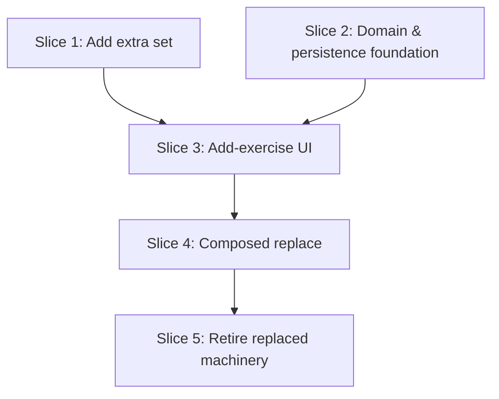

# Plan: In-Session Exercise & Set Additions (and Replace)

**Created**: 2026-06-19
**Branch**: master
**Status**: approved
**Spec**: docs/specs/in-session-exercise-and-set-additions.md

## Goal

Open the live session to three structural additions while keeping the frozen plan snapshot immutable: (1) add an exercise that wasn't in today's plan — carrying its own inline planned data, blocked from duplicating any library movement already in the session (re-doing one is done on its existing card via Resume or Add set); (2) log an extra set beyond an exercise's planned quota; (3) replace an exercise, recast as a composition of "terminate the original (end/skip)" + "add a new exercise." The dormant `ReplacedState` / `SubstituteExercise` / `ExerciseOutcome.replaced` machinery is retired in the final slice, once composed replace is shipping. Added exercises and extra sets are recorded as actual work alongside the snapshot, never folded into it.

## Approach stances (high-reversal-cost axes)

- **Replace-vs-merge (replace machinery):** **Replace** the dormant `ReplacedState`/`SubstituteExercise` model with a generalized inline-plan carrier (`AddedExercisePlan`). The two concepts overlap fully; keeping both permanently would mean a parallel mechanism plus dead code. CLAUDE.md fenced this code as "don't touch without the user" — the user has explicitly authorized its retirement.
- **Sequencing of the retirement:** Retirement is deferred to the **last** slice (Slice 5), after composed replace already ships (Slice 4). `ReplacedState` stays dormant-but-readable through Slices 1–4 (the new `EffectiveExercises` carries an inline-plan branch *alongside* the existing replaced branch), so every intermediate slice compiles and stays green and there is **no window where replace is removed but not rebuilt**.
- **Migrate-vs-edit-stub (legacy `replaced` rows):** **Migrate** defensively, in Slice 5 only. A Drift migration converts any residual `replaced` row to (skipped original + added exercise). Given the v6→v7 full wipe and the absent write path this is realistically a no-op, but it's authored and tested so the post-retirement read path never sees a `replaced` discriminator.
- **New column vs reuse:** **Add a new nullable `added_plan_json` column**, read unconditionally (independent of state discriminator). Reusing the state-gated `substitute_payload_json` would either collide with live `replaced` rows during Slices 1–4 or silently null out an added plan once the exercise leaves `unfinished`. The new column sidesteps both.
- **Snapshot-id for added rows:** `plannedExerciseIdInSnapshot` stays non-null / 36-char (no schema change). Added rows store a **synthetic UUIDv4** there; it is never resolved because `EffectiveExercises` branches on the inline plan first.
- **Format fidelity (snapshot):** **Exact.** `SessionSnapshot.sha256Hash` is never recomputed or changed by any operation here.
- **Scope:** Add-exercise and replace land on `workout_overview` only (the structural surface). Add-extra-set lands on `workout_overview`. `focus_mode` is out of scope for all three (it reads added exercises through the shared resolver but offers no add/replace/extra-set controls). Editing an added exercise's inline plan after creation is out of scope (fine-tune via the existing inline ± editor while logging).
- **Auto-merge-vs-direct:** Direct — normal branch + PR at the end; no auto-merge.

## Acceptance Criteria

- [ ] AC1 — Add a library-linked exercise from the live overview; it appears appended, loggable, `UnfinishedState`, with planned rows from its inline plan.
- [ ] AC2 — Add a one-off (unlinked) exercise the same way; never blocked by the dedup guard.
- [ ] AC3 — Logging on an added exercise auto-completes at its inline quota and derives completed/partial/skipped identically to a planned exercise.
- [ ] AC4 — `addExercise` with a `libraryExerciseId` matching **any** session exercise (any state) is rejected with a domain error and writes nothing; the picker excludes it. One-off adds always allowed.
- [ ] AC4b — A skipped/ended exercise can be **resumed** to `UnfinishedState`, retaining logged sets (the re-do path for skipped/ended); a completed exercise re-does via Add set (AC6). Resume doesn't change the snapshot.
- [ ] AC5 — Adding an exercise does not change `session.snapshot.sha256Hash`.
- [ ] AC6 — On a `completed` exercise the user can log an extra set; the exercise still reads completed and the extra set appears as a row beyond the planned rows.
- [ ] AC7 — Extra sets never alter the planned quota or snapshot; they render in session review and plain-text export as work beyond plan.
- [ ] AC8 — Replacing terminates the original (partial if sets logged, skipped if none) and adds a new exercise in one user action.
- [ ] AC9 — Replace is atomic: a fault while writing the second half leaves the session unchanged (no orphan, no terminated-without-replacement).
- [ ] AC10 — The dedup guard applies to the replacement movement, excluding the original being replaced from its own block-set.
- [ ] AC11 — No "Replaced" badge/outcome appears anywhere (live card, review, history tile, export).
- [ ] AC12 — `ReplacedState`, `SubstituteExercise`, `ExerciseOutcome.replaced` removed; `tool/check_offline_imports.sh` and `tool/ci.sh` pass.
- [ ] AC13 — Historical sessions (snapshot-only exercises) load/render identically before and after the change; completed-session outcomes don't change retroactively in a misrepresenting way.
- [ ] AC14 — `schema_versions.dart` bumped + migrations present; `test/integration/` covers add-exercise → extra set → replace → end, plus the legacy-`replaced` retirement path.
- [ ] AC15 — `product-context.md` updated for the new add-exercise / add-set features and the reworked replace.

## Slices

> Wave 1 runs Slices 1 and 2 in parallel (disjoint files: Slice 1 is overview-UI + export-render; Slice 2 is domain + persistence). Slice 1 ships the cheapest user value (extra set) first and needs no new domain. Slices 3–5 are linear because they all edit the shared overview UI files.

### Slice 1: Add an extra set beyond plan

**Depends-on:** none
**Files:** `mobile/lib/modules/workout_overview/bloc/workout_overview_event.dart`, `mobile/lib/modules/workout_overview/bloc/workout_overview_bloc.dart`, `mobile/lib/modules/workout_overview/widgets/exercise_card.dart`, `mobile/lib/modules/workout_overview/services/exercise_view_model_assembler.dart`, `mobile/lib/modules/domain/services/session_export_formatter.dart`, `mobile/lib/modules/export/widgets/session_detail_exercise_card.dart`, `mobile/test/modules/workout_overview/bloc/workout_overview_extra_set_test.dart`, `mobile/test/modules/workout_overview/services/exercise_view_model_assembler_extra_set_test.dart`, `mobile/test/domain/services/session_export_formatter_extra_set_test.dart`, `product-context.md`

> Reuses the existing `engine.completeSet` (which already permits logging past the planned quota on a completed exercise) — **no domain/engine change**, so this slice's files stay disjoint from Slice 2's.

**Behavior:**

```gherkin
Feature: Log an extra set beyond plan

  Background:
    Given the live overview of an in-progress session is open

  Scenario: Add an extra set to a completed exercise
    Given an exercise whose planned sets are all logged and reads completed
    When the lifter chooses "Add set" and logs it
    Then an additional set row appears beyond the planned rows
    And the exercise still reads completed

  Scenario: Add-set is unavailable on a skipped exercise
    Given an exercise that was skipped with no sets logged
    Then no "Add set" action is offered on it

  Scenario: Add-set is unavailable after the session is ended
    Given the session has been ended
    Then no "Add set" action is offered on any exercise

  Scenario: Extra set is excluded from the planned quota
    Given an exercise planned for 3 sets with 3 logged (completed)
    When a 4th set is logged
    Then the planned summary still shows 3 planned sets
    And the session snapshot content hash is unchanged

  Scenario: Extra set renders in review and plain-text export
    Given a finished session where an exercise logged one set beyond its plan
    When the session review and the plain-text export are produced
    Then the extra set is shown as logged work beyond the planned rows
```

**Steps:**

#### Step 1.1: Extra-set bloc event routed to `completeSet`
**Complexity**: standard
**RED**: Bloc test (plain `test()` + fake engine/repo): a `WorkoutOverviewExtraSetRequested` on a completed exercise issues `engine.completeSet` (seeding suggested values from the last set), the exercise stays completed, and a row beyond the planned count appears; the handler no-ops when the session is ended.
**GREEN**: Add the event + handler reusing the existing `_runMutation(engine.completeSet)` path; seed values via `engine.suggestValuesFor`.
**REFACTOR**: None needed.
**Files**: `workout_overview_event.dart`, `workout_overview_bloc.dart`
**Commit**: `feat(overview): extra-set bloc event via completeSet`

#### Step 1.2: "Add set" affordance + beyond-plan row rendering
**Complexity**: standard
**RED**: Assembler test: an exercise with `executed > planned` renders the extra rows beyond the planned rows and flags them as beyond-plan; a skipped (0-set) exercise and an ended session expose no add-set affordance.
**GREEN**: Add an "Add set" item to the card's kebab menu (respecting the "card surface reserved for LOG SET" principle — extra-set is a secondary action), shown on completed/loggable non-skipped exercises while the session is live; dispatch Step 1.1's event. Confirm extra rows render distinctly. Verify widgets by inspection.
**REFACTOR**: None needed.
**Files**: `exercise_card.dart`, `exercise_view_model_assembler.dart`
**Commit**: `feat(overview): add-set kebab action and beyond-plan rows`

#### Step 1.3: Extra sets in review + plain-text export
**Complexity**: standard
**RED**: Export-formatter test: a session-exercise with `executed > planned` lists every logged set (including the beyond-plan ones) in the plain-text export; session-review card test confirms the extra row renders.
**GREEN**: Adjust `session_export_formatter` and `session_detail_exercise_card` only if they currently truncate at the planned count (the overview assembler already uses `max(executed, planned)`); otherwise add the missing rendering.
**REFACTOR**: None needed.
**Files**: `session_export_formatter.dart`, `session_detail_exercise_card.dart`
**Commit**: `feat(export): render extra sets beyond plan in review and export`

#### Step 1.4: Update product-context for add-set
**Complexity**: trivial
**GREEN**: Note the explicit "extra set beyond plan" affordance in the Workout-overview section and that completed exercises stay completed.
**Files**: `product-context.md`
**Commit**: `docs(product): describe logging extra sets beyond plan`

### Slice 2: Domain & persistence foundation — added-exercise carrier + `addExercise`

**Depends-on:** none
**Files:** `mobile/lib/modules/domain/models/added_exercise_plan.dart`, `mobile/lib/modules/domain/models/session_exercise.dart`, `mobile/lib/modules/domain/services/effective_exercises.dart`, `mobile/lib/modules/domain/services/session_flow_engine.dart`, `mobile/lib/modules/domain/repositories/session_repository.dart`, `mobile/lib/modules/domain/domain.dart`, `mobile/lib/core/schema_versions.dart`, `mobile/lib/modules/persistence/database/tables.dart`, `mobile/lib/modules/persistence/database/migrations.dart`, `mobile/lib/modules/persistence/repositories/drift_session_repository.dart`, `mobile/lib/modules/persistence/mappers/session_mapper.dart`, `mobile/test/support/fake_session_repository.dart`, `mobile/test/domain/models/added_exercise_plan_test.dart`, `mobile/test/domain/services/effective_exercises_added_test.dart`, `mobile/test/domain/services/session_history_added_test.dart`, `mobile/test/domain/services/session_flow_engine_add_exercise_test.dart`, `mobile/test/domain/services/session_flow_engine_resume_test.dart`, `mobile/test/integration/add_exercise_test.dart`, `mobile/test/integration/resume_exercise_test.dart`

> Does **not** touch `ReplacedState`, `SubstituteExercise`, `ExerciseOutcome`, or any UI/export render file — those stay dormant-but-readable until Slice 5. `EffectiveExercises` gains an inline-plan branch *in front of* the existing replaced branch.

**Behavior:**

```gherkin
Feature: Add an exercise to an ongoing session (domain)

  Background:
    Given an in-progress session seeded from a planned day
    And the session snapshot has a known content hash

  Scenario: Add a library-linked exercise as unplanned work
    When an exercise linked to a library movement not yet in the session is added
      with a name, measurement type, planned values, and a set count of 3
    Then a new exercise appears at the end of the session in an unfinished state
    And it offers 3 planned sets to log against
    And the session snapshot content hash is unchanged

  Scenario: Add a one-off exercise with no library link
    When a one-off exercise with no library link is added
    Then it appears as a new unfinished exercise
    And it is loggable like any other exercise

  Scenario: Added exercise auto-completes at its inline quota
    Given an added exercise with a set count of 2
    When two sets are logged on it
    Then it reads as completed

  Scenario Outline: Reject adding a movement already in the session (any state)
    Given a library movement is present in the session as <state>
    When an exercise with the same library movement is added
    Then the add is rejected with a validation error
    And no new exercise is created

    Examples:
      | state               |
      | an unfinished exercise |
      | a completed exercise   |
      | a skipped exercise     |
      | an ended-early exercise|

  Scenario: One-off adds are never deduplicated
    Given a one-off exercise named "Cable Thing" is already in the session
    When another one-off exercise named "Cable Thing" is added
    Then it is accepted as a separate exercise

  Scenario: Resume a skipped exercise
    Given an exercise that was skipped with no sets logged
    When it is resumed
    Then it returns to an unfinished state with no logged sets
    And it is loggable from its first planned set

  Scenario: Resume an ended-early exercise retains its sets
    Given an exercise planned for 4 sets that was ended after 2 logged sets
    When it is resumed
    Then it returns to an unfinished state
    And its 2 logged sets are retained
    And it is loggable from its third planned set

  Scenario: Resuming a non-skipped exercise is rejected
    Given an exercise that is unfinished
    When it is resumed
    Then the resume is rejected with a domain error
    And the exercise's state is unchanged

  Scenario: Resuming a superset member keeps its superset tag
    Given a superset of two exercises where one was skipped and the other completed
    When the skipped member is resumed
    Then it returns to an unfinished state
    And it still shares the same superset tag as its co-member

  Scenario: A pre-existing snapshot-only session is unaffected
    Given a session whose exercises all resolve from the snapshot
    When its loggable targets and display data are computed
    Then they are identical to the behavior before added-exercise support
```

**Steps:**

#### Step 2.1: `AddedExercisePlan` model
**Complexity**: standard
**RED**: Test construction + validation (setCount ≥ 1, measurementType↔plannedValues match, libraryExerciseId UUIDv4-or-null) + JSON round-trip, mirroring `SubstituteExercise`'s rules.
**GREEN**: Add `added_exercise_plan.dart` (freezed `._()` validation + non-const factory + fromJson); export from `domain.dart`; codegen (`dart run build_runner build --force-jit`).
**REFACTOR**: None needed.
**Files**: `added_exercise_plan.dart`, `domain.dart`
**Commit**: `feat(domain): add AddedExercisePlan inline-plan carrier`

#### Step 2.2: `SessionExercise.addedPlan` + inline-aware `EffectiveExercises` (replaced branch preserved)
**Complexity**: complex
**RED**: Tests: (a) a `SessionExercise` with `addedPlan` set resolves name/measurementType/setCount/plannedValues from `addedPlan` and `plannedGroupRole == main`, with **no** snapshot entry and no `NotFoundError`; (b) a snapshot-backed exercise still resolves from the snapshot; (c) a `ReplacedState` exercise still resolves its substitute (regression — branch order: addedPlan → replaced → snapshot); (d) **every** production `EffectiveExercises` consumer behaves correctly for an added exercise — the full set verified by grep is: `SessionFlowEngine` (`computeOpenTargets`, `isSessionComplete`, `suggestValuesFor`, `completeSet`, `updateExecutedSet`), `SessionHistory.completedExerciseCount` (feeds day-picker / recent-sessions summaries), `DriftSessionRepository._effectiveForRow`, and the overview + focus assemblers.
**GREEN**: Add nullable `addedPlan` to `SessionExercise` (codegen); branch `EffectiveExercises.forSessionExercise` on `addedPlan != null` first, falling through to the existing replaced/snapshot logic. For an added exercise, `EffectiveExercise.plannedExercise` is synthesized from the inline plan so the existing instance getters (`effectiveMeasurementType`, `plannedSetCount`, `displayName`, `plannedValuesAt`) keep working without each needing a third branch. Rewrite **both** doc comments that assert "planned exercise always present" (the `EffectiveExercises` class doc and `EffectiveExercise.plannedExercise`'s getter doc) — that invariant no longer holds for added exercises.
**REFACTOR**: Extract the resolution branches into a single readable switch.
**Files**: `session_exercise.dart`, `effective_exercises.dart`, `mobile/test/domain/services/session_history_added_test.dart`
**Commit**: `feat(domain): carry inline plan on SessionExercise, resolve it in EffectiveExercises`

#### Step 2.3: `SessionFlowEngine.addExercise` + any-state dedup guard (engine, via fake)
**Complexity**: complex
**RED**: Engine tests against `FakeSessionRepository`: add library/one-off → appended unfinished exercise carrying the inline plan; dedup **rejects** a library-id match against **any** session exercise regardless of state (unfinished/completed/skipped/ended) with a `ValidationError` and writes nothing; one-off (null library id) never deduped; snapshot hash unchanged; returns a fresh `SessionState`. An optional `excludeSessionExerciseId` parameter (used by replace) drops one exercise from the block-set.
**GREEN**: Implement `engine.addExercise({required sessionId, required AddedExercisePlan plan, String? excludeSessionExerciseId})`; the dedup predicate resolves each session-exercise's `libraryExerciseId` via the inline-aware `EffectiveExercises` (added rows → `addedPlan.libraryExerciseId`, snapshot rows → `plannedExercise.libraryExerciseId`) so it never crashes on a snapshot-less added row, and matches against all session exercises except any excluded id. A movement seeded twice by the plan still blocks (any match). Add `SessionRepository.addExercise` contract + `FakeSessionRepository` impl (append at end, unfinished, synthetic snapshot id).
**REFACTOR**: Factor the dedup predicate into a small private helper reused by replace (Slice 4).
**Files**: `session_flow_engine.dart`, `session_repository.dart`, `fake_session_repository.dart`, `session_flow_engine_add_exercise_test.dart`
**Commit**: `feat(domain): SessionFlowEngine.addExercise with any-state dedup guard`

#### Step 2.4: Drift `addExercise` impl + new `added_plan_json` column + schema bump
**Complexity**: complex
**RED**: Persistence integration tests (`makeInMemoryDatabase()`): `addExercise` inserts a row at `maxPosition + gap` with a synthetic 36-char `plannedExerciseIdInSnapshot`, the plan in `added_plan_json`, unfinished, snapshot untouched; the row round-trips through `session_mapper` into a `SessionExercise` whose `addedPlan` rehydrates **regardless of state** (assert it survives a transition to `completed`); logging it persists executed sets; a pre-bump DB upgrades by adding the column (no data loss).
**GREEN**: Add nullable `added_plan_json` to `tables.dart`; `addColumn` migration + `SchemaVersions` bump (Drift + domain); implement `DriftSessionRepository.addExercise`; map `addedPlan` ⇄ `added_plan_json` in `session_mapper` **read unconditionally** (not gated on `stateDiscriminator`).
**REFACTOR**: Extract a shared "append session-exercise at max position + gap" helper.
**Files**: `tables.dart`, `migrations.dart`, `schema_versions.dart`, `drift_session_repository.dart`, `session_mapper.dart`, `add_exercise_test.dart`
**Commit**: `feat(persistence): persist added exercises via added_plan_json column`

#### Step 2.5: `resumeExercise` (skipped/ended → unfinished)
**Complexity**: standard
**RED**: Engine tests (fake) + integration: `resumeExercise(sessionExerciseId)` reverts a `SkippedState` exercise to `UnfinishedState` retaining its logged sets and its position/superset membership; a true-skip (0 sets) becomes loggable from set 1, an ended-early (2/4) from set 3; resuming a non-skipped exercise throws `OrderingError`; resuming a skipped superset member keeps its `supersetTag` (a superset with a mix of completed and unfinished members is already a valid mid-session state — no special handling); snapshot unchanged; returns a fresh `SessionState`.
**GREEN**: Add `engine.resumeExercise` (inverse of `skipExercise`, asserts current state is `SkippedState`); add `SessionRepository.resumeExercise` + `FakeSessionRepository` + `DriftSessionRepository` impls (single-row state write, `supersetTag`/position untouched). No new `computeOpenTargets`/outcome branch is needed — a resumed exercise re-enters the existing `UnfinishedState` path under quota.
**REFACTOR**: None needed.
**Files**: `session_flow_engine.dart`, `session_repository.dart`, `fake_session_repository.dart`, `drift_session_repository.dart`, `mobile/test/domain/services/session_flow_engine_resume_test.dart`, `mobile/test/integration/resume_exercise_test.dart`
**Commit**: `feat(domain): resumeExercise reverts a skipped/ended exercise to unfinished`

### Slice 3: Overview UI — add an exercise (library picker + one-off + plan config)

**Depends-on:** 1, 2
**Files:** `mobile/lib/modules/workout_overview/bloc/workout_overview_event.dart`, `mobile/lib/modules/workout_overview/bloc/workout_overview_bloc.dart`, `mobile/lib/modules/workout_overview/services/exercise_view_model_assembler.dart`, `mobile/lib/modules/workout_overview/widgets/add_exercise_sheet.dart`, `mobile/lib/modules/workout_overview/services/add_exercise_plan_builder.dart`, `mobile/lib/modules/workout_overview/widgets/workout_overview_loaded_body.dart`, `mobile/lib/modules/workout_overview/widgets/exercise_card.dart`, `mobile/test/modules/workout_overview/bloc/workout_overview_add_exercise_test.dart`, `mobile/test/modules/workout_overview/bloc/workout_overview_resume_test.dart`, `mobile/test/modules/workout_overview/services/add_exercise_plan_builder_test.dart`, `mobile/test/modules/workout_overview/services/exercise_view_model_assembler_added_test.dart`, `product-context.md`

**UX decisions (resolving the UX review):**
- **Entry point:** a labelled `+ Add exercise` button at the **foot of the exercise list** (≥56 dp tall, `actionLabel`), in the loaded body — screen-level, discoverable, doesn't crowd the cards. Hidden once the session is ended.
- **Re-doing a movement already present** is never an add: a skipped/ended card offers **Resume**, a completed card offers **Add set** — both as the **first item below the divider** in the card kebab (a single consistent "re-do" slot; the two are mutually exclusive by state so never both appear). These are the only ways to do more of a movement already in the session.
- **Flow:** reuse `LibraryPickerSheet.show` (existing). Movements already in the session (any state) are shown as **disabled rows** tagged "Already in this session — resume or add a set from its card" rather than silently removed, so a lifter who skipped Squat and looks for it understands *why* it's not selectable instead of assuming it's missing. Then a **focused plan-config sheet** (the movement is already chosen, so it shows only: set-count stepper, planned-value steppers, and — for one-offs — a measurement-type selector + name). Defaults are seeded (set count 3; planned values from `engine.suggestValuesFor` / the movement's last-logged where available, else placeholder, never a forced 0). Steppers 64 dp, confirm ≥56 dp. Fine-tuning per-set happens later via the existing inline ± editor while logging, so the sheet stays light.
- **Cancel/back:** backing out of the config sheet returns to the picker (re-pick a movement); backing out of the picker closes the flow. `addExercise` fires only on the explicit confirm — no add on dismiss.
- **Error text:** if the guard still rejects (race / bypass), the transient banner reads `"<Movement name> is already in this session"`.

**Behavior:**

```gherkin
Feature: Add an exercise from the live overview

  Background:
    Given the live overview of an in-progress session is open

  Scenario: Add a library movement
    When the lifter taps "Add exercise", picks a library movement,
      and confirms 3 planned sets at a chosen weight and reps
    Then a new exercise card appears at the end of the list
    And its first set is ready to log

  Scenario: Add a one-off movement
    When the lifter taps "Add exercise", chooses to create a one-off,
      and enters a name, measurement type, and planned sets
    Then a new exercise card appears and is loggable

  Scenario: A movement already in the session shows as disabled in the picker
    Given a library movement is already present in the session in any state
    When the lifter opens the add-exercise picker
    Then that movement appears as a disabled row explaining it is already in the session

  Scenario: A completed movement is re-done via Add set, not the picker
    Given a library movement was completed earlier in the session
    When the lifter opens the add-exercise picker
    Then that movement appears disabled
    And the completed card offers "Add set"

  Scenario: A skipped or ended movement is re-done via Resume
    Given a library movement was skipped or ended early earlier in the session
    When the lifter opens that card's menu
    Then it offers "Resume"
    And choosing it returns the card to an in-progress, loggable state

  Scenario: Resume is not offered on completed or in-progress cards
    Given a completed exercise and an in-progress exercise
    When the lifter opens each card's menu
    Then neither offers "Resume"

  Scenario: Guard violation surfaces as a named transient error
    Given a movement that entered the session after the picker was opened
    When the add is attempted for that movement
    Then a dismissible banner names the conflicting movement
    And no card is added

  Scenario: Adding is unavailable after the session is ended
    Given the session has been ended
    Then the "Add exercise" action is not shown
```

**Steps:**

#### Step 3.1: Picker pre-filter + plan-builder (pure logic)
**Complexity**: standard
**RED**: (a) Pre-filter test: given a session, compute the set of `libraryExerciseId`s to exclude — **every** library-linked exercise present, regardless of state; one-offs (null id) contribute nothing; an optional `excludeSessionExerciseId` (for replace) drops one. (b) Plan-builder test: a `LibraryPickerSelected` maps to an `AddedExercisePlan` (name/measurementType/libraryExerciseId/metadata from the entry; planned values + set count from the config inputs); a one-off maps name + chosen measurement type; validation rejects empty name / setCount < 1.
**GREEN**: Add `add_exercise_plan_builder.dart` (pure mapping + the exclude-set computation).
**REFACTOR**: None needed.
**Files**: `add_exercise_plan_builder.dart`
**Commit**: `feat(overview): add-exercise plan builder and picker exclude-set`

#### Step 3.2: `WorkoutOverviewAddExerciseRequested` event → engine
**Complexity**: standard
**RED**: Bloc test: dispatching the event with an `AddedExercisePlan` runs `_runMutation(engine.addExercise)` and emits a loaded state whose groups include the new card; a guard `DomainError` surfaces as `lastTransientError` (message naming the movement) with no card added; no-op when ended.
**GREEN**: Add the event + handler through the existing `_runMutation` path.
**REFACTOR**: None needed.
**Files**: `workout_overview_event.dart`, `workout_overview_bloc.dart`
**Commit**: `feat(overview): add-exercise bloc event wired to engine`

#### Step 3.3: Assembler renders added exercises from inline plan
**Complexity**: standard
**RED**: Assembler test: an added exercise (no snapshot entry) assembles a view model whose name/planned summary/measurement type/set rows come from `addedPlan`, grouped as a `.single`, with no crash from the missing snapshot entry.
**GREEN**: Confirm `ExerciseViewModelAssembler` sources display data via the inline-aware `EffectiveExercises` (from Slice 2); adjust only if it reads the snapshot directly anywhere.
**REFACTOR**: None needed.
**Files**: `exercise_view_model_assembler.dart`
**Commit**: `feat(overview): render added exercises from their inline plan`

#### Step 3.4: Add-exercise sheet + foot-of-list entry point
**Complexity**: complex
**RED**: Widget-logic seams already covered by Step 3.1/3.2; this step wires them. (Per project convention, the sheet/button widgets are verified by inspection; no widget test.)
**GREEN**: Build `add_exercise_sheet.dart` (library picker pre-filtered via Step 3.1, then the focused plan-config form with seeded defaults and sweaty-hands sizing) and the `+ Add exercise` button in `workout_overview_loaded_body.dart`; dispatch Step 3.2's event with the built plan.
**REFACTOR**: Extract the stepper form if it meaningfully duplicates the exercise-editor steppers.
**Files**: `add_exercise_sheet.dart`, `workout_overview_loaded_body.dart`
**Commit**: `feat(overview): add-exercise sheet with pre-filtered picker and plan config`

#### Step 3.5: Resume affordance on skipped/ended cards
**Complexity**: standard
**RED**: Bloc test: a `WorkoutOverviewResumeRequested` runs `_runMutation(engine.resumeExercise)` and the formerly-skipped card returns loggable; the action is offered only on cards reading skipped/ended (not completed, not unfinished, not when the session is ended).
**GREEN**: Add the event + handler; add a "Resume" item to the card kebab menu on skipped/ended cards (sits beside the existing terminal/menu items). Verify the widget by inspection.
**REFACTOR**: None needed.
**Files**: `workout_overview_event.dart`, `workout_overview_bloc.dart`, `exercise_card.dart`, `mobile/test/modules/workout_overview/bloc/workout_overview_resume_test.dart`
**Commit**: `feat(overview): Resume action on skipped/ended cards`

#### Step 3.6: Update product-context for add-exercise + resume
**Complexity**: trivial
**GREEN**: Describe adding an exercise mid-session (library/one-off, a movement already in the session can't be added again, recorded as unplanned actual work) and that a skipped/ended movement is resumed (not re-added) in the Workout-overview section.
**Files**: `product-context.md`
**Commit**: `docs(product): describe adding exercises and resuming mid-session`

### Slice 4: Replace as composed terminate + add

**Depends-on:** 3
**Files:** `mobile/lib/modules/domain/services/session_flow_engine.dart`, `mobile/lib/modules/domain/repositories/session_repository.dart`, `mobile/lib/modules/persistence/repositories/drift_session_repository.dart`, `mobile/test/support/fake_session_repository.dart`, `mobile/lib/modules/workout_overview/bloc/workout_overview_event.dart`, `mobile/lib/modules/workout_overview/bloc/workout_overview_bloc.dart`, `mobile/lib/modules/workout_overview/widgets/exercise_card.dart`, `mobile/lib/modules/workout_overview/widgets/add_exercise_sheet.dart`, `mobile/test/domain/services/session_flow_engine_replace_test.dart`, `mobile/test/integration/replace_flow_test.dart`, `mobile/test/modules/workout_overview/bloc/workout_overview_replace_test.dart`, `product-context.md`

> Composed replace **does not** use `ReplacedState` — it terminates the original (skip) and adds a new exercise. After this slice `ReplacedState` is fully dead code (no producer), removed in Slice 5. The old substitute-parameter `replaceExercise` signature is rewritten here to the composed contract.
> **UX:** "Replace" is a per-card **kebab menu** item on unfinished/non-terminal cards; it opens the Slice 3 add-exercise sheet with a header `"Replacing: <original name>"` and the same dedup pre-filter — except the original being replaced is **excluded from its own block-set** (it is about to be terminated, so re-picking its own movement as the replacement is allowed). The original card finishes in its terminal (partial/skipped) state; a new added-exercise card takes its place.

**Behavior:**

```gherkin
Feature: Replace an exercise

  Background:
    Given the live overview of an in-progress session is open

  Scenario: Replace an exercise that had no sets
    Given an unfinished exercise with no sets logged
    When the lifter replaces it with a chosen movement and plan
    Then the original reads as skipped
    And a new exercise for the chosen movement appears, ready to log

  Scenario: Replace an exercise that had partial work
    Given an exercise with some but not all sets logged
    When the lifter replaces it
    Then the original reads as partial and keeps its logged sets
    And a new exercise appears in its place

  Scenario: Replacement is rejected before any change for a duplicate of another exercise
    Given a library movement is already present as another exercise in the session
    When the lifter tries to replace a different exercise with that movement
    Then the replacement is rejected with a named dismissible error
    And the original exercise is left unchanged
    And no new exercise is created

  Scenario: Replacing an exercise with its own movement is allowed
    Given an unfinished exercise for a library movement
    When the lifter replaces it with the same movement (a fresh plan)
    Then the replacement is accepted
    And the original is terminated and a new card for that movement appears

  Scenario: Replace rolls back fully when the add write faults
    Given a replace whose add-write will fault inside the transaction
    When the replace is attempted
    Then the original exercise is not terminated
    And no new exercise is created

  Scenario: No "Replaced" label on the live card
    Given an exercise was replaced
    When its original card is viewed
    Then it shows skipped or partial and never a "Replaced" badge
```

**Steps:**

#### Step 4.1: Composed `replaceExercise` — engine validation + atomic repo transaction
**Complexity**: complex
**RED**: (a) Engine test (fake): `replaceExercise({sessionExerciseId, AddedExercisePlan plan})` skips the original and adds the new exercise; original derives skipped (0 sets) / partial (some sets); the dedup guard (reused helper from Slice 2, with `excludeSessionExerciseId` set to the original) **rejects up front** a replacement duplicating any movement already in the session other than the original being replaced — original unchanged, nothing written. (b) Integration test (real Drift): force the add-write to fault mid-transaction via a test subclass of `DriftSessionRepository` that throws after the skip-update statement executes but before commit — assert the whole transaction rolls back, so the original is **not** skipped and no row is added (true atomicity, distinct from the pre-check rejection in (a)).
**GREEN**: Add `engine.replaceExercise` composing the dedup pre-check + terminate + add; change `SessionRepository.replaceExercise` to `({sessionExerciseId, AddedExercisePlan plan})` performing the skip-update and the added-row insert in **one** Drift transaction; implement in fake + Drift; delete the old substitute-parameter signature.
**REFACTOR**: Reuse the Slice 2 dedup + append-position helpers.
**Files**: `session_flow_engine.dart`, `session_repository.dart`, `drift_session_repository.dart`, `fake_session_repository.dart`, `session_flow_engine_replace_test.dart`, `replace_flow_test.dart`
**Commit**: `feat(domain): replaceExercise as atomic terminate + add`

#### Step 4.2: Overview replace action wired through bloc
**Complexity**: standard
**RED**: Bloc test: a `WorkoutOverviewReplaceRequested` (carrying the original id + built `AddedExercisePlan`) runs `engine.replaceExercise`; success yields the terminal-original + new-card pair; a guard error surfaces transiently (named) with the original unchanged; no-op when ended.
**GREEN**: Add the event + handler; add a "Replace" kebab item on unfinished/non-terminal cards that opens the Slice 3 sheet (with the `Replacing: <name>` header + dedup pre-filter) and dispatches the event.
**REFACTOR**: None needed.
**Files**: `workout_overview_event.dart`, `workout_overview_bloc.dart`, `exercise_card.dart`, `add_exercise_sheet.dart`
**Commit**: `feat(overview): replace exercise via composed terminate + add`

#### Step 4.3: Update product-context for replace
**Complexity**: trivial
**GREEN**: Recast replace in `product-context.md` as "end the original + add a new exercise," no Replaced badge.
**Files**: `product-context.md`
**Commit**: `docs(product): recast replace as terminate + add`

### Slice 5: Retire the replaced/substitute machinery + legacy migration

**Depends-on:** 4
**Files:** `mobile/lib/modules/domain/models/exercise_state.dart`, `mobile/lib/modules/domain/models/substitute_exercise.dart`, `mobile/lib/modules/domain/services/exercise_outcome.dart`, `mobile/lib/modules/domain/services/effective_exercises.dart`, `mobile/lib/modules/domain/services/exercise_state_transitions.dart`, `mobile/lib/modules/domain/services/exercise_progress_aggregator.dart`, `mobile/lib/modules/domain/services/session_export_formatter.dart`, `mobile/lib/modules/domain/services/session_flow_engine.dart`, `mobile/lib/modules/persistence/mappers/session_mapper.dart`, `mobile/lib/modules/persistence/repositories/drift_session_repository.dart`, `mobile/lib/modules/persistence/database/migrations.dart`, `mobile/lib/core/schema_versions.dart`, `mobile/lib/modules/export/widgets/session_detail_exercise_card.dart`, `mobile/lib/modules/focus_mode/services/focus_mode_assembler.dart`, `mobile/lib/modules/focus_mode/widgets/focus_panel_header.dart`, `mobile/lib/modules/workout_overview/models/exercise_view_model.dart`, `mobile/lib/modules/workout_overview/services/exercise_view_model_assembler.dart`, `mobile/lib/modules/workout_overview/widgets/exercise_card.dart`, `mobile/lib/modules/workout_overview/widgets/group_with_picker_dialog.dart`, `mobile/lib/core/app_colors.dart`, `mobile/test/persistence/session_mapper_test.dart`, `mobile/test/support/generators.dart`, `mobile/test/integration/replaced_retirement_migration_test.dart`, `product-context.md`
**Also touches (tests/goldens, not collision-relevant):** `mobile/test/domain/**`, `mobile/test/serialization/**` (including deleting `test/serialization/golden/exercise_state_replaced.json`), and `substitute_exercise.dart`'s generated `.freezed.dart`/`.g.dart` parts.

**Behavior:**

```gherkin
Feature: Retire the replaced state

  Scenario: No replaced outcome exists anywhere
    Given a session-exercise that was ended after partial logging
    When its display outcome is derived on the live card, review, and export
    Then the outcome is "partial" and never "replaced"

  Scenario: A legacy replaced row is migrated on open
    Given a stored session-exercise persisted under the old "replaced" state
    When the database is upgraded to the new schema version
    Then the original reads as skipped
    And a separate added exercise carries the former substitute's plan
    And the upgrade completes without error

  Scenario: A database with no replaced rows upgrades cleanly
    Given a stored database containing no "replaced" rows
    When it is upgraded to the new schema version
    Then the upgrade is a no-op and completes without error

  Scenario: The project builds and the import guard passes
    When the offline-import guard and the full test suite run
    Then both pass with the replaced/substitute symbols removed
```

**Steps:**

#### Step 5.1: Legacy `replaced` → skip + added-exercise migration (before symbol removal)
**Complexity**: complex
**RED**: Integration migration test: seed a DB at the pre-bump version with a synthetic `state_discriminator = 'replaced'` row + `substitute_payload_json`; upgrade; assert the original becomes `skipped` and a new added exercise carries the former payload's plan in `added_plan_json`, no error; a DB with zero replaced rows upgrades as a clean no-op.
**GREEN**: Add an `if (from < N)` migration converting residual `replaced` rows (original → `skipped`; insert an added exercise from the payload, synthetic snapshot id); bump `SchemaVersions`; reuse the existing snapshot-walk helpers in `migrations.dart`.
**REFACTOR**: None needed.
**Files**: `migrations.dart`, `schema_versions.dart`, `replaced_retirement_migration_test.dart`
**Commit**: `feat(persistence): migrate legacy replaced rows to skip + added exercise`

#### Step 5.2: Remove the `replaced` read path from persistence + delete `SubstituteExercise`
**Complexity**: complex
**RED**: Update `session_mapper_test` and serialization round-trip/corruption tests: a `replaced` discriminator is no longer a valid stored state; `SubstituteExercise` no longer exists; `added_plan_json` is the only inline-plan carrier read.
**GREEN**: Drop the `'replaced'` case from `_stateForRow`/`session_mapper`; stop reading `substitute_payload_json` (leave the now-unused column in place — SQLite can't cheaply drop it, and the no-compat culture tolerates a dead column); delete `substitute_exercise.dart` + generated parts and the `replaced` union member in `exercise_state.dart`; codegen; delete the `exercise_state_replaced.json` golden and substitute-specific tests.
**REFACTOR**: None needed.
**Files**: `session_mapper.dart`, `drift_session_repository.dart`, `exercise_state.dart`, `substitute_exercise.dart` (delete), `test/serialization/**`, `test/persistence/session_mapper_test.dart`, `test/support/generators.dart`
**Commit**: `refactor(domain): delete SubstituteExercise and the replaced state`

#### Step 5.3: Remove `ExerciseOutcome.replaced` + all replaced render/branch sites
**Complexity**: complex
**RED**: Tests: `ExerciseOutcomes.of` yields completed/partial/skipped only; `EffectiveExercises` resolution is addedPlan → snapshot (replaced branch gone); engine, export formatter, focus assembler, overview assembler, and the cards/dialogs compile and render with no replaced path; progress aggregator and state-transitions tests updated.
**GREEN**: Remove `ExerciseOutcome.replaced` + its precedence branch; remove the replaced branch from `effective_exercises.dart`, `session_flow_engine.dart`, `session_export_formatter.dart`, `focus_mode_assembler.dart`, `focus_panel_header.dart`, `exercise_view_model.dart`, `exercise_view_model_assembler.dart`, `exercise_card.dart`, `group_with_picker_dialog.dart`, `session_detail_exercise_card.dart`, `exercise_state_transitions.dart`, `exercise_progress_aggregator.dart`; remove or leave-unused the `exerciseReplaced` color in `app_colors.dart` (both palettes).
**REFACTOR**: Collapse now-dead switches.
**Files**: (the render/branch files listed above) + their tests
**Commit**: `refactor: remove ExerciseOutcome.replaced and all replaced render branches`

#### Step 5.4: Final sweep — product-context + CI
**Complexity**: trivial
**GREEN**: Remove any lingering "replaced" mentions from `product-context.md` review/export sections; run `tool/ci.sh` + `tool/check_offline_imports.sh` green.
**Files**: `product-context.md`
**Commit**: `docs(product): drop replaced outcome from review/export`

## Parallelization



| Wave | Slices (parallel) |
|------|-------------------|
| 1 | 1, 2 |
| 2 | 3 |
| 3 | 4 |
| 4 | 5 |

Wave 1 runs Slices 1 (overview-UI + export-render) and 2 (domain + persistence) concurrently — their file sets are disjoint, so they build in isolated worktrees without collision. Slices 3–5 are linear because they all edit the shared overview UI files (`workout_overview_bloc.dart`, `exercise_card.dart`, the assembler) and build on each other behaviorally.

## Complexity Classification

Slice 2 and Slice 5 carry the `complex` weight (new abstraction + schema/migration; cross-cutting retirement). Slice 4's composed-replace step is `complex` (atomic transaction). Slices 1 and 3 are mostly `standard` with one `complex` UI step (the add-exercise sheet). Doc steps are `trivial`.

## Pre-PR Quality Gate

- [ ] All tests pass (`tool/ci.sh`)
- [ ] `tool/check_offline_imports.sh` passes
- [ ] Codegen clean (`dart run build_runner build --force-jit`)
- [ ] Linter / analyzer passes
- [ ] `/code-review` passes
- [ ] `product-context.md` updated

## Risks & Open Questions

- **Migration of legacy `replaced` rows** — Mitigated: v6→v7 already wiped domain tables and the write path is gone, so the Slice 5 conversion is realistically a no-op; still authored + tested defensively (Step 5.1), and it runs **before** the symbol removal in the same slice.
- **`EffectiveExercises` blast radius** — Adding the inline-plan branch changes a class whose contract was "snapshot always resolves / missing always throws." Mitigated by Step 2.2 testing every consumer (`computeOpenTargets`, `isSessionComplete`, `suggestValuesFor`, `completeSet`, `updateExecutedSet`, both assemblers) against an added exercise, plus the AC13 "snapshot-only session unchanged" regression scenario.
- **Synthetic snapshot id** — Added rows store a fresh UUIDv4 in `plannedExerciseIdInSnapshot`; safe only as long as `EffectiveExercises` branches on `addedPlan` first and no historical migration walks new rows. Verified in Step 2.4.
- **Add-exercise plan config UX** — A focused sheet with seeded defaults (set count 3; values from `suggestValuesFor`/last-logged) keeps the common path to "confirm"; per-set fine-tuning is deferred to the inline ± editor. If the sheet still feels heavy in practice, promoting the config step to a full screen is a cheap follow-up.
- **Replace name reuse** — `replaceExercise` keeps its name but its contract/semantics change (single update → atomic terminate+add). Documented at the contract; a clearer name is a possible follow-up but not worth the churn now.
- **Dead `substitute_payload_json` column** — Left in place after Slice 5 (SQLite can't cheaply drop a column; the no-compat culture tolerates it). Noted so a future schema rebuild can drop it.
- **Focus mode** — Out of scope for controls, but reads added exercises through the shared resolver; Step 2.2 covers the focus assembler so it doesn't choke on a snapshot-less exercise.

## Plan Review Summary

Five plan-review personas ran. Parallelization approved in iteration 1. Acceptance, Design, UX, and Strategic each flagged blockers in iteration 1; all were addressed in the 5-slice restructure and re-reviewed in iteration 2 (Acceptance/UX/Strategic approved; Design's one remaining blocker — a missing `EffectiveExercises` consumer — was verified by grep and fixed in Step 2.2). Residual warnings/observations carried into build:

**Acceptance (approve):** Step 4.1(b)'s fault-injection vehicle is now named (a `DriftSessionRepository` test subclass that throws after the skip-update, before commit). All six prior blockers traced to concrete scenarios + file ownership.

**Design (blocker fixed):** Step 2.2's consumer enumeration now includes `SessionHistory.completedExerciseCount` and `DriftSessionRepository._effectiveForRow`, and calls for updating both "planned exercise always present" doc comments. Synthetic-UUID snapshot id (no FK; only `{sessionId,position}` is unique) and the new unconditionally-read `added_plan_json` column are sound.

**UX (approve):** Entry point (`+ Add exercise` at list foot), light seeded plan-config sheet, named dedup error, `Replacing: <name>` header, and add-set-in-kebab all resolved. Added: two-sheet cancel/back semantics; replace excludes the original from its own dedup block-set.

**Strategic (approve):** Regression window eliminated (retirement isolated to Slice 5 after replace ships in Slice 4); cheapest value (extra set) ships in Wave 1 parallel with the foundation. Watch items for build: Slice 2 (4 non-trivial steps) and Slice 5 (~20-file retirement fan-out) are the largest — review step-by-step, don't swallow as single commits.

## Build Progress

### Slices (grouped by wave)

#### Wave 1
- [x] Slice 1: Add an extra set beyond plan
  - [x] Step 1.1: Extra-set bloc event routed to completeSet
  - [x] Step 1.2: "Add set" affordance + beyond-plan row rendering
  - [x] Step 1.3: Extra sets in review + plain-text export
  - [x] Step 1.4: Update product-context for add-set
- [x] Slice 2: Domain & persistence foundation — added-exercise carrier + addExercise
  - [x] Step 2.1: AddedExercisePlan model
  - [x] Step 2.2: SessionExercise.addedPlan + inline-aware EffectiveExercises
  - [x] Step 2.3: SessionFlowEngine.addExercise + any-state dedup guard
  - [x] Step 2.4: Drift addExercise impl + added_plan_json column + schema bump
  - [x] Step 2.5: resumeExercise (skipped/ended → unfinished)

#### Wave 2
- [ ] Slice 3: Overview UI — add an exercise
  - [x] Step 3.1: Picker pre-filter + plan-builder (pure logic)
  - [x] Step 3.2: Add-exercise bloc event → engine
  - [ ] Step 3.3: Assembler renders added exercises from inline plan
  - [ ] Step 3.4: Add-exercise sheet + foot-of-list entry point
  - [ ] Step 3.5: Resume affordance on skipped/ended cards
  - [ ] Step 3.6: Update product-context for add-exercise + resume

#### Wave 3
- [ ] Slice 4: Replace as composed terminate + add
  - [ ] Step 4.1: Composed replaceExercise — engine + atomic repo transaction
  - [ ] Step 4.2: Overview replace action wired through bloc
  - [ ] Step 4.3: Update product-context for replace

#### Wave 4
- [ ] Slice 5: Retire the replaced/substitute machinery + legacy migration
  - [ ] Step 5.1: Legacy replaced → skip + added-exercise migration
  - [ ] Step 5.2: Remove replaced read path + delete SubstituteExercise
  - [ ] Step 5.3: Remove ExerciseOutcome.replaced + all replaced render sites
  - [ ] Step 5.4: Final sweep — product-context + CI

### Acceptance Criteria

- [ ] AC1 — Add library-linked exercise; appended, loggable, unfinished, inline planned rows
- [ ] AC2 — Add one-off exercise; never blocked by dedup
- [ ] AC3 — Added exercise auto-completes at inline quota; outcome derived
- [ ] AC4 — Dedup rejects any-state library match; one-off always allowed; picker excludes match
- [ ] AC4b — Skipped/ended exercise can be resumed (retains sets); completed re-does via Add set
- [ ] AC5 — Adding does not change snapshot sha256Hash
- [ ] AC6 — Extra set on completed exercise; stays completed; row beyond plan
- [ ] AC7 — Extra sets don't alter quota/snapshot; render in review + export
- [ ] AC8 — Replace terminates original (partial/skipped) + adds new in one action
- [ ] AC9 — Replace atomic: add-write fault rolls back the whole transaction
- [ ] AC10 — Dedup guard applies to replacement (original excluded from its own block-set)
- [ ] AC11 — No "Replaced" badge/outcome anywhere
- [ ] AC12 — ReplacedState/SubstituteExercise/ExerciseOutcome.replaced removed; CI + import guard green
- [ ] AC13 — Snapshot-only historical sessions render identically; no misrepresenting retroactive change
- [ ] AC14 — schema_versions bumped + migrations; integration covers full flow + legacy retirement path
- [ ] AC15 — product-context.md updated
