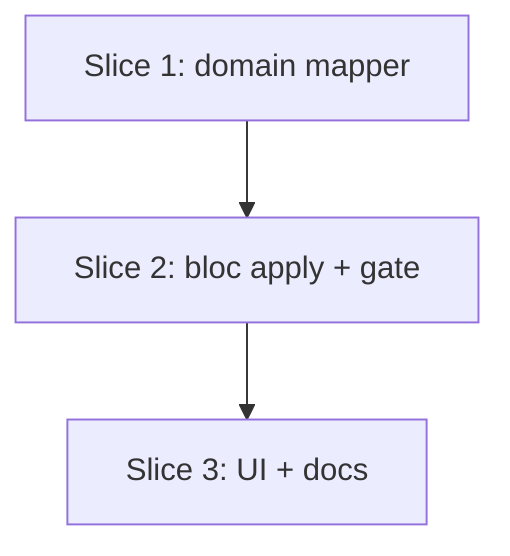

# Plan: Pre-fill Planned Sets from Recent History

**Created**: 2026-06-25
**Branch**: master
**Status**: complete
**Spec**: [docs/specs/prefill-planned-sets-from-history.md](../docs/specs/prefill-planned-sets-from-history.md)

## Goal

Let a lifter carry a movement's prescription forward instead of retyping it. In
the exercise editor, the existing **Recent history** rows (last 5 completed,
non-deload sessions of a linked movement) become tappable; tapping a row replaces
the editor's planned sets with that session's **logged (actual)** values — full
set structure (count + per-set weight/reps). It is an opt-in, reversible recall
affordance, not a silent auto-fill or a recommendation. No schema change.

## Approach stances (high-reversal-cost axes)

- **Replace, not merge.** Applying a row **replaces** the draft's planned sets
  wholesale (set count becomes the logged count). Merging logged sets into
  existing sets would be ambiguous and surprising. Data-loss risk is mitigated by
  the overwrite-confirm gate (only prompts when the draft already holds
  user-entered sets; the just-added blank default is replaced silently).
- **Scope fixed by spec.** Source is *actual* logged performance (not prior
  plan); surface is the exercise editor's recent-history list (tap any row); only
  linked exercises with history. Quick/unlinked exercises and add-time silent
  pre-fill are explicitly out of scope.

## Acceptance Criteria

- [ ] AC1 — Recent-history rows with ≥1 logged actual set are tappable; tapping replaces planned sets with that session's logged sets (full structure).
- [ ] AC2 — Per-set mapping: rep-based→fixed-rep planned; bodyweight→fixed-rep planned; time-based(+weight)→planned hold(+weight). No rep ranges result.
- [ ] AC3 — Resulting planned set count equals the number of logged actual sets in the chosen row.
- [ ] AC4 — A row that logged zero sets ("—") is not tappable / applying is a no-op.
- [ ] AC5 — Applying requires confirmation whenever the draft holds set data; a single **blank** set applies without a prompt. "Blank" is **value-based** (the existing `isBlank` extension), so it covers both the just-added default and a set the user typed then cleared — a blank set has no data to protect.
- [ ] AC6 — Apply mutates the draft only, flips dirty, persists via the existing save path, reversible via the discard guard; no write until save.
- [ ] AC7 — Unlinked exercise or linked-with-no-history shows the existing nudge/empty state; nothing pre-fills.
- [ ] AC8 — Deload sessions are never offered as applyable rows.
- [ ] AC9 — Defensive: if a chosen entry's logged sets are not the exercise's (locked) measurement type, the **whole** apply is a no-op (no partial apply); no crash.
- [ ] AC10 — After adding from the library, the user lands in the editor with rows immediately tappable; the add path itself is unchanged.
- [ ] AC11 — A one-time, per-app-process coach-mark explains the tap-to-pre-fill affordance.
- [ ] AC12 — No schema-version change, no migration; no repository call beyond the `listCompletedSessions()` already used for recent history.
- [ ] AC13 — Mapper + bloc apply/gate logic unit-tested (plain `flutter_test` + `FakeSessionRepository`; no `bloc_test`, no widget tests).
- [ ] AC14 — New/changed UI uses theme tokens; row tap target ≥48 dp; numeric readouts keep `numericSm`.
- [ ] AC15 — PRODUCT.md exercise-editor description updated.
- [ ] AC16 — Each tappable row carries a screen-reader label with its distinguishing info (relative date, logged set count, capped state) plus a "tap to pre-fill planned sets" hint; non-tappable ("—") rows are not announced as actionable.
- [ ] AC17 — Applying a second history entry after a prior apply prompts for confirmation (the draft is no longer a single blank set).

## Slices

### Slice 1: Actual→Planned set mapper (domain)

**Depends-on:** none
**Files:** `lib/modules/domain/services/actual_to_planned_sets.dart`, `lib/modules/domain/domain.dart`, `test/domain/services/actual_to_planned_sets_test.dart`

**Behavior:**

```gherkin
Feature: Convert logged sets into a planned prescription

  Scenario: a logged rep-based set becomes a fixed-rep planned set
    Given a logged set of 100 kg for 5 reps
    When it is converted to a planned set
    Then the planned set targets 100 kg at a fixed 5 reps

  Scenario: a logged bodyweight set becomes a fixed-rep planned set
    Given a logged bodyweight set of 12 reps
    When it is converted to a planned set
    Then the planned set targets a fixed 12 reps with no weight

  Scenario: a logged timed set with weight becomes a planned hold with weight
    Given a logged set held 45 seconds at 20 kg
    When it is converted to a planned set
    Then the planned set targets a 45-second hold at 20 kg

  Scenario: a logged timed set without weight becomes a planned hold without weight
    Given a logged set held 60 seconds with no weight
    When it is converted to a planned set
    Then the planned set targets a 60-second hold with no weight

  Scenario: set order is preserved
    Given an ordered list of logged sets
    When the list is converted
    Then the planned sets appear in the same order, one per logged set

  Scenario: an empty list yields an empty prescription
    Given no logged sets
    When the list is converted
    Then the result is an empty list of planned sets
```

**Steps:**

#### Step 1.1: Mapper + list conversion

**Complexity**: standard
**RED**: Write `actual_to_planned_sets_test.dart` covering all six scenarios — single-set mapping for each `ActualSetValues` variant (rep-based, bodyweight, time-based ±weight), order preservation, empty list.
**GREEN**: Add `abstract final class ActualToPlannedSets` with `static PlannedSetValues fromActual(ActualSetValues)` and `static List<PlannedSetValues> fromActuals(List<ActualSetValues>)`. Rep counts → `RepTargetFixed`; weights/durations pass through. Export from the `domain` barrel.
**REFACTOR**: None expected (small pure function).
**Files**: `lib/modules/domain/services/actual_to_planned_sets.dart`, `lib/modules/domain/domain.dart`, `test/domain/services/actual_to_planned_sets_test.dart`
**Commit**: `feat(domain): map logged actual sets to a planned prescription`

### Slice 2: Apply handler + overwrite gate (exercise-editor bloc)

**Depends-on:** 1
**Files:** `lib/modules/program_management/bloc/exercise_editor/exercise_editor_event.dart`, `lib/modules/program_management/bloc/exercise_editor/exercise_editor_state.dart`, `lib/modules/program_management/bloc/exercise_editor/exercise_editor_bloc.dart`, `lib/modules/program_management/models/program_editor_draft.dart`, `test/modules/program_management/bloc/exercise_editor/exercise_editor_prefill_test.dart`

**Behavior:**

```gherkin
Feature: Apply a recent session's logged sets to the planned sets

  Background:
    Given the exercise editor is open on a linked movement
    And the draft holds only the single blank default set

  Scenario: applying a recent session replaces the planned sets with its logged sets
    Given a recent session that logged 100x5, 100x5, 100x4
    When that history entry is applied
    Then the planned sets become 100x5, 100x5, 100x4 in order
    And there are exactly three planned sets

  Scenario: a session with more logged sets than planned fills all logged sets
    Given a recent session that logged four sets
    When that history entry is applied
    Then there are exactly four planned sets

  Scenario: a session with fewer logged sets than planned fills only the logged sets
    Given a recent session that logged two of three planned sets
    When that history entry is applied
    Then there are exactly two planned sets

  Scenario: a history entry that logged no sets is a no-op
    Given a recent session that logged zero sets of the movement
    When that history entry is applied
    Then the planned sets are unchanged

  Scenario: applying over user-entered sets asks first
    Given the draft holds set data the user has entered
    When a history entry is applied
    Then a confirmation is required before any change and the planned sets are unchanged

  Scenario: a set typed then cleared back to blank applies without a prompt
    Given the draft is a single set the user typed into and then cleared back to blank
    When a history entry is applied
    Then the planned sets are replaced without a confirmation

  Scenario: confirming the pending apply replaces the planned sets
    Given the draft holds set data and a history entry has been applied pending confirmation
    When the pending apply is confirmed
    Then the planned sets are replaced and the pending confirmation clears

  Scenario: dismissing the pending apply changes nothing
    Given the draft holds set data and a history entry has been applied pending confirmation
    When the pending apply is dismissed
    Then the planned sets are unchanged and the pending confirmation clears

  Scenario: applying a second entry after a prior apply asks first
    Given a history entry was applied to a previously-blank draft and confirmed
    When a different history entry is applied
    Then a confirmation is required before the second replace

  Scenario: applying marks the editor dirty and does not persist
    Given a draft that is a single blank set
    When a history entry is applied
    Then the editor is dirty
    And no save has occurred until the user saves

  Scenario: discarding after an apply reverts to the pre-apply draft
    Given a history entry was applied to the draft
    When the editor is discarded without saving
    Then the draft reverts to its pre-apply state

  Scenario: a deload session is never an applyable entry (existing contract)
    Given completed history that includes a deload session of the movement
    When the editor loads its recent history
    Then the deload session is not among the applyable rows

  Scenario: an entry whose logged sets are a different measurement type is a no-op
    Given a history entry whose logged sets are not the exercise's measurement type
    When that entry is applied
    Then the whole apply is a no-op and the planned sets are unchanged
```

**Steps:**

#### Step 2.1: Apply event + blank-replace + count/no-op/defensive

**Complexity**: standard
**RED**: In `exercise_editor_prefill_test.dart`, drive a `RecentHistoryEntryApplied(entry)` on a single-blank-set draft and assert: replace with mapped sets (AC1), count matches logged count incl. more/fewer (AC3), zero-logged entry is a no-op (AC4), an entry whose logged sets are a different measurement type is a **whole-row no-op** (AC9 — no partial apply), dirty flips and no persistence (AC6). Add a load-time assertion that a deload session is absent from `recentHistory` (AC8, existing aggregator behavior).
**GREEN**: Add `RecentHistoryEntryApplied(entry)` event. Handler: if `entry`'s logged sets are not the exercise's measurement type → no-op (AC9, whole-row); if the entry logged zero sets → no-op (AC4); else map `entry.actualSets` via `ActualToPlannedSets` and build `PlannedSetDraft`s. When the draft is a single blank set, **replace** `draft.sets`; otherwise defer to the 2.2 confirm gate. Build draft values via a small **extracted** `PlannedSetValues→PlannedSetDraftValues` helper placed near `PlannedSetDraftValues` (in `program_editor_draft.dart`) and called from both `_setToDraft` and this handler — avoid adding a 4th/5th hand-rolled copy of that switch; do **not** touch the day-editor/program-draft copies in this plan.
**REFACTOR**: Express the "single blank set" check as a one-liner over the existing `PlannedSetDraftBlankness.isBlank` extension (`sets.length == 1 && sets.single.isBlank`) — do not redefine blankness from raw input strings.
**Files**: `exercise_editor_event.dart`, `exercise_editor_bloc.dart`, `program_editor_draft.dart`, test
**Commit**: `feat(exercise-editor): apply a logged session's sets to the planned draft`

#### Step 2.2: Overwrite-confirm gate (pending → confirm/dismiss)

**Complexity**: standard
**RED**: Extend the test: applying when the draft holds set data stashes a transient `pendingHistoryApply` and leaves sets unchanged (AC5); a single set typed-then-cleared still counts as blank → applies without pending (AC5 boundary); `RecentHistoryApplyConfirmed` replaces and clears pending; `RecentHistoryApplyDismissed` clears pending leaving sets unchanged; applying a second entry after a prior apply re-gates (the once-blank draft is now non-blank → pending) (AC17).
**GREEN**: Add `pendingHistoryApply` to `ExerciseEditorEditing` as a nullable `CapHistoryEntry?` (freezed-generated, compared by value via `copyWith(... : () => null)` clearing); add `RecentHistoryApplyConfirmed` / `RecentHistoryApplyDismissed` events (no payload — the entry already lives in state). When the draft is **not** a single blank set, stash the entry as pending instead of replacing; confirm applies via the 2.1 path then clears pending; dismiss clears pending. **Why a confirm gate and not just the discard guard:** the lifter can tap-apply and then Save without leaving the screen, which never invokes the discard-changes guard — so the gate is the only thing protecting already-entered set data here.
**REFACTOR**: None expected.
**Files**: `exercise_editor_event.dart`, `exercise_editor_state.dart`, `exercise_editor_bloc.dart`, test
**Commit**: `feat(exercise-editor): confirm before overwriting user-entered sets on pre-fill`

### Slice 3: Tappable rows, confirm dialog, coach-mark, docs (UI)

**Depends-on:** 2
**Files:** `lib/modules/program_management/widgets/recent_set_history_section.dart`, `lib/modules/program_management/screens/exercise_editor_screen.dart`, `PRODUCT.md`

**Behavior:**

```gherkin
Feature: Tap a recent-history row to pre-fill the planned sets

  Scenario: a row with logged sets is tappable and pre-fills
    Given the exercise editor shows a recent-history row with logged sets
    When the lifter taps the row
    Then the editor's planned sets are pre-filled from that session

  Scenario: a row with no logged sets is not tappable
    Given a recent-history row that logged zero sets
    Then the row offers no tap-to-pre-fill affordance

  Scenario: an unlinked exercise offers nothing to pre-fill
    Given the exercise is not linked to a library movement
    Then the editor shows the existing link nudge and no tappable rows

  Scenario: a linked exercise with no history offers nothing to pre-fill
    Given a linked movement that has no completed sessions
    Then the editor shows the existing empty state and no tappable rows

  Scenario: tapping over edited sets asks before replacing
    Given the lifter has already entered planned sets
    And a recent-history row with logged sets is visible
    When they tap that row
    Then a confirmation appears before the sets are replaced

  Scenario: a first-time hint explains the affordance
    Given the recent-history section is shown for the first time this app run
    Then a one-time hint explains that rows can be tapped to pre-fill

  Scenario: added-from-library lands in an editor with tappable rows
    Given the lifter adds a movement from the library that has history
    When they land in the exercise editor
    Then its recent-history rows are immediately tappable
    And the planned sets still start as the single blank default until a row is tapped

  Scenario: a screen reader can tell the rows apart
    Given the recent-history section shows several tappable rows
    Then each row announces its session date, logged set count, and capped state, plus a tap-to-pre-fill hint
```

**Steps:**

#### Step 3.1: Tappable rows + confirm dialog + coach-mark

**Complexity**: standard
**RED**: None automated (UI surface — project scope excludes widget tests; behavior is unit-covered in Slice 2). Verify by inspection against the three checkpoints below.
**GREEN** — three distinct inspection checkpoints:
1. **Tappable rows + affordance.** In `RecentSetHistorySection`, make rows with ≥1 logged actual set tappable (≥48 dp, theme tokens, `numericSm`) dispatching `RecentHistoryEntryApplied`. Commit to **one** concrete visible cue (trailing chevron + ripple); zero-logged ("—") rows stay non-interactive and uncued. Set each tappable row's `Semantics` label to its distinguishing info + hint, e.g. "Session {relativeDate}, {N} sets logged{, session capped}. Tap to pre-fill planned sets." (AC16) — spell out "session capped" rather than a bare "capped", since the screen-reader user never saw the ▲ glyph; non-tappable rows carry no tap semantics.
2. **Confirm dialog.** In `exercise_editor_screen.dart`, react to `pendingHistoryApply` with the existing themed confirm dialog — concrete copy: title "Replace planned sets?", body "This replaces your current planned sets with what you logged on {date}.", confirm "Replace", cancel "Keep editing" (confirm → `RecentHistoryApplyConfirmed`, cancel → `RecentHistoryApplyDismissed`).
3. **Coach-mark.** One-time per-app-process coach-mark (`static bool`, matching existing screens) that fires the **first time the section renders with at least one tappable row** (not after the first tap), explaining rows can be tapped to pre-fill.
**REFACTOR**: None expected.
**Files**: `recent_set_history_section.dart`, `exercise_editor_screen.dart`
**Commit**: `feat(exercise-editor): tap recent-history rows to pre-fill planned sets`

#### Step 3.2: Update PRODUCT.md

**Complexity**: trivial
**RED**: None.
**GREEN**: Update the exercise-editor "Recent history" description in PRODUCT.md to note rows can be tapped to pre-fill the planned sets from that session's logged values.
**REFACTOR**: None.
**Files**: `PRODUCT.md`
**Commit**: `docs(product): note tap-to-pre-fill on the exercise editor's recent history`

## Parallelization

Linear chain — each slice builds on the prior layer (domain → bloc → UI). No
parallel waves, no same-wave file collisions.



| Wave | Slices (parallel) |
|------|-------------------|
| 1 | 1 |
| 2 | 2 |
| 3 | 3 |

## Complexity Classification

All implementation steps are `standard` (new pure function, new bloc
events/handler within existing patterns, UI wiring within existing widgets);
3.2 is `trivial` (doc-only). No `complex` steps.

## Pre-PR Quality Gate

- [ ] All tests pass (`tool/ci.sh`)
- [ ] `tool/check_offline_imports.sh` passes (layer boundaries)
- [ ] Codegen up to date (`dart run build_runner build --force-jit`) — freezed state/event changes
- [ ] Format + analyze clean
- [ ] `/code-review` passes
- [ ] PRODUCT.md updated (Step 3.2)

## Risks & Open Questions

- **Confirm-gate surface area.** The overwrite gate adds a transient state field + two events. Mitigation: keeps AC5 fully unit-testable at the bloc level and matches the project's bloc-test scope (transient/optimistic state). Accepted.
- **AC8 (deloads) is existing behavior**, not new code — covered by a confirming load-time assertion in Slice 2 (the aggregator already excludes `isDeload`). If that ever changes, this feature would need an explicit filter.
- **UI not auto-tested.** Per project conventions (no widget tests), Slice 3's tap/dialog/coach-mark are verified by inspection; the behavior they trigger is unit-tested in Slice 2.

## Plan Review Summary

**Plan tier: complex — reviewers: Acceptance, Design, UX, Strategic, Parallelization.** Dispatched as five independent sub-agents at the `medium` band (`claude-sonnet-4-6`). First pass: 3 approve (Design, Strategic, Parallelization), 2 needs-revision (Acceptance, UX). Three blockers fixed below; the plan was then revised and the two flagging reviewers' concerns addressed.

**Blockers (fixed):**
- **AC5 ambiguity (Acceptance).** "Pristine/blank" was undefined at the value-vs-provenance boundary. Resolved: blankness is **value-based** via the existing `isBlank` extension (`sets.length == 1 && sets.single.isBlank`) — a blank set has no data to protect, so applying over it (freshly-added *or* typed-then-cleared) is non-destructive; confirmation fires whenever any set holds data. Added the edit-then-revert scenario.
- **AC9 contradiction (Acceptance).** Step 2.1 said "filters" (partial-apply) while AC9 prose implied reject. Resolved: **whole-row no-op** on measurement-type mismatch (a single session's logged sets are all one locked type, so mixed rows can't occur).
- **A11y (UX).** Generic "tap to pre-fill" repeated per row is unusable by screen reader. Resolved: AC16 + Step 3.1 now require each tappable row's `Semantics` label to carry its date, logged set count, and capped state plus the hint.

**Warnings folded in:** extract a single `PlannedSetValues→PlannedSetDraftValues` helper (avoid a 4th/5th copy; don't touch the divergent day-editor/program-draft copies) and compose the blank check on the existing `isBlank` extension (Design); concrete confirm-dialog copy, one committed affordance cue, and coach-mark-on-first-render (UX); `pendingHistoryApply` typed `CapHistoryEntry?` with payload-less confirm/dismiss events, self-contained scenario Givens, and added re-apply (AC17) / discard-reverts / add-from-library-still-blank scenarios (Acceptance); a one-line justification for the confirm gate over the discard guard (Strategic).

**Per-reviewer verdicts:**
- **Acceptance Test Critic — needs-revision → addressed.** 2 blockers (AC5, AC9) + warnings on scenario isolation, re-apply coverage, and step-reuse clarity — all incorporated.
- **Design & Architecture Critic — approve.** Clean layering; reuses already-loaded `CapHistory` (no new repo call). Warnings: this is the 4th near-identical planned↔draft conversion (extract, don't re-copy) and the blank check should compose on `isBlank` — both folded in.
- **UX Critic — needs-revision → addressed.** 1 blocker (per-row screen-reader semantics) + warnings on dialog copy and affordance commitment — all incorporated.
- **Strategic Critic — approve.** Scope small and reversible; respects the human-fixed source/UX decisions. Noted AC11/AC14 are hygiene (kept as ACs for traceability) and asked the gate-vs-discard question (now answered in Step 2.2).
- **Parallelization Critic — approve.** Fully sequential (3 single-slice waves), empty collisions — nothing to parallelize.

## Build Progress

### Slices (grouped by wave)

#### Wave 1
- [x] Slice 1: Actual→Planned set mapper (domain)
  - [x] Step 1.1: Mapper + list conversion

#### Wave 2
- [x] Slice 2: Apply handler + overwrite gate (exercise-editor bloc)
  - [x] Step 2.1: Apply event + pristine-replace + count/no-op/defensive
  - [x] Step 2.2: Overwrite-confirm gate (pending → confirm/dismiss)

#### Wave 3
- [x] Slice 3: Tappable rows, confirm dialog, coach-mark, docs (UI)
  - [x] Step 3.1: Tappable rows + confirm dialog + coach-mark
  - [x] Step 3.2: Update PRODUCT.md

### Acceptance Criteria

- [x] AC1 — Rows with logged sets tappable; tap replaces planned sets (full structure)
- [x] AC2 — Per-set actual→planned mapping; no rep ranges
- [x] AC3 — Planned set count equals logged count
- [x] AC4 — Zero-logged row not tappable / no-op
- [x] AC5 — Confirm before overwriting edited sets; blank default applies silently
- [x] AC6 — Draft-only mutation, dirty, reversible, no write until save
- [x] AC7 — Unlinked / no-history shows existing nudge/empty state
- [x] AC8 — Deloads never offered as applyable rows
- [x] AC9 — Defensive measurement-type mismatch not applied; no crash
- [x] AC10 — Added-from-library lands in editor with tappable rows; add path unchanged
- [x] AC11 — One-time per-app-process coach-mark
- [x] AC12 — No schema/migration; no extra repository call
- [x] AC13 — Mapper + bloc apply/gate unit-tested
- [x] AC14 — Theme tokens; ≥48 dp; numericSm
- [x] AC15 — PRODUCT.md updated
- [x] AC16 — Per-row screen-reader label (date, set count, capped) + tap-to-pre-fill hint; "—" rows not actionable
- [x] AC17 — Applying a second entry after a prior apply prompts for confirmation
