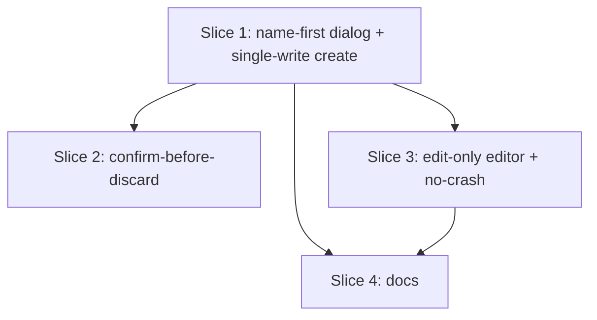

# Plan: Reliable program creation (name-first)

**Created**: 2026-06-29
**Branch**: master
**Status**: approved
**Spec**: docs/specs/reliable-program-creation.md
**Approval**: Approved by user (interactive) on 2026-06-29 — "approve and build". GitHub-issue prompt skipped (user opted straight to build).

## Goal

Replace the program editor's silent per-keystroke auto-save creation — which races
concurrent inserts into duplicate programs (`A`, `AS`, `ASDF`) and then crashes on a
follow-up edit/back via an uncaught `StateError` — with an explicit **name-first
creation dialog**. The user names the program (required) before it exists, the program
is written exactly once through `ProgramRepository.createProgram`, and the editor only
ever operates on an already-saved program (edit mode, non-null `programId`). Editor
persistence is hardened so no save failure can crash the app. This makes a non-empty
program name mandatory at creation and eliminates both the duplicate-program defect and
the back-navigation crash.

## Approach stance

- **Scope:** fix the program-*creation* flow only. Edit-mode auto-save, exercise/set
  editing, sessions, and the existing "empty program / empty day allowed" behavior are
  unchanged — emptiness is permitted, it just must not crash (per spec Ambiguity Log).
- **Migrate-vs-edit-stub:** the editor's create-mode branch (`_onOpened` null-id path,
  `_persistCreate`, `isCreateMode`) is **removed**, not left as a parallel path — keeping
  a second reachable creation path is exactly what produced the bug. It is first made
  *unreachable* (Slice 1 rewires entry points) and then *deleted* (Slice 3), so trunk
  stays releasable between the two.
- **Single-writer:** creation is one `createProgram` call in `ProgramListBloc`; editor
  mutations are serialized (sequential transformer) as defense-in-depth.

## Acceptance Criteria

- [ ] AC1 — Creating a program named `ASDF` yields exactly one program named `ASDF`; no partial-name programs are ever created, regardless of typing speed.
- [ ] AC2 — A program cannot be created with an empty/whitespace-only name; Create is blocked until the trimmed name is non-empty and ≤ 100 chars.
- [ ] AC3 — Create program → add empty day → navigate back completes to the list with no crash; any editor save failure surfaces as a non-fatal notice, not an uncaught exception.
- [ ] AC4 — Creation performs exactly one program insert; the editor is never opened in create mode from the list — it always loads an existing program in edit mode.
- [ ] AC5 — Both the Programs `+` action and the empty-state CTA open the name-first dialog; after Create the editor opens for the new (named, empty) program; cancelling creates nothing.
- [ ] AC6 — Dismissing the dialog with a non-empty typed name prompts "Discard new program?"; Discard creates nothing, Keep editing preserves the typed name; an empty field dismisses with no prompt.
- [ ] AC7 — Renaming an existing program and managing its days still work and auto-save; editing never creates a duplicate; tapping an existing day-less program still opens the editor in edit mode.
- [ ] AC8 — PRODUCT.md program-management section reflects name-first creation.

## Slices

### Slice 1: Name-first creation dialog + single-write creation

**Depends-on:** none
**Files:** `lib/modules/program_management/widgets/new_program_dialog.dart`, `lib/modules/program_management/bloc/program_list/program_list_event.dart`, `lib/modules/program_management/bloc/program_list/program_list_state.dart`, `lib/modules/program_management/bloc/program_list/program_list_bloc.dart`, `lib/modules/program_management/screens/program_list_screen.dart`, `test/modules/program_management/bloc/program_list/program_list_create_test.dart`

**Behavior:**

```gherkin
Feature: Create a program by name

  Scenario: Name a program and create it
    Given the programs list is open
    When the user starts a new program, enters the name "Push Pull Legs", and confirms
    Then exactly one program named "Push Pull Legs" exists
    And the program editor opens for that program with no workout days

  Scenario: A blank name cannot create a program
    Given the new-program dialog is open
    When the name field is empty or only whitespace
    Then the create action is unavailable
    And confirming creates no program

  Scenario: Fast typing never creates duplicates
    Given the user is creating a program
    When they type the name "ASDF"
    And they confirm once
    Then exactly one program named "ASDF" exists
    And no programs named "A", "AS", or "ASD" exist

  Scenario: A name longer than the limit cannot create a program
    Given the new-program dialog is open
    When the entered name exceeds the 100-character program-name limit
    Then the create action is unavailable

  Scenario: Cancelling the dialog creates nothing
    Given the new-program dialog is open with the name "Draft"
    When the user cancels
    Then no program is created
    And the programs list is unchanged
```

**Steps:**

#### Step 1.1: Program-name create-validity is a pure, reused rule

**Complexity**: trivial
**RED**: Assert the create-name validity rule (reuse `ProgramDraftValidation.compute(name, isCreateMode: true).canSave`) is true for `"ASDF"`, false for `""`, `"   "`, and a 101-char string; true for a 100-char string.
**GREEN**: No new logic if `ProgramDraftValidation` already covers it; otherwise expose a thin `ProgramNameRules.canCreate(name)` wrapper delegating to `ProgramRules.programNameMaxLength`.
**REFACTOR**: Ensure the dialog and the bloc both consume this one rule (no duplicated trim/length checks).
**Files**: `test/modules/program_management/bloc/program_list/program_list_create_test.dart` (rule cases), reuse `lib/modules/program_management/bloc/program_editor/program_editor_state.dart`
**Commit**: `test(program): pin program-name create-validity rule`

#### Step 1.2: ProgramListBloc creates exactly one program by name

**Complexity**: standard
**RED**: With a test-local `ProgramRepository` fake (counts `createProgram` calls), dispatch `ProgramCreateRequested(name: "ASDF")`; assert `createProgram` is called exactly once with `"ASDF"`, the reloaded list contains exactly that program, and the loaded state exposes the new program's id for navigation. Dispatch with `""`/`"   "`; assert `createProgram` is never called and no program is created.
**GREEN**: Add `ProgramCreateRequested(name)` event; add a transient `lastCreatedProgramId` to `ProgramListLoaded` (+ `copyWith`/`props`); handler trims, guards via the Step 1.1 rule, calls `createProgram`, reloads, emits loaded with `lastCreatedProgramId`. Failure path catches `DomainError` into a notice (mirror the delete handler).
**REFACTOR**: Share the load/sort helper; keep the handler small.
**Files**: `lib/modules/program_management/bloc/program_list/program_list_event.dart`, `.../program_list_state.dart`, `.../program_list_bloc.dart`, `test/modules/program_management/bloc/program_list/program_list_create_test.dart`
**Commit**: `feat(program-list): single-write create-program event`

#### Step 1.3: Name-first dialog widget

**Complexity**: standard
**RED**: Assert the dialog's Create-enabled state tracks the Step 1.1 rule (enabled only for a valid trimmed name); assert confirming returns the trimmed name and cancelling returns nothing. (Pure controller/predicate-level assertions; widget rendering verified by inspection.)
**GREEN**: Add `NewProgramDialog` (modeled on `AddWorkoutDaySheet._buildEmptyForm`): autofocus required-name `TextField` with `maxLength`, error/disabled until valid, `Create`/`Cancel`; returns the trimmed name via `Navigator.pop`. Tokens only (`AppSpacing`/`appColors`/`AppTypography`), tap target ≥ `touchMin`.
**REFACTOR**: Extract any inline strings; no hard-coded px/colors.
**Files**: `lib/modules/program_management/widgets/new_program_dialog.dart`, test file as above
**Commit**: `feat(program-management): name-first new-program dialog`

#### Step 1.4: Wire list entry points to the dialog and navigate on create

**Complexity**: standard
**RED**: (Bloc-level) assert that after `ProgramCreateRequested` succeeds the loaded state carries `lastCreatedProgramId`, the signal the screen consumes to navigate. (Screen navigation verified by inspection.)
**GREEN**: In `program_list_screen.dart`, point the app-bar `+` and the empty-state CTA at `showDialog(NewProgramDialog)`; on a returned name dispatch `ProgramCreateRequested`; add a `BlocListener` that, when `lastCreatedProgramId` is set, navigates to the editor for that id and refreshes on return. Leave the existing edit/empty-program tap path untouched.
**REFACTOR**: De-dupe the two entry points into one `_startNewProgram()` helper; ensure the navigation signal is consumed once (cleared on the next list load).
**Files**: `lib/modules/program_management/screens/program_list_screen.dart`
**Commit**: `feat(program-list): open name-first dialog from create entry points`

### Slice 2: Confirm before discarding a typed-but-uncreated name

**Depends-on:** 1
**Files:** `lib/modules/program_management/widgets/new_program_dialog.dart`, `test/modules/program_management/widgets/new_program_dialog_discard_test.dart`

**Behavior:**

```gherkin
Feature: Protect a typed-but-uncreated program name

  Scenario: Dismissing with typed text asks before discarding
    Given the new-program dialog has the name "Push day" typed
    When the user attempts to dismiss it without creating
    Then a "Discard new program?" confirmation is shown

  Scenario: Keep editing preserves the typed name
    Given the discard confirmation is shown
    When the user chooses "Keep editing"
    Then the dialog stays open with "Push day" still in the field

  Scenario: Discard abandons creation
    Given the discard confirmation is shown
    When the user chooses "Discard"
    Then the dialog closes and no program is created

  Scenario: An empty field dismisses with no prompt
    Given the new-program dialog has an empty name field
    When the user dismisses it
    Then it closes immediately with no confirmation and no program created
```

**Steps:**

#### Step 2.1: Pure discard-confirmation predicate

**Complexity**: trivial
**RED**: Assert `shouldConfirmDiscard(name)` is true for `"Push day"` / `"  x "`, false for `""` / `"   "`.
**GREEN**: Add a top-level `shouldConfirmDiscard(String) => name.trim().isNotEmpty` in the dialog file.
**REFACTOR**: None needed.
**Files**: `lib/modules/program_management/widgets/new_program_dialog.dart`, `test/modules/program_management/widgets/new_program_dialog_discard_test.dart`
**Commit**: `test(program-management): discard-confirmation predicate`

#### Step 2.2: Gate dialog dismissal on the predicate

**Complexity**: standard
**RED**: Predicate cases from 2.1 stand in for the gate's decision (the `PopScope`/`AppConfirmDialog` wiring is verified by inspection).
**GREEN**: Wrap the dialog in `PopScope` (and route Cancel through the same path); when `shouldConfirmDiscard` is true, show `AppConfirmDialog` titled "Discard new program?" (Discard destructive → pop; Keep editing → stay); empty field pops immediately.
**REFACTOR**: Single dismissal path shared by Cancel, system back, and scrim.
**Files**: `lib/modules/program_management/widgets/new_program_dialog.dart`
**Commit**: `feat(program-management): confirm before discarding a typed program name`

### Slice 3: Editor is edit-only and cannot crash on save

**Depends-on:** 1
**Files:** `lib/modules/program_management/bloc/program_editor/program_editor_bloc.dart`, `lib/modules/program_management/bloc/program_editor/program_editor_state.dart`, `lib/modules/program_management/screens/program_editor_screen.dart`, `test/modules/program_management/bloc/program_editor/program_editor_bloc_test.dart`

**Behavior:**

```gherkin
Feature: The program editor only edits an existing program

  Scenario: Editor loads an existing program in edit mode
    Given a saved program with no workout days
    When the program editor is opened for it
    Then it shows the program's name ready to edit
    And it is not in a create-new mode

  Scenario: Adding a day to a fresh program then leaving does not crash
    Given a freshly created program open in the editor
    When the user adds an empty day and navigates back
    Then the programs list is shown
    And no crash or uncaught error occurs

  Scenario: A save failure is surfaced, not fatal
    Given a program open in the editor
    And the next save will fail
    When the user makes an edit that triggers a save
    Then a non-fatal save-error notice is shown
    And the app does not crash

  Scenario: Rapid edits apply in order without corruption
    Given a program open in the editor
    When several edits are made in quick succession
    Then each is applied against current state in order
    And the persisted program stays internally consistent

  Scenario: Editing an existing program never creates a duplicate
    Given a saved program named "Old"
    When the editor renames it to "New" and adds a workout day
    Then exactly one program exists, named "New", with that day
    And tapping a program that has no days still opens the editor in edit mode
```

**Steps:**

#### Step 3.1: Editor refuses to enter create mode; save failures never crash

**Complexity**: complex
**RED**: With a fake repo, open the editor for an existing program → assert edit mode (`isCreateMode == false`) and name loaded. Rename it and add a day → assert exactly one program (no duplicate insert). Configure a mutation save to throw a **non-`DomainError`** (e.g. `StateError`) → assert the bloc emits `lastSaveError` (or equivalent notice) and does **not** rethrow. Open with a null `programId` → assert a not-found/guard state, never a create draft.
**GREEN**: Remove the `_onOpened` null-id create branch and `_persistCreate`; `_onOpened` requires a `programId` (guard → `ProgramEditorNotFound` otherwise). Make `_persist` always edit-persist and broaden its `catch` so any error becomes `lastSaveError`. Drop now-dead create-mode state (`isCreateMode` always false / removed).
**REFACTOR**: Delete unreachable create-mode code paths and their helpers; keep `_persistEdit` reload logic intact.
**Files**: `.../program_editor_bloc.dart`, `.../program_editor_state.dart`, `.../program_editor_screen.dart`
**Commit**: `fix(program-editor): edit-only editor; save failures are non-fatal`

#### Step 3.2: Serialize editor mutations (single-writer)

**Complexity**: standard
**RED**: Dispatch several mutating events back-to-back against a fake repo whose saves resolve out of order; assert the final persisted/reloaded state reflects all edits applied in dispatch order with a consistent baseline (no "baseline not found").
**GREEN**: Apply a sequential event transformer to the editor's mutating events (`bloc_concurrency`'s `sequential()`, or an equivalent in-bloc single-writer guard if avoiding the dependency).
**REFACTOR**: Apply the transformer uniformly to all mutation events; document the choice in a short comment.
**Files**: `.../program_editor_bloc.dart`, test file as above (`pubspec.yaml` only if `bloc_concurrency` is added)
**Commit**: `fix(program-editor): serialize mutations to a single writer`

### Slice 4: Document the name-first creation flow

**Depends-on:** 1, 3
**Files:** `PRODUCT.md`

**Behavior:**

```gherkin
Feature: Product docs match the shipped creation flow

  Scenario: Program-management section describes name-first creation
    Given PRODUCT.md describes program management
    Then it states that creating a program requires a name up front via a dialog
    And it does not describe an in-editor create-new mode
```

**Steps:**

#### Step 4.1: Update PRODUCT.md program-management bullets

**Complexity**: trivial
**RED**: N/A (docs) — reviewer check: the Program list / Program editor bullets mention name-first creation and no in-editor create mode.
**GREEN**: Edit the "Program list" and "Program editor" bullets to describe the name-first dialog and the edit-only editor.
**REFACTOR**: None needed.
**Files**: `PRODUCT.md`
**Commit**: `docs(product): describe name-first program creation`

## Parallelization



<!-- waves table filled from plan-waves.sh below -->

| Wave | Slices (parallel) |
|------|-------------------|
| 1 | 1 |
| 2 | 2, 3 |
| 3 | 4 |

## Complexity Classification

Per-step ratings are inline above (trivial / standard / complex). Slice 3 Step 3.1 is
`complex` (removes a reachable code path + changes error-handling semantics on the
crash-prone surface); the dialog and bloc create steps are `standard`; the pure rules
and the docs step are `trivial`.

## Pre-PR Quality Gate

- [ ] All tests pass (`tool/ci.sh`)
- [ ] `tool/check_offline_imports.sh` passes (UI → repository contract only)
- [ ] Codegen current (`dart run build_runner build --force-jit`) — freezed `lastCreatedProgramId` / state changes
- [ ] Analyze + format clean
- [ ] `/code-review` passes
- [ ] PRODUCT.md updated (Slice 4)

## Risks & Open Questions

- **Navigation signal lifecycle:** `lastCreatedProgramId` must be consumed exactly once so the editor isn't re-pushed on rebuild — cleared on the next list load; the BlocListener guards against double-fire. Mitigation: bloc test asserts it is set on create; screen consumes once.
- **`bloc_concurrency` dependency (Slice 3.2):** serialization is defense-in-depth (name-first already removes the create race). If adding the dependency is unwanted, use an equivalent in-bloc single-writer guard. Either satisfies the spec's "single-writer" clause.
- **Dead create-mode removal blast radius:** confirm nothing else opens the editor with a null `programId` after Slice 1 (only the `+`/empty-CTA did, both rewired). Mitigation: Slice 3 guards null-id to a not-found state rather than assuming.
- **Freezed regen:** state-shape changes require `--force-jit` codegen; never hand-edit generated files.

## Build Progress

### Slices (grouped by wave)

#### Wave 1
- [x] Slice 1: Name-first creation dialog + single-write creation
  - [x] Step 1.1: Program-name create-validity is a pure, reused rule
  - [x] Step 1.2: ProgramListBloc creates exactly one program by name
  - [x] Step 1.3: Name-first dialog widget
  - [x] Step 1.4: Wire list entry points to the dialog and navigate on create

#### Wave 2
- [ ] Slice 2: Confirm before discarding a typed-but-uncreated name
  - [ ] Step 2.1: Pure discard-confirmation predicate
  - [ ] Step 2.2: Gate dialog dismissal on the predicate
- [ ] Slice 3: Editor is edit-only and cannot crash on save
  - [ ] Step 3.1: Editor refuses to enter create mode; save failures never crash
  - [ ] Step 3.2: Serialize editor mutations (single-writer)

#### Wave 3
- [ ] Slice 4: Document the name-first creation flow
  - [ ] Step 4.1: Update PRODUCT.md program-management bullets

### Acceptance Criteria

- [x] AC1 — Creating "ASDF" yields exactly one program; no partial-name programs
- [x] AC2 — Empty/whitespace/over-limit name cannot create
- [ ] AC3 — Create → add empty day → back: no crash; save failures non-fatal
- [x] AC4 — Exactly one insert; editor never in create mode from the list _(create half; editor-edit-only half lands in Slice 3)_
- [x] AC5 — Both entry points open the dialog; editor opens for the new program; cancel creates nothing
- [ ] AC6 — Typed-name dismissal confirms; empty dismisses silently
- [ ] AC7 — Existing rename/day-management/edit unaffected; no duplicates on edit
- [ ] AC8 — PRODUCT.md reflects name-first creation

## Plan Review Summary

**Plan tier: complex** — reviewers: Acceptance, Design, UX, Strategic, Parallelization.
Conducted **inline** (personas not dispatched as subagents, per the session's spawn
guardrail; available on request). `plan-waves.sh`: no cycles, no same-wave file
collisions.

| Lens | Verdict | Notes |
|------|---------|-------|
| Acceptance Test | approve (after fix) | Gherkin is deterministic and implementation-independent; every AC maps to ≥1 scenario. **Fixed:** AC7 had no dedicated scenario → added an "editing an existing program never creates a duplicate" scenario + RED assertion in Slice 3. |
| Design & Architecture | approve | UI→`ProgramRepository` contract preserved; create-mode removed via expand-then-contract (unreachable in S1, deleted in S3) so trunk stays releasable. Watch: `lastCreatedProgramId` navigation-via-state and reuse of `ProgramDraftValidation` across modules — both acceptable, noted in Risks. |
| UX | approve | Required-name gate, autofocus, discard-confirm only when text typed. Minor: empty-state CTA label should read "Create program" (it now opens the dialog, not an empty editor); ensure the name field's error is announced for screen readers. |
| Strategic | approve | Tightly scoped to creation; S1 already removes the crash trigger, S3 hardens. Good releasable ordering; no scope creep into edit-mode redesign. |
| Parallelization | approve | Wave 2 (Slices 2 & 3) touch disjoint files; `collisions: []`. |
