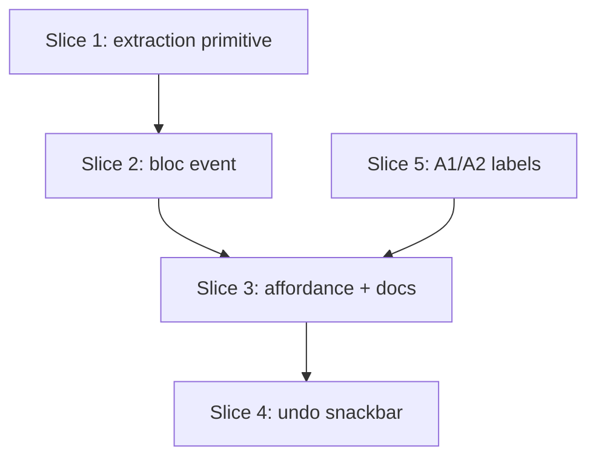

# Plan: Remove Exercise from Superset (Workout Overview)

**Created**: 2026-06-21
**Branch**: master
**Status**: implemented
**Spec**: [docs/specs/remove-exercise-from-superset.md](../docs/specs/remove-exercise-from-superset.md)

## Goal

Add an in-session **Remove from superset** action: a per-member kebab item that
pulls one exercise out of a 3-or-more-member superset (keeping the exercise and
its logged/planned sets) and drops it back into the list as a standalone exercise
positioned **immediately under** the superset, while the remaining members stay
one contiguous superset. The action is hidden for 2-member supersets (where the
header's existing **Ungroup** is the right tool), for finished members, and once
the session has ended. Removal is reversible: no confirmation dialog, plus an
**Undo** snackbar that restores prior membership and position. Superset members
also gain **A1 / A2 / A3…** position labels that renumber live as membership
changes. Scope is the workout-overview in-session surface only; the frozen
snapshot and planned/actual tracking are untouched.

## Approach stances (high-reversal-cost axes — correct at the gate)

- **Migrate vs. edit-stub → new atomic engine/repo primitive.** Add
  `SessionFlowEngine.removeFromSuperset` + `SessionRepository.removeFromSuperset`
  (drift + fake), the exact inverse of the existing atomic `addToSuperset`,
  rather than composing `removeSuperset([id])` + `reorderUnfinished` in the bloc.
  Rationale: clearing a middle member's tag then repositioning in two separate
  transactions leaves a transient **split run** if the second fails; the live
  watch-stream would render two supersets. One transaction avoids that.
- **Scope / gating → offer Remove only on a fully-unfinished superset with ≥ 3
  members.** Confirmed with the user (2026-06-21) and the spec's A1/A3 amended to
  match. The engine precondition is "every member of the group unfinished",
  mirroring `addToSuperset` and the sibling spec's "a group with a finished member
  is a fixed anchor." A partially-finished superset offers only Ungroup. Keeps
  "right under the superset" unambiguous and the gating decision the same across
  the engine (1.2/1.3), the UI predicate (3.2/3.3), and undo (4.1).
- **Undo composition → best-effort re-group, safe by construction.** Undo re-tags
  via `addToSuperset` (itself atomic — re-establishes a contiguous run) then
  restores the captured pre-removal order via `reorderUnfinished`. The asymmetry
  with the atomic forward path is deliberate and *not* a contradiction: the
  forward op's intermediate state (tag cleared on a middle member, not yet
  repositioned) **is** a split run, so it must be one transaction; undo's worst
  failure mode is a *contiguous* superset with imperfect internal member order
  (member appended last instead of restored to the middle) — never a split run.
  A stale session (changed since removal) is caught, leaves the post-removal state
  intact, and surfaces a brief "Couldn't undo — the workout changed" message.
- **Replace vs. merge (A-labels) → additive.** Labels are derived from member
  index at render time (no stored field), so "live renumber" is automatic and
  there is no persistence/migration change.

## Acceptance Criteria

- [ ] Every member of a fully-unfinished superset with ≥ 3 members offers **Remove from superset** in its kebab while the session is live.
- [ ] **Remove from superset** is absent on 2-member supersets, on standalone exercises, on **any** member of a partially-finished superset (a fixed anchor), and after the session has ended.
- [ ] Removing a member clears its superset grouping and re-lists it as a standalone exercise immediately under the superset, with its planned/logged sets and state unchanged.
- [ ] After removing any member (first, middle, or last), the remaining members render as one contiguous superset; non-involved exercises keep relative order and finished exercises keep absolute slots.
- [ ] Ungrouping a 2-member superset splits both into standalone exercises preserving their prior order (unchanged behavior).
- [ ] Removal applies with no confirmation dialog and shows an Undo snackbar; Undo restores the exercise to its original superset and exact prior position; ignoring the snackbar leaves the removal in place.
- [ ] A stale Undo (session changed/ended since removal) fails safely — post-removal state intact, a brief "Couldn't undo" message, never a split run.
- [ ] Superset members display A1/A2/A3… labels (also exposed to assistive tech) that renumber after removal, reorder, or ungroup; standalone exercises show no label.
- [ ] The extraction (tag-clear + reposition) is atomic — verified by a forced mid-transaction failure rolling back to the prior structure; no split run; no schema/migration change.
- [ ] `tool/ci.sh` is green and product-context.md is updated.

## Slices

### Slice 1: Atomic extraction primitive (domain ordering + engine/repo)

**Depends-on:** none
**Files:** `mobile/lib/modules/domain/services/superset_ordering.dart`, `mobile/lib/modules/domain/services/session_flow_engine.dart`, `mobile/lib/modules/domain/repositories/session_repository.dart`, `mobile/lib/modules/persistence/repositories/drift_session_repository.dart`, `mobile/test/support/fake_session_repository.dart`, `mobile/test/domain/services/superset_ordering_test.dart`, `mobile/test/domain/services/session_flow_engine_remove_from_superset_test.dart`, `mobile/test/integration/remove_from_superset_test.dart`

**Behavior:**

```gherkin
Feature: Extract a member from a superset (domain)

  Background:
    Given a live session whose order is "Squat, [Bench, Row, Curl], Plank"
    And "Bench, Row, Curl" form one superset, all unfinished

  Scenario: Extract the middle member, placed right under the group
    When the lifter removes "Row" from the superset
    Then the order becomes "Squat, [Bench, Curl], Row, Plank"
    And "Bench, Curl" remain one contiguous superset
    And "Row" is no longer part of any superset

  Scenario: Extract the first member
    When the lifter removes "Bench" from the superset
    Then the order becomes "Squat, [Row, Curl], Bench, Plank"
    And "Row, Curl" remain one contiguous superset

  Scenario: Extract the last member
    When the lifter removes "Curl" from the superset
    Then the order becomes "Squat, [Bench, Row], Curl, Plank"
    And "Bench, Row" remain one contiguous superset

  Scenario: The extracted exercise keeps its data
    Given "Row" has logged and planned sets
    When the lifter removes "Row" from the superset
    Then "Row" retains its logged sets, planned sets, and state

  Scenario: Refuse extracting an exercise that is not in a superset
    When the lifter tries to remove "Squat" from a superset
    Then the operation is refused and the order is unchanged

  Scenario: Refuse extraction when any group member is finished
    Given "Curl" is finished
    When the lifter tries to remove "Bench" from the superset
    Then the operation is refused and the order is unchanged

  Scenario: Refuse extracting a member that is itself finished
    Given "Bench" is finished
    When the lifter tries to remove "Bench" from the superset
    Then the operation is refused and the order is unchanged

  Scenario: Refuse extraction once the session has ended
    Given the session has ended
    When the lifter tries to remove "Row" from the superset
    Then the operation is refused and the order and grouping are unchanged

  Scenario: Finished exercises outside the group keep their absolute slot
    Given "Squat" and "Plank" are finished
    When the lifter removes "Row" from the superset
    Then "Squat" and "Plank" stay in their original absolute positions
    And only the unfinished sequence is reshuffled

  Scenario: Extraction is atomic
    Given a forced failure injected after the position rewrite but before commit
    When the lifter removes a member
    Then the transaction rolls back
    And the session order and grouping are exactly as before the attempt
```

**Steps:**

#### Step 1.1: `SupersetOrdering.orderForExtract`

**Complexity**: standard
**RED**: In `superset_ordering_test.dart`, add cases asserting that extracting a member from `memberIds` within `unfinishedIds` returns the order with the member removed and reinserted immediately after the last *remaining* member (cover first/middle/last; assert non-members keep relative order). Because the function operates purely over `unfinishedIds`, add an invariant case proving the input/output never contains finished ids — i.e. the caller splices finished exercises back at their absolute slots (covers B5 at the cheapest layer).
**GREEN**: Add `static List<String> orderForExtract({required List<String> unfinishedIds, required List<String> memberIds, required String extractedId})` mirroring `orderForAppend`: drop `extractedId`, reinsert right after the last of `memberIds` excluding `extractedId`.
**REFACTOR**: Share the "remove then insert-after-anchor" shape with `orderForAppend` only if it reads cleaner; otherwise none.
**Files**: `mobile/lib/modules/domain/services/superset_ordering.dart`, `mobile/test/domain/services/superset_ordering_test.dart`
**Commit**: `feat(domain): add SupersetOrdering.orderForExtract`

#### Step 1.2: Engine `removeFromSuperset` + repository contract + fake

**Complexity**: complex
**RED**: In `session_flow_engine_remove_from_superset_test.dart` (with `FakeSessionRepository`), assert: extracting a member returns a `SessionState` where the member's `supersetTag` is null and it sits immediately after the group; the remaining members keep their tag and contiguity; the member's sets/state are preserved. Refusal cases (each leaving order/grouping unchanged): exercise has no tag (`ValidationError`); the target member is itself not unfinished (`OrderingError`); **any other** member of the group is not unfinished (`OrderingError`); the session has ended.
**GREEN**: Add `Future<Session> removeFromSuperset({required String sessionId, required String sessionExerciseId})` to `SessionRepository`; implement a positions-preserving stub in `FakeSessionRepository` (clear tag + apply `orderForExtract` ordering). Add `SessionFlowEngine.removeFromSuperset`: load session, validate (session exists & not ended / exercise exists & unfinished / tag != null / **every** member sharing that tag unfinished), then delegate to the repo and `_buildState`.
**REFACTOR**: Factor shared member-lookup/validation with `addToSuperset`/`removeSuperset` if it reduces duplication; else none.
**Files**: `mobile/lib/modules/domain/services/session_flow_engine.dart`, `mobile/lib/modules/domain/repositories/session_repository.dart`, `mobile/test/support/fake_session_repository.dart`, `mobile/test/domain/services/session_flow_engine_remove_from_superset_test.dart`
**Commit**: `feat(domain): add SessionFlowEngine.removeFromSuperset`

#### Step 1.3: Drift `removeFromSuperset` (atomic two-phase write) + integration test

**Complexity**: complex
**RED**: In `test/integration/remove_from_superset_test.dart` (using `makeInMemoryDatabase()`), seed a 3-member superset and assert end-to-end that removing the middle member yields the contiguous remaining superset + the extracted exercise directly below, positions dense, in a single round-trip; assert the no-tag, finished-member, and ended-session refusals leave rows unchanged. **Atomicity:** add a test that forces an exception mid-transaction (e.g. a test-only seam after the negative-temp position write but before the final write) and asserts the DB still reflects the exact pre-removal positions and tags — proving rollback, the core justification for the new primitive.
**GREEN**: Implement `DriftSessionRepository.removeFromSuperset` mirroring `addToSuperset`: in one `transaction`, compute the new unfinished order via `SupersetOrdering.orderForExtract`, apply the two-phase (negative-temp) position write to dodge the `(session_id, position)` UNIQUE constraint, clear the member's `supersetTag`, bump timestamps, reload.
**REFACTOR (required):** This is the **third** copy of the two-phase negative-temp position write (`createSuperset`, `addToSuperset`, `removeFromSuperset`). Extract a single private helper they all call. Not optional — extract it in this step so the duplication never lands.
**Files**: `mobile/lib/modules/persistence/repositories/drift_session_repository.dart`, `mobile/test/integration/remove_from_superset_test.dart`
**Commit**: `feat(persistence): atomic removeFromSuperset in DriftSessionRepository`

### Slice 2: Bloc event + handler

**Depends-on:** 1
**Files:** `mobile/lib/modules/workout_overview/bloc/workout_overview_event.dart`, `mobile/lib/modules/workout_overview/bloc/workout_overview_bloc.dart`, `mobile/test/modules/workout_overview/bloc/workout_overview_remove_from_superset_test.dart`

**Behavior:**

```gherkin
Feature: Remove-from-superset orchestration (bloc)

  Scenario: Member-removed runs the extraction
    Given a loaded live session with a 3-member superset
    When a remove-from-superset intent for a member is dispatched
    Then the engine extracts that member and the new session state is emitted

  Scenario: Ignored once the session has ended
    Given a loaded session that has ended
    When a remove-from-superset intent is dispatched
    Then no mutation runs and the state is unchanged

  Scenario: Ignored while another mutation is in flight
    Given a mutation is already in flight
    When a remove-from-superset intent is dispatched
    Then it is dropped by the in-flight guard
```

**Steps:**

#### Step 2.1: `WorkoutOverviewSupersetMemberRemoved` event + handler

**Complexity**: standard
**RED**: In `workout_overview_remove_from_superset_test.dart` (plain `test()` + `FakeSessionRepository` + real engine), assert dispatching the new event runs `removeFromSuperset` and emits updated `Loaded` state; asserts the ended-session and in-flight guards drop it.
**GREEN**: Add `WorkoutOverviewSupersetMemberRemoved(String sessionExerciseId)` to the event hierarchy; register `_onSupersetMemberRemoved` which returns early unless `Loaded` and `!isEnded`, then `_runMutation(() => _engine.removeFromSuperset(...), touchedSessionExerciseId: id)`.
**REFACTOR**: None (mirrors `_onResumeRequested`).
**Files**: `mobile/lib/modules/workout_overview/bloc/workout_overview_event.dart`, `mobile/lib/modules/workout_overview/bloc/workout_overview_bloc.dart`, `mobile/test/modules/workout_overview/bloc/workout_overview_remove_from_superset_test.dart`
**Commit**: `feat(workout_overview): bloc event for remove-from-superset`

### Slice 3: Kebab affordance + gating + docs

**Depends-on:** 2, 5
**Files:** `mobile/lib/modules/workout_overview/services/superset_remove_eligibility.dart`, `mobile/lib/modules/workout_overview/widgets/exercise_card.dart`, `mobile/lib/modules/workout_overview/widgets/superset_card.dart`, `mobile/lib/modules/workout_overview/widgets/workout_group_builder.dart`, `mobile/lib/modules/workout_overview/screens/workout_overview_screen.dart`, `mobile/test/modules/workout_overview/services/superset_remove_eligibility_test.dart`, `product-context.md`

**Behavior:**

```gherkin
Feature: Remove-from-superset affordance (workout overview)

  Scenario: Offered on a 3+ member fully-unfinished superset
    Given a live session with an unfinished superset of 3 members
    When the lifter opens any member's action menu
    Then a "Remove from superset" item is shown

  Scenario: Hidden on a 2-member superset
    Given a live session with a 2-member superset
    When the lifter opens a member's action menu
    Then no "Remove from superset" item is shown
    And the header still offers "Ungroup"

  Scenario: Hidden on a partially-finished superset
    Given a live session with a 3-member superset where one member is finished
    When the lifter opens any member's action menu
    Then no "Remove from superset" item is shown
    And the header still offers "Ungroup"

  Scenario: Hidden on a standalone exercise
    Given a live session with a standalone exercise
    When the lifter opens its action menu
    Then no "Remove from superset" item is shown

  Scenario: Hidden once the session has ended
    Given a session that has ended
    When the lifter opens a superset member's action menu
    Then no "Remove from superset" item is shown

  Scenario: Selecting it triggers extraction
    Given a "Remove from superset" item is shown on a member
    When the lifter selects it
    Then that member is pulled out and re-listed directly under the superset

  Scenario: Group shrinking to two removes the affordance
    Given a 3-member superset showing "Remove from superset"
    When the lifter removes one member, leaving two
    Then neither remaining member offers "Remove from superset"
    And the header still offers "Ungroup"
```

**Steps:**

#### Step 3.1: Pure eligibility predicate

**Complexity**: standard
**RED**: In `superset_remove_eligibility_test.dart`, assert a pure predicate is true only when the group is a superset, `members.length >= 3`, every member is unfinished, and the session is live (`canMutate`); false for 2-member, partially-finished, standalone, and ended-session inputs. This is the single tested enforcement point for the confirmed gating rule.
**GREEN**: Add `abstract final class SupersetRemoveEligibility { static bool canRemove({required int memberCount, required bool allUnfinished, required bool canMutate}) => canMutate && allUnfinished && memberCount >= 3; }` (plus a convenience over a `SupersetGroupViewModel`).
**REFACTOR**: None.
**Files**: `mobile/lib/modules/workout_overview/services/superset_remove_eligibility.dart`, `mobile/test/modules/workout_overview/services/superset_remove_eligibility_test.dart`
**Commit**: `feat(workout_overview): pure remove-from-superset eligibility predicate`

#### Step 3.2: Menu item in `ExerciseCard`

**Complexity**: standard
**RED**: N/A automated (widget verified by inspection per CLAUDE.md). Define the contract: new `onRemoveFromSupersetPressed` callback + `_MenuAction.removeFromSuperset`, item shown only when the callback is non-null, rendered adjacent to the "Group into superset…" slot with label "Remove from superset" and icon `Icons.link_off`.
**GREEN**: Add the callback field, enum case, `onSelected` branch, and a gated `PopupMenuItem`; include it in the `hasMenu` predicate.
**REFACTOR**: None.
**Files**: `mobile/lib/modules/workout_overview/widgets/exercise_card.dart`
**Commit**: `feat(workout_overview): ExerciseCard remove-from-superset menu item`

#### Step 3.3: Gated builder in `SupersetCard`

**Complexity**: standard
**RED**: N/A automated. Contract: `SupersetCard` accepts a `memberRemoveBuilder` (per member → `VoidCallback?`) and wires each member card's `onRemoveFromSupersetPressed`; the builder returns a non-null callback for every member only when `SupersetRemoveEligibility.canRemove(...)` holds for the group — otherwise null (item hidden on all members).
**GREEN**: Add the builder field; thread it into each member `ExerciseCard`.
**REFACTOR**: None.
**Files**: `mobile/lib/modules/workout_overview/widgets/superset_card.dart`
**Commit**: `feat(workout_overview): gate remove action via eligibility predicate`

#### Step 3.4: Wire `WorkoutGroupBuilder` → bloc

**Complexity**: standard
**RED**: N/A automated. Contract: `_buildSuperset` passes `memberRemoveBuilder` that, for an eligible group (via `SupersetRemoveEligibility`), returns a callback dispatching `WorkoutOverviewSupersetMemberRemoved(member.id)`.
**GREEN**: Implement the builder alongside the existing `memberMove`/`memberDragHandle` wiring; dispatch through the bloc.
**REFACTOR**: None.
**Files**: `mobile/lib/modules/workout_overview/widgets/workout_group_builder.dart`, `mobile/lib/modules/workout_overview/screens/workout_overview_screen.dart`
**Commit**: `feat(workout_overview): dispatch remove-from-superset from group builder`

#### Step 3.5: Update product-context.md

**Complexity**: trivial
**RED**: None.
**GREEN**: Extend the workout-overview bullet in `product-context.md` to mention removing a single exercise from a superset (placed directly under the group) and the A1/A2 member labels.
**REFACTOR**: None.
**Files**: `product-context.md`
**Commit**: `docs: note remove-from-superset and member labels in product-context`

### Slice 4: No-confirm + Undo snackbar

**Depends-on:** 3
**Files:** `mobile/lib/modules/workout_overview/bloc/workout_overview_event.dart`, `mobile/lib/modules/workout_overview/bloc/workout_overview_bloc.dart`, `mobile/lib/modules/workout_overview/bloc/workout_overview_state.dart`, `mobile/lib/modules/workout_overview/widgets/workout_overview_loaded_body.dart`, `mobile/test/modules/workout_overview/bloc/workout_overview_remove_from_superset_undo_test.dart`

**Behavior:**

```gherkin
Feature: Undo a remove-from-superset

  Scenario: Removal applies without confirmation
    When the lifter selects "Remove from superset"
    Then the member is pulled out immediately with no confirmation dialog
    And an Undo affordance is offered

  Scenario: Undo restores membership and exact position
    Given the lifter removed the middle member of "[Bench, Row, Curl]"
    When the lifter chooses Undo
    Then the superset is restored to "[Bench, Row, Curl]" in the original order

  Scenario: Ignoring the Undo affordance keeps the removal
    Given the lifter removed a member
    When the Undo affordance is dismissed without being chosen
    Then the removal stands and nothing further changes

  Scenario: A second removal supersedes the first Undo
    Given the lifter removed a member and its Undo snackbar is showing
    When the lifter removes another member
    Then the first removal is finalized
    And only the second removal's Undo affordance is shown

  Scenario: Undo fails safely after the workout changed
    Given the lifter removed a member
    And the session changed before Undo was chosen (another mutation, or it ended)
    When the lifter chooses Undo
    Then the post-removal state is left intact, never a split run
    And a brief "Couldn't undo — the workout changed" message is shown
```

**Steps:**

#### Step 4.1: Capture undo payload + undo handler

**Complexity**: complex
**RED**: In `workout_overview_remove_from_superset_undo_test.dart`, assert: after a remove, the bloc exposes a transient "last removal" (member id, original `supersetTag`, captured pre-removal unfinished order); dispatching the undo event re-groups the member and restores the exact prior order; the transient clears after one consumption (a second consumption is a no-op). Enumerate the **stale** conditions and assert each fails safely (post-removal state intact, no split run, a transient error surfaced, not a crash): (a) another member sharing the captured `supersetTag` became finished before Undo was invoked (so the run is no longer re-groupable), (b) the session has ended, (c) another removal happened first (the prior transient was already finalized/superseded).
**GREEN**: Capture the pre-removal `supersetTag` + ordered unfinished ids in `_onSupersetMemberRemoved` before mutating; stash on `WorkoutOverviewLoaded` (transient, equality-excluded one-shot; a new removal replaces/finalizes the prior one). Add `WorkoutOverviewSupersetMemberRemovalUndone` handled via `_runMutation` composing `addToSuperset` then `reorderUnfinished(capturedOrder)`; on a guard/precondition failure, surface a transient error and leave the post-removal state. (Safe by construction: `addToSuperset` is atomic, so even a failed follow-up reorder yields a contiguous run, never a split.)
**REFACTOR**: None.
**Files**: `mobile/lib/modules/workout_overview/bloc/workout_overview_event.dart`, `mobile/lib/modules/workout_overview/bloc/workout_overview_bloc.dart`, `mobile/lib/modules/workout_overview/bloc/workout_overview_state.dart`, `mobile/test/modules/workout_overview/bloc/workout_overview_remove_from_superset_undo_test.dart`
**Commit**: `feat(workout_overview): undo support for remove-from-superset`

#### Step 4.2: Undo snackbar in the loaded body

**Complexity**: standard
**RED**: N/A automated (snackbar verified by inspection). Contract: on a fresh "last removal" the body shows a `SnackBar` ("Removed from superset") with an **Undo** action dispatching the undo event; mirrors `program_editor._showUndoSnackbar` exactly — `clearSnackBars()` before showing so only **one** undo snackbar exists at a time (a second removal replaces it, finalizing the first), and a one-shot guard so it isn't re-shown on rebuild. A stale-undo failure surfaces via the bloc's existing transient-error snackbar path (same channel as the "Could not open video" error) with text "Couldn't undo — the workout changed". No confirmation dialog anywhere in the path.
**GREEN**: Surface the snackbar from `WorkoutOverviewLoadedBody` when the transient removal appears.
**REFACTOR**: None.
**Files**: `mobile/lib/modules/workout_overview/widgets/workout_overview_loaded_body.dart`
**Commit**: `feat(workout_overview): Undo snackbar for remove-from-superset`

### Slice 5: A1/A2 live-renumber member labels

**Depends-on:** none
**Files:** `mobile/lib/modules/workout_overview/services/superset_member_label.dart`, `mobile/lib/modules/workout_overview/widgets/superset_card.dart`, `mobile/lib/modules/workout_overview/widgets/exercise_card.dart`, `mobile/test/modules/workout_overview/services/superset_member_label_test.dart`

**Behavior:**

```gherkin
Feature: Superset member position labels

  Scenario: Members are labelled in order
    Given a superset of "Bench, Row, Curl"
    Then they display "A1", "A2", "A3" respectively

  Scenario: Standalone exercises have no label
    Given a standalone exercise
    Then it displays no superset position label

  Scenario: The position is announced to assistive tech
    Given a superset of "Bench, Row, Curl"
    Then each member exposes a semantics label like "Superset position A1 of 3"

  Scenario: Labels renumber after membership changes
    Given a superset showing "A1, A2, A3"
    When a member is removed, reordered, or the group is ungrouped
    Then the remaining members renumber contiguously from "A1"
```

**Steps:**

#### Step 5.1: Label helper

**Complexity**: trivial
**RED**: In `superset_member_label_test.dart`, assert `SupersetMemberLabel.forIndex(0) == 'A1'`, `forIndex(2) == 'A3'`.
**GREEN**: Add `abstract final class SupersetMemberLabel { static String forIndex(int i) => 'A${i + 1}'; }`.
**REFACTOR**: None.
**Files**: `mobile/lib/modules/workout_overview/services/superset_member_label.dart`, `mobile/test/modules/workout_overview/services/superset_member_label_test.dart`
**Commit**: `feat(workout_overview): superset member label helper`

#### Step 5.2: Render labels on member cards

**Complexity**: standard
**RED**: N/A automated (rendering verified by inspection). Contract: `ExerciseCard` accepts an optional `supersetPositionLabel`; when present it renders near the title using `AppTypography`/`appColors` tokens (mirrors the editor's `supersetPositionLabel`) **and** is exposed to assistive tech via a `Semantics` label ("Superset position A1 of N", N = group size). `SupersetCard` passes `SupersetMemberLabel.forIndex(i)` (and the member count) per member; standalone cards pass none. Because the label is index-derived each build, it renumbers live after any membership change.
**GREEN**: Add the field + render + semantics; thread the label and count from `SupersetCard`'s member loop.
**REFACTOR**: None.
**Files**: `mobile/lib/modules/workout_overview/widgets/superset_card.dart`, `mobile/lib/modules/workout_overview/widgets/exercise_card.dart`
**Commit**: `feat(workout_overview): show live A1/A2 labels on superset members`

## Parallelization



| Wave | Slices (parallel) |
|------|-------------------|
| 1 | 1, 5 |
| 2 | 2 |
| 3 | 3 |
| 4 | 4 |

Wave 1 runs Slice 1 (domain/persistence) and Slice 5 (overview label helper +
member-card rendering) concurrently — disjoint files. Slice 3 depends on Slice 5
as well as Slice 2 because both edit `superset_card.dart`/`exercise_card.dart`;
serializing them avoids a same-wave file collision.

## Complexity Classification

| Step | Rating |
|------|--------|
| 1.1 | standard |
| 1.2 | complex |
| 1.3 | complex |
| 2.1 | standard |
| 3.1 | standard |
| 3.2 | standard |
| 3.3 | standard |
| 3.4 | standard |
| 3.5 | trivial |
| 4.1 | complex |
| 4.2 | standard |
| 5.1 | trivial |
| 5.2 | standard |

## Pre-PR Quality Gate

- [ ] All tests pass (`flutter test`)
- [ ] Codegen current (`dart run build_runner build --force-jit`) — freezed event/state additions
- [ ] `tool/check_offline_imports.sh` passes (no drift/AppDatabase in workout_overview)
- [ ] Linter/analyzer passes (`dart analyze`)
- [ ] `/code-review` passes
- [ ] product-context.md updated

## Incremental delivery

Value lands progressively, not all-or-nothing: **Slices 1–3 are the MVP** — pull a
member out, keep the rest grouped, place it directly below — shippable without
Undo (4) or A-labels (5). Slice 5 is fully decoupled (wave 1) and Slice 4 builds
only on Slice 3, so each can ship as its own follow-up PR if the team wants the
new atomic primitive to bake in production before layering on undo. The plan keeps
them in one effort for coherence, but the slice/wave boundaries make a split clean.

## Risks & Open Questions

- **Gating tightness — RESOLVED (2026-06-21).** User confirmed: Remove is offered
  only when *every* member is unfinished; a partially-finished superset is a fixed
  anchor (Ungroup only). Spec A1/A3 amended to match; engine, UI predicate, and
  undo all share this rule.
- **Undo durability (stance, accepted).** Undo is best-effort for the snackbar
  lifetime (composed `addToSuperset` + `reorderUnfinished`) and not persisted. It
  is **safe by construction**: `addToSuperset` is atomic, so a failed follow-up
  reorder yields a contiguous run with imperfect order — never a split run. A stale
  session is caught and surfaces "Couldn't undo — the workout changed" (criterion D4).
- **Two-phase write duplication — now a required REFACTOR** in Step 1.3 (third
  copy → extract a shared private helper in the same step). Not deferred.
- **No widget tests (project rule).** The eligibility predicate (3.1), engine,
  bloc, and label helper are unit-tested; the menu item (3.2), gated builder (3.3),
  snackbar (4.2), and label rendering (5.2) are verified by inspection — matching
  the project's stated test scope (domain/persistence/pure-UI-logic only).

## Build Progress

### Slices (grouped by wave)

#### Wave 1
- [x] Slice 1: Atomic extraction primitive (domain ordering + engine/repo)
  - [x] Step 1.1: SupersetOrdering.orderForExtract
  - [x] Step 1.2: Engine removeFromSuperset + repository contract + fake
  - [x] Step 1.3: Drift removeFromSuperset (atomic two-phase write) + integration test
- [~] Slice 5: A1/A2 live-renumber member labels — **reverted post-build at user request**
  - [~] Step 5.1: Label helper (deleted)
  - [~] Step 5.2: Render labels on member cards (reverted)

#### Wave 2
- [x] Slice 2: Bloc event + handler
  - [x] Step 2.1: WorkoutOverviewSupersetMemberRemoved event + handler

#### Wave 3
- [x] Slice 3: Kebab affordance + gating + docs
  - [x] Step 3.1: Pure eligibility predicate
  - [x] Step 3.2: Menu item in ExerciseCard
  - [x] Step 3.3: Gated builder in SupersetCard
  - [x] Step 3.4: Wire WorkoutGroupBuilder → bloc
  - [x] Step 3.5: Update product-context.md

#### Wave 4
- [~] Slice 4: No-confirm + Undo snackbar — **Undo reverted post-build at user request** (snackbar cluttered the overview). Removal stays no-confirm/immediate; the undo event, handler, transient state, and snackbar were removed.
  - [~] Step 4.1: Capture undo payload + undo handler (reverted)
  - [~] Step 4.2: Undo snackbar in the loaded body (reverted)

### Acceptance Criteria

- [x] Remove offered on every member of a fully-unfinished ≥3-member superset while live
- [x] Remove absent on 2-member supersets, standalone, partially-finished supersets, ended sessions
- [x] Removing re-lists the member standalone directly under the superset with data/state intact
- [x] Remaining members stay one contiguous superset; others keep order; finished keep slots
- [x] Ungroup on a 2-member superset preserves prior order (unchanged)
- [~] No-confirm removal — kept; **Undo removed post-build at user request** (snackbar clutter)
- [~] Stale Undo fails safely — n/a (Undo removed)
- [~] A1/A2/A3 labels — **removed post-build at user request** (felt unnecessary in-session). Slice 5 (helper, member-card rendering, semantics) and the product-context mention were reverted; the program-editor's own labels are unaffected.
- [ ] Extraction is atomic — forced mid-transaction failure rolls back; no split run; no schema change
- [ ] tool/ci.sh green and product-context.md updated

## Plan Review Summary

Five plan-review personas (sonnet) ran. After one revision iteration, **all five
approve**.

| Reviewer | Round 1 | Round 2 |
|----------|---------|---------|
| Acceptance Test Critic | needs-revision (6 blockers) | **approve** (1 minor warning, since addressed) |
| Design & Architecture Critic | **approve** (2 warnings) | n/a |
| UX Critic | needs-revision (3 warnings) | **approve** |
| Strategic Critic | needs-revision (3 warnings) | **approve** |
| Parallelization Critic | **approve** | n/a |

### Blockers resolved in revision
- **Spec/plan gating contradiction** — user confirmed "whole group must be unfinished"; spec A1/A3 amended; rule propagated identically across engine (1.2), UI predicate (3.1), and undo (4.1).
- **Atomicity untested for mid-write failure** — Step 1.3 adds a forced mid-transaction rollback test (the primitive's core justification).
- **Stale-undo undefined** — added spec D4 + Slice 4 fail-safe scenario + enumerated stale conditions in Step 4.1, with a user-visible "Couldn't undo — the workout changed" message.
- **Missing engine scenarios** — added finished-target refusal, ended-session refusal, and finished-exercises-keep-slots (B5) to Slice 1.
- **Untestable UI gating** — extracted `SupersetRemoveEligibility` as a pure, unit-tested predicate (new Step 3.1); split the bundled "hidden" scenario into four; added the 3→2 shrink scenario.

### Warnings addressed (non-blocking)
- **Undo snackbar stacking** — Step 4.2 mandates `clearSnackBars()`; bloc finalizes/supersedes the prior transient; "second removal supersedes Undo" scenario added.
- **A1/A2 accessibility** — spec E1 + Step 5.2 require a `Semantics` "Superset position A1 of N" announcement.
- **Two-phase-write duplication** — promoted from optional to a **required** refactor in Step 1.3 (third copy → shared helper).
- **Undo asymmetry** — documented as safe-by-construction (`addToSuperset` is atomic → undo failure yields a contiguous run, never a split).
- **Incremental delivery** — added section: Slices 1–3 = shippable MVP; 4 and 5 are independent follow-ups.

### Residual observations (carry into build, non-blocking)
- Design: `SessionRepository` is trending toward a wide interface over many feature additions — worth tracking, not blocking here.
- Acceptance/UX: widget gating, snackbar, and label rendering are inspection-verified per the project's no-widget-test rule; their logic is unit-tested.
