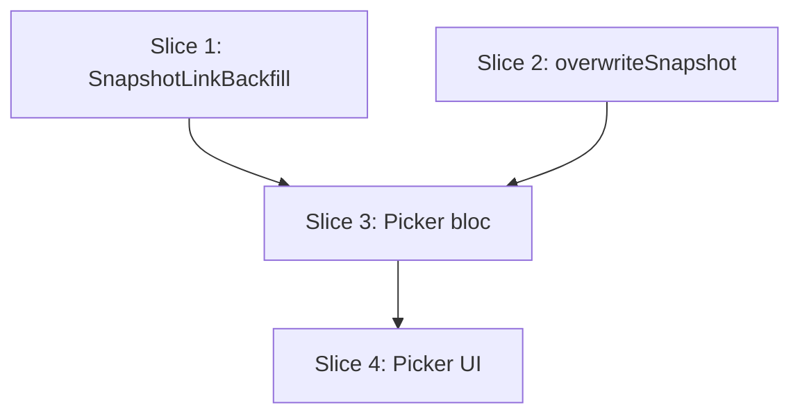

# Plan: Repair Snapshot Library Links (one-shot)

**Created**: 2026-06-17
**Branch**: master
**Status**: implemented

> **Temporary, throwaway feature.** Every file/symbol added by this plan must carry
> `// TEMP: snapshot link repair — remove after one-time run` so the whole thing reverts
> cleanly after the maintainer runs it once. No `product-context.md` change. No schema
> migration, no `SchemaVersions` bump. Spec: `docs/specs/repair-snapshot-library-links.md`.

## Goal

The exercise library was once cleared and every program exercise re-linked to a freshly
named canonical entry. The Recent-history section and the exercise progress trend join
each historical session to a library entry **only** through the `libraryExerciseId` frozen
inside that session's snapshot, so sessions recorded before the clear (stale/`null` link)
silently vanish from history. This plan adds a temporary, maintainer-triggered action on
the workout-day picker that, for the open program, walks every **ended** session's frozen
snapshot and rewrites each exercise's `libraryExerciseId` to the value the **current**
template exercise carries — matched by exercise id, then by unambiguous normalized name
within the same day. The action previews what would change, applies on confirm, is
idempotent, never clears a link, and touches nothing but the snapshot blob.

## Acceptance Criteria

- [ ] A maintainer-visible "Repair history links" action is reachable on the workout-day picker only when a program is loaded.
- [ ] Activating it computes and presents a preview (sessions scanned, exercises to re-link, unmatched + skipped counts) and writes nothing until confirmed.
- [ ] Cancelling leaves every stored snapshot byte-for-byte unchanged.
- [ ] Snapshot exercises whose id still exists in the current template are re-linked to the current entry.
- [ ] Snapshot exercises whose id is gone are re-linked only when exactly one current exercise in the same day shares their normalized name; 0/≥2 matches are left unchanged and reported as unmatched.
- [ ] A matched-but-unlinked current exercise never clears the snapshot's existing link (reported as current-unlinked).
- [ ] Every rewritten session re-hydrates without throwing: `snapshotHash == sha256(snapshotJson)` and `snapshotJson == CanonicalJson.encode(WorkoutDay.fromJson(snapshotJson).toJson())`.
- [ ] A rewritten snapshot is identical to the original except for the targeted `libraryExerciseId`s; session timestamps, `schemaVersion`, and all child rows are unchanged.
- [ ] After applying, a previously-missing ended session reappears in `ExerciseCapHistoryAggregator.computeHistory` and `ExerciseProgressAggregator.compute` for the current library id.
- [ ] In-flight (un-ended) sessions are never rewritten.
- [ ] A session whose day was deleted is skipped and reported; the rest of the program still processes.
- [ ] Re-running after a successful repair produces zero rewrites.
- [ ] Only the open program's sessions are read or written.
- [ ] No new Drift migration; `SchemaVersions` unchanged.

## Slices

### Slice 1: Pure matching/rewrite plan (`SnapshotLinkBackfill`)

**Depends-on:** none
**Files:** `mobile/lib/modules/domain/services/snapshot_link_backfill.dart`, `mobile/lib/modules/domain/domain.dart`, `mobile/test/domain/services/snapshot_link_backfill_test.dart`

A pure-Dart service. Given the program's current `WorkoutDay` templates and its already-hydrated **ended** `Session`s, it computes a plan: the rewritten `WorkoutDay` for each session that changed, plus a structured report (sessions scanned, exercises re-linked, unmatched, current-unlinked, day-missing). Matching is scoped to the day identified by `session.workoutDayId`: by exercise id first, then unambiguous normalized-name fallback within that day. Reuses the same name normalization the link-suggester uses, for consistency. Never overwrites with `null`. Produces no rewrite when nothing changes (idempotency at the computation level).

**Behavior:**

```gherkin
Feature: Compute the snapshot library-link repair plan

  Background:
    Given a program whose current template exercises are linked to library entries
    And historical ended sessions whose snapshots carry stale or missing library links

  Scenario: Exercise still in the template is re-linked by id
    Given a snapshot exercise whose id still exists in the current day
    And the current template exercise is linked to a library entry
    When the repair plan is computed
    Then the plan rewrites that session, setting the snapshot exercise's link to the current entry
    And it counts one re-linked exercise

  Scenario: Missing id falls back to a unique name match
    Given a snapshot exercise whose id is absent from the current day
    And exactly one current exercise in that day shares its normalized name
    When the repair plan is computed
    Then the snapshot exercise is re-linked to that current exercise's library entry

  Scenario: Ambiguous or absent name match is left unchanged
    Given a snapshot exercise whose id is absent from the current day
    And zero or more than one current exercise in that day shares its normalized name
    When the repair plan is computed
    Then the snapshot exercise is left unchanged and reported as unmatched

  Scenario: Unlinked current exercise never clears an existing link
    Given a snapshot exercise that matches a current exercise carrying no library link
    When the repair plan is computed
    Then the snapshot exercise's existing link is left unchanged and reported as current-unlinked

  Scenario: Already-correct snapshot yields no rewrite
    Given every snapshot exercise is already linked to its current library entry
    When the repair plan is computed
    Then no rewrite is produced for that session

  Scenario: Session whose day was deleted is reported, not rewritten
    Given a historical session whose workout day is absent from the current templates
    When the repair plan is computed
    Then no rewrite is produced and the session is reported as day-missing

  Scenario: Exercises inside supersets are repaired like any other
    Given a snapshot superset group whose members match current exercises
    When the repair plan is computed
    Then each member's link is set from its matched current exercise
```

**Steps:**

#### Step 1.1: Report model + per-day matching (id, name fallback, never-clear, idempotent)

**Complexity**: standard
**RED**: Tests for id-match re-link, unique-name fallback, ambiguous/absent name → unmatched, unlinked-current → current-unlinked (no clear), already-correct → no rewrite. Drive through `SnapshotLinkBackfill.plan(currentDays:, sessions:)` returning a plan with a rewritten `WorkoutDay` and counts.
**GREEN**: Implement `SnapshotLinkBackfill` + a plain (non-freezed) `SnapshotLinkBackfillPlan`/report value in the same file. Build `dayById` from `currentDays`; per session look up its day, build id- and name-indexes, rewrite exercises, recompute the rewritten `WorkoutDay`. Reuse link-suggester name normalization.
**REFACTOR**: Extract the shared normalization call; keep the per-exercise decision in one well-named helper.
**Files**: `mobile/lib/modules/domain/services/snapshot_link_backfill.dart`, `mobile/test/domain/services/snapshot_link_backfill_test.dart`
**Commit**: `feat(domain): TEMP snapshot link-backfill matching plan`

#### Step 1.2: Day-missing reporting, superset traversal, barrel export

**Complexity**: standard
**RED**: Tests for a session whose `workoutDayId` is absent from `currentDays` (reported day-missing, no rewrite) and for superset-group members all being rewritten. A test importing the service via the `domain.dart` barrel.
**GREEN**: Handle the day-missing branch; ensure every group (single and superset) is traversed; add `export 'services/snapshot_link_backfill.dart';` to `domain.dart`.
**REFACTOR**: None needed.
**Files**: `mobile/lib/modules/domain/services/snapshot_link_backfill.dart`, `mobile/lib/modules/domain/domain.dart`, `mobile/test/domain/services/snapshot_link_backfill_test.dart`
**Commit**: `feat(domain): TEMP backfill day-missing + superset handling`

### Slice 2: Persist a rewritten snapshot (`overwriteSnapshotWorkoutDay`)

**Depends-on:** none
**Files:** `mobile/lib/modules/domain/repositories/session_repository.dart`, `mobile/lib/modules/persistence/repositories/drift_session_repository.dart`, `mobile/test/support/fake_session_repository.dart`, `mobile/test/integration/overwrite_snapshot_link_test.dart`

Add one temporary method to the `SessionRepository` contract, typed purely in domain terms (`String sessionId`, `WorkoutDay workoutDay`). The Drift implementation serializes the day to canonical JSON, recomputes the SHA-256, and writes **only** the `snapshotJson` + `snapshotHash` columns — leaving timestamps, `schemaVersion`, and all child rows untouched. `FakeSessionRepository` gets a matching in-memory implementation (used by Slice 3). The existing `repository_contract_purity_test` automatically guards the new signature.

**Behavior:**

```gherkin
Feature: Persist a rewritten session snapshot

  Scenario: Rewritten snapshot stores a consistent hash pair and re-hydrates
    Given an ended session with a stored snapshot
    When the snapshot is overwritten with a workout day carrying updated library links
    Then re-reading the session succeeds without error
    And the re-read snapshot reflects the updated library links
    And every other day, group, exercise, and set value is unchanged

  Scenario: Only the snapshot blob is touched
    Given an ended session with logged sets, notes, timestamps, and a schema version
    When its snapshot is overwritten
    Then its executed sets, notes, extra work, started and ended timestamps, and schema version are all unchanged

  Scenario: Sibling sessions are untouched
    Given two ended sessions
    When one session's snapshot is overwritten
    Then the other session's stored snapshot is unchanged

  Scenario: Repaired history reappears in the aggregators
    Given an ended session whose snapshot exercise carried a stale library link
    And the session's logged sets are not in that movement's progress or recent history
    When the snapshot is overwritten with the current library link
    Then the movement's recent history and top-set progress series include that session
```

**Steps:**

#### Step 2.1: Contract method + Drift write + fake + integration test

**Complexity**: standard
**RED**: Integration test (`makeInMemoryDatabase()`): start + end a session, overwrite its snapshot with a day whose links differ, assert it re-hydrates, links updated, all other snapshot fields and child rows/timestamps unchanged, and a sibling session untouched.
**GREEN**: Add `// TEMP` `overwriteSnapshotWorkoutDay({required String sessionId, required WorkoutDay workoutDay})` to the contract; implement in `DriftSessionRepository` (encode → `CanonicalJson.sha256Hex` → update the two columns inside a transaction, after `_requireSessionRow`); implement in `FakeSessionRepository` by replacing the stored session's snapshot via `SessionSnapshot.capture` and notifying watchers.
**REFACTOR**: None needed.
**Files**: `mobile/lib/modules/domain/repositories/session_repository.dart`, `mobile/lib/modules/persistence/repositories/drift_session_repository.dart`, `mobile/test/support/fake_session_repository.dart`, `mobile/test/integration/overwrite_snapshot_link_test.dart`
**Commit**: `feat(persistence): TEMP overwriteSnapshotWorkoutDay write path`

#### Step 2.2: End-to-end aggregator reappearance (AC9)

**Complexity**: standard
**RED**: Integration test: seed an ended session whose snapshot exercise links to a stale/deleted library id; assert `ExerciseProgressAggregator.compute` and `ExerciseCapHistoryAggregator.computeHistory` for the *current* library id exclude it. Overwrite the snapshot with the current link, reload via `listCompletedSessions()`, and assert both aggregators now include the session.
**GREEN**: No new production code expected — this proves Step 2.1 closes the loop end-to-end. If a gap surfaces, fix it here.
**REFACTOR**: None needed.
**Files**: `mobile/test/integration/overwrite_snapshot_link_test.dart`
**Commit**: `test(persistence): TEMP aggregator reappearance after relink`

### Slice 3: Picker bloc orchestration (preview → apply → result)

**Depends-on:** 1, 2
**Files:** `mobile/lib/modules/workout_day_picker/bloc/workout_day_picker_event.dart`, `mobile/lib/modules/workout_day_picker/bloc/workout_day_picker_state.dart`, `mobile/lib/modules/workout_day_picker/bloc/workout_day_picker_bloc.dart`, `mobile/test/modules/workout_day_picker/bloc/workout_day_picker_repair_test.dart`

Add temporary events/state to the existing bloc. Preview enumerates the program's ended sessions via `listCompletedSessions()` filtered by `snapshot.workoutDay.programId`, loads current templates via `listWorkoutDaysForProgram`, computes the `SnapshotLinkBackfill` plan, and exposes the counts **without writing**, caching the plan. Apply persists each cached rewrite via `overwriteSnapshotWorkoutDay` and exposes a result summary. Hand-written bloc test (no `bloc_test` package, per project convention).

**Behavior:**

```gherkin
Feature: Repair history links from the picker bloc

  Scenario: Preview reports counts without writing
    Given a loaded program with ended sessions carrying stale links
    When the maintainer requests the repair preview
    Then a summary of sessions scanned, exercises to re-link, and unmatched and skipped counts is exposed
    And no session snapshot has been modified

  Scenario: Cancelling the preview changes nothing
    Given a repair preview is shown
    When the maintainer dismisses it
    Then no session snapshot is modified and the picker returns to its loaded state

  Scenario: Applying rewrites matched snapshots and reports the result
    Given a repair preview is shown
    When the maintainer confirms the repair
    Then the matched session snapshots are rewritten with current library links
    And a result summary of re-linked exercises and changed sessions is exposed

  Scenario: Re-running after a completed repair changes nothing
    Given the repair has already been applied
    When the maintainer runs the repair again
    Then the result reports zero re-linked exercises

  Scenario: Only the open program is affected
    Given another program also has ended sessions with stale links
    When the repair is applied for the open program
    Then only the open program's session snapshots are rewritten

  Scenario: A deleted day does not abort the run
    Given one ended session whose workout day was deleted
    And other ended sessions whose days still exist
    When the repair is applied
    Then the deleted-day session is reported as skipped
    And the remaining sessions are repaired

  Scenario: An in-flight session is never considered
    Given an in-progress (un-ended) session for the open program
    When the repair is previewed and applied
    Then that session's snapshot is not counted and not rewritten
```

**Steps:**

#### Step 3.1: Preview — compute counts, cache plan, no writes

**Complexity**: standard
**RED**: Bloc test with seeded fakes: dispatch the preview event, assert a preview state carrying the counts and that no `overwriteSnapshotWorkoutDay` call occurred (fake records writes); dispatch dismiss, assert return to loaded.
**GREEN**: Add `WorkoutDayPickerRepairPreviewRequested` / `WorkoutDayPickerRepairDismissed` events, a preview state (or fields on loaded) carrying the cached plan + counts, and the handler (program-scoped enumeration + plan compute).
**REFACTOR**: None needed.
**Files**: bloc event/state/bloc, `mobile/test/modules/workout_day_picker/bloc/workout_day_picker_repair_test.dart`
**Commit**: `feat(picker): TEMP repair preview (no-write) in picker bloc`

#### Step 3.2: Apply — persist rewrites, result summary, idempotent, scoped, resilient

**Complexity**: standard
**RED**: Bloc test: from a preview, dispatch confirm; assert each expected snapshot was overwritten and a result summary emitted; a second run reports zero; a second seeded program is untouched; a session on a deleted day is reported skipped while siblings are repaired.
**GREEN**: Add `WorkoutDayPickerRepairConfirmed`; handler iterates cached rewrites calling `overwriteSnapshotWorkoutDay`, emits a result state/field; reload the picker afterward.
**REFACTOR**: None needed.
**Files**: bloc event/state/bloc, `mobile/test/modules/workout_day_picker/bloc/workout_day_picker_repair_test.dart`
**Commit**: `feat(picker): TEMP repair apply + result summary in picker bloc`

### Slice 4: Picker UI trigger + preview/confirm dialog + result summary

**Depends-on:** 3
**Files:** `mobile/lib/modules/workout_day_picker/screens/workout_day_picker_screen.dart`

Add a `// TEMP` overflow-menu action ("Repair history links") to the picker AppBar, shown only in the loaded state. Tapping dispatches the preview event and shows a confirm/cancel dialog with the preview counts; confirm dispatches apply and shows the result summary (snackbar/dialog). Per project convention there are **no widget tests** — this slice is verified manually by the maintainer (the behavior beneath it is covered by Slice 3's bloc tests).

**Behavior:**

```gherkin
Feature: Repair history links action on the picker screen

  Scenario: Action is reachable on a loaded program
    Given the workout-day picker is showing a loaded program
    When the maintainer opens the app-bar overflow menu
    Then a "Repair history links" action is available

  Scenario: Action drives preview then apply
    Given the maintainer activates "Repair history links"
    Then a preview summary with confirm and cancel is shown
    When the maintainer confirms
    Then a result summary is shown

  Scenario: Action is absent when no program is loaded
    Given the picker is in a loading, error, or not-found state
    Then the "Repair history links" action is not shown
```

**Steps:**

#### Step 4.1: Overflow action, preview/confirm dialog, result summary

**Complexity**: standard
**RED**: No automated test (widget tests are out of scope for this project); behavior beneath the UI is covered by Slice 3. Manual verification by the maintainer.
**GREEN**: Add the `// TEMP` overflow `PopupMenuButton` item gated on `WorkoutDayPickerLoaded`; wire preview → confirm dialog (counts) → apply → result summary, reacting to the bloc states from Slice 3. Use `AppSpacing`/theme tokens; this surface is out-of-gym so 48 dp tap targets are fine.
**REFACTOR**: None needed.
**Files**: `mobile/lib/modules/workout_day_picker/screens/workout_day_picker_screen.dart`
**Commit**: `feat(picker): TEMP repair history-links action on picker`

## Parallelization

Each slice declares `Depends-on`; waves are derived by `scripts/plan-waves.sh`.



| Wave | Slices (parallel) |
|------|-------------------|
| 1 | 1, 2 |
| 2 | 3 |
| 3 | 4 |

## Complexity Classification

All implementation steps are `standard` (new pure service, a thin persistence write within
existing patterns, and additive bloc/UI wiring). Step 4.1's GREEN is `standard` but has no
automated test by project convention — manual verification only. No `complex` steps: the
change adds one isolated abstraction and touches no security/concurrency-sensitive paths.

## Pre-PR Quality Gate

- [ ] All tests pass (`tool/ci.sh`)
- [ ] `tool/check_offline_imports.sh` passes (UI stays off Drift/AppDatabase)
- [ ] Codegen up to date (`dart run build_runner build --force-jit`) — only if any freezed/json model is touched (none planned)
- [ ] `dart analyze` + `dart format` clean
- [ ] `/code-review` passes
- [ ] Manual verification of Slice 4 by the maintainer
- [ ] Documentation: none (deliberately not added to product-context.md — throwaway)

## Risks & Open Questions

- **Immutability exception (by design).** This rewrites frozen historical snapshots — the one sanctioned exception is otherwise "actual values on the current week only". Bounded to `libraryExerciseId`; documented in the spec; the action is removed after one run.
- **Unparseable snapshot (E8).** Enumeration uses `listCompletedSessions()`, which hydrates (and thus parses) every ended snapshot. A corrupt snapshot would make the load throw *before* the repair runs, so the operation fails fast and writes nothing rather than per-session-skipping. Acceptable for a one-shot tool on known-parseable data; flagged so the reviewer/maintainer is aware the resilient-batch guarantee (AC11) covers deleted-day (E6), not corrupt-blob (E8).
- **Name-fallback false match.** Mitigated by requiring an *exactly-one* normalized-name match within the same day; anything ambiguous is reported, not guessed. The maintainer sees the unmatched count in the preview before applying.
- **Preview/apply staleness.** The cached plan could go stale if data changes between preview and apply. On a single-user device mid-repair this is negligible; rewrites remain valid (they only set `libraryExerciseId` by id/name) and the operation is idempotent.
- **Removal.** Tracked by the `// TEMP: snapshot link repair — remove after one-time run` marker on every added symbol; removal is a grep-and-revert.

## Plan Review Summary

Reviewed inline across five lenses (acceptance/Gherkin, design, UX, strategic, parallelization)
rather than via five dispatched cloud sub-agents, per the workspace's spawn-conservatively
guidance. Verdict: **approve** after the two fixes below.

**Blockers fixed before presenting:**
- _Acceptance:_ AC9 (history reappears in the aggregators) had no scenario — added Slice 2 scenario + Step 2.2 (end-to-end aggregator reappearance integration test).
- _Acceptance:_ "in-flight never rewritten" had no explicit scenario — added one to Slice 3.

**Warnings / observations (non-blocking):**
- _Design:_ A temporary method on the permanent `SessionRepository` contract is unavoidable under the offline-first layering rule (UI can't touch Drift). Mitigated by the `// TEMP` marker; removal must also revert the `FakeSessionRepository` impl, and `repository_contract_purity_test` keeps the signature domain-pure.
- _Performance:_ Enumeration via `listCompletedSessions()` loads every program's ended sessions, then filters by `snapshot.workoutDay.programId`. Negligible on a single-user device for a one-shot run; not worth a dedicated query.
- _UX:_ The confirm dialog copy should state plainly that it rewrites frozen history, and the result summary should surface the unmatched/current-unlinked counts so the maintainer knows to link more entries and re-run.
- _Acceptance (E8):_ The resilient-batch guarantee covers deleted-day (E6). A corrupt snapshot would fail hydration before the repair runs (fail-safe, no writes) — see Risks; acceptable for known-parseable data.
- _Parallelization:_ `plan-waves.sh` reports no collisions and no cycles; Wave 1 slices 1 & 2 touch disjoint files with no behavioral coupling.

## Build Progress

### Slices (grouped by wave)

#### Wave 1
- [x] Slice 1: Pure matching/rewrite plan (`SnapshotLinkBackfill`)
  - [x] Step 1.1: Report model + per-day matching (id, name fallback, never-clear, idempotent)
  - [x] Step 1.2: Day-missing reporting, superset traversal, barrel export
- [x] Slice 2: Persist a rewritten snapshot (`overwriteSnapshotWorkoutDay`)
  - [x] Step 2.1: Contract method + Drift write + fake + integration test
  - [x] Step 2.2: End-to-end aggregator reappearance (AC9)

#### Wave 2
- [x] Slice 3: Picker bloc orchestration (preview → apply → result)
  - [x] Step 3.1: Preview — compute counts, cache plan, no writes
  - [x] Step 3.2: Apply — persist rewrites, result summary, idempotent, scoped, resilient

#### Wave 3
- [x] Slice 4: Picker UI trigger + preview/confirm dialog + result summary
  - [x] Step 4.1: Overflow action, preview/confirm dialog, result summary

### Acceptance Criteria

- [x] "Repair history links" action reachable only when a program is loaded
- [x] Preview presents counts and writes nothing until confirmed
- [x] Cancel leaves every stored snapshot unchanged
- [x] Id-match re-links to the current entry
- [x] Name fallback only on an exactly-one match; otherwise unmatched and reported
- [x] Unlinked current exercise never clears the snapshot's link
- [x] Every rewritten session re-hydrates with a consistent hash pair
- [x] Rewrite preserves all snapshot fields except the targeted links; timestamps/child rows/schemaVersion untouched
- [x] Previously-missing session reappears in history + progress aggregators
- [x] In-flight sessions never rewritten
- [x] Deleted-day session skipped + reported; rest still processed
- [x] Re-run produces zero rewrites
- [x] Only the open program is read or written
- [x] No new migration; SchemaVersions unchanged
