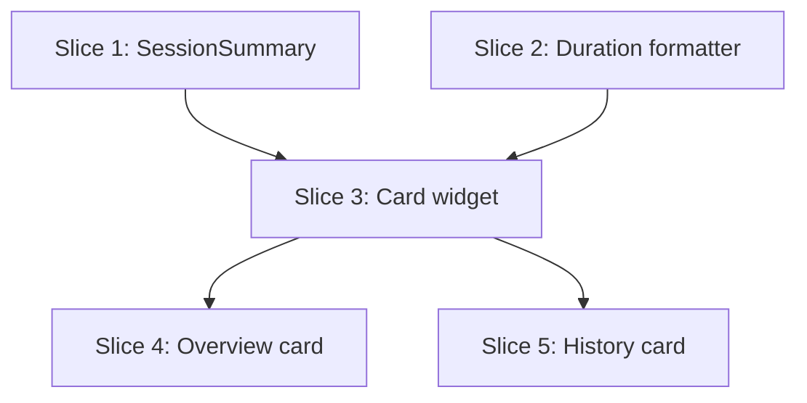

# Plan: Session Summary Stats

**Created**: 2026-06-13
**Branch**: master
**Status**: implemented

## Goal

Surface three headline numbers — duration, sets completed (of planned), and total weighted
volume — at the two moments a lifter asks "how did that go?": immediately after ending a
session on the workout overview, and when reopening a finished session from history. All
numbers are a pure read over the already-persisted `Session`; no new persistence, no schema
change, no snapshot mutation. A single domain computation (`SessionSummary.fromSession`)
feeds one shared card widget rendered on both surfaces, so the two surfaces can never drift.

## Acceptance Criteria

- [ ] Duration shows `endedAt - startedAt`, formatted `mm:ss` under 1h and `h:mm:ss` at/over 1h, matching the app-bar elapsed label.
- [ ] Sets read "X of Y" working (non-warmup) sets; X = completed executed sets, Y = planned sets; warmups excluded from both; X may exceed Y when extra sets are logged.
- [ ] Volume = Σ(weightKg × reps) over weighted (repBased) working sets; bodyweight and time-based sets contribute 0.
- [ ] Volume figure is omitted entirely (not "0 kg") when a session has zero weighted working sets.
- [ ] Both surfaces show identical numbers for the same session, derived from a single `SessionSummary.fromSession` — no second computation path.
- [ ] Overview: the post-end banner becomes the summary card, retains the "Completed sets remain editable." line, and renders only when the session is ended.
- [ ] History: the summary card appears as a header above the set list on the session detail screen.
- [ ] Correcting a logged value on an editable in-week session re-renders the card via the existing watch stream — no manual refresh.
- [ ] No migration, no `schema_versions` bump, no new repository method.
- [ ] No hard-coded pixels/color literals in new widgets; `domain` imports no Flutter/Drift/networking; `tool/check_offline_imports.sh` and `tool/ci.sh` pass.

## Slices

A slice is a vertically deliverable increment. Each slice carries the Gherkin scenario(s)
that define its behavior, followed by the TDD steps that satisfy them. Steps are numbered
`<slice>.<step>`.

> **Test-scope note (project rule).** Per `CLAUDE.md` and the team's standing decision, the
> suite is domain/persistence/services unit tests only — **no widget tests, no `bloc_test`**.
> All testable logic in this feature lives in Slices 1–2 (pure functions) and is covered
> there. Slices 3–5 are presentation/wiring with no new branching logic; they are GREEN-only
> and verified by the user's own visual validation (per project convention), not automated
> widget tests. This is a deliberate, documented deviation from strict RED-first, not an
> omission.

### Slice 1: SessionSummary domain computation

**Depends-on:** none
**Files:** `mobile/lib/modules/domain/services/warmup_exercises.dart`, `mobile/lib/modules/domain/services/session_summary.dart`, `mobile/lib/modules/domain/services/session_export_formatter.dart`, `mobile/lib/modules/domain/domain.dart`, `mobile/test/domain/services/warmup_exercises_test.dart`, `mobile/test/domain/services/session_summary_test.dart`

**Behavior:**

```gherkin
Feature: Session summary computation

  Background:
    Given a finished session that started at 18:00:00 and ended at 18:42:18

  Scenario: Duration is the elapsed wall time
    When the session summary is computed
    Then the duration is 42 minutes and 18 seconds

  Scenario: Sets count completed working sets against planned working sets
    Given the plan prescribes 20 working sets across the day
    And the lifter completed 18 of those working sets
    When the session summary is computed
    Then the sets figure reads 18 of 20

  Scenario: Warmup sets are excluded from both completed and planned counts
    Given the day has a warmup group with 3 planned sets
    And 10 planned working sets outside any warmup group
    And the lifter completed every warmup set and 9 working sets
    When the session summary is computed
    Then the sets figure reads 9 of 10

  Scenario: Completed may exceed planned when extra sets are logged
    Given the plan prescribes 20 working sets
    And the lifter logged 22 working sets
    When the session summary is computed
    Then the sets figure reads 22 of 20

  Scenario: Volume sums weighted work only
    Given a working set of 100 kg for 5 reps
    And a working set of 80 kg for 8 reps
    And a bodyweight working set of 12 reps
    And a time-based working set of 60 seconds
    When the session summary is computed
    Then the weighted volume is 1140 kg
    And the summary reports that weighted volume is present

  Scenario: Volume is absent when no weighted set was logged
    Given the session contains only bodyweight and time-based working sets
    When the session summary is computed
    Then the weighted volume is 0 kg
    And the summary reports that weighted volume is absent

  Scenario: Weighted sets inside a warmup group do not count toward volume
    Given a warmup group containing a 40 kg by 10 rep set
    And one working set of 100 kg for 5 reps
    When the session summary is computed
    Then the weighted volume is 500 kg
```

**Steps:**

#### Step 1.1: Extract shared warmup-exercise-id derivation

**Complexity**: standard
**RED**: Write `warmup_exercises_test.dart` asserting `warmupExerciseIdsIn(WorkoutDay)` returns exactly the snapshot exercise ids belonging to warmup-role groups (and empty when none).
**GREEN**: Add `warmupExerciseIdsIn(WorkoutDay)` to `warmup_exercises.dart`, lifting the logic currently private in `SessionExportFormatter._warmupExerciseIds`, built on the existing `isWarmupGroup` helper.
**REFACTOR**: Point `SessionExportFormatter` at the shared helper; delete its private copy; confirm existing formatter tests stay green. Export the helper from `domain.dart`.
**Files**: `mobile/lib/modules/domain/services/warmup_exercises.dart`, `mobile/lib/modules/domain/services/session_export_formatter.dart`, `mobile/lib/modules/domain/domain.dart`, `mobile/test/domain/services/warmup_exercises_test.dart`
**Commit**: `refactor(domain): extract shared warmupExerciseIdsIn helper`

#### Step 1.2: SessionSummary value object + fromSession factory

**Complexity**: complex
**RED**: Write `session_summary_test.dart` covering every scenario above — duration, X-of-Y with warmup exclusion, extra-sets-over-planned, weighted-only volume across rep/bodyweight/time mixes, `hasWeightedVolume` true/false, warmup weighted sets excluded from volume.
**GREEN**: Implement immutable `SessionSummary` (`duration`, `completedWorkingSets`, `plannedWorkingSets`, `weightedVolumeKg`, `hasWeightedVolume`) and `SessionSummary.fromSession(Session)` — pure Dart, walking `session.snapshot.workoutDay` for planned counts and `session.sessionExercises[].executedSets` for actuals, excluding warmup exercise ids via the Step 1.1 helper.
**REFACTOR**: Collapse the rep/bodyweight/time branching behind a small switch on `ActualSetValues`; export `SessionSummary` from `domain.dart`.
**Files**: `mobile/lib/modules/domain/services/session_summary.dart`, `mobile/lib/modules/domain/domain.dart`, `mobile/test/domain/services/session_summary_test.dart`
**Commit**: `feat(domain): add SessionSummary.fromSession computation`

### Slice 2: Shared duration formatter

**Depends-on:** none
**Files:** `mobile/lib/core/duration_format.dart`, `mobile/lib/modules/workout_overview/widgets/session_elapsed_label.dart`, `mobile/test/core/duration_format_test.dart`

**Behavior:**

```gherkin
Feature: Elapsed-duration formatting

  Scenario: Under one hour shows minutes and seconds
    Given an elapsed duration of 42 minutes and 18 seconds
    When it is formatted
    Then the result is "42:18"

  Scenario: At or over one hour shows hours, minutes and seconds
    Given an elapsed duration of 1 hour, 3 minutes and 9 seconds
    When it is formatted
    Then the result is "1:03:09"

  Scenario: Zero and sub-minute durations pad correctly
    Given an elapsed duration of 7 seconds
    When it is formatted
    Then the result is "00:07"
```

**Steps:**

#### Step 2.1: Extract `formatElapsed` to core and delegate from the label

**Complexity**: standard
**RED**: Write `duration_format_test.dart` for `formatElapsed(Duration)` covering sub-minute padding, the under-1h `mm:ss` form, and the ≥1h `h:mm:ss` form.
**GREEN**: Add `formatElapsed` to `lib/core/duration_format.dart`, lifting the logic from `SessionElapsedLabel._formatElapsed`.
**REFACTOR**: Replace `SessionElapsedLabel`'s private formatter with a call to the shared one; behavior unchanged.
**Files**: `mobile/lib/core/duration_format.dart`, `mobile/lib/modules/workout_overview/widgets/session_elapsed_label.dart`, `mobile/test/core/duration_format_test.dart`
**Commit**: `refactor(core): extract shared formatElapsed duration formatter`

### Slice 3: Shared SessionSummaryCard widget

**Depends-on:** 1, 2
**Files:** `mobile/lib/building_blocks/session_summary_card.dart`, `mobile/lib/building_blocks/building_blocks.dart`

**Behavior:**

```gherkin
Feature: Session summary card presentation

  Scenario: Renders the three stats for a weighted session
    Given a summary of 42:18, 18 of 20 sets, and 1140 kg volume
    When the card is shown
    Then it displays the duration, the "18 of 20" sets figure, and the volume in kg

  Scenario: Omits the volume stat when weighted volume is absent
    Given a summary whose weighted volume is absent
    When the card is shown
    Then no volume figure is displayed
    And the duration and sets figures are still displayed

  Scenario: Optional footer line is shown only when provided
    Given a summary card given a footer message
    When the card is shown
    Then the footer message appears beneath the stats
```

**Steps:**

#### Step 3.1: Build the presentational card

**Complexity**: standard
**RED**: None automated — presentation widget, outside the project test scope (see test-scope note). Behavior validated by the user's visual check.
**GREEN**: Implement `SessionSummaryCard(SessionSummary summary, {String? footer})` in `building_blocks/`: a positive-accent container (reusing the `exerciseCompleted` semantic color), duration + "X of Y sets" via `formatElapsed` and `AppTypography.standard.numeric`, volume rendered only when `summary.hasWeightedVolume`, and the optional `footer` line. No hard-coded pixels or color literals; tokens only. Export from `building_blocks.dart`.
**REFACTOR**: None expected.
**Files**: `mobile/lib/building_blocks/session_summary_card.dart`, `mobile/lib/building_blocks/building_blocks.dart`
**Commit**: `feat(building_blocks): add SessionSummaryCard`

### Slice 4: Overview post-end summary card

**Depends-on:** 3
**Files:** `mobile/lib/modules/workout_overview/widgets/session_ended_banner.dart`

**Behavior:**

```gherkin
Feature: Post-end summary on the workout overview

  Scenario: Ending a session reveals the summary card
    Given a session with logged sets
    When the lifter ends the session
    Then the post-end card shows the session's duration, sets, and volume
    And the card still says completed sets remain editable

  Scenario: Card is absent while the session is live
    Given a session that has not been ended
    Then no post-end summary card is shown
```

**Steps:**

#### Step 4.1: Render the card from the ended-session banner

**Complexity**: standard
**RED**: None automated (presentation/wiring — see test-scope note); verified by user visual check.
**GREEN**: Replace the body of `SessionEndedBanner` with `SessionSummaryCard(SessionSummary.fromSession(session), footer: 'Completed sets remain editable.')`. Pass the ended session through (already gated by `state.isEnded` at the call site in `workout_overview_loaded_body.dart`).
**REFACTOR**: None expected.
**Files**: `mobile/lib/modules/workout_overview/widgets/session_ended_banner.dart`
**Commit**: `feat(workout-overview): show summary card on session end`

### Slice 5: History detail summary card

**Depends-on:** 3
**Files:** `mobile/lib/modules/export/screens/session_detail_screen.dart`

**Behavior:**

```gherkin
Feature: Summary header on a past session

  Scenario: Opening a finished session shows its summary at the top
    Given a finished session in history with logged sets
    When the lifter opens its detail view
    Then a summary card with duration, sets, and volume appears above the set list

  Scenario: Correcting a logged value updates the summary
    Given an editable in-week session open in the detail view
    When the lifter corrects a logged set value
    Then the summary card's sets and volume update without a manual refresh
```

**Steps:**

#### Step 5.1: Add the summary header above the set list

**Complexity**: standard
**RED**: None automated (presentation/wiring — see test-scope note); the watch-stream re-render path already has domain/bloc coverage. Verified by user visual check.
**GREEN**: In `session_detail_screen.dart`, insert `SessionSummaryCard(SessionSummary.fromSession(session))` as the first child of the `ListView`, above the group cards. No footer here. Reactivity is inherited from the existing `BlocBuilder` on `SessionDetailLoaded.session`.
**REFACTOR**: None expected.
**Files**: `mobile/lib/modules/export/screens/session_detail_screen.dart`
**Commit**: `feat(export): show summary card on session detail`

## Parallelization

Each slice declares `Depends-on`. Waves are derived by `scripts/plan-waves.sh` — not hand-maintained.



| Wave | Slices (parallel) |
|------|-------------------|
| 1 | 1, 2 |
| 2 | 3 |
| 3 | 4, 5 |

## Complexity Classification

| Step | Rating |
|------|--------|
| 1.1 | standard |
| 1.2 | complex |
| 2.1 | standard |
| 3.1 | standard |
| 4.1 | standard |
| 5.1 | standard |

## Pre-PR Quality Gate

- [ ] All tests pass (`mobile/tool/ci.sh`)
- [ ] `tool/check_offline_imports.sh` passes (domain stays networking/Drift-free)
- [ ] Linter / analyzer passes
- [ ] `/code-review` passes
- [ ] Documentation updated if needed (product-context.md — see Open Questions)

## Risks & Open Questions

- **product-context.md update.** The post-end card and the history-detail header are
  user-facing surface changes. Per CLAUDE.md's "keep product-context.md current" rule, decide
  during build whether these warrant a doc edit (likely a small note under the relevant
  screens). Owner: implementer at Slice 4/5.
- **Warmup helper home.** `warmupExerciseIdsIn` is placed in a new
  `domain/services/warmup_exercises.dart`; an alternative is co-locating with `isWarmupGroup`
  in `exercise_group_role.dart`. Chosen the service file to avoid a model→WorkoutDay
  dependency. Low risk; revisit if it fragments warmup logic.
- **Duration formatter home.** Placed in `lib/core/` (cross-cutting, unit-testable under
  `test/core/`). Both `workout_overview` and `building_blocks` import core freely.
- **"X of Y" when extra sets exceed planned.** Shown as-is (e.g. "22 of 20"); confirmed
  desirable (signals the lifter exceeded the prescription). No clamping.

## Build Progress

### Slices (grouped by wave)

#### Wave 1
- [x] Slice 1: SessionSummary domain computation
  - [x] Step 1.1: Extract shared warmup-exercise-id derivation
  - [x] Step 1.2: SessionSummary value object + fromSession factory
- [x] Slice 2: Shared duration formatter
  - [x] Step 2.1: Extract formatElapsed to core and delegate from the label

#### Wave 2
- [x] Slice 3: Shared SessionSummaryCard widget
  - [x] Step 3.1: Build the presentational card

#### Wave 3
- [x] Slice 4: Overview post-end summary card
  - [x] Step 4.1: Render the card from the ended-session banner
- [x] Slice 5: History detail summary card
  - [x] Step 5.1: Add the summary header above the set list

### Acceptance Criteria

- [x] Duration formatted mm:ss / h:mm:ss, matching the app-bar elapsed label.
- [x] Sets read "X of Y" working sets; warmups excluded; X may exceed Y.
- [x] Volume = Σ(weightKg × reps) over weighted working sets only.
- [x] Volume omitted (not "0 kg") when no weighted working sets exist.
- [x] Both surfaces show identical numbers from one `SessionSummary.fromSession`.
- [x] Overview banner becomes the card post-end, keeps the editable line, gated on ended.
- [x] History detail shows the card above the set list.
- [x] Value correction re-renders the card via the existing watch stream.
- [x] No migration, no schema bump, no new repository method.
- [x] Token/layer compliance; `check_offline_imports.sh` and analyzer/format/tests pass.
