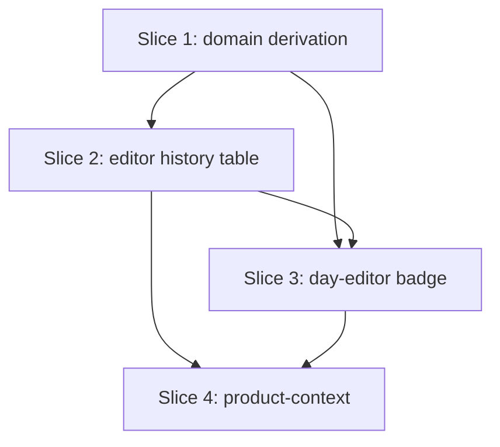

# Plan: Set History with Progression Hints

**Created**: 2026-06-16
**Branch**: master
**Status**: approved
**Spec**: docs/specs/set-history-with-progression-hints.md

## Goal

Surface the planned-vs-actual record the lifter already logs, at the two moments a manual progression decision is made: a recent set-history table in the exercise editor, and a "needs attention" badge in the workout-day editor that flags a lift already capped at its current prescription. All derivation is pure-Dart and read-only — no persisted state, no schema bump. The feature deepens the planned-vs-actual pillar while honoring the no-coaching non-goal: it shows what happened; the lifter still decides whether to advance.

## Acceptance Criteria

- [ ] AC1 — Rep-range target: capped iff every working set's reps ≥ maxReps (`12·12·12` caps a 10–12 target; `12·12·11` does not).
- [ ] AC2 — Fixed rep target: capped iff every working set's reps ≥ target.
- [ ] AC3 — Time-based target: capped iff every working set's duration ≥ planned seconds.
- [ ] AC4 — Reps/duration exceeding the ceiling still count as capped.
- [ ] AC5 — Bodyweight targets use the same rep-ceiling rule as rep-based.
- [ ] AC6 — Pyramid / vary-by-set plans are judged per set against each set's own ceiling: an ascending pyramid caps only when every set meets its own ceiling; a descending drop set generally does not. No special-casing.
- [ ] AC7 — History shows up to the 5 most recent ended sessions of the movement (by `libraryExerciseId`), newest first.
- [ ] AC8 — History aggregates across every program the movement appears in.
- [ ] AC9 — Each row shows absolute date, weight, planned target, per-set actuals; capped sessions show the `▲` marker.
- [ ] AC10 — Linked exercise with no ended sessions shows the "No history yet" empty state.
- [ ] AC11 — Unlinked exercise shows the "link to a library entry to see history" nudge and no rows.
- [ ] AC12 — Warmup-group exercise shows no history section and no cap markers.
- [ ] AC13 — An exercise is badged iff, among ended sessions whose snapshot planned sets equal the current planned sets, the most recent one capped.
- [ ] AC14 — The badge fires after a single capped session.
- [ ] AC15 — The badge clears when the plan advances (tighten, weight bump, any change making current planned sets ≠ the capped session's).
- [ ] AC16 — A warmup-group exercise is never badged.
- [ ] AC17 — An unlinked exercise is never badged.
- [ ] AC18 — Each program/day badges against its own weight+target; the same movement at a different load elsewhere does not cross-trigger.
- [ ] AC19 — No schema-version change and no migration introduced.
- [ ] AC20 — No networking or Drift/`AppDatabase` imports in domain or UI; UI reads session data only via `SessionRepository`.
- [ ] AC21 — New UI uses theme tokens (no hard-coded px/colors); badge tap target ≥ 48 dp.
- [ ] AC22 — All copy is descriptive; no recommendation/imperative text.
- [ ] AC23 — Domain aggregator and cap predicate have unit tests covering AC1–AC18 derivation.
- [ ] AC24 — `product-context.md` updated for the new capability on both screens.

## Slices

### Slice 1: Domain — cap predicate, history & badge derivation

**Depends-on:** none
**Files:** `mobile/lib/modules/domain/models/cap_history.dart`, `mobile/lib/modules/domain/services/exercise_cap_history_aggregator.dart`, `mobile/lib/modules/domain/domain.dart`, `mobile/test/domain/services/exercise_cap_history_aggregator_test.dart`, `mobile/test/domain/models/cap_history_test.dart`

**Behavior:**

```gherkin
Feature: Cap predicate and recent set-history derivation

  Scenario: Rep-range session caps when all working sets reach the top
    Given a completed session of a movement planned at 10-12 reps for 3 sets
    And the logged reps are 12, 12, 12
    Then the session is marked capped

  Scenario: Rep-range session does not cap when one set falls short
    Given a completed session of a movement planned at 10-12 reps for 3 sets
    And the logged reps are 12, 12, 11
    Then the session is not marked capped

  Scenario: Fixed-target session caps when all sets meet the target
    Given a completed session of a movement planned at 12 reps for 3 sets
    And the logged reps are 12, 12, 12
    Then the session is marked capped

  Scenario: Exceeding the ceiling still caps
    Given a completed session of a movement planned at 10-12 reps for 3 sets
    And the logged reps are 13, 12, 14
    Then the session is marked capped

  Scenario: Time-based session caps when every hold meets the planned duration
    Given a completed session of a movement planned at 45 seconds for 3 sets
    And the logged holds are 45, 50, 45 seconds
    Then the session is marked capped

  Scenario: Bodyweight session uses the rep-ceiling rule
    Given a completed bodyweight session planned at 8-10 reps for 3 sets
    And the logged reps are 10, 10, 10
    Then the session is marked capped

  Scenario: Descending vary-by-set (drop set) plan does not cap
    Given a completed session whose planned sets are 8, 6, 4 reps respectively
    And the logged reps are 8, 5, 4
    Then the session is not marked capped

  Scenario: An ascending pyramid caps when every set meets its own target
    Given a completed session whose planned sets are 8-10, 6-8, 4-6 reps respectively
    And the logged reps are 10, 8, 6
    Then the session is marked capped

  Scenario: An unfinished session does not cap
    Given a movement planned for 3 working sets at 10-12 reps
    And only 2 sets were logged at 12, 12
    Then the session is not marked capped

  Scenario: Recent history is the five newest completed sessions, newest first
    Given a movement with seven completed sessions across two programs
    When the recent set-history is computed
    Then it lists the five most recent sessions, newest first
    And sessions from both programs appear

  Scenario: A movement with no completed sessions yields empty history
    Given a movement that has never been logged in a completed session
    When the recent set-history is computed
    Then the history is empty

  Scenario: Badge fires when the most recent matching session capped
    Given the current plan is 80 kg at 10-12 reps for 3 sets
    And the most recent completed session at 80 kg / 10-12 logged 12, 12, 12
    When the badge state is computed
    Then the exercise is badged

  Scenario: Badge clears after the plan advances
    Given the most recent completed session at 80 kg / 10-12 logged 12, 12, 12
    And the current plan has since been changed to 80 kg at a fixed 12 reps
    When the badge state is computed
    Then the exercise is not badged

  Scenario: A heavier or different-load session elsewhere does not trigger the badge
    Given the current plan is 80 kg at 10-12 reps for 3 sets
    And the only capped session for this movement was at 60 kg in another program
    When the badge state is computed
    Then the exercise is not badged

  Scenario: An off day at the current plan does not badge
    Given the current plan is 80 kg at 10-12 reps for 3 sets
    And the most recent completed session at 80 kg / 10-12 logged 12, 12, 11
    When the badge state is computed
    Then the exercise is not badged
```

**Steps:**

#### Step 1.1: Cap predicate for rep-based and bodyweight targets
**Complexity**: standard
**RED**: Tests for AC1, AC2, AC4, AC5, AC6 (rep-range, fixed, exceeding, bodyweight, per-set vary-by-set) and the unfinished-session edge.
**GREEN**: Pure function deriving per-set ceiling from `RepTargetFixed.reps` / `RepTargetRange.maxReps`; a session caps iff it completed its planned working-set count and every working set's reps ≥ its ceiling.
**REFACTOR**: Extract a single `ceilingFor(PlannedSetValues)` helper shared with time-based.
**Files**: `mobile/lib/modules/domain/services/exercise_cap_history_aggregator.dart`, `mobile/test/domain/services/exercise_cap_history_aggregator_test.dart`
**Commit**: `feat(domain): cap predicate for rep-based and bodyweight targets`

#### Step 1.2: Cap predicate for time-based targets
**Complexity**: standard
**RED**: Tests for AC3 and AC4 (time) — every hold ≥ planned `durationSeconds`.
**GREEN**: Extend the ceiling helper to handle `PlannedTimeBased`.
**REFACTOR**: None needed.
**Files**: same as 1.1
**Commit**: `feat(domain): cap predicate for time-based targets`

#### Step 1.3: CapHistory models + computeHistory aggregation
**Complexity**: complex
**RED**: Tests for AC7, AC8, AC10 — five-newest-first, cross-program aggregation, empty history. Build `Session` fixtures via existing test support generators.
**GREEN**: Freezed `CapHistory`/`CapHistoryEntry` models; `ExerciseCapHistoryAggregator.computeHistory({libraryExerciseId, sessions, limit = 5})` mirroring `ExerciseProgressAggregator`'s ended-session filter + snapshot attribution; per entry carry date, programId, day name, ordered `(planned, actual)` set pairs, and `isCapped`. Export via `domain.dart` barrel. Run `dart run build_runner build --force-jit`.
**REFACTOR**: Share the ended-session ordering with the progress aggregator if cleanly extractable; otherwise leave a note.
**Files**: `mobile/lib/modules/domain/models/cap_history.dart`, `mobile/lib/modules/domain/services/exercise_cap_history_aggregator.dart`, `mobile/lib/modules/domain/domain.dart`, `mobile/test/domain/models/cap_history_test.dart`, `mobile/test/domain/services/exercise_cap_history_aggregator_test.dart`
**Commit**: `feat(domain): recent set-history aggregation`

#### Step 1.4: computeBadge derivation
**Complexity**: complex
**RED**: Tests for AC13, AC14, AC15, AC18 — fire after one matching capped session; clear after plan advances (tighten + weight bump); no cross-load trigger; value-equality of planned sets (weight + target, set-for-set, same count).
**GREEN**: `ExerciseCapHistoryAggregator.computeBadge({currentPlannedSets, libraryExerciseId, sessions})` → filter ended sessions whose snapshot planned values equal `currentPlannedSets`, take the most recent, return its cap result.
**REFACTOR**: Reuse the cap predicate and ceiling helper from 1.1–1.2.
**Files**: `mobile/lib/modules/domain/services/exercise_cap_history_aggregator.dart`, `mobile/test/domain/services/exercise_cap_history_aggregator_test.dart`
**Commit**: `feat(domain): progression cap badge derivation`

### Slice 2: Exercise-editor recent-history table

**Depends-on:** 1
**Files:** `mobile/lib/modules/program_management/bloc/exercise_editor/exercise_editor_bloc.dart`, `mobile/lib/modules/program_management/bloc/exercise_editor/exercise_editor_state.dart`, `mobile/lib/modules/program_management/bloc/exercise_editor/exercise_editor_event.dart`, `mobile/lib/modules/program_management/screens/exercise_editor_screen.dart`, `mobile/lib/modules/program_management/widgets/recent_set_history_section.dart`, `mobile/lib/modules/program_management/navigation/program_management_router.dart`, `mobile/test/modules/program_management/bloc/exercise_editor/exercise_editor_history_test.dart`

**Behavior:**

```gherkin
Feature: Recent set-history in the exercise editor

  Scenario: Linked exercise with history shows its recent sessions
    Given an exercise linked to a library entry with completed sessions
    When the exercise editor opens
    Then the recent-history section lists those sessions newest first
    And capped sessions are marked

  Scenario: Linked exercise with no history shows the empty state
    Given an exercise linked to a library entry with no completed sessions
    When the exercise editor opens
    Then the recent-history section shows "No history yet"

  Scenario: Unlinked exercise shows the link nudge
    Given an exercise not linked to any library entry
    When the exercise editor opens
    Then the recent-history section shows the link-to-see-history nudge
    And no session rows are shown

  Scenario: Warmup-group exercise shows no history section
    Given an exercise that belongs to a warmup group
    When the exercise editor opens
    Then no recent-history section is shown
```

**Steps:**

#### Step 2.1: Bloc loads and exposes recent-history state
**Complexity**: complex
**RED**: Bloc unit tests (no `bloc_test` pkg — drive the bloc directly) for the four states: linked-with-history, linked-empty, unlinked-nudge, warmup-hidden. AC7–AC8, AC10–AC12 (state side), AC20.
**GREEN**: Add a `SessionRepository` dependency to `ExerciseEditorBloc` (domain contract); on load, fetch `listCompletedSessions()`, run `computeHistory` for linked non-warmup exercises, and expose a history view-state (rows / empty / nudge / hidden) on `ExerciseEditorState`. Pass `SessionRepository` in `program_management_router.dart`.
**REFACTOR**: None needed.
**Files**: bloc, state, event, router, test (as listed)
**Commit**: `feat(program): exercise editor loads recent set-history`

#### Step 2.2: Render the recent-history section
**Complexity**: standard
**RED**: No automated test — widget tests are out of project scope; rendering correctness rides on the 2.1 state coverage plus manual visual verification (noted in Risks). 
**GREEN**: `RecentSetHistorySection` widget rendering rows (absolute date, weight, planned target, per-set actuals, `▲` marker), empty state, and link nudge using theme tokens; hidden for warmup. Mark text strictly descriptive. AC9, AC11, AC12 (render), AC21, AC22.
**REFACTOR**: None needed.
**Files**: `mobile/lib/modules/program_management/widgets/recent_set_history_section.dart`, `mobile/lib/modules/program_management/screens/exercise_editor_screen.dart`
**Commit**: `feat(program): render recent set-history table in exercise editor`

### Slice 3: Workout-day-editor attention badge

**Depends-on:** 1, 2
**Files:** `mobile/lib/modules/program_management/bloc/workout_day_editor/workout_day_editor_bloc.dart`, `mobile/lib/modules/program_management/bloc/workout_day_editor/workout_day_editor_state.dart`, `mobile/lib/modules/program_management/screens/workout_day_editor_screen.dart`, `mobile/lib/modules/program_management/navigation/program_management_router.dart`, `mobile/test/modules/program_management/bloc/workout_day_editor/workout_day_editor_badge_test.dart`

> Depends-on 2 is a file-collision dependency only: both UI slices edit `program_management_router.dart`. Logically Slice 3 needs only Slice 1.

**Behavior:**

```gherkin
Feature: Needs-attention badge in the workout-day editor

  Scenario: A capped, unadvanced exercise is badged
    Given a day containing an exercise whose most recent matching session capped
    When the workout-day editor opens
    Then that exercise shows a needs-attention badge

  Scenario: An advanced exercise is not badged
    Given an exercise whose plan was changed after its last capped session
    When the workout-day editor opens
    Then that exercise shows no badge

  Scenario: A warmup-group exercise is never badged
    Given a day containing a warmup-group exercise that has capped
    When the workout-day editor opens
    Then that warmup exercise shows no badge

  Scenario: An unlinked exercise is never badged
    Given a day containing an unlinked exercise
    When the workout-day editor opens
    Then that exercise shows no badge
```

**Steps:**

#### Step 3.1: Bloc computes per-exercise badge state
**Complexity**: complex
**RED**: Bloc unit tests for badged / advanced-cleared / warmup-excluded / unlinked-excluded / cross-load-not-triggered. AC13, AC15, AC16, AC17, AC18 (surfacing).
**GREEN**: Add a `SessionRepository` dependency to `WorkoutDayEditorBloc`; on load, fetch completed sessions and compute `computeBadge` per exercise, excluding warmup-group (`warmupExerciseIdsIn`) and unlinked exercises; expose badged exercise ids on state. Wire repo in `program_management_router.dart`.
**REFACTOR**: None needed.
**Files**: bloc, state, router, test (as listed)
**Commit**: `feat(program): workout-day editor computes attention badges`

#### Step 3.2: Render the attention badge chip
**Complexity**: standard
**RED**: No automated test (widget tests out of scope); rides on 3.1 state coverage + manual visual check.
**GREEN**: Render a token-based badge chip on flagged exercise rows in `workout_day_editor_screen.dart` (tap target ≥ 48 dp, no tap action). AC21.
**REFACTOR**: None needed.
**Files**: `mobile/lib/modules/program_management/screens/workout_day_editor_screen.dart`
**Commit**: `feat(program): render needs-attention badge in workout-day editor`

### Slice 4: Product-context update

**Depends-on:** 2, 3
**Files:** `product-context.md`

**Behavior:**

```gherkin
Feature: Product context reflects the new capability

  Scenario: Both screens document the new capability
    Given the feature has shipped on the exercise and workout-day editors
    When product-context.md is read
    Then the exercise editor entry mentions the recent set-history table
    And the workout-day editor entry mentions the needs-attention badge
```

**Steps:**

#### Step 4.1: Update product-context.md
**Complexity**: trivial
**RED**: None (documentation-only).
**GREEN**: Add the recent-history table to the exercise-editor entry and the needs-attention badge to the workout-day-editor entry; keep to current-state scope (no roadmap), per project doc rules. AC24.
**REFACTOR**: None needed.
**Files**: `product-context.md`
**Commit**: `docs: document set-history table and attention badge`

## Parallelization



| Wave | Slices (parallel) |
|------|-------------------|
| 1 | 1 |
| 2 | 2 |
| 3 | 3 |
| 4 | 4 |

Waves are linear: Slices 2 and 3 share `program_management_router.dart`, so 3 follows 2 to avoid a same-wave file collision; Slice 4 documents both UI slices.

## Complexity Classification

Steps 1.3, 1.4, 2.1, 3.1 are `complex` (new abstraction / cross-cutting bloc+repo wiring). Steps 1.1, 1.2, 2.2, 3.2 are `standard`. Step 4.1 is `trivial`.

## Pre-PR Quality Gate

- [ ] All tests pass (`tool/ci.sh`)
- [ ] Offline-imports guard passes (`tool/check_offline_imports.sh`)
- [ ] Codegen clean (`dart run build_runner build --force-jit`)
- [ ] Analyze + format pass
- [ ] `/code-review` passes
- [ ] `product-context.md` updated (Slice 4)

## Risks & Open Questions

- **User override (2026-06-16): exercise-editor history is NOT hidden for warmups.** AC12's "warmup-group exercise shows no history section" is overridden — the exercise editor shows recent history for any *linked* exercise, warmup or not (no warmup detection in `ExerciseEditorBloc`). The no-warmup-hints rule is kept only for the workout-day-editor badge (Slice 3, AC16). Drops the planned "warmup-hidden" bloc state/test.
- **Unfinished-session rule (decided 2026-06-16).** A session caps only if **every planned working set was executed** *and* each met its ceiling. A session that logged fewer than its planned sets is not capped, even if the logged sets hit the ceiling.
- **No automated UI coverage.** Per project test scope (no widget tests), Slices 2.2 and 3.2 have no automated test; behavioral logic is pushed into the blocs (2.1/3.1) which *are* tested. Visual correctness is the user's manual check.
- **Always-on badge in v1.** A deliberately-held lift (rehab) badges persistently with no dismiss — accepted; suppression is a separate follow-up PR.
- **Performance.** `listCompletedSessions()` loads all completed sessions on every editor open; fine at single-user scale, revisit with a targeted query if it grows.
- **`SessionRepository` availability in the router.** Confirm `program_management_router.dart` can obtain a `SessionRepository` from app composition (it already exists for focus-mode/progress) without broader wiring changes.

## Build Progress

### Slices (grouped by wave)

#### Wave 1
- [x] Slice 1: Domain — cap predicate, history & badge derivation
  - [x] Step 1.1: Cap predicate for rep-based and bodyweight targets
  - [x] Step 1.2: Cap predicate for time-based targets
  - [x] Step 1.3: CapHistory models + computeHistory aggregation
  - [x] Step 1.4: computeBadge derivation

#### Wave 2
- [x] Slice 2: Exercise-editor recent-history table
  - [x] Step 2.1: Bloc loads and exposes recent-history state
  - [x] Step 2.2: Render the recent-history section

#### Wave 3
- [x] Slice 3: Workout-day-editor attention badge
  - [x] Step 3.1: Bloc computes per-exercise badge state
  - [x] Step 3.2: Render the attention badge chip

#### Wave 4
- [ ] Slice 4: Product-context update
  - [ ] Step 4.1: Update product-context.md

## Plan Review Summary (inline — 5 lenses)

Waves hand-derived: `plan-waves.sh` is absent in plugin 6.7.0. Linear waves, one slice each, no same-wave collisions. Formal 5-agent review available on request.

- **Acceptance/Gherkin** — *approve, 1 warning.* Scenarios are deterministic and implementation-independent (domain-phrased, no storage/selectors). Coverage of AC1–AC18 is complete. Warning: add a scenario for "most recent matching session was *not* capped (an off day) → no badge even though the plan is unchanged" — it's implied by AC13's "most recent one capped" but not explicitly scenario'd.
- **Design/Architecture** — *approve.* `ExerciseCapHistoryAggregator` mirrors the existing `ExerciseProgressAggregator` (consistent pattern, pure-Dart, read-only). Layer rules respected (UI via `SessionRepository` contract). Minor: both blocs independently load all completed sessions — acceptable; extract a shared loader only if it duplicates awkwardly.
- **UX** — *approve.* Empty / nudge / warmup states all covered; copy constrained to descriptive. Cap signal is `▲` + text (not color-only) → accessible. Minor: the v1 badge is non-interactive, so a tap does nothing — acceptable since the table (where action happens) is one tap away in the exercise editor.
- **Strategic** — *approve.* Tight scope fit to the stated double-progression forget problem. Slice 2 (table) is independently shippable and valuable before Slice 3 (badge). Main known follow-up (dismiss/suppression) is deliberately deferred.
- **Parallelization** — *approve.* Linear DAG, no cycles, no same-wave file overlap; router edit sequenced.

**Open question resolved (2026-06-16):** unfinished-session rule — all planned sets must be executed *and* capped, else not capped.

### Acceptance Criteria

- [x] AC1 — Rep-range cap rule
- [x] AC2 — Fixed-target cap rule
- [x] AC3 — Time-based cap rule
- [x] AC4 — Exceeding the ceiling still caps
- [x] AC5 — Bodyweight cap rule
- [x] AC6 — Pyramid / vary-by-set per-set ceiling
- [x] AC7 — Five most recent sessions, newest first
- [x] AC8 — Cross-program aggregation
- [x] AC9 — Row content + cap marker
- [x] AC10 — Empty state
- [x] AC11 — Unlinked nudge
- [~] AC12 — Warmup hidden (OVERRIDDEN 2026-06-16: exercise editor shows history for warmups too)
- [x] AC13 — Badge fires on matching capped session
- [x] AC14 — Fires after one
- [x] AC15 — Clears on plan advance
- [x] AC16 — Warmup never badged
- [x] AC17 — Unlinked never badged
- [x] AC18 — Per-program load gating
- [ ] AC19 — No schema bump
- [ ] AC20 — Layer rules (no networking/Drift; via SessionRepository)
- [x] AC21 — Tokens + 48 dp
- [x] AC22 — Descriptive copy
- [x] AC23 — Domain unit tests
- [ ] AC24 — product-context.md updated
