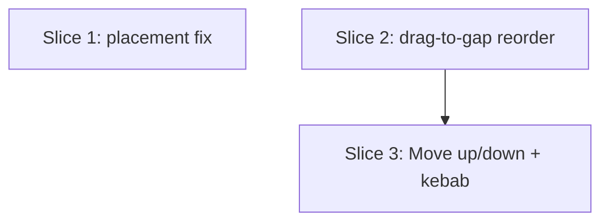

# Plan: Superset Drag-and-Drop UX (Workout Overview)

**Created**: 2026-06-18
**Branch**: master
**Status**: implemented
**Spec**: [docs/specs/superset-drag-drop-ux.md](../docs/specs/superset-drag-drop-ux.md)

## Goal

Fix two superset drag-and-drop UX defects on the live workout-overview screen.
(1) When two exercises are grouped into a new superset (by drag-onto-card or the
"Group into superset" picker), anchor the new group at the **drop target's** slot
with member order dragged-then-target — today it lands at the earliest chosen
member's slot. (2) Let a lifter reorder a whole superset as a unit, via a header
drag handle dropped into the between-group gaps and a tap-only Move up / Move down
fallback. Both changes are confined to the workout-overview surface plus one pure
domain ordering function; the session snapshot, engine grouping semantics, and DB
schema are untouched.

## Approach Stances (high-reversal-cost axes)

- **Scope:** Minimal — exactly the two reported defects plus their tap-fallback
  parity. Superset **merging/nesting** and single-**member extraction** are
  explicitly excluded (locked during `/specs`).
- **Migrate-vs-edit-stub:** Reuse the existing `reorderUnfinished` engine method
  and `ReorderIntent` for the whole-group move — **no new engine method, no
  schema/migration**. The group move is an ordinary permutation of unfinished ids.
- **Placement-rule mechanism:** Add an **explicit `anchorId` parameter** to
  `SupersetOrdering.blockedOrderForCreate` and anchor the block at it (not at the
  earliest chosen member). The repository passes `anchorId: sessionExerciseIds.last`
  — the drop target, which the resolver and picker already place last. This makes
  the ordering function's contract **named, not positional**, while keeping the
  fix domain-local (no `createSuperset` engine/repo/intent signature churn).
  *(Revised per design review: was an implicit "anchor = last chosen" contract.)*
- **Drag payload discrimination:** Introduce a **sealed `OverviewDragPayload`**
  with two variants — `ExerciseDragPayload` (existing, relocated) and
  `SupersetDragPayload` (new: tag + ordered member ids). Every drop target becomes
  a single `DragTarget<OverviewDragPayload>` that **branches on the variant** in
  `onWillAcceptWithDetails`, exactly mirroring the codebase's existing
  field-discrimination idiom (`details.data.supersetTag`). This replaces the
  earlier "two type-scoped DragTargets layered in one gap" idea — it avoids two
  competing DragTargets at one hit-test offset, keeps one discrimination idiom
  across all drop zones, and still makes the accept/reject branches explicit and
  exhaustive (sealed union). *(Revised per design review.)*
- **Eligibility is pure and tested:** the predicate "this superset can be
  dragged/moved as a whole" (session live **and** every member unfinished) is a
  pure function `SupersetReorderResolver.isWholeDragEligible(...)`, unit-tested, so
  the finished-member and ended-session gates have a real backstop rather than
  living only in untested widget `canMutate` wiring. *(Added per acceptance review.)*

## Acceptance Criteria

- [ ] Dragging the upper card onto the lower one (`A · [X,Y] · B`, drag A→B) yields `[X,Y] · [A,B]` — new group at the drop target's slot, order A then B.
- [ ] Dragging the lower card onto the upper one (drag B→A) yields `[B,A] · [X,Y]`; new-group member order is always dragged-then-target.
- [ ] The "Group into superset" picker produces identical placement/order to the equivalent drag.
- [ ] Non-member exercises (including finished/terminal ones) keep their relative order and absolute slots; appending to an existing superset is unchanged.
- [ ] A fully-unfinished superset can be dragged by a header handle into a between-group gap, moving all members as one contiguous block (order + tag preserved, still one superset); a self-adjacent drop is a no-op.
- [ ] Dropping a dragged superset onto another card/superset, or onto its own member, makes no structural change (reorder-only); intra-superset member reorder and standalone form/append drops are unaffected.
- [ ] Resolving a reorder for a tag that no longer exists, or for a group that isn't fully unfinished, is a no-op (pure-resolver guarded).
- [ ] A fully-unfinished superset header exposes Move up / Move down that jump whole groups (skipping all-finished anchors), disabled at the ends, landing identically to the equivalent drag.
- [ ] A superset with any finished member, or an ended session, is not whole-drag/move eligible (no header handle, no Move actions) — gate is a unit-tested pure predicate; the widget hiding is UI-only and manually verified.
- [ ] `tool/ci.sh` is green; `product-context.md` workout-overview bullet mentions whole-superset reordering.

## Slices

### Slice 1: Create-superset placement at the drop target

**Depends-on:** none
**Files:** `mobile/lib/modules/domain/services/superset_ordering.dart`, `mobile/lib/modules/persistence/repositories/drift_session_repository.dart`, `mobile/test/domain/services/superset_ordering_test.dart`

**Behavior:**

```gherkin
Feature: New superset anchors at the drop target

  Scenario: Dragging an upper exercise onto a lower one places the group at the target
    Given the unfinished exercises are ordered "A, X, Y, B"
    And "X" and "Y" are already a superset
    When a superset is created from dragged "A" onto target "B"
    Then the resulting order is "X, Y, A, B"
    And "A" and "B" form one superset in that member order

  Scenario: Dragging a lower exercise onto an upper one places the group at the target
    Given the unfinished exercises are ordered "A, X, Y, B"
    And "X" and "Y" are already a superset
    When a superset is created from dragged "B" onto target "A"
    Then the resulting order is "B, A, X, Y"
    And "B" and "A" form one superset in that member order
```

```gherkin
Feature: Create-block placement preserves all non-member positions

  Scenario: Non-adjacent members are pulled into one block at the target
    Given the exercises are ordered "a, b, c, d"
    When a superset is created from dragged "a" onto target "c"
    Then the resulting order is "b, c, a, d"
    And non-member exercises "b" and "d" keep their relative order

  Scenario: Grouping two already-adjacent exercises is a stable, position-preserving block
    Given the exercises are ordered "a, b, c, d"
    When a superset is created from dragged "b" onto target "c"
    Then the resulting order is "a, b, c, d"
    And "b" and "c" form one superset

  Scenario: A terminal (finished/skipped) exercise in range keeps its absolute slot
    Given the exercises are ordered "F, A, B" where "F" is skipped and "A","B" are unfinished
    When a superset is created from dragged "A" onto target "B"
    Then "F" keeps its absolute slot at the top
    And "A" and "B" form one superset below it in that order
```

**Steps:**

#### Step 1.1: Anchor the create-block at an explicit drop-target id

**Complexity**: standard
**RED**: Rewrite `superset_ordering_test.dart`'s three `blockedOrderForCreate` cases to call the new `anchorId`-bearing signature and assert **target-anchored** placement; add the non-adjacent, already-adjacent, and terminal-in-range cases from the Gherkin. Tests fail against the current earliest-anchor implementation.
**GREEN**: Change `blockedOrderForCreate` to `({required List<String> allIds, required List<String> chosenIds, required String anchorId})`. Assert `anchorId` is in `chosenIds`. Insert the `chosenIds` block among the non-member ids at the count of non-members preceding `anchorId` in `allIds` (replacing `allIds.indexWhere(chosen.contains)`). Keep block order == `chosenIds`; keep every non-member's relative order. Update the doc comment to state the explicit-anchor contract. Update the single caller `DriftSessionRepository.createSuperset` to pass `anchorId: sessionExerciseIds.last`, with a comment that the resolver/picker place the drop target last.
**REFACTOR**: Single-pass anchor computation (no repeated `indexOf` in a loop). Confirm `orderForAppend` untouched.
**Files**: `mobile/lib/modules/domain/services/superset_ordering.dart`, `mobile/lib/modules/persistence/repositories/drift_session_repository.dart`, `mobile/test/domain/services/superset_ordering_test.dart`
**Commit**: `fix(domain): anchor new superset at explicit drop target, not earliest member`

#### Step 1.2: Confirm engine/repo placement specs still hold

**Complexity**: trivial
**RED**: None — verification step. Run `test/integration/create_superset_test.dart` (which already covers a skipped exercise retaining its position/state) and `test/domain/services/session_flow_engine_superset_property_test.dart`.
**GREEN**: These assert member adjacency, within-block order, shared tag, dense unique positions, and terminal-exercise position retention — not the absolute landing slot — so they pass unchanged. **Before editing any failing assertion**, confirm the failure diff is specifically the anchor slot/order (not an unrelated regression from Step 1.1); only then update it to the target-anchored expectation (no production change).
**REFACTOR**: None needed.
**Files**: (tests only, if any adjustment needed) `mobile/test/integration/create_superset_test.dart`, `mobile/test/domain/services/session_flow_engine_superset_property_test.dart`
**Commit**: `test(domain): confirm superset placement specs under target anchoring`

### Slice 2: Reorder a whole superset by dragging it into a gap

**Depends-on:** none
**Files:** `mobile/lib/modules/workout_overview/widgets/overview_drag_payload.dart`, `mobile/lib/modules/workout_overview/widgets/exercise_card.dart`, `mobile/lib/modules/workout_overview/widgets/draggable_exercise.dart`, `mobile/lib/modules/workout_overview/widgets/superset_drop_target.dart`, `mobile/lib/modules/workout_overview/widgets/superset_reorder_gap.dart`, `mobile/lib/modules/workout_overview/widgets/reorder_gap.dart`, `mobile/lib/modules/workout_overview/widgets/drag_handle.dart`, `mobile/lib/modules/workout_overview/widgets/superset_card.dart`, `mobile/lib/modules/workout_overview/widgets/workout_group_builder.dart`, `mobile/lib/modules/workout_overview/services/superset_reorder_resolver.dart`, `mobile/lib/modules/workout_overview/bloc/workout_overview_event.dart`, `mobile/lib/modules/workout_overview/bloc/workout_overview_bloc.dart`, `mobile/test/modules/workout_overview/services/superset_reorder_resolver_test.dart`, `product-context.md`

**Behavior:**

```gherkin
Feature: Reorder a whole superset as one block

  Background:
    Given the groups top-to-bottom are "P", "[X,Y]", "Q"
    And every exercise is unfinished

  Scenario: Drag a superset down past a standalone group
    When the superset "[X,Y]" is dropped into the gap below "Q"
    Then the groups top-to-bottom are "P", "Q", "[X,Y]"
    And "X" and "Y" are still one superset in that order

  Scenario: Drag a superset up past a standalone group
    When the superset "[X,Y]" is dropped into the gap above "P"
    Then the groups top-to-bottom are "[X,Y]", "P", "Q"

  Scenario: Dropping into the gap adjacent to its current position is a no-op
    When the superset "[X,Y]" is dropped into the gap immediately above itself
    Then the groups top-to-bottom are unchanged "P", "[X,Y]", "Q"

  Scenario: A finished exercise keeps its absolute slot during a group move
    Given a finished exercise "F" sits between "P" and "[X,Y]"
    When the superset "[X,Y]" is dropped into the gap below "Q"
    Then "F" keeps its absolute slot
    And "P" and "Q" keep their relative order
```

```gherkin
Feature: Whole-superset drag rejects non-reorder targets (resolver-level)

  Background:
    Given the groups top-to-bottom are "P", "[X,Y]", "Q"

  Scenario: Resolving a reorder for an unknown or stale superset tag is a no-op
    When a whole-superset reorder is resolved for a tag that no longer exists
    Then no structural change occurs

  Scenario: Resolving a reorder for a group that is not fully unfinished is a no-op
    Given member "Y" of superset "[X,Y]" is finished
    And "P" and "Q" remain unfinished
    When a whole-superset reorder is resolved for "[X,Y]"
    Then no structural change occurs

  Scenario: A superset with a finished member is not whole-drag eligible
    Given member "Y" of superset "[X,Y]" is finished
    Then whole-drag eligibility for "[X,Y]" is false

  Scenario: A superset in an ended session is not whole-drag eligible
    Given every member of "[X,Y]" is unfinished
    And the session has ended
    Then whole-drag eligibility for "[X,Y]" is false

  Scenario: A fully-unfinished superset in a live session is whole-drag eligible
    Given every member of "[X,Y]" is unfinished
    And the session is live
    Then whole-drag eligibility for "[X,Y]" is true
```

```gherkin
Feature: Member-level interactions are unaffected (UI-only, manually verified)

  Scenario: Member reorder inside a superset still works
    Given a superset "[X,Y,Z]" with all members unfinished
    When member "Z" is dragged onto the gap above member "X"
    Then the member order becomes "Z, X, Y" within the same superset

  Scenario: Dropping a dragged superset onto another group or its own member does nothing
    Given the groups top-to-bottom are "P", "[X,Y]", "Q"
    When the superset "[X,Y]" is released over standalone "Q" or its own member "X"
    Then the groups top-to-bottom are unchanged "P", "[X,Y]", "Q"
    And the dragged feedback dims to signal "no drop target here"
```

**Steps:**

#### Step 2.1: Pure resolver + eligibility predicate for whole-superset reorder

**Complexity**: standard
**RED**: New `superset_reorder_resolver_test.dart`. For `resolve(...)`: move down past a group, move up past a group, self-adjacent gap → noop, finished exercises retain slots / only unfinished ids permuted, group not all-unfinished → noop, unknown/stale tag → noop. For `isWholeDragEligible(...)`: all-unfinished + live → true; any finished member → false; ended session → false; unknown tag → false. Assert `resolve` returns a `ReorderIntent` with the expected `orderedUnfinishedIds` (block reinserted contiguously, with the same self-removal index shift `_resolveGap` uses) or `NoopIntent`.
**GREEN**: Add `SupersetReorderResolver` with:
- `resolve({sessionId, groups, supersetTag, targetUnfinishedIndex})` → gather the tag's unfinished member ids in order; noop if the group is unknown or not fully unfinished; remove them from the global unfinished id sequence; insert the block at `targetUnfinishedIndex` adjusted for removed-before-target; noop if unchanged; else `DropIntent.reorder(...)`.
- `isWholeDragEligible({groups, supersetTag, isEnded})` → `!isEnded` and the tagged group exists and every member is unfinished.
**REFACTOR**: Extract the shared "remove ids → insert block at adjusted index → noop-if-equal" arithmetic so `DropResolver._resolveGap` and this resolver share one implementation (committed, not optional — both do the identical self-removal shift).
**Files**: `mobile/lib/modules/workout_overview/services/superset_reorder_resolver.dart`, `mobile/test/modules/workout_overview/services/superset_reorder_resolver_test.dart` (and the shared helper's home, e.g. `drop_resolver.dart`, if extraction lands there)
**Commit**: `feat(overview): pure resolver + eligibility for whole-superset reorder`

#### Step 2.2: Sealed OverviewDragPayload + bloc event

**Complexity**: standard
**RED**: Extend `superset_reorder_resolver_test.dart` as needed for resolver coverage. The event/bloc wiring itself has **no RED** — per project convention bloc/widget code is structurally untested; only the resolver it calls is covered (Step 2.1). State this plainly rather than implying coverage.
**GREEN**: Add `overview_drag_payload.dart`: a sealed `OverviewDragPayload` with `ExerciseDragPayload` (moved here from `exercise_card.dart`) and `SupersetDragPayload(tag, memberIds)`. Update `exercise_card.dart` and all importers to the new location. Add `WorkoutOverviewSupersetReordered(supersetTag, targetUnfinishedIndex)` event; handle it in the bloc by calling `SupersetReorderResolver.resolve(...)` then dispatching the existing `reorderUnfinished` via `_runMutation` (reuse the in-flight guard). No engine change.
**REFACTOR**: Keep the new handler symmetric with `_onDropResolved`. Confirm `freezed` codegen for the sealed payload/event.
**Files**: `mobile/lib/modules/workout_overview/widgets/overview_drag_payload.dart`, `mobile/lib/modules/workout_overview/widgets/exercise_card.dart`, `mobile/lib/modules/workout_overview/bloc/workout_overview_event.dart`, `mobile/lib/modules/workout_overview/bloc/workout_overview_bloc.dart`
**Commit**: `feat(overview): sealed drag payload + whole-superset reorder event`

#### Step 2.3: Migrate drop targets to the sealed payload; add header handle + gap acceptance

**Complexity**: complex
**RED**: Resolver-level coverage only (Step 2.1); UI follows the no-widget-test convention (verified via `flutter analyze` + the user's visual validation).
**GREEN**:
- Migrate every drop target to `DragTarget<OverviewDragPayload>` branching on the variant in `onWillAcceptWithDetails`:
  - `reorder_gap.dart` (between-group gap): accept the **exercise** variant → existing single reorder (unchanged behavior); accept the **superset** variant → dispatch `WorkoutOverviewSupersetReordered(tag, unfinishedIndex)` with a distinct hover overlay ("Move superset here"). One target, no layering.
  - `draggable_exercise.dart`, `superset_drop_target.dart`, `superset_reorder_gap.dart`: accept the exercise variant per their existing rules; **reject** the superset variant (explicit branch).
- `drag_handle.dart`: generalise to build either payload variant; the group feedback pill reads as a group ("Superset (n)" with the link icon) and carries a "Drag superset" semantic label; it reuses the existing `_DragFeedbackPill` dim-when-outside behavior so a release over a non-accepting target gives the same "no drop target here" cue (addresses UX warning).
- `SupersetCard`: add the group drag handle in the header's **leading** slot, shown only when `SupersetReorderResolver.isWholeDragEligible(...)` is true.
- `WorkoutGroupBuilder._buildSuperset`: build the `SupersetDragPayload` (tag + ordered unfinished member ids) and gate the handle on the eligibility predicate.
**REFACTOR**: Verify auto-scroll works for the group drag (reuse `DragAutoScroller`/`DragSession`). Confirm the existing optimistic-update + in-flight indicator reads acceptably for a multi-card reflow; if not, add a brief landed-group highlight reusing motion tokens (addresses UX warning).
**Files**: `mobile/lib/modules/workout_overview/widgets/reorder_gap.dart`, `mobile/lib/modules/workout_overview/widgets/draggable_exercise.dart`, `mobile/lib/modules/workout_overview/widgets/superset_drop_target.dart`, `mobile/lib/modules/workout_overview/widgets/superset_reorder_gap.dart`, `mobile/lib/modules/workout_overview/widgets/drag_handle.dart`, `mobile/lib/modules/workout_overview/widgets/superset_card.dart`, `mobile/lib/modules/workout_overview/widgets/workout_group_builder.dart`
**Commit**: `feat(overview): drag a whole superset into a gap to reorder it`

#### Step 2.4: Update product-context.md

**Complexity**: trivial
**RED**: None (doc).
**GREEN**: Update the workout-overview bullet in `product-context.md` to note reordering a whole superset (drag the group, or its Move up/down) alongside the existing drag-to-reorder / drag-onto-card-to-group description.
**REFACTOR**: None needed.
**Files**: `product-context.md`
**Commit**: `docs(product): note whole-superset reordering on workout overview`

### Slice 3: Move up / Move down for a whole superset

**Depends-on:** 2
**Files:** `mobile/lib/modules/workout_overview/services/reorder_move_resolver.dart`, `mobile/lib/modules/workout_overview/widgets/superset_card.dart`, `mobile/lib/modules/workout_overview/widgets/workout_group_builder.dart`, `mobile/test/modules/workout_overview/services/reorder_move_resolver_test.dart`

**Behavior:**

```gherkin
Feature: Tap-only Move up / Move down for a whole superset

  Background:
    Given the groups top-to-bottom are "P", "[X,Y]", "Q"
    And every exercise is unfinished

  Scenario: Move a superset up jumps the whole group above it
    When "Move up" is chosen on superset "[X,Y]"
    Then the groups top-to-bottom are "[X,Y]", "P", "Q"

  Scenario: Move a superset down jumps the whole group below it
    When "Move down" is chosen on superset "[X,Y]"
    Then the groups top-to-bottom are "P", "Q", "[X,Y]"

  Scenario: Directions are disabled at the ends
    Given the groups top-to-bottom are "[X,Y]", "Q"
    Then "Move up" is unavailable on superset "[X,Y]"

  Scenario: All-finished groups are skipped as fixed anchors
    Given a fully-finished group "F" sits above "[X,Y]"
    And an unfinished group "P" sits above "F"
    When "Move up" is chosen on superset "[X,Y]"
    Then "[X,Y]" lands immediately above "P"
    And "F" keeps its slot

  Scenario: Move down lands at the same concrete order as the equivalent drag
    When "Move down" is chosen on superset "[X,Y]"
    Then the groups top-to-bottom are "P", "Q", "[X,Y]"
    And this equals dropping "[X,Y]" into the gap below "Q"
    # Step 3.1's test asserts equivalence via a shared named index constant
    # referenced by both this move test and the Slice 2 drag test, so a
    # regression in either resolver's arithmetic fails both.
```

**Steps:**

#### Step 3.1: Whole-superset move targets in ReorderMoveResolver

**Complexity**: standard
**RED**: Extend `reorder_move_resolver_test.dart` with a `supersetTargetsFor` group: up jumps the nearest unfinished group above, down jumps the nearest unfinished group below, all-finished groups skipped, `null` (disabled) at each end. Assert **equivalence with the drag** by referencing a **shared fixture constant** for the expected `targetUnfinishedIndex` that both this test and the Slice 2 drag scenario use, so the two cannot silently diverge.
**GREEN**: Add `ReorderMoveResolver.supersetTargetsFor({groups, supersetTag})` returning the up/down **target unfinished index** for the whole block (mirroring `_standaloneTargets`, computed for the group's leading/trailing unfinished slot). Return none when the group isn't fully unfinished.
**REFACTOR**: Reuse `_unfinishedInGroup` / `_unfinishedBeforeGroup` helpers.
**Files**: `mobile/lib/modules/workout_overview/services/reorder_move_resolver.dart`, `mobile/test/modules/workout_overview/services/reorder_move_resolver_test.dart`
**Commit**: `feat(overview): compute whole-superset move up/down targets`

#### Step 3.2: Superset header overflow kebab (Move up/down + Ungroup)

**Complexity**: standard
**RED**: Covered by 3.1 resolver tests (UI follows the no-widget-test convention).
**GREEN**: Replace the superset header's inline Ungroup button with a single **trailing overflow kebab** holding Move up, Move down, and Ungroup — so the final header is exactly: leading drag handle · "Superset" label · one trailing kebab (addresses the UX header-crowding warning; no two competing trailing affordances). Move up/down are each enabled per the resolved `supersetTargetsFor` targets (disabled directions greyed/omitted); they dispatch the Slice 2 `WorkoutOverviewSupersetReordered(tag, targetIndex)` event. The whole kebab is shown only when `canMutate`; Move items additionally require whole-move eligibility. All items meet the in-session tap-target floor and use design tokens; kebab + items carry accessible labels.
**REFACTOR**: Keep the header uncluttered and within sweaty-hands spacing tokens.
**Files**: `mobile/lib/modules/workout_overview/widgets/superset_card.dart`, `mobile/lib/modules/workout_overview/widgets/workout_group_builder.dart`
**Commit**: `feat(overview): Move up/down + Ungroup in a superset header kebab`

## Parallelization



| Wave | Slices (parallel) |
|------|-------------------|
| 1 | 1, 2 |
| 2 | 3 |

Slice 1 (domain ordering + its sole repo caller) and Slice 2 (overview
widgets/services/bloc) touch disjoint files and run concurrently. Slice 3 follows
Slice 2 because both edit `superset_card.dart` and `workout_group_builder.dart`
and Slice 3 dispatches the event and consumes the eligibility predicate Slice 2
introduces.

## Complexity Classification

| Step | Rating | Why |
|------|--------|-----|
| 1.1 | standard | Behavioral change to a pure ordering function + signature change + 1 repo caller + test rewrite |
| 1.2 | trivial | Verification; test-only adjustment if any |
| 2.1 | standard | New pure resolver + eligibility predicate within existing patterns |
| 2.2 | standard | Sealed payload migration of a small class + new bloc event reusing the existing mutation path |
| 2.3 | complex | Cross-cutting drag-target migration across five widgets + header handle + new gap branch |
| 2.4 | trivial | Documentation only |
| 3.1 | standard | New resolver method + tests |
| 3.2 | standard | Header kebab restructure within existing UI patterns |

## Pre-PR Quality Gate

- [ ] All tests pass (`mobile/tool/ci.sh`)
- [ ] `dart run build_runner build --force-jit` clean (freezed payload/event codegen)
- [ ] `dart format` + `dart analyze` clean
- [ ] `tool/check_offline_imports.sh` passes (no drift/AppDatabase in UI)
- [ ] `/code-review` passes
- [ ] `product-context.md` updated

## Risks & Open Questions

- **Sealed-payload migration blast radius.** Step 2.3 changes the generic type of
  five existing `DragTarget`s and relocates `ExerciseDragPayload`. Mechanical but
  wide; mitigated by `analyze` and that each target's accept logic is preserved,
  only re-expressed as a variant branch. This is the deliberate trade for one
  discrimination idiom and no layered hit-testing (design-review decision).
- **Header restructure.** Folding Ungroup into the new kebab changes an existing
  affordance's location; Ungroup behavior itself is unchanged. Final header is
  pinned to handle · label · single kebab.
- **Codegen.** New freezed sealed payload + event require `build_runner
  --force-jit`; generated files are committed.
- **Test-scope note.** Per project convention the bloc event + widgets are not
  bloc/widget-tested; correctness rests on the pure resolvers (`SupersetOrdering`,
  `SupersetReorderResolver` incl. `isWholeDragEligible`, `ReorderMoveResolver`)
  plus `analyze` and the user's own visual validation. The "no handle when ended /
  finished member" guarantee is gated by the unit-tested eligibility predicate; the
  widget *hiding* itself is UI-only and manually verified — acceptable and
  consistent with the existing per-exercise drag-handle gating.

## Plan Review Summary

**Final status: all five reviewers approve** (Acceptance, Design, UX, Strategic,
Parallelization). Iteration 1 saw Parallelization and Strategic approve while
Acceptance (2 blockers), Design (3 warnings), and UX (3 warnings) returned
needs-revision; iteration 2 re-ran those three and all three now approve, with
only sub-threshold polish warnings remaining (since folded in). The revisions:

- **Acceptance (2 blockers + warnings):** added a terminal-exercise create scenario
  (A5), added the ended-session / finished-member gate as a **unit-tested pure
  predicate** `isWholeDragEligible` plus explicit Gherkin (B1), split the generic
  a/b/c/d cases into their own Feature (no Background override), added the
  unknown/stale-tag and not-all-unfinished noop scenarios, restated the Slice 3
  equivalence as a concrete order tied to a shared fixture constant, and made the
  un-TDD'd bloc/UI steps state their lack of RED honestly.
- **Design (3 warnings):** replaced the two-type-scoped-DragTarget idea with a
  **sealed `OverviewDragPayload`** branched per target (one idiom, no layering);
  made `blockedOrderForCreate`'s anchor an **explicit `anchorId` param**; colocated
  both payload variants in one `overview_drag_payload.dart`; committed the
  shared-arithmetic extraction in Step 2.1 rather than leaving it optional.
- **UX (3 warnings):** the group feedback pill **dims** over non-accepting targets
  (reusing the existing out-of-target cue); the header is **pinned** to a single
  trailing kebab (handle · label · kebab) with Ungroup folded in; a multi-card
  **landed-group highlight** is added if the existing indicator proves insufficient.
- **Strategic (approve, 1 warning):** the layered-DragTarget fallback risk is
  **mooted** by the sealed-payload design (no layering remains).
- **Parallelization (approve):** `collisions: []`, waves safe; the wider Slice 2
  file surface remains disjoint from Slice 1 and is correctly sequenced before
  Slice 3.

## Build Progress

### Slices (grouped by wave)

#### Wave 1
- [x] Slice 1: Create-superset placement at the drop target
  - [x] Step 1.1: Anchor the create-block at an explicit drop-target id
  - [x] Step 1.2: Confirm engine/repo placement specs still hold
- [x] Slice 2: Reorder a whole superset by dragging it into a gap
  - [x] Step 2.1: Pure resolver + eligibility predicate for whole-superset reorder
  - [x] Step 2.2: Sealed OverviewDragPayload + bloc event
  - [x] Step 2.3: Migrate drop targets to the sealed payload; add header handle + gap acceptance
  - [x] Step 2.4: Update product-context.md

#### Wave 2
- [x] Slice 3: Move up / Move down for a whole superset
  - [x] Step 3.1: Whole-superset move targets in ReorderMoveResolver
  - [x] Step 3.2: Superset header overflow kebab (Move up/down + Ungroup)

### Acceptance Criteria

- [x] Drag A→B in `A · [X,Y] · B` yields `[X,Y] · [A,B]` (group at target slot, order A then B)
- [x] Drag B→A yields `[B,A] · [X,Y]`; new-group order is always dragged-then-target
- [x] Picker path matches the equivalent drag's placement/order
- [x] Non-members (incl. finished/terminal) keep relative order and slots; append unchanged
- [x] Whole superset drags into a gap as one contiguous block (order + tag preserved); self-adjacent drop is a no-op
- [x] Drop-on-group / drop-on-own-member is a no-op; member reorder and standalone form/append drops unaffected
- [x] Unknown/stale tag or not-fully-unfinished group resolves to a no-op
- [x] Superset Move up/down jumps whole groups (skips finished anchors), disabled at ends, equals the drag landing
- [x] No whole-drag/move eligibility (handle/Move hidden) on a superset with a finished member or an ended session — predicate unit-tested
- [x] `tool/ci.sh` green; `product-context.md` bullet updated
