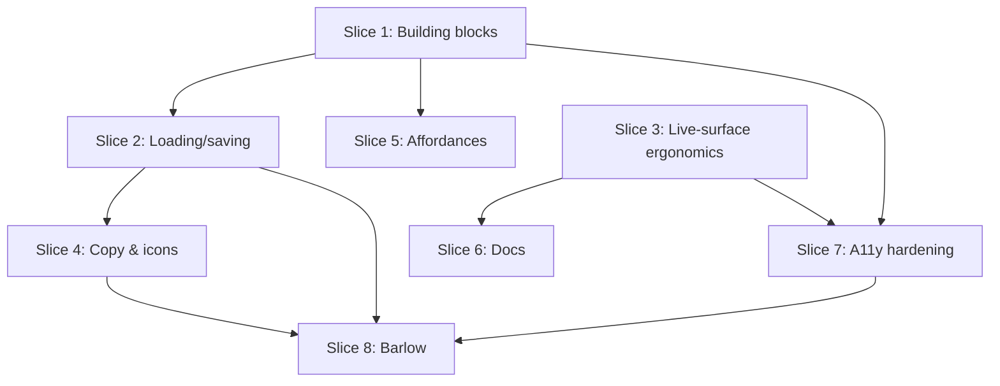

# Plan: UI Improvement 4 — de-AI-ing the UI

**Created**: 2026-06-10
**Branch**: master — build and commit directly on master; do **not** create a feature branch (owner decision, 2026-06-10)
**Status**: in-progress (2026-06-10) — all slices implemented & committed on
master; CI green after every slice. Remaining (owner-run by design): bundle the
Barlow TTFs (`mobile/tool/fetch_barlow.sh` + pubspec `fonts:` block) and the
on-device visual pass (Slice 8.2 jitter/metrics, sheet keyboard, max-font sweep).
**Spec**: [ui_improvement_4.md](../ui_improvement_4.md) (decisions closed 2026-06-10)

## Goal

Converge the app's screens onto one pattern per problem — one loading story,
one saving story, one add-affordance rule, one swipe meaning, rule-compliant
live-surface ergonomics — and replace the platform-default typeface with
bundled Barlow. No new features; the only behavior-shaped changes are
dialog→sheet migrations on the live surface. All paths relative to `mobile/`
unless noted.

**Testing constraint (project rule):** test scope is domain + persistence
only — no widget tests, no `bloc_test`. UI steps therefore gate on
`tool/ci.sh` (imports → codegen → format → analyze → existing tests) and the
slice's Gherkin, which doubles as the owner's manual visual checklist. The
RED phase exists only where a `test/core`-eligible assertion is possible
(Slice 8). Steps without a writable test say so explicitly.

## Acceptance Criteria

- [ ] No screen renders a bare default `CircularProgressIndicator()`; list screens skeleton, editor screens form-skeleton, and the only centered spinner is `AppLoadingView` (§A).
- [ ] No scrim+spinner save overlays remain anywhere (§A).
- [ ] Autosave editors (program editor, workout-day editor) show save progress as their existing inline chip/app-bar spinner — unchanged paradigm (§A).
- [ ] Explicit-save contexts (exercise editor, library editor, plan preview) all present Save as an app-bar `TextButton` (primary color, disabled when invalid/saving) with an inline app-bar spinner while saving (§A).
- [ ] A failed save re-enables the form, preserves the user's edits, and surfaces the existing `AppNoticeBanner` error (§A).
- [ ] Plan import's Parse control does not change layout while parsing (§A).
- [ ] Workout-overview bottom bar: Focus ≥56 dp with `actionLabel`; Note/Extra 56 dp (§B).
- [ ] Rest-timer readout uses a tabular numeric style (no digit jitter) (§B).
- [ ] Note, extra-work, replace-exercise, and group-with flows open as bottom sheets on `surfaceElevated`; commit buttons — and the group-with picker's rows, where the row tap is the commit — are ≥56 dp (§B, §D).
- [ ] The hand-rolled inline-spinner blocks are gone; all use `AppInlineSpinner` (§C).
- [ ] Copy fixes: sentence-case titles, no trailing periods on state titles, no raw IDs in user-facing messages, no `⋮` glyph in copy (§E).
- [ ] Icons: platform-correct share glyph, `link` for suggestions, share glyph for week export (§F).
- [ ] Add rule: extended FAB on program list + library only; editors use app-bar `+` (§G).
- [ ] Swipe-to-delete exists only on editor draft rows; program tiles and session tiles delete via kebab + confirm (§H).
- [ ] `restTimerOvertime` removed from CLAUDE.md; product-context.md focus-mode bullet matches auto-dismiss behavior (§I).
- [ ] Marquee and animated containers respect `MediaQuery.disableAnimations`; in-session numeric chrome clamps text scaling; fixed-height banners use min-heights (§J).
- [ ] Barlow ships bundled, wired through `AppTypography`, with verified tabular figures on every `numeric*` style (§K).
- [ ] `tool/ci.sh` green after every slice.

## Slices

### Slice 1: Shared building blocks & literal sweep

**Depends-on:** none
**Files:** `mobile/lib/building_blocks/app_inline_spinner.dart`, `mobile/lib/building_blocks/app_loading_view.dart`, `mobile/lib/building_blocks/app_form_skeleton.dart`, `mobile/lib/building_blocks/building_blocks.dart`, `mobile/lib/core/app_spacing.dart`, `mobile/lib/modules/exercise_library/screens/link_suggestion_screen.dart`, `mobile/lib/modules/export/widgets/export_preview_sheet.dart`, `mobile/lib/modules/program_management/widgets/program_editor_app_bar.dart`, `mobile/lib/modules/program_management/widgets/workout_day_save_chip.dart`, `mobile/lib/modules/workout_day_picker/widgets/start_resume_action_button.dart`, `mobile/lib/navigation/widgets/session_in_flight_banner.dart`, `mobile/lib/modules/program_management/widgets/add_workout_day_sheet.dart`, `mobile/lib/modules/focus_mode/widgets/focus_set_progress.dart`

**Behavior:**

```gherkin
Feature: One inline progress vocabulary

  Scenario Outline: Inline progress looks identical at every call site
    Given the <control> is performing its operation
    Then its spinner is the shared inline spinner at a named size
    And the control's layout does not shift when progress appears

    Examples:
      | control                                  |
      | link-suggestion "Create & link all"      |
      | export sheet share action                |
      | program editor autosave indicator        |
      | day tile START button launch             |
      | workout-day editor save chip             |

  Scenario: In-progress banner reuses the accent bar
    Given a session is in flight
    When a root screen shows the "Workout in progress" banner
    Then its left accent is the same accent bar as in-progress list tiles

  Scenario: Banner survives large fonts
    Given the OS font size is at its largest accessibility step
    When a root screen shows the "Workout in progress" banner
    Then both banner text lines are fully readable
    And no overflow indicator appears
```

**Steps:**

#### Step 1.1: Add `AppInlineSpinner`, `AppLoadingView`, `AppFormSkeleton` building blocks

**Complexity**: standard
**RED**: n/a — widgets are outside the permitted test scope; gate = `tool/ci.sh` green
**GREEN**: Three new building blocks: `AppInlineSpinner` (named sizes sm=12/md=16/lg=24, stroke from `AppStroke`, color defaults `onSurfaceMuted`), `AppLoadingView` (centered, token-colored), `AppFormSkeleton` (a few `AppSkeletonBar`s mimicking a form). Export from the barrel.
**REFACTOR**: None needed
**Files**: `mobile/lib/building_blocks/app_inline_spinner.dart`, `app_loading_view.dart`, `app_form_skeleton.dart`, `building_blocks.dart`
**Commit**: `add inline-spinner, loading-view, and form-skeleton building blocks`

#### Step 1.2: Replace the six hand-rolled inline spinners

**Complexity**: standard
**RED**: n/a — gate = `tool/ci.sh`; grep gate: no `SizedBox(width: 16, height: 16, child: CircularProgressIndicator` remains outside building_blocks
**GREEN**: Swap in `AppInlineSpinner` at `link_suggestion_screen.dart:231`, `export_preview_sheet.dart:179`, `program_editor_app_bar.dart:75`, `start_resume_action_button.dart:35`, `workout_day_save_chip.dart:45`.
**REFACTOR**: Remove now-unused size literals
**Files**: the five call-site files above
**Commit**: `replace hand-rolled inline spinners with AppInlineSpinner`

#### Step 1.3: Literal sweep — banner accent, stray pixels

**Complexity**: trivial
**RED**: n/a — gate = `tool/ci.sh`
**GREEN**: `SessionInProgressBanner` uses `InProgressAccentBar` instead of the raw 4 px `Container` and `BoxConstraints(minHeight: …)` instead of fixed `height: 56` (token: `AppSpacing.bannerMin = 56` with a doc comment distinguishing it from `touchMin` 48 and the in-session-only `AppInSessionSize.controlMin` 56 — it's a banner min-height, not a tap-target floor); `add_workout_day_sheet.dart:260` `height: 2` → `AppSpacing.xxs`; `focus_set_progress.dart` 8 px dots → `AppSpacing.sm`.
**REFACTOR**: None needed
**Files**: `session_in_flight_banner.dart`, `add_workout_day_sheet.dart`, `focus_set_progress.dart`, `mobile/lib/core/app_spacing.dart`
**Commit**: `sweep stray pixel literals into tokens; reuse InProgressAccentBar in session banner`

### Slice 2: One loading & saving story

**Depends-on:** 1
**Files:** `mobile/lib/modules/program_management/screens/workout_day_editor_screen.dart`, `mobile/lib/modules/program_management/widgets/exercise_editor_scaffolds.dart`, `mobile/lib/modules/exercise_library/screens/exercise_library_editor_screen.dart`, `mobile/lib/modules/program_management/screens/plan_preview_screen.dart`, `mobile/lib/modules/program_management/screens/plan_import_screen.dart`, `mobile/lib/modules/program_management/widgets/plan_text_input.dart`, `mobile/lib/modules/workout_overview/widgets/workout_overview_loading_view.dart`, `mobile/lib/modules/focus_mode/widgets/focus_mode_state_views.dart`, `mobile/lib/modules/exercise_library/widgets/library_picker_sheet.dart`, `mobile/lib/modules/export/widgets/export_preview_sheet.dart`, `mobile/lib/core/app_typography.dart`

**Behavior:**

```gherkin
Feature: One loading and one saving treatment per screen archetype

  Scenario: Editor screens load with a form skeleton
    Given I open the workout-day editor, exercise editor, or library editor
    When its draft is still loading
    Then I see a form skeleton, not a centered spinner

  Scenario: Live-session screens load with the shared loading view
    Given I open the workout overview, focus mode, or plan preview
    When content is not yet available
    Then I see the shared loading view in theme colors

  Scenario: Saving never blocks the screen with an overlay
    Given I press Save in the exercise editor, library editor, or plan preview
    When the save is in flight
    Then the content is disabled and an inline spinner shows in the app bar
    And no scrim covers the screen

  Scenario: Save affordance reads the same in every explicit-save context
    Given any screen with an explicit Save (exercise editor, library editor,
      plan preview)
    Then Save is an app-bar text button in the primary color
    And it is visibly disabled when the draft is invalid or saving

  Scenario: A failed save loses nothing and says why
    Given a save is in flight in the exercise editor, library editor,
      or plan preview
    When the write fails
    Then the inline spinner disappears and the form re-enables
    And a notice banner names what went wrong
    And every value I had entered is still present

  Scenario: Back during a dirty draft is still guarded
    Given I have unsaved edits in an explicit-save editor
    When I press back
    Then a discard-confirmation dialog appears before anything is lost
    And saving-in-flight adds no new back guard
      (save pops the route on completion by existing design)

  Scenario: Parsing does not reflow the import screen
    Given I have pasted a plan and pressed Parse
    When parsing is in flight
    Then the Parse button stays in place, disabled, with an inline spinner

  Scenario: Plan preview shows no zero-information chrome
    Given a parsed plan containing single exercises and supersets
    When I view the preview
    Then only superset groups carry a group label
    And parse warnings render in the shared notice chrome
```

**Steps:**

#### Step 2.1: Converge loading states

**Complexity**: standard
**RED**: n/a — gate = `tool/ci.sh`; grep gate: zero `CircularProgressIndicator` constructions remain under `lib/modules` outside `AppInlineSpinner`/`AppLoadingView` usages (covers both bare and colored variants)
**GREEN**: Workout-day editor `_LoadingView`, `ExerciseEditorLoadingScaffold`, library editor `_LoadingScaffold` → `AppFormSkeleton` inside their scaffolds. `workout_overview_loading_view.dart`, `FocusLoadingView` → `AppLoadingView`. Plan preview's four bare spinners → `AppLoadingView`. `library_picker_sheet.dart`'s loading state → `AppLoadingView`.
**REFACTOR**: Delete per-module loading widgets that became one-liner wrappers if they no longer add naming value
**Files**: as listed on the slice
**Commit**: `converge loading states: form skeletons for editors, AppLoadingView elsewhere`

#### Step 2.2: Converge save feedback — kill the scrims

**Complexity**: standard
**RED**: n/a — gate = `tool/ci.sh`; grep gate: no `colors.scrim` + spinner stack remains in editors
**GREEN**: Exercise editor and library editor saving state → form disabled (`AbsorbPointer`/disabled fields) + `AppInlineSpinner` in the app bar (program-editor pattern); remove both scrim `Stack`s. **Failure path preserved**: all three screens already surface `lastSaveError`/`lastError` via `AppNoticeBanner` and return to the editing state with the draft intact — the migration must keep that wiring (banner shows, form re-enables, controllers untouched); the existing `PopScope` dirty-draft guards stay. Drop the inline `fontWeight: FontWeight.w600` copyWith on Save labels — plain `typography.label`. Plan preview: app-bar `FilledButton` Save → same `TextButton` treatment; saving state shows the app-bar inline spinner instead of the scrim overlay.
**REFACTOR**: Extract a shared `_AppBarSaveAction` **only if** the three call sites end up with an identical widget subtree (same disabled logic, same label); the app bars differ structurally, so if any site needs a parameter the others don't, skip the extraction entirely — no partial abstraction
**Files**: `exercise_editor_scaffolds.dart`, `exercise_library_editor_screen.dart`, `plan_preview_screen.dart`
**Commit**: `converge save feedback: inline app-bar progress, no scrim overlays`

#### Step 2.3: Plan import — stable Parse control, monospace constant

**Complexity**: standard
**RED**: n/a — gate = `tool/ci.sh`
**GREEN**: Keep the Parse `FilledButton` mounted while parsing — disabled, leading `AppInlineSpinner`; remove the centered-spinner branch. Add a `monoFamily` constant in `app_typography.dart` and migrate **all four** inline `fontFamily: 'monospace'` sites to it: `plan_import_screen.dart` (example block), `plan_text_input.dart` (two occurrences), `export_preview_sheet.dart` (preview text). This is the one sanctioned non-default family — Slice 8's "one family" check carves it out by name.
**REFACTOR**: None needed
**Files**: `plan_import_screen.dart`, `plan_text_input.dart`, `export_preview_sheet.dart` (mono constant only — its spinner swap is Slice 1's), `app_typography.dart`
**Commit**: `plan import: stable parse button; one named monospace family`

#### Step 2.4: Plan preview chrome — drop "Single" labels, shared warning chrome

**Complexity**: standard
**RED**: n/a — gate = `tool/ci.sh`
**GREEN**: Render the group-kind header only for supersets (the "Single" caption on every lone exercise is zero-information chrome, spec §J); replace the hand-rolled `_WarningBadge` with `AppNoticeBanner` (tone: warning, `margin: EdgeInsets.zero`) so parse warnings use the one notice recipe.
**REFACTOR**: Delete `_WarningBadge`
**Files**: `plan_preview_screen.dart`
**Commit**: `plan preview: superset-only group labels, shared warning chrome`

### Slice 3: Live-surface ergonomics

**Depends-on:** none
**Files:** `mobile/lib/modules/workout_overview/widgets/workout_overview_bottom_bar.dart`, `mobile/lib/modules/focus_mode/widgets/focus_rest_timer_bar.dart`, `mobile/lib/modules/workout_overview/widgets/text_entry_sheet.dart`, `mobile/lib/modules/workout_overview/widgets/text_entry_dialog.dart`, `mobile/lib/modules/workout_overview/widgets/replace_exercise_dialog.dart`, `mobile/lib/modules/workout_overview/widgets/group_with_picker_dialog.dart`, `mobile/lib/modules/workout_overview/screens/workout_overview_screen.dart`, `product-context.md`

**Behavior:**

```gherkin
Feature: Sweaty-hands compliance on the live surface

  Scenario: Bottom-bar actions meet the in-session floor
    Given a loaded session on the workout overview
    Then the Focus button is at least 56 dp tall with the action-label style
    And the Note and Extra buttons are 56 dp square

  Scenario: Rest timer is glanceable and steady
    Given the rest timer is running in focus mode
    When seconds tick down
    Then the mm:ss readout renders in a tabular numeric style
    And the readout's width does not change between ticks

  Scenario: Adding a note mid-session uses a bottom sheet
    Given a live session
    When I tap Add note (or Add extra work)
    Then a bottom sheet opens on the elevated surface with the keyboard below it
    And the text field has input focus immediately
    And the commit button is at least 56 dp tall
    And dismissing the sheet without committing discards nothing silently logged

  Scenario: A failed note commit is reported on the overview
    Given I committed a note from the sheet
    When the write fails
    Then the overview's transient error banner names the failure
    And no phantom note appears in the Notes section

  Scenario: Replacing an exercise mid-session uses a bottom sheet
    Given a live session with an unfinished exercise
    When I choose Replace exercise
    Then a scrollable bottom sheet hosts the full replace form
    And the sheet scrolls rather than clipping when the keyboard is open
    And the confirm action is at least 56 dp tall
    And cancelling leaves the exercise unchanged

  Scenario: Grouping into a superset uses a bottom sheet
    Given a live session with at least two ungrouped exercises
    When I choose "Group into superset…"
    Then the partner picker opens as a bottom sheet
    And every pickable row is at least 56 dp tall
    And picking a partner forms the superset; dismissing forms nothing
```

**Steps:**

#### Step 3.1: Bottom bar sizes and label style

**Complexity**: standard
**RED**: n/a — gate = `tool/ci.sh`
**GREEN**: Focus button height `AppInSessionSize.controlMin`, `actionLabel` text style; `_SecondaryActionButton` → 56 dp square.
**REFACTOR**: None needed
**Files**: `workout_overview_bottom_bar.dart`
**Commit**: `workout overview bottom bar: 56dp actions, actionLabel on Focus`

#### Step 3.2: Rest-timer readout → tabular numeric

**Complexity**: trivial
**RED**: n/a — gate = `tool/ci.sh`
**GREEN**: mm:ss text `caption` → `numericMd` in the existing `restTimer` color.
**REFACTOR**: None needed
**Files**: `focus_rest_timer_bar.dart`
**Commit**: `rest timer readout: numericMd tabular figures`

#### Step 3.3: Note / extra-work entry → bottom sheet

**Complexity**: standard
**RED**: n/a — gate = `tool/ci.sh`
**GREEN**: New `TextEntrySheet` (modal sheet, `surfaceElevated` via theme, drag handle, `viewInsets` keyboard padding per `SetValueEditorSheet`). Commit button height is `AppInSessionSize.controlMin` (56 dp) — explicitly **not** inheriting `SetValueEditorSheet`'s 48 dp `touchMin` (that sheet is the calm export surface; this one is live-session). Text field keeps `autofocus: true` (carried over from the dialog) so input — and screen-reader focus — lands in the sheet on open. Same `Future<String?>` contract as the dialog; swap call sites in `workout_overview_screen.dart`; delete `text_entry_dialog.dart`. Commit failures need no new UI: the bloc already routes them to the overview's transient error banner.
**REFACTOR**: None needed
**Files**: `text_entry_sheet.dart` (new), `text_entry_dialog.dart` (deleted), `workout_overview_screen.dart`
**Commit**: `in-session text entry: dialog → bottom sheet`

#### Step 3.4: Replace-exercise + group-with picker → bottom sheets

**Complexity**: complex
**RED**: n/a — gate = `tool/ci.sh`; the Gherkin above is the owner's manual script for this step
**GREEN**: `ReplaceExerciseDialog` → scroll-controlled modal sheet: `isScrollControlled: true`, `useSafeArea: true`, drag handle, body in a `SingleChildScrollView` with `EdgeInsets.only(bottom: viewInsets.bottom)` so the keyboard pushes content up rather than clipping (the `SetValueEditorSheet` strategy, not `DraggableScrollableSheet`). Preserve the existing `show(...) → Future<ReplaceExerciseResult?>` contract so `presentReplaceFlow` callers don't change shape — and re-verify `presentReplaceFlow`'s chained `await` (library picker → replace form): the `context.mounted` guard between the two awaits must still hold when both steps are sheets. First field gets `autofocus` so input/AT focus enters the sheet. `GroupWithPickerDialog` → list sheet with the same `Future<String?>` contract; picker rows get `minTileHeight: AppInSessionSize.controlMin` (row tap IS the commit on this surface, so the 56 dp floor applies to the rows, not a button).
**REFACTOR**: Share the sheet scaffold (title + drag handle + insets padding) with `SetValueEditorSheet`/`LibraryPickerSheet` if a clean extraction presents itself; do not force it
**Files**: `replace_exercise_dialog.dart`, `group_with_picker_dialog.dart`, `workout_overview_screen.dart`
**Commit**: `replace-exercise and group-with flows: dialogs → bottom sheets`

#### Step 3.5: product-context.md — sheet interactions

**Complexity**: trivial
**RED**: n/a
**GREEN**: Update the workout-overview bullet (notes/extra/replace open as bottom sheets).
**REFACTOR**: None needed
**Files**: `product-context.md` (repo root)
**Commit**: `product-context: live-session entry flows are bottom sheets`

### Slice 4: Copy & icon pass

**Depends-on:** 2
**Files:** `mobile/lib/modules/program_management/widgets/exercise_editor_scaffolds.dart`, `mobile/lib/modules/program_management/screens/workout_day_editor_screen.dart`, `mobile/lib/modules/export/screens/session_detail_screen.dart`, `mobile/lib/modules/export/widgets/session_history_tile.dart`, `mobile/lib/modules/exercise_library/screens/exercise_library_list_screen.dart`, `mobile/lib/modules/export/screens/recent_sessions_screen.dart`

**Behavior:**

```gherkin
Feature: One copy voice, honest icons

  Scenario: Titles are sentence case without trailing periods
    Given the exercise editor screen and its not-found state
    Then the title reads "Edit exercise"
    And the not-found state reads "Exercise not found" via the shared state view

  Scenario: Coach-mark copy names actions, not glyphs
    Given the workout-day editor shows its gesture tip
    Then the tip does not contain the "⋮" character

  Scenario: Share and suggestion actions use honest glyphs
    Given the session detail, session history, library, and recent sessions screens
    Then share/export actions use the platform share icon
    And the library suggestion action uses the link icon
```

**Steps:**

#### Step 4.1: Copy fixes + not-found convergence

**Complexity**: standard
**RED**: n/a — gate = `tool/ci.sh`
**GREEN**: "Edit Exercise" → "Edit exercise"; replace `ExerciseEditorNotFoundScaffold`'s hand-rolled body with `AppStateView` (error tone, "Exercise not found", no period); coach-mark text "Use the ⋮ menu for more" → "More actions live in each exercise's menu".
**REFACTOR**: None needed
**Files**: `exercise_editor_scaffolds.dart`, `workout_day_editor_screen.dart`
**Commit**: `copy pass: sentence case, shared not-found view, no glyphs in copy`

#### Step 4.2: Icon corrections

**Complexity**: trivial
**RED**: n/a — gate = `tool/ci.sh`; grep gate: no `ios_share`, `auto_fix_high`, `calendar_view_week` in `lib/`
**GREEN**: `ios_share` → `Icons.share` (session detail app bar, session history trailing glyph); `auto_fix_high` → `Icons.link` (library app bar + empty-state secondary action); `calendar_view_week` → `Icons.share` with the existing "Export this week" tooltip.
**REFACTOR**: None needed
**Files**: `session_detail_screen.dart`, `session_history_tile.dart`, `exercise_library_list_screen.dart`, `recent_sessions_screen.dart`
**Commit**: `icon pass: platform share glyph, link for suggestions`

### Slice 5: Affordance convergence

**Depends-on:** 1
**Files:** `mobile/lib/modules/program_management/screens/program_editor_screen.dart`, `mobile/lib/modules/program_management/widgets/program_list_tile.dart`

**Behavior:**

```gherkin
Feature: One add rule, one swipe meaning

  Scenario: Editors add via the app bar
    Given the program editor
    Then there is no floating action button
    And an app-bar "+" action adds a workout day

  Scenario: Program not-found does not leak internals
    Given I open the editor for a deleted program
    Then the message contains no internal identifier

  Scenario: Program deletion is menu-guarded only
    Given the program list
    When I swipe left on a program tile
    Then nothing happens
    And deleting via the tile menu still asks for confirmation

  Scenario: Editor draft rows keep their swipe
    Given the workout-day editor with several exercises (including a superset)
    When I swipe left on an exercise row or a superset card
    Then the row is removed as before
    And the removal remains recoverable exactly as it is today
```

**Steps:**

#### Step 5.1: Program editor FAB → app-bar `+`; de-leak not-found

**Complexity**: standard
**RED**: n/a — gate = `tool/ci.sh`
**GREEN**: Remove the circular FAB; add app-bar `IconButton` (`Icons.add`, tooltip "Add workout day") matching the day editor. Not-found state: drop `message: programId` (no message, or "It may have been deleted.").
**REFACTOR**: None needed
**Files**: `program_editor_screen.dart`
**Commit**: `program editor: add via app bar, no raw id in not-found`

#### Step 5.2: Program tile — remove swipe, adopt inline spinner

**Complexity**: standard
**RED**: n/a — gate = `tool/ci.sh`
**GREEN**: Remove the `Dismissible` wrapper (kebab + confirm remains the delete path); replace the 24 px deleting spinner with `AppInlineSpinner` lg.
**REFACTOR**: None needed
**Files**: `program_list_tile.dart`
**Commit**: `program tiles: delete via menu only; shared inline spinner`

### Slice 6: Doc/code reconciliation

**Depends-on:** 3
**Files:** `CLAUDE.md`, `product-context.md`

**Behavior:**

```gherkin
Feature: Docs describe the shipped rest timer

  Scenario: No phantom semantic color
    Given CLAUDE.md's semantic-color list
    Then it does not mention restTimerOvertime

  Scenario: Product context matches auto-dismiss
    Given product-context.md's focus-mode bullet
    Then it describes the rest timer auto-dismissing at zero (with haptic)
    And does not promise an overtime indicator
```

**Steps:**

#### Step 6.1: Reconcile rest-timer docs

**Complexity**: trivial
**RED**: n/a — grep gate: `restTimerOvertime`/"overtime indicator" absent from both docs
**GREEN**: Edit both docs per the decided Option B.
**REFACTOR**: None needed
**Files**: `CLAUDE.md`, `product-context.md`
**Commit**: `docs: rest timer auto-dismisses; drop phantom restTimerOvertime`

### Slice 7: Structural a11y hardening

**Depends-on:** 1, 3
**Files:** `mobile/lib/core/app_motion.dart`, `mobile/lib/modules/focus_mode/widgets/focus_marquee_text.dart`, `mobile/lib/modules/workout_overview/widgets/exercise_card.dart`, `mobile/lib/modules/workout_overview/widgets/set_row.dart`, `mobile/lib/modules/focus_mode/widgets/focus_pinned_bottom_bar.dart`, `mobile/lib/modules/workout_overview/widgets/workout_overview_bottom_bar.dart`

**Behavior:**

```gherkin
Feature: Motion and text-scale resilience

  Scenario: Reduced motion is honored
    Given the OS reduce-motion setting is on
    When a long exercise name would marquee in focus mode
    Then the name truncates with an ellipsis instead of scrolling
    And card border/expansion transitions complete without animating

  Scenario: Large fonts do not break in-session chrome
    Given the OS font size is set to its largest accessibility step
    When I inspect, in order: a set row's ± steppers, the log circle row,
      the focus rest-timer bar, the focus pinned bottom bar, and the
      workout-overview bottom bar
    Then each control is fully visible with its label readable
    And no overflow indicator appears on any of them
```

**Steps:**

#### Step 7.1: Reduced-motion gate

**Complexity**: standard
**RED**: n/a — gate = `tool/ci.sh`
**GREEN**: Add a top-level `resolveDuration(BuildContext, Duration)` helper in `app_motion.dart` (returns `Duration.zero` when `MediaQuery.disableAnimations`) — a new function, since `AppDuration` is a static-const token class and should stay one; thread through `AnimatedContainer`s in `exercise_card.dart` and panel transitions; `FocusMarqueeText` falls back to ellipsis under the flag (full name stays reachable via the existing static layout when it fits; truncation under reduce-motion is the accepted trade).
**REFACTOR**: None needed
**Files**: `app_motion.dart`, `focus_marquee_text.dart`, `exercise_card.dart`
**Commit**: `honor reduced motion: zero durations, marquee falls back to ellipsis`

#### Step 7.2: Clamped text scaling on in-session numeric chrome

**Complexity**: standard
**RED**: n/a — gate = `tool/ci.sh`; manual check at max accessibility font size per the Gherkin
**GREEN**: Wrap stepper rows, log circle row, and the two pinned bottom bars in `MediaQuery.withClampedTextScaling(maxScaleFactor: 1.3)`; informational text outside numeric chrome keeps full scaling.
**REFACTOR**: None needed
**Files**: `set_row.dart`, `focus_pinned_bottom_bar.dart`, `workout_overview_bottom_bar.dart`
**Commit**: `clamp text scaling on in-session numeric chrome`

### Slice 8: Typeface — Barlow, whole app

**Depends-on:** 2, 4, 7
**Files:** `mobile/pubspec.yaml`, `mobile/assets/fonts/Barlow/`, `mobile/lib/core/app_typography.dart`, `mobile/test/core/app_typography_test.dart`

**Behavior:**

```gherkin
Feature: Bundled Barlow with steady numerals

  Scenario: The app renders Barlow offline
    Given the app is launched with no network
    Then all text renders in Barlow (weights 400–700)

  Scenario: Numerals never jitter
    Given a running rest timer and a weight stepper crossing 99 → 100
    When digits change
    Then glyph positions and the readout width remain stable

  Scenario: One family, everywhere (one named exception)
    Given the shipped typography tokens
    Then every style in AppTypography references the Barlow family
    And the only non-Barlow family in lib/ is the named monoFamily constant
      (plan-text input/preview/export surfaces)
```

**Steps:**

#### Step 8.1: Bundle Barlow and wire the family (real RED)

**Complexity**: standard
**RED**: `test/core/app_typography_test.dart` — every `numeric*` style carries `FontFeature.tabularFigures()`; every style in `AppTypography.standard` has `fontFamily == 'Barlow'`. Fails before wiring. Scope note: this test guards family + font features only; it cannot guard rendered glyph behavior (a font file lacking real `tnum` variants still passes) nor the Step 8.2 `height`/`letterSpacing` tuning — the manual jitter check is the true acceptance gate for both.
**GREEN**: Add Barlow w400/w500/w600/w700 TTFs under `assets/fonts/`, declare the family in `pubspec.yaml`, set `fontFamily` across `AppTypography.standard` (one definition point).
**REFACTOR**: None needed
**Files**: `pubspec.yaml`, `assets/fonts/Barlow-{Regular,Medium,SemiBold,Bold}.ttf`, `app_typography.dart`, `test/core/app_typography_test.dart`
**Commit**: `ship Barlow: bundled weights wired through AppTypography`

#### Step 8.2: Metrics pass + jitter acceptance

**Complexity**: standard
**RED**: n/a — acceptance is the manual jitter check (rest timer ticking; stepper 99→100) and a layout sweep at default + 1.3× text scale
**GREEN**: Re-tune `height`/`letterSpacing` where Barlow's metrics drift from the platform default (expect `overline` and `actionLabel` tracking). Fallback trigger (explicit): if, with `FontFeature.tabularFigures()` applied, the rest-timer tick or the 99→100 stepper crossing visibly shifts glyph positions or readout width on device, Barlow lacks effective `tnum` — swap assets + family name to IBM Plex Sans (the decided fallback) and re-run both checks.
**REFACTOR**: Note bundle-size delta in the PR description
**Files**: `app_typography.dart`
**Commit**: `barlow metrics pass: tracking and line-height tuning`

## Parallelization

Waves derived by `plan-waves.sh` from `Depends-on` declarations — do not hand-maintain.



| Wave | Slices (parallel) |
|------|-------------------|
| 1 | 1, 3 |
| 2 | 2, 5, 6, 7 |
| 3 | 4 |
| 4 | 8 |

## Complexity Classification

| Rating | Steps |
|--------|-------|
| trivial | 1.3, 3.2, 3.5, 4.2, 6.1 |
| standard | 1.1, 1.2, 2.1, 2.2, 2.3, 2.4, 3.1, 3.3, 4.1, 5.1, 5.2, 7.1, 7.2, 8.1, 8.2 |
| complex | 3.4 |

## Pre-PR Quality Gate

- [ ] All tests pass (`tool/ci.sh` — imports, codegen, format, analyze, test)
- [ ] `tool/check_offline_imports.sh` passes (no UI→drift, no domain→Flutter regressions)
- [ ] `/code-review` passes
- [ ] product-context.md + CLAUDE.md updated (Slices 3, 6)
- [ ] Owner visual pass on a device: live-session ergonomics, sheet keyboard handling, Barlow jitter check, max-font-size sweep

## Risks & Open Questions

- **Barlow tabular figures unverified** — mitigated by the Step 8.1 test + 8.2 manual jitter gate (explicit trigger criterion) and the pre-decided IBM Plex Sans fallback.
- **Replace-exercise sheet keyboard behavior** (Step 3.4) is the riskiest migration; contract-preserving refactor keeps the bloc untouched, but the sheet must scroll correctly with the keyboard up and `presentReplaceFlow`'s chained sheet-then-sheet awaits must survive — owner verifies on device.
- **Removing program-tile swipe** deletes an existing gesture (decided knowingly); watch for muscle-memory complaints in personal use.
- **"End session" stays an icon-only app-bar action** — a residual §B tension, accepted during the interrogation ("rely on the confirm dialog; no new chrome"). Recorded so it isn't mistaken for an oversight; revisit only if it annoys in real use.
- **Sheet focus for assistive tech**: `autofocus` on the first field covers note/replace sheets; the group-with picker is list-only — verify TalkBack lands inside it during the owner pass.
- **No widget tests permitted** — regression safety for UI slices rests on the analyzer, ci.sh, and the Gherkin manual scripts; this is a project-rule constraint, not an oversight.

## Build Progress

### Slices (grouped by wave)

#### Wave 1
- [x] Slice 1: Shared building blocks & literal sweep
  - [x] Step 1.1: Add AppInlineSpinner, AppLoadingView, AppFormSkeleton
  - [x] Step 1.2: Replace the six hand-rolled inline spinners
  - [x] Step 1.3: Literal sweep — banner accent, stray pixels
- [x] Slice 3: Live-surface ergonomics
  - [x] Step 3.1: Bottom bar sizes and label style
  - [x] Step 3.2: Rest-timer readout → tabular numeric
  - [x] Step 3.3: Note / extra-work entry → bottom sheet
  - [x] Step 3.4: Replace-exercise + group-with picker → bottom sheets
  - [x] Step 3.5: product-context.md — sheet interactions

#### Wave 2
- [x] Slice 2: One loading & saving story
  - [x] Step 2.1: Converge loading states
  - [x] Step 2.2: Converge save feedback — kill the scrims
  - [x] Step 2.3: Plan import — stable Parse control, monospace constant
  - [x] Step 2.4: Plan preview chrome — drop "Single" labels, shared warning chrome
- [x] Slice 5: Affordance convergence
  - [x] Step 5.1: Program editor FAB → app-bar +; de-leak not-found
  - [x] Step 5.2: Program tile — remove swipe, adopt inline spinner
- [x] Slice 6: Doc/code reconciliation
  - [x] Step 6.1: Reconcile rest-timer docs
- [x] Slice 7: Structural a11y hardening
  - [x] Step 7.1: Reduced-motion gate
  - [x] Step 7.2: Clamped text scaling on in-session numeric chrome

#### Wave 3
- [x] Slice 4: Copy & icon pass
  - [x] Step 4.1: Copy fixes + not-found convergence
  - [x] Step 4.2: Icon corrections

#### Wave 4
- [ ] Slice 8: Typeface — Barlow, whole app
  - [~] Step 8.1: Bundle Barlow and wire the family — **family wired + RED→GREEN
    test done & committed**; TTF bundling (run `mobile/tool/fetch_barlow.sh` +
    add the pubspec `fonts:` block) is the owner-run step (app falls back to the
    platform face until then, no build break).
  - [ ] Step 8.2: Metrics pass + jitter acceptance — **owner device pass**
    (height/letterSpacing tuning + the rest-timer/99→100 jitter check can only
    be judged with Barlow actually rendering).

### Acceptance Criteria

- [x] No bare default spinners; skeleton/form-skeleton/AppLoadingView per archetype
- [x] No scrim save overlays; one Save treatment; inline save progress
- [x] Parse control stable while parsing
- [x] Bottom bar 56 dp actions with actionLabel Focus
- [x] Rest-timer readout tabular (code); no-jitter is the owner device check
- [x] Note/extra/replace/group-with flows are bottom sheets on surfaceElevated
- [x] All inline spinners use AppInlineSpinner
- [x] Copy: sentence case, no trailing periods, no raw IDs, no ⋮ in copy
- [x] Icons: platform share, link for suggestions, share for week export
- [x] FABs on browse screens only; editors add via app bar
- [x] Swipe-to-delete only on editor draft rows
- [x] restTimerOvertime gone from CLAUDE.md; product-context matches auto-dismiss
- [x] Reduced motion honored; in-session text scaling clamped; min-height banners
- [~] Barlow wired + guard test (code done); bundling + tabular-figures verify are owner-run (fallback: IBM Plex Sans)
- [x] tool/ci.sh green after every slice

## Plan Review Summary

Five reviewers (acceptance, design, UX, strategic, parallelization); three
review iterations. All blockers resolved in-plan; final verdicts: **5×
approve**. Residual warnings/observations for the builder:

**Design** — `AppFormSkeleton` must stay generic (don't mirror specific form
layouts); skip the `_AppBarSaveAction` extraction unless the three subtrees
are identical (criterion now in Step 2.2); `resolveDuration` is a new
top-level helper, not a method on the token class (Step 7.1); the new
`AppSpacing.bannerMin` token needs its doc comment distinguishing it from
`touchMin`/`controlMin` (Step 1.3); `TextEntrySheet` must use 56 dp, not
`SetValueEditorSheet`'s 48 dp (now explicit in Step 3.3).

**UX** — "End session" stays icon-only by accepted decision (Risks);
marquee's reduce-motion ellipsis trade accepted; group-with picker rows are
the commit surface, hence the 56 dp `minTileHeight` (Step 3.4); the back-
guard scenario must not be over-implemented into a save-in-flight block —
save pops on completion by existing design.

**Acceptance** — Gherkin doubles as the owner's manual checklist; the
Step 8.1 test guards family + font-feature declarations only, the manual
jitter check is the true `tnum` gate; the Step 1.2/2.1 grep gates are part
of the verification, not decoration.

**Strategic** — `_WarningBadge` + "Single" label leftovers folded in as
Step 2.4; Barlow fallback trigger criterion made explicit (Step 8.2);
follow-ups (autosave convergence, stream-based lists) correctly excluded.

**Parallelization** — collisions: none; waves [1,3] → [2,5,6,7] → [4] → [8];
all shared-file pairs (product-context.md, workout_overview_bottom_bar.dart,
exercise_editor_scaffolds.dart, export_preview_sheet.dart, app_typography.dart)
are serialized across waves via `Depends-on`. Wave-1 independence of Slices
1 and 3 verified: Slice 3 uses only pre-existing building blocks.
