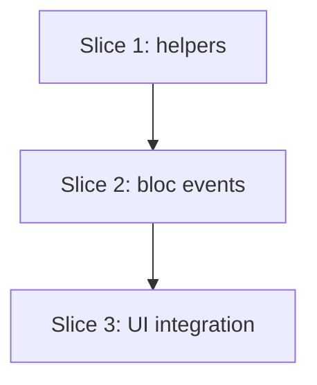

# Plan: Uniform Set Editor (Solution A)

**Created**: 2026-06-13
**Branch**: master
**Status**: implemented
**Spec**: [docs/specs/uniform-set-editor.md](../docs/specs/uniform-set-editor.md)

## Goal

Make identical sets the default presentation in the Exercise editor. When an exercise's
sets all share the same planned values, show one weight ± stepper, one reps ± stepper
(range-safe), and a sets-count stepper that drive **all** sets at once — turning a coach's
"add 2.5 kg" from four edits into one tap. Per-set editing stays available behind a "Vary
by set" expander, which opens automatically when sets are non-uniform so variation is never
hidden or silently flattened. Presentation/affordance only: each set still persists its own
values; "uniform" is derived and fanned back out on every edit. No schema/domain/migration/
save/validation change.

## Acceptance Criteria

- [x] Opening an all-identical-sets exercise shows the uniform editor (one weight, one reps, one count, a summary), not N rows.
- [x] In uniform mode, one weight `+` step raises every set's planned weight by the `IncrementRules` step (half-kg snapped, clamped ≥0); save persists it on all sets.
- [x] Typing an absolute weight in uniform mode sets that weight on every set.
- [x] Reps `+1` turns `5`→`6` and `6-8`→`7-9` on every set (range shape and separator preserved, clamped ≥0); a range can still be typed directly.
- [x] Sets-count `+` appends a set inheriting the uniform value; `−` removes the last set; bounded 1–20 with the bound button disabled.
- [x] Opening an exercise with non-uniform sets shows the per-row list with a visible "sets vary" indicator and changes no values on open.
- [x] "Vary by set" reveals the existing per-row editor; per-row behavior is unchanged.
- [x] Collapsing to uniform while sets differ prompts a confirm and only then flattens all sets to set 1; collapsing while uniform changes nothing and shows no prompt.
- [x] Rep-based, time-based (duration ±5 s + optional weight), and bodyweight (reps only, no weight) each render the correct uniform controls.
- [x] A uniform-edited exercise saves to the same per-set structure with equal planned values; existing save/validation/dirty-discard unchanged; domain & persistence suites stay green unmodified.
- [x] New widgets use only design tokens (no px/color literals), tap targets ≥48 dp, ± steps from `IncrementRules`; `tool/check_offline_imports.sh` passes.
- [x] `tool/ci.sh` passes.

## Slices

A slice is a vertically deliverable increment. Each carries the Gherkin that defines its
behavior, then the TDD steps that satisfy it. Steps are numbered `<slice>.<step>`.

> **Test-scope note (project rule):** automated coverage is unit tests under
> `test/modules/**` (helpers + bloc, no `bloc_test` package) and the existing
> `test/{domain,persistence}` suites. **Widget tests are out of scope.** Slices 1–2 are
> fully TDD; Slice 3 is thin presentation wiring whose behavior is already proven at the
> helper/bloc layer — it is verified by analyzer + `check_offline_imports` + format + **your
> manual visual validation**, not automated UI tests.

### Slice 1: Set-input adjustment helpers (pure)

**Depends-on:** none
**Files:** `mobile/lib/modules/program_management/services/set_input_adjustment.dart`, `mobile/test/modules/program_management/services/set_input_adjustment_test.dart`

**Behavior:**

```gherkin
Feature: Adjusting raw planned-set inputs uniformly

  Scenario: Bump a fixed rep count
    Given a reps input of "5"
    When it is bumped by +1
    Then the reps input becomes "6"

  Scenario: Bump a rep range preserves its shape and separator
    Given a reps input of "6-8"
    When it is bumped by +1
    Then the reps input becomes "7-9"
    And an input of "6–8" with an en-dash bumped by +1 becomes "7–9"

  Scenario: Reps bump clamps at zero
    Given a reps input of "0-1"
    When it is bumped by -1
    Then the reps input becomes "0-0"

  Scenario: Reps bump is a no-op on a blank or non-numeric input
    Given a reps input of ""
    When it is bumped by +1
    Then the reps input remains ""

  Scenario: Bump a weight input
    Given a weight input of "100"
    When it is bumped by +2.5
    Then the weight input becomes "102.5"

  Scenario: Weight bump snaps to half-kg and clamps at zero
    Given a weight input of "2"
    When it is bumped by -2.5
    Then the weight input becomes "0"

  Scenario: Weight bump is a no-op on a blank input
    Given a weight input of ""
    When it is bumped by +2.5
    Then the weight input remains ""

  Scenario: Whole-kg weights format without a trailing decimal
    Given a weight value of 100.0
    When it is formatted for input
    Then the result is "100"

  Scenario: Sets are uniform when every set holds equal values
    Given three rep-based sets each "100" x "5"
    Then the sets are reported uniform

  Scenario: Sets are non-uniform when any set differs
    Given rep-based sets "80" x "5", "90" x "5", "100" x "5"
    Then the sets are reported non-uniform

  Scenario: A single set is uniform
    Given one rep-based set "100" x "5"
    Then the sets are reported uniform

  Scenario: Blank-but-equal sets are uniform
    Given two rep-based sets each blank weight and blank reps
    Then the sets are reported uniform
```

**Steps:**

#### Step 1.1: Range-safe reps token bump

**Complexity**: standard
**RED**: Tests for `bumpReps(input, delta)` — fixed, hyphen range, en-dash range, zero-clamp, blank/non-numeric no-op.
**GREEN**: Implement by applying `IncrementRules.bumpReps` to every `\d+` run in the string, leaving separators intact; return input unchanged when no numeric run exists.
**REFACTOR**: Extract the per-token regex replace if it clarifies; else none.
**Files**: `set_input_adjustment.dart`, `set_input_adjustment_test.dart`
**Commit**: `feat(program): range-safe reps input bump helper`

#### Step 1.2: Numeric weight/duration input bump + format

**Complexity**: standard
**RED**: Tests for `bumpWeight(input, delta)` (parse → `IncrementRules.bumpWeight` → format; half-kg snap; zero-clamp; blank no-op), `bumpDuration(input, delta)` (`IncrementRules.bumpDuration`; blank no-op), and `formatWeight(double)` (drops trailing `.0`, keeps `.5`).
**GREEN**: Implement the three functions over the existing `IncrementRules` primitives; no new step literals.
**REFACTOR**: Share the "blank → no-op" guard; none if trivial.
**Files**: `set_input_adjustment.dart`, `set_input_adjustment_test.dart`
**Commit**: `feat(program): numeric weight/duration input bump + format helpers`

#### Step 1.3: Uniformity detection over planned-set drafts

**Complexity**: standard
**RED**: Tests for `areUniform(List<PlannedSetDraft>)` — all-equal true, any-differ false, single-set true, blank-equal true; across rep-based / time-based / bodyweight values.
**GREEN**: Implement as "every set's `values` equals the first" using freezed value equality.
**REFACTOR**: None expected.
**Files**: `set_input_adjustment.dart`, `set_input_adjustment_test.dart`
**Commit**: `feat(program): uniform planned-set detection helper`

### Slice 2: Bloc fan-out events

**Depends-on:** 1
**Files:** `mobile/lib/modules/program_management/bloc/exercise_editor/exercise_editor_event.dart`, `mobile/lib/modules/program_management/bloc/exercise_editor/exercise_editor_bloc.dart`, `mobile/test/modules/program_management/bloc/exercise_editor_bloc_uniform_test.dart`

**Behavior:**

```gherkin
Feature: Editing every planned set at once

  Background:
    Given an exercise open in the editor with 4 rep-based sets each "100" x "5"

  Scenario: Set an absolute weight on all sets
    When the weight for all sets is set to "110"
    Then all 4 sets read "110" x "5"

  Scenario: Bump weight on all sets
    When the weight for all sets is bumped by +2.5
    Then all 4 sets read "102.5" x "5"

  Scenario: Bump reps on all sets preserves ranges
    Given the 4 sets are "100" x "6-8"
    When the reps for all sets are bumped by +1
    Then all 4 sets read "100" x "7-9"

  Scenario: Grow the set count inherits the uniform value
    When the set count is changed to 6
    Then there are 6 sets and the two new sets read "100" x "5"

  Scenario: Shrink the set count drops from the end
    When the set count is changed to 2
    Then there are 2 sets

  Scenario: Set count is bounded
    When the set count is changed to 0
    Then there is still 1 set
    And changing it to 25 leaves at most 20 sets

  Scenario: Flatten varied sets to the first set
    Given the 4 sets are "80" x "5", "90" x "5", "100" x "5", "110" x "5"
    When all sets are flattened to the first
    Then all 4 sets read "80" x "5"

  Scenario: Time-based and bodyweight fan-out
    Given a time-based exercise with 3 sets at duration "60"
    When the duration for all sets is bumped by +5
    Then all 3 sets read duration "65"

  Scenario: Uniform edits do not change the persisted set structure
    When the weight for all sets is bumped by +2.5 and the exercise is saved
    Then the saved exercise still has 4 sets, each with equal planned values

  Scenario: Clearing the weight on all sets blocks saving
    When the weight for all sets is set to ""
    Then the editor reports the exercise cannot be saved
```

**Steps:**

#### Step 2.1: Absolute "set all" events

**Complexity**: standard
**RED**: Bloc tests for `AllSetsWeightChanged`, `AllSetsRepsChanged`, `AllSetsDurationChanged` — each maps the raw input onto every set's matching field, leaves non-matching measurement shapes untouched, recomputes validation.
**GREEN**: Add the three events + handlers, mapping over `draft.sets` (mirror the existing per-set switch on `values`); each recomputes `ExerciseDraftValidation` so a blanked value flips `canSave` (covers the "clearing weight blocks saving" scenario).
**REFACTOR**: Factor the shared "map a transform over all sets + revalidate + emit" into one private helper reused by 2.1–2.4.
**Files**: `exercise_editor_event.dart`, `exercise_editor_bloc.dart`, `exercise_editor_bloc_uniform_test.dart`
**Commit**: `feat(program): set-all weight/reps/duration editor events`

#### Step 2.2: Relative "bump all" events

**Complexity**: standard
**RED**: Bloc tests for `AllSetsWeightBumped`, `AllSetsRepsBumped`, `AllSetsDurationBumped` — apply the Slice-1 helpers to every set; ranges preserved; clamps respected.
**GREEN**: Add the three events + handlers using `SetInputAdjustment` over `draft.sets`.
**REFACTOR**: Reuse the 2.1 fan-out helper.
**Files**: `exercise_editor_event.dart`, `exercise_editor_bloc.dart`, `exercise_editor_bloc_uniform_test.dart`
**Commit**: `feat(program): bump-all weight/reps/duration editor events`

#### Step 2.3: Set-count change with inherit/trim

**Complexity**: standard
**RED**: Bloc tests for `PlannedSetCountChanged(count)` — grow appends copies of the last (uniform) value, shrink drops from the end, clamp to 1–20.
**GREEN**: Add the event + handler (reuse the existing "copy last set's values" logic from `PlannedSetAdded`).
**REFACTOR**: Share the new-set construction with `_onPlannedSetAdded` if clean.
**Files**: `exercise_editor_event.dart`, `exercise_editor_bloc.dart`, `exercise_editor_bloc_uniform_test.dart`
**Commit**: `feat(program): planned set-count change event`

#### Step 2.4: Flatten-to-first event

**Complexity**: standard
**RED**: Bloc test for `AllSetsFlattenedToFirst` — every set takes set 1's `values`; single-set and already-uniform are no-ops in effect.
**GREEN**: Add the event + handler.
**REFACTOR**: Reuse the 2.1 fan-out helper.
**Files**: `exercise_editor_event.dart`, `exercise_editor_bloc.dart`, `exercise_editor_bloc_uniform_test.dart`
**Commit**: `feat(program): flatten-sets-to-first editor event`

### Slice 3: Uniform editor UI + form integration

**Depends-on:** 2
**Files:** `mobile/lib/modules/program_management/widgets/set_stepper_field.dart`, `mobile/lib/modules/program_management/widgets/uniform_sets_editor.dart`, `mobile/lib/modules/program_management/widgets/exercise_editor_form.dart`, `mobile/product-context.md`

**Behavior:**

```gherkin
Feature: Uniform-first planned-sets editing on screen

  Scenario: All-identical sets show the uniform editor
    Given an exercise whose 4 sets are all "100" x "5"
    When the exercise editor opens
    Then a single weight control, a single reps control, a sets-count control, and a "4 × 5 @ 100 kg" summary are shown
    And four separate set rows are not shown

  Scenario: One tap raises every set
    Given the uniform editor for sets at "100" x "5"
    When the weight "+" step is tapped once
    Then the summary reflects every set at 102.5 kg

  Scenario: Vary-by-set reveals the per-row editor
    Given the uniform editor
    When "Vary by set" is activated
    Then the per-set rows are shown and behave as before

  Scenario: Varied sets open expanded
    Given an exercise whose sets are "80" x "5", "90" x "5", "100" x "5"
    When the exercise editor opens
    Then the per-set rows are shown with a "sets vary" indicator
    And no set value has changed

  Scenario: Collapsing varied sets asks before flattening
    Given the per-row editor with sets that differ
    When the editor is collapsed back to uniform
    Then a confirmation is shown
    And only on confirm do all sets take the first set's value

  Scenario: Bodyweight shows no weight control
    Given a bodyweight exercise
    When the uniform editor opens
    Then a reps control and a sets-count control are shown and no weight control is shown
```

**Steps:**

#### Step 3.1: Reusable stepper field widget

**Complexity**: standard
**RED (manual)**: Widget tests are out of scope; behavior (the bump math, step magnitudes) is already covered in Slice 1. Acceptance for this step = analyzer/format clean and the field renders an editable center value flanked by − / + buttons.
**GREEN**: Build `SetStepperField` — editable `TextField` center + − / + `OutlinedButton`s; step magnitudes from `IncrementRules` (weight steps vary by magnitude); tokens only (`AppSpacing`, `appColors`, `AppTypography.standard.numeric`); tap targets ≥48 dp (`AppSpacing.touchMin`); ± buttons carry `Semantics` labels (e.g. "increase weight") and never convey state by color alone.
**REFACTOR**: None.
**Files**: `set_stepper_field.dart`
**Commit**: `feat(program): reusable set stepper field widget`

#### Step 3.2: UniformSetsEditor widget

**Complexity**: complex
**RED (manual)**: Per measurement type the editor exposes the right controls (rep-based: weight + reps + count; time-based: duration + optional weight + count; bodyweight: reps + count), a live summary, and a "Vary by set" affordance; dispatches the Slice-2 events. Validated by you visually.
**GREEN**: Build `UniformSetsEditor` wiring `SetStepperField`s to `AllSets*` events; render summary (reuse/extend `planned_draft_summary_formatter.dart`); emit `PlannedSetCountChanged` from the count stepper.
**REFACTOR**: Keep per-type branching readable via a switch on `measurementType`.
**Files**: `uniform_sets_editor.dart`
**Commit**: `feat(program): uniform planned-sets editor widget`

#### Step 3.3: Integrate into the exercise editor form

**Complexity**: complex
**RED (manual)**: The form shows the uniform editor when sets are uniform and collapsed, the per-row list when expanded; auto-expands on a non-uniform open; collapsing while varied confirms then dispatches `AllSetsFlattenedToFirst`. Validated by you visually.
**GREEN**: In `exercise_editor_form.dart`, derive uniformity via `SetInputAdjustment.areUniform`, hold expand/collapse as local widget state seeded from uniformity on first build, and branch between `UniformSetsEditor` and the existing `ReorderableListView`; wire the collapse confirm through `AppConfirmDialog`.
**REFACTOR**: Keep the existing per-row list path untouched for reuse.
**Files**: `exercise_editor_form.dart`
**Commit**: `feat(program): uniform-first planned-sets editing in exercise editor`

#### Step 3.4: Update product context

**Complexity**: trivial
**RED**: n/a (docs).
**GREEN**: Update the Exercise-editor bullet in `product-context.md` to note uniform-first set editing with per-set "Vary by set".
**REFACTOR**: None.
**Files**: `product-context.md`
**Commit**: `docs: note uniform-first set editing on the exercise editor`

## Parallelization



| Wave | Slices (parallel) |
|------|-------------------|
| 1 | 1 |
| 2 | 2 |
| 3 | 3 |

Strictly sequential (each slice consumes the previous), so no same-wave file collisions are possible. (`scripts/plan-waves.sh` is not shipped in the installed plugin build 6.7.0; with a single-slice-per-wave chain the wave derivation is unambiguous and the collisions set is necessarily empty.)

## Complexity Classification

Steps 1.1–1.3, 2.1–2.4, 3.1 = `standard`; 3.2–3.3 = `complex` (new presentation abstraction + mode/state branching on the live editing surface); 3.4 = `trivial`.

## Pre-PR Quality Gate

- [x] All tests pass (`tool/ci.sh`)
- [x] Analyzer passes
- [x] Formatter passes (`dart format`)
- [x] `tool/check_offline_imports.sh` passes
- [x] `/code-review` passes
- [x] `product-context.md` updated (Step 3.4)
- [x] Codegen run after freezed event additions (`dart run build_runner build --force-jit`)

## Risks & Open Questions

- **Codegen** — new freezed events/equatable additions need `build_runner build --force-jit` before analyze/test; bake into the Slice 2 GREEN loop.
- **UI not auto-tested** — Slice 3 has no widget tests by project policy; the behavior it surfaces is TDD-proven in Slices 1–2, but rendering/wiring relies on your visual validation. Mitigation: keep Slice 3 thin — no logic that isn't already covered below it.
- **Expand/collapse state ownership** — expansion is local widget state (not bloc/draft) seeded from uniformity on first build. Risk: a library-link rebuild re-seeds it; mitigation: seed once (guard like the existing `_didInitialControllerSync`).
- **Summary formatter reuse** — confirm `planned_draft_summary_formatter.dart` can render a single uniform line; if not, add a small tested formatter to Slice 1 rather than inlining.
- **Weight-step magnitude flips at 10 kg** — `IncrementRules.weightSteps` returns ±1 at ≤10 kg, ±2.5 above; the stepper must recompute steps from the current value each build (matches focus mode). Already covered by reuse.

## Plan Review Summary

Five review lenses applied inline (Acceptance, Design, UX, Strategic, Parallelization). **All five: `approve`.** No blockers. Two findings were folded into the plan before approval (validation fan-out scenario in Slice 2; `Semantics` labels in Step 3.1). Remaining warnings/observations:

| Lens | Verdict | Warnings | Observations |
|------|---------|----------|--------------|
| Acceptance Test | approve | Slice 3 RED is manual (no widget tests) — documented project policy; logic it surfaces is TDD-proven in Slices 1–2. | Gherkin is deterministic, implementation-independent, and every AC traces to ≥1 scenario + step. |
| Design & Architecture | approve | `exercise_editor_bloc.dart` (~582 ln) grows with 7 handlers — but responsibility stays single (editor) and all math is delegated to `SetInputAdjustment` + one shared fan-out helper, so net new logic in the bloc is thin. | Mirrors existing `PlannedSet*` event pattern; reuses `IncrementRules`; pure helpers + injected repo are unit-testable. |
| UX | approve | (resolved) custom steppers now specify accessible labels + no color-only state. | Root-cause fix (model, not symptom); progressive disclosure via "Vary by set"; flatten is confirm-guarded; batch-edit is the whole point; state visible via summary + "sets vary" indicator. |
| Strategic | approve | Step count (11) and AC count (12) sit just over the heuristic — acceptable: it's one feature decomposed into 3 independently-shippable slices, with the day-editor action explicitly excluded as a non-goal. | Specific problem statement with a real reported workaround; no schema/migration/contract change → trivial rollback, low risk, low maintenance. |
| Parallelization | approve | none | Fully sequential (1→2→3); no same-wave pairs, so concurrency is trivially safe. |

## Build Progress

### Slices (grouped by wave)

#### Wave 1
- [x] Slice 1: Set-input adjustment helpers (pure)
  - [x] Step 1.1: Range-safe reps token bump
  - [x] Step 1.2: Numeric weight/duration input bump + format
  - [x] Step 1.3: Uniformity detection over planned-set drafts

#### Wave 2
- [x] Slice 2: Bloc fan-out events
  - [x] Step 2.1: Absolute "set all" events
  - [x] Step 2.2: Relative "bump all" events
  - [x] Step 2.3: Set-count change with inherit/trim
  - [x] Step 2.4: Flatten-to-first event

#### Wave 3
- [x] Slice 3: Uniform editor UI + form integration
  - [x] Step 3.1: Reusable stepper field widget
  - [x] Step 3.2: UniformSetsEditor widget
  - [x] Step 3.3: Integrate into the exercise editor form
  - [x] Step 3.4: Update product context

### Acceptance Criteria

- [x] Opening an all-identical-sets exercise shows the uniform editor, not N rows.
- [x] One weight `+` step raises every set's weight (half-kg snapped, clamped ≥0); save persists on all sets.
- [x] Typing an absolute weight sets that weight on every set.
- [x] Reps `+1` turns `5`→`6` and `6-8`→`7-9` on every set; range typeable directly.
- [x] Sets-count `+`/`−` inherits the uniform value / trims from end; bounded 1–20.
- [x] Non-uniform sets open expanded with a "sets vary" indicator; no values changed on open.
- [x] "Vary by set" reveals the unchanged per-row editor.
- [x] Collapse-while-varied confirms then flattens to set 1; collapse-while-uniform is silent/no-op.
- [x] Rep-based, time-based, and bodyweight render the correct uniform controls.
- [x] Uniform-edited exercise saves to the same per-set structure; domain & persistence suites stay green unmodified.
- [x] New widgets use only tokens, ≥48 dp targets, `IncrementRules` steps; `check_offline_imports.sh` passes.
- [x] `tool/ci.sh` passes.
