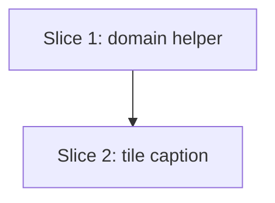

# Plan: Non-warmup set count on workout day picker

**Created**: 2026-06-13
**Branch**: master
**Status**: implemented

## Goal

Show the total planned set count for non-warmup exercises in each workout-day
picker tile caption, alongside the existing non-warmup exercise count, rendered
as `5 exercises · 18 sets`. The counting logic moves into a pure, unit-tested
domain helper so both numbers are derived from one non-warmup filter (no
divergence), and the tile caption becomes a thin consumer of it.

## Acceptance Criteria

- [ ] Each loaded day tile caption reads `<N> exercises · <M> sets`, N = non-warmup exercise count (unchanged), M = total planned sets across those exercises.
- [ ] Pluralization mirrors existing: `1 exercise`/`N exercises`, `1 set`/`M sets`.
- [ ] Warmup-group exercises and their sets are excluded from both N and M.
- [ ] A day with no non-warmup exercises reads `0 exercises · 0 sets`.
- [ ] Both counts range over the identical exercise population (single shared filter).
- [ ] Tile loading/error/in-progress states, layout, and tap behavior are unchanged; only the caption gains the ` · <M> sets` suffix.
- [ ] The counting helper is covered by domain unit tests (warmup excluded, superset summed, multi-set summed, zero case).

## Slices

### Slice 1: Non-warmup counts domain helper

**Depends-on:** none
**Files:** `mobile/lib/modules/domain/services/warmup_exercises.dart`, `mobile/test/domain/services/warmup_exercises_test.dart`

**Behavior:**

```gherkin
Feature: Counting non-warmup exercises and their planned sets

  Scenario: Sums sets across non-warmup exercises only
    Given a workout day with a warmup group of 1 exercise carrying 2 sets
    And a main group of 2 exercises carrying 3 and 4 sets
    When the non-warmup counts are computed
    Then the exercise count is 2
    And the set count is 7

  Scenario: Superset group contributes each of its exercises and their sets
    Given a workout day with one main superset group of 2 exercises carrying 3 and 3 sets
    When the non-warmup counts are computed
    Then the exercise count is 2
    And the set count is 6

  Scenario: A day with only warmup groups counts zero
    Given a workout day whose only group is a warmup group of 1 exercise carrying 2 sets
    When the non-warmup counts are computed
    Then the exercise count is 0
    And the set count is 0
```

**Steps:**

#### Step 1.1: Add `nonWarmupCountsIn` returning exercise and set tallies

**Complexity**: standard
**RED**: In `warmup_exercises_test.dart`, add a `group('nonWarmupCountsIn')` with the three scenarios above, asserting on a `({int exercises, int sets})` record. Extend the existing fixture builder so each group can carry exercises with a configurable set count (current builder uses zero-set, single-exercise groups; add a variant that attaches N `WorkoutSet`s and supports multi-exercise superset groups). `Random`/date rules per CLAUDE.md: use a fixed `DateTime.utc` base, no live clock.
**GREEN**: Add `({int exercises, int sets}) nonWarmupCountsIn(WorkoutDay day)` to `warmup_exercises.dart`. Iterate `day.exerciseGroups`, skip groups where `isWarmupGroup(group.role)`, and for the rest accumulate `exercises += group.exercises.length` and `sets += group.exercises.fold(0, (a, e) => a + e.sets.length)` in a single pass. Reuse the existing `isWarmupGroup` predicate so it stays the single source of warmup exclusion.
**REFACTOR**: Confirm the helper sits beside `warmupExerciseIdsIn` and is reachable through the `domain.dart` barrel (it re-exports the file). Tidy the shared test fixture builder; no production duplication.
**Files**: `mobile/lib/modules/domain/services/warmup_exercises.dart`, `mobile/test/domain/services/warmup_exercises_test.dart`
**Commit**: `add nonWarmupCountsIn domain helper`

### Slice 2: Day-tile caption shows the set count

**Depends-on:** 1
**Files:** `mobile/lib/modules/workout_day_picker/widgets/day_tile.dart`

**Behavior:**

```gherkin
Feature: Set count on the workout-day picker tile

  Scenario: Caption shows both counts joined by a middle dot
    Given a day with 5 non-warmup exercises carrying 18 planned sets in total
    When the tile renders
    Then its caption reads "5 exercises · 18 sets"

  Scenario: Singular forms for a one-exercise, one-set day
    Given a day with 1 non-warmup exercise carrying 1 planned set
    When the tile renders
    Then its caption reads "1 exercise · 1 set"

  Scenario: Warmup-only day reads zero for both counts
    Given a day whose only group is a warmup group
    When the tile renders
    Then its caption reads "0 exercises · 0 sets"
```

**Steps:**

#### Step 2.1: Wire the caption to `nonWarmupCountsIn`

**Complexity**: standard
**RED**: No widget tests in this project (CLAUDE.md test scope); the helper's behavior is locked by Slice 1's domain tests. Visual validation of the rendered caption is the user's per established workflow — do not launch the app.
**GREEN**: In `day_tile.dart`, replace the inline `exerciseCount` computation (lines 48–53) with `final counts = nonWarmupCountsIn(day);`. Build the label as `'<exercises> exercise[s] · <sets> set[s]'`, applying the existing singular/plural pattern to each count. Keep the single muted `typography.caption` / `onSurfaceMuted` styling and the surrounding layout untouched.
**REFACTOR**: Extract the singular/plural formatting into a small local helper if it reads cleaner than two inline ternaries; otherwise leave inline. No token or layout changes.
**Files**: `mobile/lib/modules/workout_day_picker/widgets/day_tile.dart`
**Commit**: `show non-warmup set count on day picker tiles`

## Parallelization



| Wave | Slices (parallel) |
|------|-------------------|
| 1 | 1 |
| 2 | 2 |

## Complexity Classification

| Step | Rating |
|------|--------|
| 1.1 | standard |
| 2.1 | standard |

## Pre-PR Quality Gate

- [ ] All tests pass (`tool/ci.sh` from `mobile/`)
- [ ] Codegen clean (`dart run build_runner build --force-jit`) — no model changes expected, but run after touching domain
- [ ] Analyzer + format pass
- [ ] Offline-import guard passes (`tool/check_offline_imports.sh`)
- [ ] `/code-review` passes
- [ ] Documentation: none — display tweak to an existing screen, no new screen/feature, so `product-context.md` is unchanged

## Risks & Open Questions

- **Predicate consistency:** the existing caption filters on `role == ExerciseGroupRole.main`; the new helper filters on `!isWarmupGroup(role)`. With today's two-role enum (`warmup`, `main`) these are identical, so no observable change to the exercise count — and routing both counts through one predicate is the point (AC: shared population). If a cooldown/activation role is added later, "non-warmup" will include it; that is the intended forward-compatible semantics.
- **Set definition:** there is no warmup-set axis yet (warmup is group-level), so "non-warmup sets" = all sets of non-warmup-group exercises. If a per-set warmup flag is introduced later, `nonWarmupCountsIn` is the single place to extend.

## Build Progress

### Slices (grouped by wave)

#### Wave 1
- [x] Slice 1: Non-warmup counts domain helper
  - [x] Step 1.1: Add `nonWarmupCountsIn` returning exercise and set tallies

#### Wave 2
- [x] Slice 2: Day-tile caption shows the set count
  - [x] Step 2.1: Wire the caption to `nonWarmupCountsIn`

### Acceptance Criteria

- [x] Each loaded day tile caption reads `<N> exercises · <M> sets`.
- [x] Pluralization mirrors existing singular/plural pattern for both counts.
- [x] Warmup-group exercises and their sets excluded from both counts.
- [x] Warmup-only / no-non-warmup day reads `0 exercises · 0 sets`.
- [x] Both counts range over the identical exercise population.
- [x] Tile states, layout, and tap behavior unchanged apart from the caption suffix.
- [x] Counting helper covered by domain unit tests (warmup excluded, superset summed, multi-set summed, zero case).
